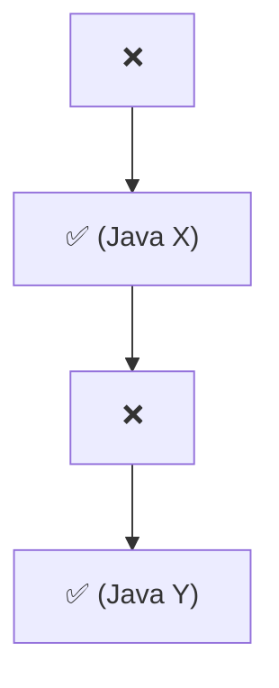

# Lesson template (v4: story first, told as chapters)

These are skeletons for:
- the `.md` lesson
- the `.java` demo
- the QUICK REVISION block in code files
- the chat reply

The filled-in reference is `01-java-core/J03_StringsAndStringPool.md` (the String → StringBuffer → StringBuilder story), plus `J01_HashMapInternals.md` for layout.

## `.md` skeleton

~~~markdown
# <ID> · <Topic in plain words>

> **In one line:** <the whole idea in one sentence, no unexplained jargon>

| ⏱️ Read | 🧪 Run | 🎯 Asked |
|---|---|---|
| <N> min | `java <folder>/<ID>_<Name>.java` | <where it comes up; what product companies push on> |

---

## 🧬 Why does this exist? The story

<One hook line: what this story explains, e.g. "Why does Java have three text classes? Here's what happened.">

### Chapter 1 · <the problem, in plain words>

**🧑‍💻 What people were doing:** <the normal code back then, 1 or 2 sentences>

**😣 The problem they hit:** <what went wrong for a programmer, with a small number>

**☕ What the Java team said:** "We'll give you <X>, so that <the problem> never happens again." → **<Feature> (Java <version>, <year>)**

**✅ How it solved the problem:** <what is different now, same numbers>. **But…** <the new problem it created, one sentence>

### Chapter 2 · <the new problem>

<same four lines; 3 to 5 chapters in all; explain every technical word in brackets the first time>



🧠 **So it's not random:** <one line tying the chain to what this lesson teaches>

---

## 🧩 Words you need

| Word | In one line |
|---|---|
| **<term>** | <plain meaning> |

---

## 🖼️ Picture it: <everyday analogy>

<2 to 4 short sentences.>

```mermaid
<the mechanism, with real values from the example>
```

👀 **Notice:** <what to look at>

| <Analogy> | <Tech> |
|---|---|
| ... | ... |

---

## 🔬 How it works, step by step

### Step 1 · <action, using the running example>

<Start with the problem this step solves, then show the numbers, then state the rule and why.>

👀 **Notice:** <the takeaway>

---

## 💻 Code you should be able to write

```java
// the essential code, 12 lines or fewer
```

**What the demo prints** (from a real run):

```text
<copied from the actual output>
```

---

## ⚠️ Traps interviewers love

| Trap | Why it's wrong | Do this instead |
|---|---|---|

---

## 🎯 In the interview

**What they're really testing**
- *Service companies:* ...
- *Product companies:* ...

**Say it in this order** (start with the problem):
1. <the problem this solves>
2. ...

**Sample answer** (about a minute, in your own words):

> "..."

**Product-company deep dive:**
- **Q:** ... **A:** ...

---

## ❓ Follow-up questions

## 🧪 Test yourself (answer aloud, then click)

<details><summary>1. <question></summary>

<answer>

</details>

---

## ⚡ Quick Revision (2 hours before the interview)

**🧬 The story:** <pain> → <fix> (Java X) → <new pain> → <next fix> (Java Y)

```mermaid
<ONE diagram that holds the whole idea>
```

**🧠 Must remember**
1. ...

**⚠️ Top traps**
- ...

**🎯 30-second answer:** "<start with the problem it solves, then 3 sentences>"

**🔑 Memory hook:** <one vivid line>

**🗣️ Say it aloud (no peeking):**
1. Why does <concept> exist? What was the pain before it?
2. ...
3. ...
~~~

## `.java` header skeleton

~~~java
/*
 * <ID>  <Topic>: runnable demo
 *
 * THE STORY (why this exists)
 *   <pain> -> <fix> (Java X) -> <new pain> -> <next fix> (Java Y)
 *
 * WHAT YOU WILL SEE (the numbers match <ID>_<Name>.md)
 *   Step 1  <what happens and the key number>
 *
 * HOW TO RUN   java <folder>/<ID>_<Name>.java   (or click "Run" above main)
 * READ FIRST   <ID>_<Name>.md
 */
~~~

## Story block in code files (`.sql` WHY THIS TOOL EXISTS, DSA WHY THE BETTER WAY EXISTS)

~~~text
-- Chapter 1: <the problem, in plain words>
--   What people did  : <the normal query or code>
--   Problem they hit : <what went wrong, with numbers from the data>
--   What SQL said    : "We'll give you <X>, so that <problem> can't happen."
--   How it solved it : <what is different now>. But... <new problem, if any>
--
-- Chapter 2: ...
~~~

In DSA files the labels are `What you did first`, `Problem you hit`, `What a smarter programmer said` and `How it solved it`. Use `//` comments, and line the colons up.

## QUICK REVISION block (`.java` / `.sql`)

~~~text
QUICK REVISION START
<ID> <Title>: <one-line description>
  Story   : <pain> -> <fix> -> <new pain> -> <next fix>
  Idea    : ...
  Traps   : ...
  30-second answer: "..."
QUICK REVISION END
~~~

In `.sql` files, every line is a `--` comment, with **no `;`** anywhere inside the comments.

## Chat reply skeleton (new lesson)

~~~markdown
<One line: the topic.>

**🧬 The story:** <pain> → <fix> → <new pain> → <next fix>

**The idea:** <one sentence with the running example>

**In the interview:** 1. <the problem it solves> 2. ... 3. ...

**Files:** read `<ID>_<Name>.md` (it ends with ⚡ Quick Revision), and run `java <folder>/<ID>_<Name>.java` (you'll see ...).

**Your turn:** read → run → explain aloud, starting with the problem → `grade: <your answer>` or `next`.
~~~
