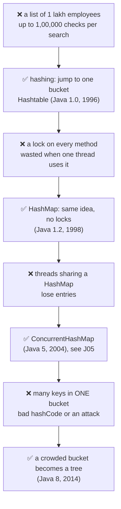
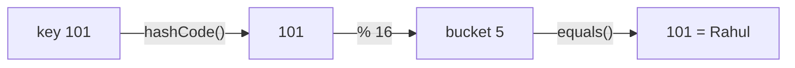
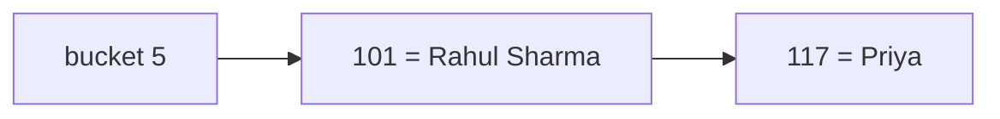
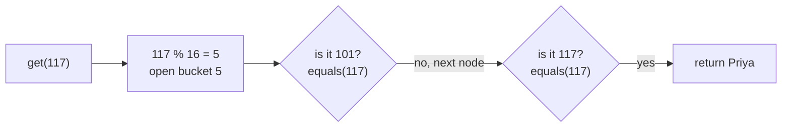
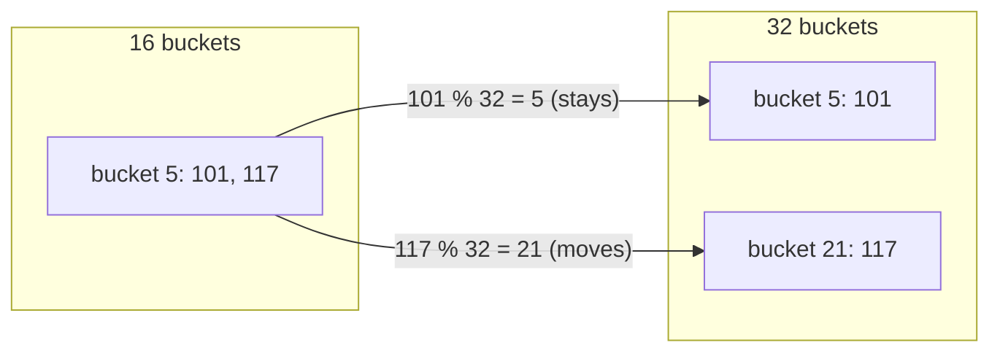
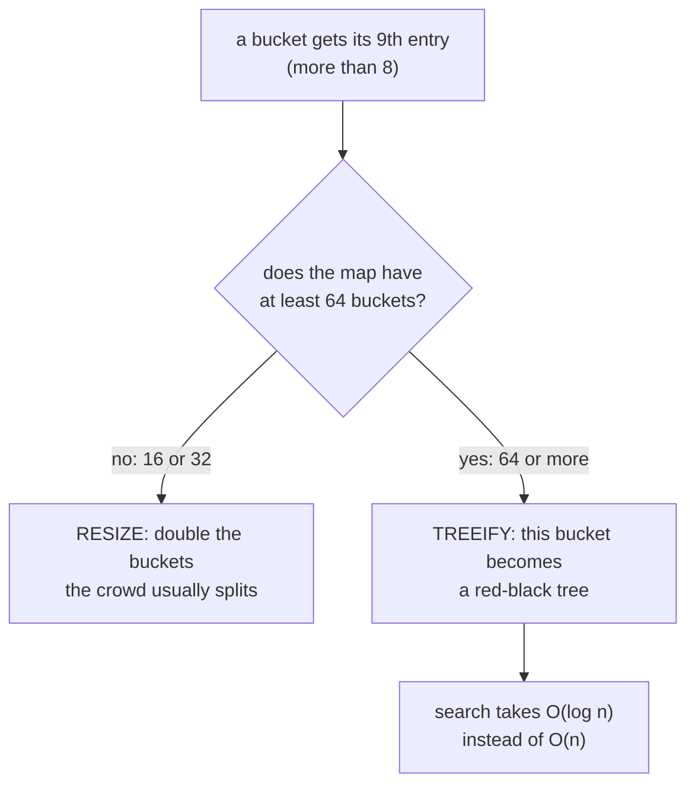
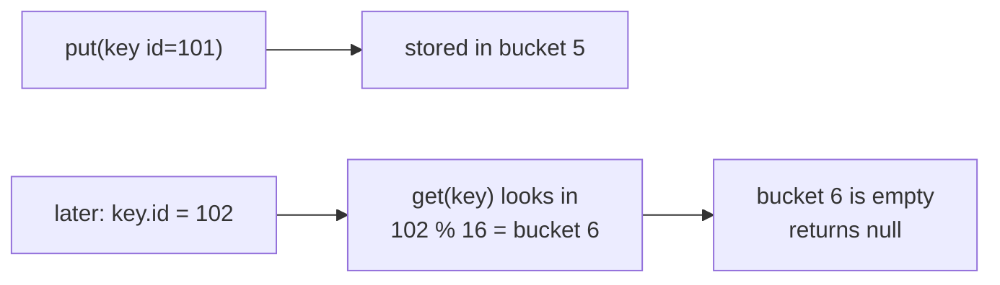
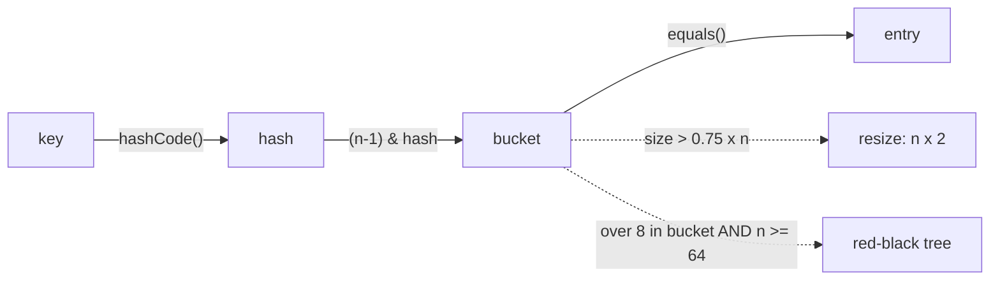

# J01 · How HashMap works inside

> **In one line:** HashMap turns your key into a bucket number with `hashCode()`, jumps straight to that bucket, and uses `equals()` to pick the right entry. There's no searching, which is why `get` and `put` are O(1).

| ⏱️ Read | 🧪 Run | 🎯 Asked |
|---|---|---|
| 14 min | `java 01-java-core/J01_HashMapInternals.java` | Almost every Java round. Product companies go deep into collisions, resize and treeify |

---

## 🧬 Why does this exist? The story

Why does HashMap have buckets, no locks, and even trees inside it? Each part was added after programmers hit a real problem. Here's what happened, in order.

### Chapter 1 · Searching 1 lakh employees was slow

**🧑‍💻 What people were doing:** they kept employees in a list. To find employee 101, the code checked them one by one.

**😣 The problem they hit:** with 1 lakh employees, one search could take up to **1,00,000 checks**. And that was for every single search.

**☕ What the Java team said:** "We'll turn each key into a number, and use that number to jump straight to one drawer (a **bucket**). You open one drawer, not the whole cupboard." → **Hashing, in `Hashtable` (Java 1.0, 1996)**

**✅ How it solved the problem:** a search now takes about **1 check** instead of 1 lakh. **But…** Hashtable put a **lock** (only one thread can use it at a time) on every method.

### Chapter 2 · Everyone paid for locks they didn't need

**🧑‍💻 What people were doing:** most programs used a map from just **one thread** (one worker running the code).

**😣 The problem they hit:** every `get` and `put` still took the lock and gave it back. That's wasted time on every call, for safety nobody needed.

**☕ What the Java team said:** "We'll give you the same map with no locks. If you share it between threads, ask for safety separately." → **`HashMap` (Java 1.2, 1998)**. It also allows one null key.

**✅ How it solved the problem:** one-thread code got fast. **But…** when many threads share one HashMap, entries get lost.

### Chapter 3 · Many threads, one map

**🧑‍💻 What people were doing:** a server handles many users at once, so many threads touch the same map.

**😣 The problem they hit:** HashMap lost entries. Hashtable was safe, but its one lock covers the **whole map**, so every thread waited in one line.

**☕ What the Java team said:** "We'll give you a map where many threads can work at the same time, safely." → **`ConcurrentHashMap` (Java 5, 2004)**. Its full story is in J05.

**✅ How it solved the problem:** safe, and no long queue of waiting threads.

### Chapter 4 · Too many keys in one drawer

**🧑‍💻 What people were doing:** using HashMap everywhere, and trusting it to find a key in about 1 check.

**😣 The problem they hit:** many keys can land in **one** bucket. A bad hashCode can do it. In 2011, researchers showed attackers could do it on purpose, by sending keys that all collide ("hash flooding"). A bucket with 1,000 keys means up to **1,000 checks** again.

**☕ What the Java team said:** "When one drawer gets crowded, we'll arrange its keys as a **sorted tree**, where each step cuts the search in half." → **Crowded buckets become trees (Java 8, 2014)**

**✅ How it solved the problem:** finding one of those 1,000 keys now takes about **10 checks**.



👀 **Notice:** it's the same "**safe first, fast later**" pattern as StringBuffer → StringBuilder in J03: Hashtable (locked) came first, and HashMap (no locks) came later.

🧠 **So it's not random:** hashing kills the slow search, removing locks kills the wasted time, and trees kill the long bucket. Each step below is one of these fixes.

---

## 🧩 Words you need

| Word | In one line |
|---|---|
| **bucket** | one slot of HashMap's internal array. A new map has 16 |
| **hashCode()** | a number Java calculates from the key. For an `Integer`, it's the number itself |
| **collision** | two different keys landing in the same bucket |
| **load factor** | how full the map may get before it grows: 0.75, so 75% |
| **resize** | making the array twice as big, then moving every entry to its new bucket |
| **treeify** | turning a crowded bucket's list into a sorted tree (Java 8+) |

---

## 🖼️ Picture it: an office cupboard with 16 drawers

Every employee file goes into drawer number **ID % 16**. To find a file, you calculate the drawer and open **only** that one. If two files share a drawer, you read the name on each file.



👀 **Notice:** HashMap **calculates** where to go, and never walks through the other 15 buckets.

| Cupboard | HashMap |
|---|---|
| 16 drawers | an array of 16 buckets |
| "drawer = ID % 16" | `hashCode()` turned into a bucket number |
| two files in one drawer | a collision |
| reading the name on each file | `equals()` |
| cupboard 75% full, so buy one with 32 drawers | resize at load factor 0.75 |

---

## 🔬 How it works, step by step

We store employees in a `Map<Integer, String>`: the key is the employee ID and the value is the name.

### Step 1 · `put(101, "Rahul")`: which bucket?

The hashCode of `101` is 101, and 101 % 16 = **5**. Bucket 5 is empty, so the entry goes in.

```text
bucket:  [0] [1] [2] [3] [4] [5] [6] ... [15]
                              |
                          101=Rahul
```

Each stored entry is a small object called a **Node**. It holds the key, the value, the key's hash and `next`, a link to the next node in the same bucket.

### Step 2 · `get(101)`

`get` does the same math: 101 % 16 = 5. It opens bucket 5, finds 101 and returns "Rahul".

👀 **Notice:** it never looked at the other 15 buckets. **That's the whole trick.**

### Step 3 · `put(101, "Rahul Sharma")`: the same key again

Bucket 5 already has key 101, and `equals()` says it's the same key. So HashMap **replaces the value** and adds no new entry.

- The size stays **1**.
- `put()` returns the **old** value, "Rahul".

🧠 A map never keeps two entries with the same key.

### Step 4 · `put(117, "Priya")`: a collision

117 % 16 = **5**, which is bucket 5 again. Two different keys in one bucket is a **collision**. Both are kept, one after the other.



Here's how `get(117)` finds the right one:



👀 **Notice:** **hashCode() picks the bucket. equals() picks the entry inside the bucket.** Remember this line, because it answers half the follow-up questions.

### Step 5 · The map gets full: resize

A new HashMap has 16 buckets and a load factor of **0.75**, and 16 × 0.75 = **12**. When the **13th** entry arrives, HashMap doubles to **32** buckets and moves every entry, now using % 32.



👀 **Notice:** each entry either **stays** at its bucket or **moves to bucket + 16** (5 → 21). The collision is gone, because more buckets means fewer collisions.

💡 **Why 0.75?** It's a balance. A lower value wastes memory on empty buckets. A higher value means more collisions, which is slower.

### Step 6 · Too many keys in one bucket: tree or resize? (Java 8)

A bucket normally holds 0, 1 or 2 entries. But sometimes many keys pile into **one** bucket, and then `get()` has to check them one by one. Java 8 asks **one question** when a bucket gets **more than 8** entries:



**When the map is small, it resizes.** The demo puts the keys 5, 21, 37, 53, 69, 85, 101, 117 and 133 into a 16-bucket map. They're 16 apart, so each one % 16 = 5, and all 9 land in bucket 5. There are only 16 buckets, so HashMap doubles to 32:

| Keys | key % 32 | New bucket |
|---|---|---|
| 5, 37, 69, 101, 133 | 5 | bucket 5 (5 entries) |
| 21, 53, 85, 117 | 21 | bucket 21 (4 entries) |

👀 **Notice:** the crowd of 9 split into 5 + 4, so no tree was needed. It resized with only 9 entries, below the normal limit of 12.

**When the hashCode is bad, it builds a tree.** If every key's hashCode is 1, then 1 % 16 = 1, 1 % 64 = 1 and 1 % 1024 = 1. The bucket never changes, so resizing can't help. Once the map has 64 buckets, that bucket becomes a **tree**.

**Why a tree is faster: the "higher or lower" game.** I think of a number from 1 to 1000. Guessing one by one (a list) takes up to 1000 tries. If I say "higher" or "lower" after each guess (a sorted tree), you need at most **10**.

```text
List: check one by one          5 -> 21 -> 37 -> 53 -> 69 -> 85 -> 101 -> 117 -> 133

Tree: smaller goes left, bigger goes right
                    69
                /        \
             21            117
            /  \          /   \
           5    37      85     133
                  \       \
                   53      101
```

👀 **Notice:** finding 101 takes 7 checks in the list, but only 4 in the tree: 69, then 117, then 85, then 101.

**Two more small rules, each with its reason:**
- **A tree goes back to a list at 6 or fewer entries,** not at 8. The gap stops the bucket flipping back and forth, like an AC that turns on at 26°C and off at 24°C.
- **Trees aren't used everywhere,** because a tree node takes about twice the memory, and with a good hashCode a bucket almost never reaches 8. The tree is a **spare tyre**, not the everyday wheel.

### Step 7 · The null key

HashMap allows **one** null key. Its hash is treated as 0, so it always goes to bucket 0. Values can be null too.

### Step 8 · Never change a key after `put()`



👀 **Notice:** the entry is still sitting in bucket 5 (`size()` is 1), but nobody can reach it. **Keys must be immutable:** use String, Integer, or your own class with `final` fields.

---

## 💻 Code you should be able to write

You won't write HashMap itself, but you must be able to explain these two formulas:

```java
static int hash(Object key) {
    int h = key.hashCode();
    return h ^ (h >>> 16);        // mixes the high bits into the low bits, so keys spread better
}
static int bucketIndex(int hash, int buckets) {
    return (buckets - 1) & hash;  // the same answer as hash % buckets, because buckets is a power of 2, but faster
}
```

**What the demo prints** (from a real run):

```text
=== Step 4: put(117, "Priya"), a collision ===
117 % 16 = 5, the same bucket as 101
  bucket  5 : 101=Rahul Sharma -> 117=Priya
get(117) = Priya
Notice: hashCode() picked bucket 5, then equals() picked 117 inside it.

=== Step 5: resize when the map goes past 12 entries (16 x 0.75) ===
13th entry added, so HashMap doubled to 32 buckets:
  bucket  5 : 101=Rahul Sharma
  bucket 21 : 117=Priya
Notice: 101 stayed in bucket 5. 117 moved to bucket 21 (5 + 16). The collision is gone.
```

In Step 6, the real HashMap's print order changes from `[5, 21, 37, …]` to `[5, 37, 69, 101, 133, 21, …]`. That's proof it actually resized.

---

## ⚠️ Traps interviewers love

| Trap | Why it's wrong | Say this instead |
|---|---|---|
| "A tree forms at 8 entries" | it needs **more than 8** entries **and** at least 64 buckets | "Over 8 in one bucket, with 64+ buckets, gives a tree; otherwise it resizes" |
| "Resize happens when the array is full" | it happens past **75%**, at the 13th entry for 16 buckets | "size > capacity × 0.75" |
| "Same hashCode means same key" | a collision: "Aa" and "BB" both have hashCode 2112 | "hashCode picks the bucket, equals decides" |
| "HashMap is thread-safe" | concurrent puts lose entries (J05 shows it) | "Use ConcurrentHashMap" |
| Using a mutable object as a key | its hashCode changes, so get() looks in the wrong bucket | "Keys must be immutable" |

---

## 🎯 In the interview

**What they're really testing**
- *Service companies:* buckets, hashCode + equals, collisions, O(1), the load factor.
- *Product companies:* why 0.75 and why a power of two, the treeify conditions (8 **and** 64) and why, what resize costs, what a bad hashCode does, immutable keys, and thread safety.

**Say it in this order** (start with the problem):
1. **Why it exists:** searching a list checks items one by one. HashMap **calculates** where a key lives, so it jumps straight there.
2. It's an **array of buckets**, 16 by default.
3. `put`: hashCode → **bucket index** → store the entry.
4. **Collision:** the entries are chained in that bucket, and `equals()` finds or replaces the right one.
5. **Java 8:** more than 8 entries in a bucket, with 64+ buckets, turns it into a **red-black tree**, so a crowded bucket stays fast. Below 64 buckets it resizes instead.
6. At **75%** full it **doubles** and moves the entries. `get` follows the same path, so both are **O(1)** on average.

**Sample answer** (about a minute, in your own words):

> "Searching a list means checking items one by one, and HashMap avoids that by calculating where each key lives. It's basically an array of buckets, 16 by default. When I put a key, Java calls hashCode on it and converts it into a bucket number. Say key 101 lands in bucket 5, so it's stored there. If I then put key 117 and it also lands in bucket 5, that's a collision: both entries stay in bucket 5 as a linked list, and get(117) uses equals to find the right one. From Java 8, if one bucket gets more than 8 entries and the map has at least 64 buckets, that list becomes a red-black tree, so search stays fast. And when the map is 75% full, which is 12 entries for 16 buckets, it doubles to 32 and moves the entries. That's why get and put are O(1) on average."

**Product-company deep dive:**
- **Q: What's the worst-case complexity?**
  **A:** O(n) if every key collides, as in Java 7. Java 8's tree bins make it O(log n) when the keys are Comparable, like String and Integer.
- **Q: Why is the capacity always a power of two?**
  **A:** The index can be computed with a fast `(n - 1) & hash` instead of `%`. And on a resize, each entry either stays at `i` or moves to `i + oldSize`, decided by one bit of the hash.
- **Q: What does `h ^ (h >>> 16)` do?**
  **A:** It mixes the top 16 bits of the hashCode into the bottom 16. With 16 buckets, only the last 4 bits pick the bucket, so without mixing, keys that differ only in their high bits would all collide.
- **Q: Why not resize or treeify on every collision?**
  **A:** A few collisions are normal and cheap. With a good hashCode, a bucket with 8 entries has a probability of about 6 in 10 crore, so the tree is only a safety net.
- **Q: Two threads call `put` at the same time?**
  **A:** Entries can be lost. In Java 7, a resize could even create a loop that made `get()` hang forever. Use `ConcurrentHashMap` (J05).

---

## ❓ Follow-up questions

**Can two different keys have the same hashCode?**
Yes. They go to the same bucket, and `equals()` separates them. "Aa" and "BB" both have hashCode 2112.

**Is the order of keys guaranteed?**
No. `LinkedHashMap` keeps insertion order, and `TreeMap` keeps keys sorted (J04).

**What if I remove entries while looping over the map?**
You get `ConcurrentModificationException`. Use `iterator.remove()` or `map.entrySet().removeIf(...)`.

**How does HashSet work?**
It's a HashMap inside. Your element is the key, and a dummy object is the value.

**HashMap vs Hashtable?**
Hashtable is the old one (Java 1.0). Every method is synchronized, which makes it slow, and it allows no null key or value. HashMap (Java 1.2) took the locks out, because most maps are used by one thread. Use HashMap, or ConcurrentHashMap when threads share the map.

**I'll store 1,000 entries. How do I avoid resizing?**
Give it an initial capacity: `new HashMap<>(1334)`, because 1000 / 0.75 ≈ 1334. On Java 19+, `HashMap.newHashMap(1000)` does the math for you.

---

## 🧪 Test yourself (answer aloud, then click)

<details><summary>1. In a 16-bucket map, which bucket does key 50 go to?</summary>

50 % 16 = 2, so bucket 2.

</details>

<details><summary>2. Keys 3 and 19 go into a 16-bucket map. What happens, and what about after the resize to 32?</summary>

Both go to bucket 3 (19 % 16 = 3), which is a collision. After the resize, 3 stays in bucket 3 and 19 moves to bucket 19 (3 + 16).

</details>

<details><summary>3. When exactly does the first resize happen?</summary>

When the 13th entry goes in, because 16 × 0.75 = 12.

</details>

<details><summary>4. Why do we need equals() if we already have hashCode()?</summary>

hashCode only picks the bucket. Different keys can share a bucket, so equals() decides which entry is the right one.

</details>

<details><summary>5. One bucket has 9 entries, but the map has only 16 buckets. Tree or resize?</summary>

Resize to 32, because treeify needs at least 64 buckets. With keys 5, 21 … 133, the crowd splits into 5 in bucket 5 and 4 in bucket 21.

</details>

<details><summary>6. Why does a tree go back to a list at 6, not at 8?</summary>

The gap stops it switching back and forth when a bucket hovers around 8, like an AC with different on and off temperatures.

</details>

<details><summary>7. What happens if you change a key's field after putting it in the map?</summary>

get() calculates a different bucket and returns null. The entry is still inside, but unreachable. Keys should be immutable.

</details>

<details><summary>8. Why did Java 8 add trees to HashMap? What was the pain?</summary>

Many keys could land in one bucket, from a bad hashCode or from attackers sending keys that all collide ("hash flooding"). That bucket became a long list, and get() checked keys one by one again. A tree finds one of 1,000 keys in about 10 checks.

</details>

If you get stuck on one, add it to [STUMBLE-LIST.md](../STUMBLE-LIST.md). When they all feel easy, tick J01 in the [README](../README.md) and send `next`.

---

## ⚡ Quick Revision (2 hours before the interview)

**🧬 The story:** searching a list is slow → hashing, **Hashtable** (Java 1.0, locked) → locks wasted on one thread → **HashMap** (1.2, no locks) → unsafe when threads share it → **ConcurrentHashMap** (5) → too many keys in one bucket is slow again → **trees** in crowded buckets (Java 8).



**🧠 Must remember**
1. An array of **16** buckets. bucket = hash % 16, computed as `(n-1) & hash`.
2. **hashCode picks the bucket, equals picks the entry.**
3. **Collision:** the entries are chained in the bucket. Java 8 adds new ones at the tail.
4. Load factor **0.75**, so the resize comes at the **13th** entry: 16 → 32. Each entry stays at `i` or moves to `i + 16`.
5. **Treeify:** more than **8** in one bucket **and** at least **64** buckets. Otherwise it resizes. Back to a list at **6**.
6. On average **O(1)**. The worst case is O(n), or O(log n) with trees (Java 8).
7. **One null key** is allowed, in bucket 0. **Not thread-safe:** use ConcurrentHashMap.
8. **Keys must be immutable,** or get() looks in the wrong bucket.

**⚠️ Top traps**
- A tree needs **more than 8 entries AND 64 buckets**, not just 8.
- The resize happens past **75%**, not at 100%.
- The same hashCode doesn't mean the same key.

**🎯 30-second answer:** "Searching a list checks items one by one, so HashMap calculates where each key lives instead. It's an array of buckets. put calls hashCode, turns it into a bucket index and stores the entry. Keys that collide are chained in the bucket, and equals finds the right one. In Java 8 a bucket with more than 8 entries becomes a red-black tree once there are 64+ buckets. At 75% full it doubles and moves the entries, so get and put stay O(1) on average."

**🔑 Memory hook:** *"Hash picks the drawer, equals picks the file. At 3/4 full, double the cupboard. More than 8 in a drawer with 64 drawers, and it becomes a tree."*

**🗣️ Say it aloud (no peeking):**
1. Why does HashMap exist, why did it replace Hashtable, and what pain made Java 8 add trees?
2. Keys 101 and 117 go into 16 buckets. Where do they go, where does 117 go after the resize to 32, and when exactly does that resize happen?
3. Why does a crowded bucket in a 16-bucket map cause a resize and not a tree?
