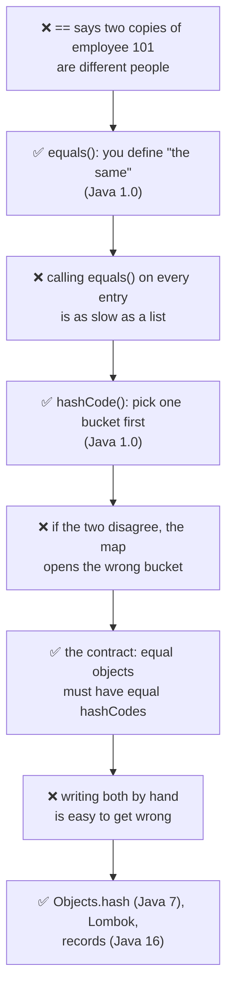
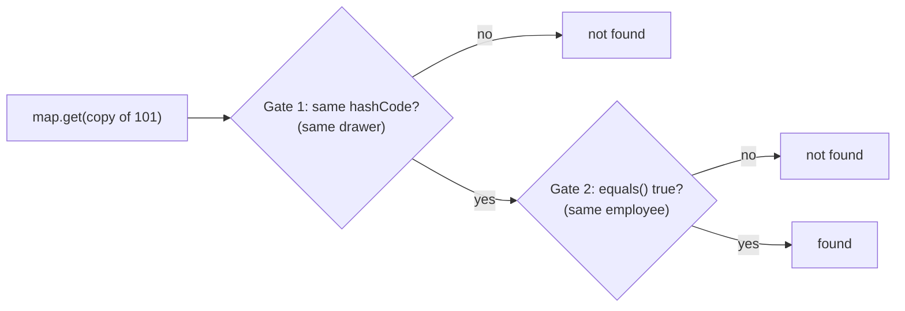
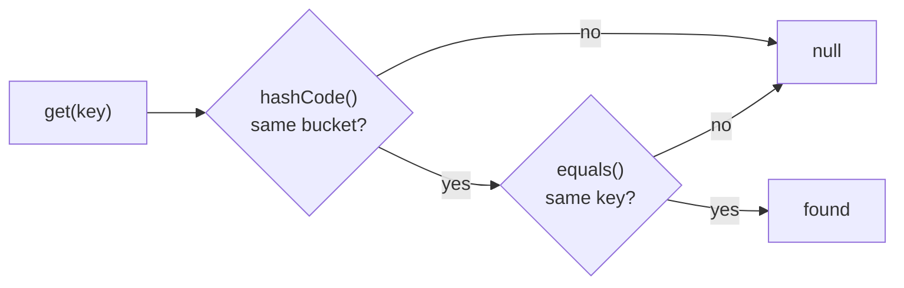

# J02 · equals() and hashCode()

> **In one line:** HashMap finds a key in two steps: `hashCode()` picks the bucket, then `equals()` confirms the key. So if two objects are equal, they **must** have the same hashCode, and you always override **both** methods, using the **same fields**.

| ⏱️ Read | 🧪 Run | 🎯 Asked |
|---|---|---|
| 12 min | `java 01-java-core/J02_EqualsAndHashCode.java` | In every Java round, usually right after HashMap (J01) |

---

## 🧬 Why does this exist? The story

Why does every Java object have **two** methods, `equals()` and `hashCode()`? Because each one fixes a different pain:

1. **❌ The pain:** `==` only asks "is it the same object in memory?". You load employee 101 from the database twice and get two objects. `==` says they're different, even though it's the same person.
2. **✅ The fix (Java 1.0): `equals()`.** Every class can decide what "the same" means. For an Employee: the same ID.
3. **❌ New pain:** a map with 1 lakh entries can't call `equals()` on every entry to find your key. That's as slow as searching a list.
4. **✅ The fix (also Java 1.0): `hashCode()`.** A number that picks **one bucket** first (J01). Then `equals()` only checks the few entries inside that bucket.
5. **❌ New pain:** now the map uses **both** methods, so they must agree. If two equal employees get different hashCodes, the map opens the wrong bucket, and a HashSet keeps both copies.
6. **✅ The fix: the contract.** Equal objects must have equal hashCodes. So you always override both, on the same fields.
7. **❌ New pain:** writing both by hand for every class is boring and easy to get wrong. You forget a field, or use different fields in each one.
8. **✅ The fix: let Java write them.** `Objects.equals` and `Objects.hash` (Java 7, 2011), IDE generation, Lombok, and **records** (Java 16, 2021), which write both for you.



👀 **Notice:** `equals()` answers "same?", and `hashCode()` makes that answer **fast**. The contract exists only because a map uses both.

🧠 **So it's not random:** once you know the map checks hashCode first and equals second, every rule in this lesson follows from it.

---

## 🧩 Words you need

| Word | In one line |
|---|---|
| **`==`** | "Is it the **same object** in memory?" |
| **`equals()`** | "Do these two objects mean the **same thing**?" You decide what that means |
| **`hashCode()`** | a number that decides the **bucket** (J01) |
| **default versions** | from `Object`: `equals()` is the same as `==`, and `hashCode()` is a number made up per object |
| **the contract** | the rules the two methods must follow together |

---

## 🖼️ Picture it: two photocopies of Rahul's ID card

HR files every sheet in one of 16 drawers.

- `==` asks: "Is this the same **sheet of paper**?" For two photocopies, **no**.
- `equals()` asks: "Is this the same **employee**?" You define it: the same employee ID.
- `hashCode()` decides **which drawer**. By default, Java stamps a **random token** on every sheet, so the two copies end up in random drawers.

Every `map.get(copy)` has to pass **two gates**:



👀 **Notice:** you need **both** gates to say yes. Override only one method and one gate stays shut.

| HR office | Java |
|---|---|
| two photocopies of Rahul's card | two objects with the same data |
| "same sheet of paper?" | `==` |
| "same employee?" | `equals()` |
| which drawer to use | `hashCode()` |
| a random token on each sheet | the default `hashCode()` |

---

## 🔬 How it works: the 4 cases

The same test runs every time. We make employee 101 twice (`e1`, `e2`), add both to a `HashSet`, put `e1` in a `HashMap`, then call `get(e2)`. The right answer is **set size 1**, and `get(e2)` **finds** the value.

### Case 1 · Override nothing

- `e1 == e2` is **false**, because there are two objects in memory.
- `e1.equals(e2)` is **false**, because the default `equals()` is just `==`.
- The hashCodes are made-up numbers. This laptop printed `210281271` and `1560940633`; yours will differ.

**Result:** set size **2**, `get` returns **null**. Java thinks these are two employees.

### Case 2 · Override only `equals()`

Now `equals()` returns true. But the hashCodes are still random and different, so **Gate 1 fails**. The map compares hashes first and **never even calls `equals()`**.

**Result:** set size **2**, `get` returns **null**.

👀 **Notice:** equals() without hashCode() is useless in a HashMap, because the map never gets far enough to call it.

### Case 3 · Override only `hashCode()`

`Objects.hash(101)` gives **132** for both copies, so both go to bucket 132 % 16 = **4**. Gate 1 passes. But `equals()` is still `==`, so **Gate 2 fails**.

**Result:** set size **2**, `get` returns **null**.

### Case 4 · Override both (correct)

The same hashCode (132) sends both copies to bucket 4, and `equals()` compares IDs and returns true. **Both gates pass.**

**Result:** set size **1**, and `get` **finds** the value.

### The whole topic in one table

| You override | Gate 1 (same bucket?) | Gate 2 (equals?) | Set size | `get(copy)` |
|---|---|---|---|---|
| nothing | ❌ random numbers | ❌ `==` | 2 | null |
| only equals | ❌ random numbers | never reached | 2 | null |
| only hashCode | ✅ bucket 4 | ❌ still `==` | 2 | null |
| **both** | ✅ bucket 4 | ✅ same ID | **1** | **found** |

---

## 📜 The rules (the "contract"), each with its reason

1. **Equal objects must have equal hashCodes.** Otherwise they land in different buckets, and Gate 1 fails (Case 2).
2. **Equal hashCodes do NOT mean equal objects.** That's just a collision (J01). "Aa" and "BB" both have hashCode 2112, but they're different strings.
3. **Use the same fields in both.** If `equals()` uses only the ID but `hashCode()` uses the ID and the name, then (101, "Rahul") and (101, "Rahul Sharma") are equal but get different hashCodes. The demo shows the set keeping both. hashCode may use **fewer** fields than equals, never more.
4. **Don't change those fields after `put()`.** The entry would get lost (J01 Step 8), so make them `final`.

The equals rules themselves, in everyday words:

| Rule | Meaning | Everyday version |
|---|---|---|
| reflexive | `a.equals(a)` is true | you're the same as yourself |
| symmetric | `a.equals(b)` means `b.equals(a)` | if copy 1 matches copy 2, copy 2 matches copy 1 |
| transitive | a = b and b = c means a = c | copy 1 = copy 2 = copy 3 |
| consistent | the same answer every time, if nothing changed | asking twice doesn't change it |
| null | `a.equals(null)` is false, never an exception | a card never matches "no card" |

---

## 💻 Code you should be able to write

```java
public final class Employee {
    private final int id;          // final: can't change after creation (J01 Step 8)
    private final String name;

    @Override
    public boolean equals(Object o) {
        if (this == o) return true;                                   // 1. same object? then equal
        if (o == null || getClass() != o.getClass()) return false;   // 2. null or another class? not equal
        Employee other = (Employee) o;                                // 3. now the cast is safe
        return id == other.id;                                        // 4. compare what defines "same"
    }

    @Override
    public int hashCode() {
        return Objects.hash(id);                                      // the same field(s) as equals()
    }
}
```

To compare object fields like a String, use `Objects.equals(name, other.name)`, which is null-safe.

**Shortcuts at work:**
- **VS Code:** right-click, then Source Action, then Generate hashCode() and equals(). **IntelliJ:** Alt+Insert.
- **Lombok:** `@EqualsAndHashCode`.
- **Java 16+:** a record, `record Employee(int id, String name) {}`, which uses **all** its fields.

**What the demo prints** (from a real run):

```text
=== Step 2: override only equals() ===
  e1.equals(e2)  : true
  same hashCode? : false
  HashSet size   : 2       <- WRONG: the same employee twice
  map.get(copy)  : null    <- WRONG: can't find it
Notice: equals() is true, but the map compares hashCodes first and never asks equals().

=== Step 4: override both (correct) ===
  HashSet size   : 1       <- correct
  map.get(copy)  : 50,000  <- correct
```

---

## ⚠️ Traps interviewers love

| Trap | Why it's wrong | Say this instead |
|---|---|---|
| "I overrode equals, so HashMap works" | the map checks hashCode first (Gate 1) | "Override both, on the same fields" |
| "Same hashCode means equal" | that's just a collision | "Equal objects need the same hash; the reverse isn't true" |
| hashCode uses a field that equals ignores | equal objects then get different hashes | "hashCode uses the same or fewer fields" |
| Comparing Strings with `==` | `==` compares objects, not text (J03) | "`equals()` for content" |
| Lombok `@Data` on a JPA entity | its equals/hashCode use every field, including lazy relations | "Use a business key, or write them yourself" |

---

## 🎯 In the interview

**What they're really testing**
- *Service companies:* what the two methods do, the contract, and "override both".
- *Product companies:* **why** each wrong version fails (the two gates), which fields to use, mutable keys, `getClass()` vs `instanceof`, and equals/hashCode on JPA entities.

**Say it in this order** (start with the problem):
1. **Why both exist:** `==` can't tell that two copies are the same employee, so `equals()` lets you define "same". Calling equals() on every entry would be slow, so `hashCode()` picks the bucket first.
2. By default, `equals()` is the same as `==`, and `hashCode()` comes from the object's identity, not its data.
3. HashMap uses `hashCode()` to pick the bucket, then `equals()` to find the entry.
4. **The contract:** equal objects must have equal hashCodes, but the same hashCode doesn't mean equal.
5. **Only equals:** different buckets, so duplicates in a HashSet and `get` returns null. **Only hashCode:** the right bucket, but equals is still `==`, so the same result.
6. So override **both**, using the **same fields**, generated by the IDE, Lombok or a record.

**Sample answer** (about a minute, in your own words):

> "equals exists so a class can decide what 'the same' means, and hashCode exists so a map can find the right bucket fast, without calling equals on every entry. By default, equals just checks if two references are the same object, and hashCode comes from the object's identity. HashMap uses hashCode to find the bucket and equals to find the entry inside it. So the contract is: equal objects must have the same hashCode, but the same hashCode doesn't mean equal. Say I create employee 101 twice. If I override only equals, the copies get different hashCodes, go to different buckets, and a HashSet keeps both. If I override only hashCode, they reach the same bucket, but equals still compares references, so the result is the same. That's why we override both, using the same fields, usually generated by the IDE, Lombok or a record."

**Product-company deep dive:**
- **Q: `getClass()` or `instanceof` inside equals?**
  **A:** `getClass()` accepts only the exact same class, which is the safe default and what IDEs generate. `instanceof` also accepts subclasses, which can break symmetry. JPA code often uses `instanceof`, because Hibernate creates proxy subclasses of entities.
- **Q: How do you write equals/hashCode for a JPA entity?**
  **A:** The database ID is null until you save, so a hashCode based on it changes after saving, which is J01's lost-key problem. Use a business key that exists from the start, like a transaction ID.
- **Q: Why the number 31 in hashCode?**
  **A:** `Objects.hash` multiplies by 31 at each step, so `Objects.hash(101)` = 31 × 1 + 101 = **132**. 31 is an odd prime, so it spreads values well, and `31 × x` is fast to compute as `(x << 5) - x`.
- **Q: A hashCode that returns 1 for everything?**
  **A:** It's legal, because equal objects still get equal hashes. But every key lands in one bucket, so the map becomes slow (J01 Step 6).

---

## ❓ Follow-up questions

**What do equals() and hashCode() do by default?**
equals() is `==`, and hashCode() is a number tied to the object itself, so two objects with the same data usually get different hashCodes.

**Two objects are equal. Can they have different hashCodes?**
No. That breaks the contract, and HashMap can't find them (Case 2).

**Where does this matter in real work?**
Anything used as a HashMap key or stored in a HashSet: cache keys, request objects, value objects, and entities in `Set` fields.

---

## 🧪 Test yourself (answer aloud, then click)

<details><summary>1. Two new Employee(101, "Rahul") with nothing overridden: what are == and equals()?</summary>

Both are false. The default equals() is ==, and these are two different objects.

</details>

<details><summary>2. Only equals() is overridden, and you add both copies to a HashSet. What's the size, and why?</summary>

2. Their hashCodes are different random numbers, so Gate 1 fails and equals() is never called.

</details>

<details><summary>3. Only hashCode() is overridden, with Objects.hash(id). Which bucket does 101 go to in a 16-bucket map, and what's the set size?</summary>

Objects.hash(101) = 132, and 132 % 16 = 4, so bucket 4. The set size is still 2, because equals() is still ==.

</details>

<details><summary>4. Two objects both have hashCode 132. Must they be equal?</summary>

No. That only means they share a bucket, which is a collision. equals() decides.

</details>

<details><summary>5. equals() uses only the id, but hashCode() uses the id and the name. What breaks?</summary>

(101, "Rahul") and (101, "Rahul Sharma") are equal but get different hashCodes, so the set keeps both and get() fails.

</details>

<details><summary>6. For record Employee(int id, String name), are (101, "Rahul") and (101, "Rahul Sharma") equal?</summary>

No. A record compares all of its fields.

</details>

<details><summary>7. Why does hashCode() exist at all? Isn't equals() enough?</summary>

equals() alone would mean comparing your key with every entry, which is as slow as a list. hashCode() picks one bucket first, so equals() only checks the few entries there.

</details>

If you get stuck on one, add it to [STUMBLE-LIST.md](../STUMBLE-LIST.md). When they all feel easy, tick J02 in the [README](../README.md) and send `next`.

---

## ⚡ Quick Revision (2 hours before the interview)

**🧬 The story:** `==` can't see that two copies are the same employee → **equals()** defines "same" → calling equals() on every entry is slow → **hashCode()** picks the bucket first → the two must agree → **the contract** → writing both by hand goes wrong → **Objects.hash** (Java 7), Lombok, **records** (Java 16).



**🧠 Must remember**
1. Default `equals()` is `==`. The default `hashCode()` is a number made up per object.
2. HashMap: **hashCode picks the bucket, equals confirms the key.** Both gates must pass.
3. **Contract:** equal objects mean equal hashCodes. The same hashCode does **not** mean equal ("Aa" and "BB" are both 2112).
4. **Only equals:** different buckets, so set size 2 and get() is null.
5. **Only hashCode:** the right bucket, but equals is `==`, so set size 2 and get() is null.
6. **Both, on the same fields:** set size 1, and get() works.
7. Key fields must be `final`. Records generate both methods from **all** fields.
8. `Objects.hash(101)` = 31 × 1 + 101 = **132**, which goes to bucket 132 % 16 = 4.

**⚠️ Top traps**
- equals() alone does nothing for HashMap, because the hash is checked first.
- hashCode must never use a field that equals ignores.
- On JPA entities, don't build hashCode on a generated ID, and don't put Lombok `@Data` on them.

**🎯 30-second answer:** "HashMap checks hashCode to find the bucket, then equals to confirm the key, so the contract is that equal objects must have equal hashCodes. If I override only equals, equal objects land in different buckets and a HashSet keeps duplicates. If I override only hashCode, they share a bucket but equals is still reference equality. So I always override both, using the same fields."

**🔑 Memory hook:** *"Two gates: the drawer (hashCode) and the name check (equals). Open only one gate and the file is never found."*

**🗣️ Say it aloud (no peeking):**
1. Why do both equals() and hashCode() exist? What pain does each one fix?
2. Walk through what happens with only equals() overridden.
3. How do you write equals and hashCode for Employee by ID?
