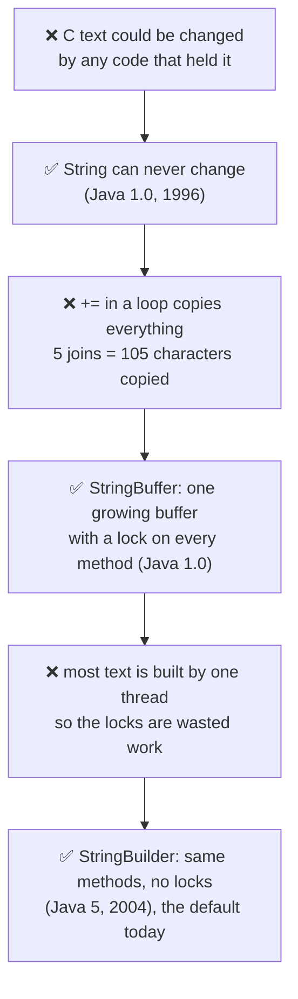
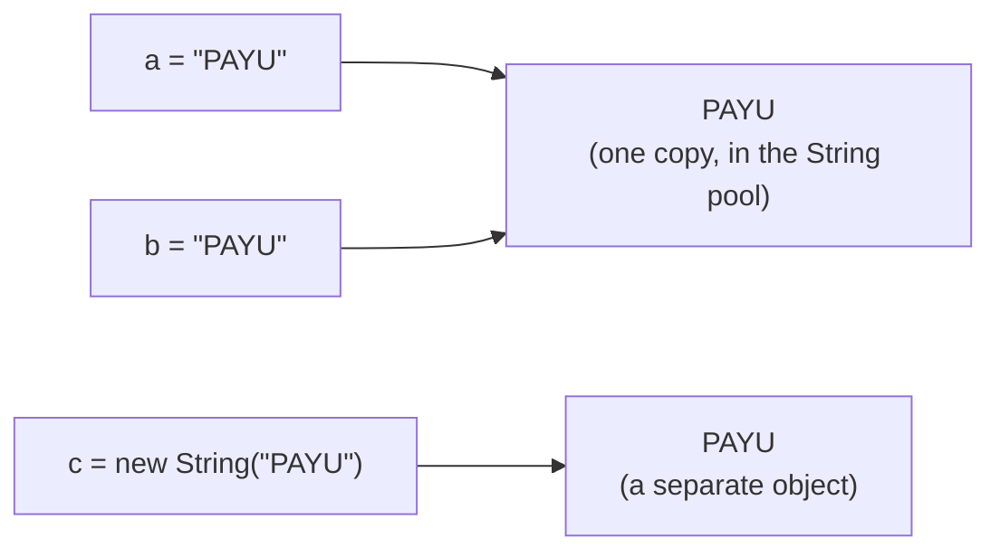
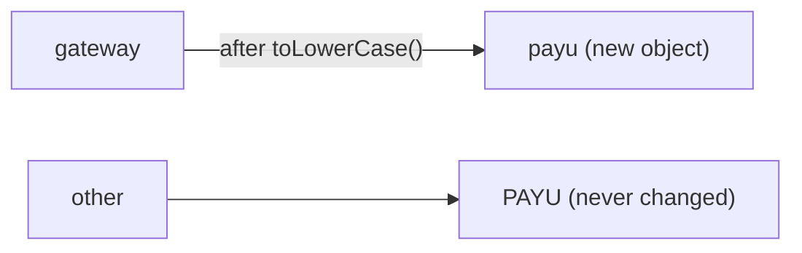
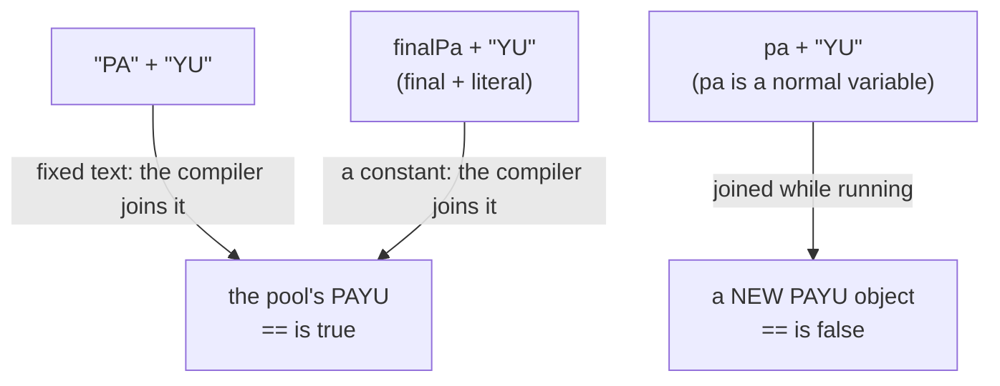
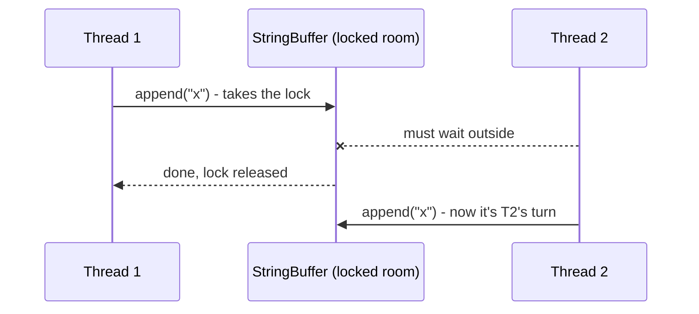
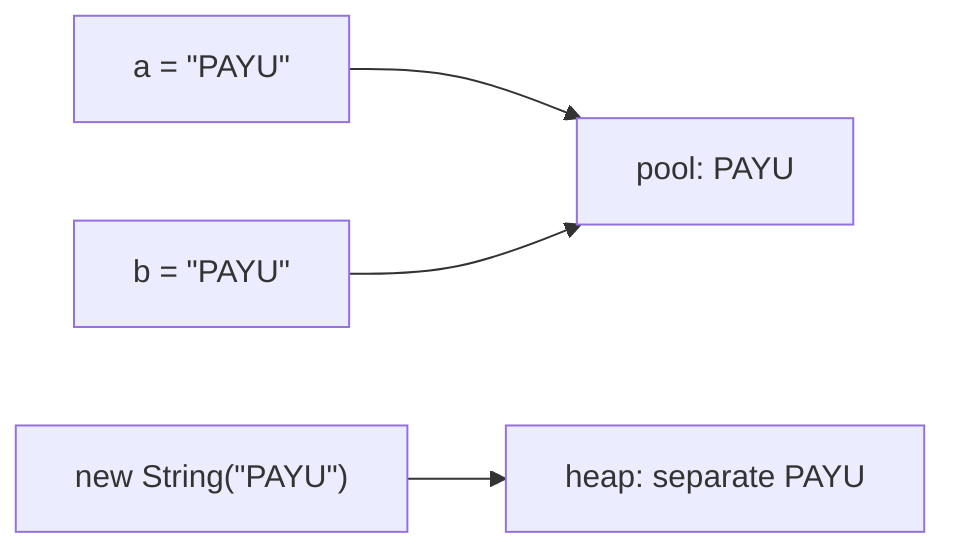

# J03 · Strings: immutability, the String pool, StringBuilder vs StringBuffer

> **In one line:** A String can **never change**; every "change" makes a new String. Because of that, Java safely **shares** one copy of each literal in the **String pool**. To build text in a loop, use **StringBuilder**, or **StringBuffer** only if threads share it.

| ⏱️ Read | 🧪 Run | 🎯 Asked |
|---|---|---|
| 12 min | `java 01-java-core/J03_StringsAndStringPool.java` | In every Java round: `==` vs equals, the pool, "why immutable?" |

---

## 🧬 Why does this exist? The story

Java didn't make three text classes for fun. Each one fixed a real pain.

> 💡 **A common mix-up:** many people think StringBuilder came first. It's the other way round. **StringBuffer is the old one (Java 1.0), and StringBuilder came later (Java 5).** The order is the story.

1. **❌ The pain (before Java):** in older languages like C, text was a plain array of characters. Any code that held it could change it. You check a file path is safe, and some other code changes it right after your check.
2. **✅ The fix (Java 1.0, 1996): String can never change.** Once created, it stays the same forever. So Java can share it safely everywhere: one copy per literal in the String pool, as HashMap keys, and across threads.
3. **❌ New pain:** building text step by step. Every `+=` makes a new String and copies all the old text again. 5 joins of "TXN0001" copy **105** characters to build a **35**-character result.
4. **✅ The fix (also Java 1.0): StringBuffer.** It's one growing, changeable buffer. `append` just writes at the end, with no copying of the old text. To be safe, every method got a **lock** (`synchronized`), so only one thread can use it at a time.
5. **❌ New pain:** almost all text is built inside one method, by one thread. There, taking a lock on every `append` is wasted work. Even the compiler used StringBuffer for every `+` in your code, so everyone paid for locks.
6. **✅ The fix (Java 5, 2004): StringBuilder.** It has the same methods, with no locks. The compiler switched `+` to it too. The Java docs say a buffer is usually "used by a single thread (as is generally the case)". So **StringBuilder is the default today.**



👀 **Notice:** every ✅ box fixes the ❌ box just above it, and then leads to the next ❌.

🧠 **So it's not random:** Java first played **safe** (locks everywhere). Later it saw that most code uses one thread, and added a **fast** version without locks. The same thing happened to collections: `Vector` and `Hashtable` (Java 1.0, locked) were followed by `ArrayList` and `HashMap` (Java 1.2, no locks). Remember "**safe first, fast later**" and you'll see it again in J01 and J04.

---

## 🧩 Words you need

| Word | In one line |
|---|---|
| **immutable** | can't be changed after it's created |
| **String pool** | a special area where Java keeps **one shared copy** of each String literal |
| **literal** | text written directly in code, like `"PAYU"` |
| **synchronized** | a lock: only one thread at a time can run that method |
| **StringBuffer** | the old changeable text buffer (Java 1.0). Every method is `synchronized`: thread-safe, a bit slower |
| **StringBuilder** | the newer copy of StringBuffer (Java 5) **without locks**: fast, **not** thread-safe |

---

## 🖼️ Picture it: the society notice board

- A **String** is a **printed notice**. You can't edit it; to change it, you print a new one.
- The **String pool** is the **notice board**. There's one copy of each notice, and everyone reads the same sheet.
- `new String("PAYU")` is **your own photocopy**: a separate sheet with the same words.
- A **StringBuilder** is a **whiteboard**: you keep writing on the same board.
- A **StringBuffer** is a whiteboard **in a locked room**: only one person writes at a time.



👀 **Notice:** `a` and `b` point to **the same object**; `c` points to a different one. That's why `a == b` is true but `a == c` is false.

| Society | Java |
|---|---|
| a printed notice | a `String` (immutable) |
| the notice board | the String pool |
| your own photocopy | `new String("PAYU")` |
| a whiteboard | `StringBuilder` |
| a whiteboard in a locked room | `StringBuffer` |

---

## 🔬 How it works, step by step

### Step 1 · A String never changes

```java
String gateway = "PAYU";
String other = gateway;              // two variables, one String
gateway = gateway.toLowerCase();     // toLowerCase() returns a NEW String
// gateway = "payu", other = "PAYU"
```



👀 **Notice:** the **variable moved** to a new object, and the old "PAYU" stayed exactly as it was. Every "changing" method returns a **new** String: `toLowerCase`, `replace`, `substring`, `trim` and `concat`.

### Step 2 · The String pool

| Check | Result | Why |
|---|---|---|
| `a == b` | **true** | both are the pool's one "PAYU" |
| `a == c` | **false** | `new` always makes a separate object |
| `a.equals(c)` | **true** | the same text |
| `a == c.intern()` | **true** | `intern()` returns the pool's copy |

🧠 `==` asks "same object?", and `equals()` asks "same text?". **Always compare Strings with `equals()`.**

💡 **Why a pool?** To save memory. If 50 classes use the literal "SUCCESS", there's still only **one** "SUCCESS" object.

### Step 3 · Why Strings are immutable: four reasons

1. **The pool depends on it.** `a` and `b` share one object. If `a` could change it to "SETU", `b` would silently change too. Nobody can trust a notice board that anyone can scribble on.
2. **They make safe HashMap keys** (J01). A key must never change after `put()`, and a String can't. It even caches its hashCode after the first call.
3. **They're thread-safe for free.** Many threads can read the same String with no locks.
4. **Security.** A DB username or a file path can't be changed after your code has checked it.

### Step 4 · Joined by the compiler vs joined while running



👀 **Notice:** this is exactly why `==` on Strings is a trap. The same text can be one object, or two.

### Step 5 · Joining in a loop: String vs StringBuilder

Append the 7-character "TXN0001" five times with `+=`. **Every round creates a new String** and copies everything so far:

| Round | New String length | Characters copied |
|---|---|---|
| 1 | 7 | 7 |
| 2 | 14 | 14 |
| 3 | 21 | 21 |
| 4 | 28 | 28 |
| 5 | 35 | 35 |
| **total** | | **105** |

A StringBuilder writes into one growing buffer, so each character is written once: **35**.

👀 **Notice:** with n rounds, `+=` does about n × n / 2 work, but StringBuilder does about n. The demo does 50,000 rounds: on this laptop `+=` took **170 to 310 ms** and StringBuilder **1 to 3 ms**. Your times will differ, but the gap won't.

💡 A single line like `"Hello " + name` is fine, because Java already makes one join efficient. **Loops** are the problem.

### Step 6 · StringBuilder vs StringBuffer

StringBuffer is the older one (Java 1.0). StringBuilder (Java 5) is the same class with the locks taken out. So they have the same methods (`append`, `insert`, `reverse`, `delete`). The only difference is **locking**:



In the demo, two threads each append "x" 100,000 times to the same object, so the right length is **200,000**:
- **StringBuffer:** 200,000, every run.
- **StringBuilder:** fewer, and a different number each run. This laptop printed 113,739, 119,494, 118,697 and 152,774. Appends get lost because both threads write the same array. In rare runs it can even crash with `ArrayIndexOutOfBoundsException`.

🧠 Text built inside one method runs on one thread, so **StringBuilder is the default**. StringBuffer is almost never needed.

| | String | StringBuilder | StringBuffer |
|---|---|---|---|
| Can change? | ❌ | ✅ | ✅ |
| Thread-safe? | ✅ (nobody can change it) | ❌ | ✅ (synchronized) |
| Many joins | slow (a new object each time) | **fastest** | a bit slower (locking) |
| Use it for | fixed text, keys, constants | building text in a method or loop | text shared between threads (rare) |

---

## 💻 Code you should be able to write

```java
// Build a CSV line from many transactions: StringBuilder, not +=
StringBuilder csv = new StringBuilder();
for (String txnId : txnIds) {
    if (csv.length() > 0) csv.append(',');   // no comma before the first one
    csv.append(txnId);
}
String line = csv.toString();

// Compare text: equals, never ==
if ("SUCCESS".equals(status)) { ... }        // literal first: no NullPointerException if status is null
```

**What the demo prints** (from a real run):

```text
=== Step 2: the String pool ===
a == b          : true
a == c          : false
a.equals(c)     : true
a == c.intern() : true
Notice: == compares objects, equals() compares text. Always use equals() for Strings.

=== Step 5: joining in a loop ===
total characters copied with += : 105
StringBuilder writes each char once: 35
50000 joins: String += took 311 ms, StringBuilder took 3 ms (same result: true)
```

---

## ⚠️ Traps interviewers love

| Trap | Why it's wrong | Say this instead |
|---|---|---|
| Comparing Strings with `==` | it compares objects; the same text can be two objects | "`equals()` for content" |
| "`s.toUpperCase()` changes s" | it returns a **new** String | "Strings are immutable: assign the result" |
| `+=` in a loop | it copies everything every round, about n²/2 work | "StringBuilder" |
| "StringBuffer is better because it's safe" | locking costs time and is rarely needed | "StringBuilder by default" |
| "`new String("x")` creates 1 object" | it can create 2: the pool literal plus the heap object | "Up to two" |

---

## 🎯 In the interview

**What they're really testing**
- *Service companies:* immutability, `==` vs equals, the pool, and String vs StringBuilder vs StringBuffer.
- *Product companies:* **why** immutability (the pool, security, hashCode caching, thread safety), compile-time constant folding, the cost of `+=` in a loop, `intern()`, and why passwords go in a `char[]`.

**Say it in this order** (the story, start to end):
1. **The problem:** text is shared everywhere (the pool, map keys, threads), so it must never change. That's why a String is **immutable**: every change makes a new object.
2. Literals are **shared** from the String pool; `new String()` makes a separate object. So compare with **equals()**.
3. Immutability is what makes the pool safe. It also makes Strings safe HashMap keys, thread-safe and secure.
4. **The new problem:** `+` in a loop creates a new String every round. That's why a changeable buffer exists.
5. **The history:** StringBuffer (Java 1.0) locks every method. Most text is built by one thread, so Java 5 added **StringBuilder** without locks. **It's the default.**

**Sample answer** (about a minute, in your own words):

> "String in Java is immutable. If I call toLowerCase on "PAYU", I get a new String, and the original doesn't change. String literals are stored in the String pool, so two variables with the literal "PAYU" point to the same object, while new String creates a separate one. That's why we compare with equals, not ==. Immutability is what makes this sharing safe, and it also makes Strings good HashMap keys and thread-safe. The cost is that every change creates a new object, so joining in a loop with + is slow. That's why Java has a changeable buffer. The first one, StringBuffer, came in Java 1.0 with every method synchronized. Most text is built by one thread, so Java 5 added StringBuilder, the same thing without locks. I use StringBuilder by default, and StringBuffer only if threads share the buffer."

**Product-company deep dive:**
- **Q: How many objects does `new String("PAYU")` create?**
  **A:** Up to two: the pool literal (only if it isn't there yet) plus the new heap object.
- **Q: Why store passwords in a `char[]`?**
  **A:** You can't erase a String. It stays in memory until garbage collection, maybe even in the pool. You can wipe a `char[]` right after use: `Arrays.fill(pwd, '0')`.
- **Q: Where is the pool?**
  **A:** In the heap, since Java 7. Before that it was in PermGen (J09).
- **Q: Does `a + b` use StringBuilder?**
  **A:** Old Java compiled it into StringBuilder calls. Since Java 9 it uses a faster built-in mechanism (`invokedynamic`). Either way, each `+` expression is one new String, so loops still need StringBuilder.
- **Q: Compact strings?**
  **A:** Since Java 9, Latin-1 text stores 1 byte per character instead of 2, which halves the memory for most Strings.

---

## ❓ Follow-up questions

**Why is the String class `final`?**
So nobody can make a subclass whose text changes. That would break the pool, security and every guarantee above.

**What does `intern()` do?**
It returns the pool's copy of that text, adding it to the pool if it's missing.

**equals vs equalsIgnoreCase vs compareTo?**
equals checks the exact text. equalsIgnoreCase ignores case, so "payu" matches "PAYU". compareTo is for sorting: it returns a negative number, 0 or a positive number (J08).

---

## 🧪 Test yourself (answer aloud, then click)

<details><summary>1. a = "PAYU", b = "PAYU", c = new String("PAYU"). What are a == b, a == c, a.equals(c) and a == c.intern()?</summary>

true, false, true, true.

</details>

<details><summary>2. String s = "PAYU"; s.toLowerCase(); System.out.println(s); What prints?</summary>

PAYU. toLowerCase() returned a new String, and nobody kept it.

</details>

<details><summary>3. What do "PA" + "YU" == "PAYU", pa + "YU" == "PAYU" (normal variable) and the same with a final variable give?</summary>

true, false, true. The compiler joins fixed text and constants. Anything joined while running is a new object.

</details>

<details><summary>4. You append "TXN0001" 4 times with +=. How many characters are copied?</summary>

7 + 14 + 21 + 28 = 70. StringBuilder would write 28.

</details>

<details><summary>5. You build a CSV line from 1,000 transactions inside a method. Which class do you use?</summary>

StringBuilder. It's a loop, so not String +=, and it runs on one thread, so no locking is needed.

</details>

<details><summary>6. Why does the String pool need immutability?</summary>

Many variables share one object. If one of them could change it, everyone else would see the change.

</details>

<details><summary>7. Which came first, StringBuffer or StringBuilder? Why was the second one added?</summary>

StringBuffer came first, in Java 1.0, with a lock on every method. StringBuilder came in Java 5, because most text is built by one thread, and there the locks are wasted work.

</details>

If you get stuck on one, add it to [STUMBLE-LIST.md](../STUMBLE-LIST.md). When they all feel easy, tick J03 in the [README](../README.md) and send `next`.

---

## ⚡ Quick Revision (2 hours before the interview)

**🧬 The story:** shared text must never change → **String** is immutable (Java 1.0) → `+=` in a loop copies everything → **StringBuffer**, a growing buffer with locks (Java 1.0) → the locks are wasted on one thread → **StringBuilder**, no locks (Java 5), the default.



**🧠 Must remember**
1. A String is **immutable**. `toLowerCase` and `replace` return a **new** String.
2. Literals are shared from the **String pool**: `a == b` is true. `new String` is a separate object: `a == c` is false.
3. **Always compare with `equals()`.** `==` compares objects.
4. `"PA" + "YU"` is joined by the compiler and is the pool object. `pa + "YU"` (a normal variable) is a new object.
5. Why immutable: the **pool**, **HashMap keys** (a cached hash), **thread safety** and **security**.
6. `+=` in a loop copies everything every round. 5 × "TXN0001" copies **105** characters, versus **35** with StringBuilder.
7. **StringBuffer** (Java 1.0) is synchronized. **StringBuilder** (Java 5) is the same without locks, so it's faster, and it's the default.
8. `new String("x")` creates **up to 2** objects. Passwords go in a `char[]`, because it can be wiped.

**⚠️ Top traps**
- `==` on Strings.
- Forgetting to assign the result: `s.trim();` does nothing to `s`.
- `+=` inside loops.

**🎯 30-second answer:** "Strings are immutable, so every change creates a new object. Literals are shared in the String pool, which is safe only because nobody can change them, so we compare with equals, not ==. Immutability also makes Strings safe HashMap keys and thread-safe. The cost is that joining in a loop copies everything, so Java added a changeable buffer: StringBuffer in Java 1.0, with locks, then StringBuilder in Java 5, without them. I use StringBuilder, and StringBuffer only if threads share it."

**🔑 Memory hook:** *"A printed notice on the society board: one copy for everyone, and nobody can scribble on it. For drafts, use a whiteboard (StringBuilder); lock the room (StringBuffer) only if many people write."* And: **safe first, fast later**, StringBuffer (1.0) then StringBuilder (5).

**🗣️ Say it aloud (no peeking):**
1. Why does `a == b` print true but `a == c` print false?
2. Give four reasons why String is immutable.
3. Tell the story: why does StringBuffer exist, and why was StringBuilder added later?
