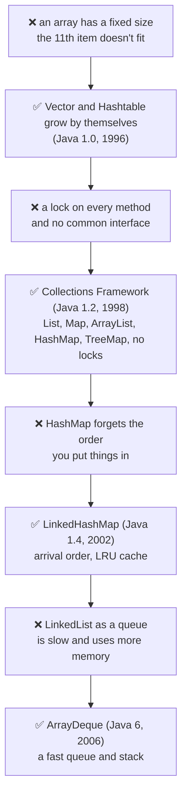
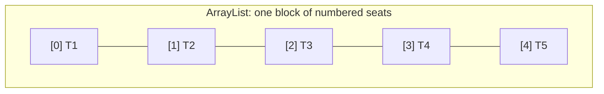
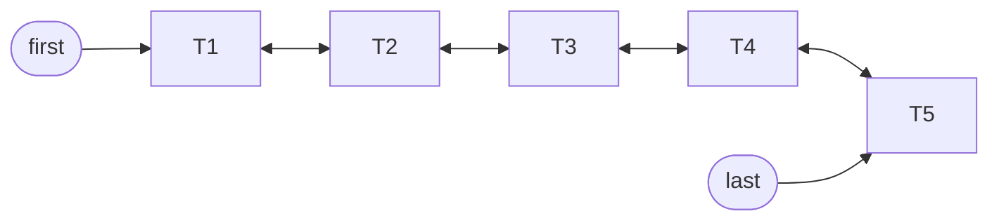
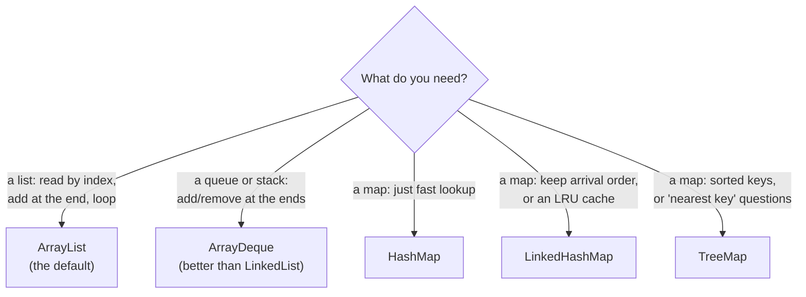
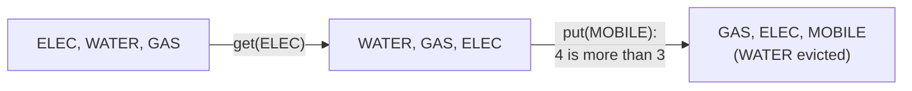
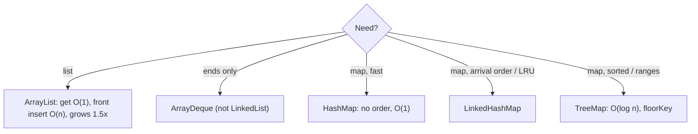

# J04 · ArrayList vs LinkedList, and HashMap vs LinkedHashMap vs TreeMap

> **In one line:** An **ArrayList** is an array, so reading by index is instant but inserting at the front shifts everything. A **LinkedList** is a chain, so adding at the ends is instant but reaching the middle means walking. The three maps differ in the **order** you get the keys back: **none** (HashMap), **arrival** (LinkedHashMap) or **sorted** (TreeMap).

| ⏱️ Read | 🧪 Run | 🎯 Asked |
|---|---|---|
| 14 min | `java 01-java-core/J04_ListsAndMaps.java` | "Which collection would you use and why?" comes up in every round |

---

## 🧬 Why does this exist? The story

Why does Java have so many lists and maps? Each one arrived to fix a pain the older ones had:

1. **❌ The pain:** a Java array has a **fixed size**. `new String[10]` holds 10 transactions, and the 11th doesn't fit. You'd have to make a bigger array and copy everything yourself.
2. **✅ The fix (Java 1.0, 1996): `Vector` and `Hashtable`.** A list and a map that grow by themselves.
3. **❌ New pain:** both put a **lock** on every method, which is wasted time when one thread uses them. They also had no common interface, so code written for one couldn't switch to another.
4. **✅ The fix (Java 1.2, 1998): the Collections Framework.** Common interfaces (`List`, `Set`, `Map`) and fast classes with no locks: `ArrayList`, `LinkedList`, `HashMap` and `TreeMap`. Each has a **shape** that's fast for one job: ArrayList for reading by index, LinkedList for adding at the ends, TreeMap for sorted keys.
5. **❌ New pain:** HashMap forgets the order you put things in. For "recent billers in the order they were added", or for a cache, you need that order.
6. **✅ The fix (Java 1.4, 2002): `LinkedHashMap`.** A HashMap plus an arrival register. With one flag, it becomes an LRU cache in 10 lines (Step 7).
7. **❌ New pain:** people used LinkedList as a queue. But its nodes are scattered in memory, so it's slow, and it uses more memory.
8. **✅ The fix (Java 6, 2006): `ArrayDeque`.** A queue and stack built on an array, which is faster.



👀 **Notice:** "**safe first, fast later**" again (J03, J01): Vector and Hashtable (locked) came first, ArrayList and HashMap (no locks) came later.

🧠 **So it's not random:** every collection is a trade-off picked for one job. Java 21 (2023) added one more small fix: `getFirst()` and `getLast()` on every ordered collection, because each class used to do it differently.

---

## 🧩 Words you need

| Word | In one line |
|---|---|
| **index** | a position in a list: 0, 1, 2 … |
| **capacity** | how many seats an ArrayList's array has, which isn't the same as how many are used |
| **node** | a LinkedList box: the value plus links to the previous and next box |
| **insertion order** | the order you put things in |
| **LRU cache** | "Least Recently Used": when the cache is full, drop the entry unused for the longest time |

---

## 🖼️ Picture it: cinema seats vs train coaches

- **ArrayList = numbered cinema seats in a row.** You can walk straight to seat 3. But to seat someone in seat 0, everyone shifts one seat right. When the row is full, everyone moves to a hall **1.5×** bigger.
- **LinkedList = train coaches.** Each coach is hooked to the one before and after. Attaching a coach at either end is quick. But to reach the 4th coach, you walk through the first three.





👀 **Notice:** the ArrayList is **one block** you can jump into. The LinkedList is **separate boxes** joined by links, so you must follow them.

**And the maps:**
- **HashMap** is the cupboard with drawers (J01). It's fast, but keys come back in **drawer order**, which looks random.
- **LinkedHashMap** is the same cupboard plus an **arrival register**, so you get insertion order.
- **TreeMap** is a **telephone directory**: always sorted, and finding a name takes a few "higher or lower" steps.

---

## 🔬 How it works, step by step

### Step 1 · ArrayList: an array inside

```text
index:   [0]  [1]  [2]  [3]  [4]  [5] ... [9]
          T1   T2   T3   T4   T5   (empty seats: capacity 10)

add(0, "T0"):   T0 -> [0], T1 -> [1], T2 -> [2] ...   (5 items shift right)
```

- **`get(3)`** jumps straight to seat 3 and returns T4. That's **O(1)**.
- **`add(x)` at the end** takes the next empty seat, O(1) usually.
- **`add(0, x)` at the front** makes 5 items shift. With n items that's **O(n)**, and removing from the front is the same.
- **When the array is full**, ArrayList creates a new one **1.5× bigger** and copies everything: **10 → 15 → 22 → 33 → 49**. Each step is the old size plus half of it: 10 + 5 = 15, 15 + 7 = 22. The first array of 10 is only created at the first `add()`.

### Step 2 · LinkedList: coaches with links

- **`addFirst("T0")` or `addLast("T6")`** just hooks on a node, and nothing shifts: **O(1)**.
- The list is now [T0, T1, T2, T3, T4, T5, T6]. **`get(3)`** walks T0 → T1 → T2 → T3: **O(n)**. It starts from the nearer end.
- **Adding in the middle** takes O(n) to walk there, then O(1) to hook the node in.
- **Memory:** every item sits in a node with **2 extra links** (prev and next), so a LinkedList uses much more memory.

### Step 3 · Measure it (the demo does this)

| Test | ArrayList | LinkedList |
|---|---|---|
| `get(i)` for every i, 20,000 items | **0 to 1 ms** (jumps) | 117 to 168 ms (walks every time) |
| `add(0, x)` 30,000 times | 21 to 39 ms (shifts everything) | **2 to 7 ms** (just links) |

👀 **Notice:** each list wins one test. These times come from several runs on this laptop. Yours will differ, but the same list will win each test.

### Step 4 · Which one to pick



🧠 **ArrayList is the default** for lists. LinkedList is rarely the right answer. Even for queues, `ArrayDeque` is usually faster.

### Step 5 · Same keys, three maps, three orders

Put the employee IDs **250, 42, 305, 101**, in that order, into each map:

| Map | Printed order | Why |
|---|---|---|
| HashMap | **[305, 101, 250, 42]** | bucket order (J01): 305 % 16 = 1, 101 % 16 = 5, and 250 and 42 both give 10 |
| LinkedHashMap | **[250, 42, 305, 101]** | the order they were put in |
| TreeMap | **[42, 101, 250, 305]** | sorted |

### Step 6 · TreeMap answers "nearest key" questions

```text
keys:   42 ------ 101 ------ (200) ------ 250 ------ 305
                   ^                       ^
           floorKey(200) = 101     ceilingKey(200) = 250
```

- `firstKey()` gives **42**, and `lastKey()` gives **305**.
- `floorKey(200)` gives **101**, the biggest key that's 200 or less. `ceilingKey(200)` gives **250**, the smallest key that's 200 or more.
- `headMap(250)` gives {42, 101}, everything below 250.

**A real payments use: fee slabs.** From ₹0 the fee is ₹0; from ₹1,000 it's ₹5; from ₹5,000 it's ₹10; from ₹10,000 it's ₹15.

| Amount | `floorKey(amount)` | Fee |
|---|---|---|
| ₹999 | 0 | ₹0 |
| ₹7,200 | 5,000 | ₹10 |
| ₹10,000 | 10,000 | ₹15 |

👀 **Notice:** one `floorEntry(amount)` call replaces a whole if-else chain.

### Step 7 · LinkedHashMap as an LRU cache

In **access order** mode (`new LinkedHashMap<>(16, 0.75f, true)`), every `get` moves that key to the end. Add a size limit (`removeEldestEntry`), and the front is always the least recently used entry.



👀 **Notice:** WATER was at the front (unused the longest), so it's the one dropped. This is a biller-details cache in ten lines.

---

## 💻 Code you should be able to write

```java
// An LRU cache in 10 lines
class LruCache<K, V> extends LinkedHashMap<K, V> {
    private final int maxSize;
    LruCache(int maxSize) {
        super(16, 0.75f, true);                       // true = access order
        this.maxSize = maxSize;
    }
    @Override
    protected boolean removeEldestEntry(Map.Entry<K, V> eldest) {
        return size() > maxSize;                      // too many? drop the least recently used
    }
}

// Fee slab lookup with TreeMap
int fee = feeSlabs.floorEntry(amount).getValue();
```

**What the demo prints** (from a real run):

```text
HashMap       : [305, 101, 250, 42]   (bucket order: 305->1, 101->5, 250 and 42->10)
LinkedHashMap : [250, 42, 305, 101]   (the order they were put in)
TreeMap       : [42, 101, 250, 305]   (sorted)
...
after get(ELEC) : [WATER, GAS, ELEC]
after put MOBILE: [GAS, ELEC, MOBILE]   (WATER evicted)
```

---

## ⚠️ Traps interviewers love

| Trap | Why it's wrong | Say this instead |
|---|---|---|
| "LinkedList is faster for inserts" | only at the ends. In the middle it first walks O(n), and its nodes are scattered in memory | "ArrayList by default; ArrayDeque for queues" |
| "HashMap keeps insertion order" | it doesn't. Small maps can *look* ordered by luck | "LinkedHashMap for insertion order" |
| A null key in a TreeMap | a NullPointerException, because it must compare keys | "TreeMap needs comparable, non-null keys" |
| `Arrays.asList(...).add(x)` | fixed size, so UnsupportedOperationException | "`new ArrayList<>(Arrays.asList(...))`" |
| "ArrayList grows 2×" | it grows **1.5×**; Vector grows 2× | "10 → 15 → 22 → 33" |

---

## 🎯 In the interview

**What they're really testing**
- *Service companies:* the differences in plain words and the Big-O table.
- *Product companies:* **why** ArrayList usually wins (memory layout, cache-friendliness), the growth policy, LRU with LinkedHashMap, TreeMap's navigation methods, and picking a collection for a real scenario.

**Say it in this order** (start with the problem):
0. **Why there are so many:** arrays can't grow, so Java added collections that grow by themselves. Each one has a shape that's fast for one job.
1. **ArrayList** is a resizable array: `get(i)` is O(1), inserting at the front or in the middle is O(n) because of shifting, and it grows 1.5×.
2. **LinkedList** is a doubly linked list: O(1) at the ends, O(n) `get(i)`, and more memory per item.
3. In practice **ArrayList is the default**, and ArrayDeque is better for queues.
4. **HashMap** has no order, O(1). **LinkedHashMap** keeps insertion or access order (LRU). **TreeMap** is sorted, O(log n), with floor and ceiling.
5. Pick by need: speed → HashMap, arrival order → LinkedHashMap, sorted or ranges → TreeMap.

**Sample answer** (about a minute, in your own words):

> "Arrays have a fixed size, so Java gives us collections that grow, and each one is fast for a different job. ArrayList is backed by an array, so get by index is O(1), but inserting at the front shifts every element, so it's O(n), and when it's full it grows by 50% and copies everything. LinkedList is a doubly linked list: adding or removing at the ends is O(1), but get by index walks the nodes, and each node carries two extra links. In practice I use ArrayList almost always. For maps, HashMap gives O(1) with no ordering. LinkedHashMap keeps insertion order, and in access order it can work as an LRU cache. TreeMap keeps keys sorted in a red-black tree, O(log n), with methods like floorKey, which I'd use for fee slabs by amount."

**Product-company deep dive:**
- **Q: Why is ArrayList often faster even with some shifting?**
  **A:** Its items sit next to each other in memory, so the CPU reads them in fast blocks, and Java moves them with one `System.arraycopy`. LinkedList nodes are scattered, and it must walk node by node.
- **Q: Design an LRU cache.**
  **A:** LinkedHashMap in access order with `removeEldestEntry`, as above. From scratch, it's a HashMap plus a doubly linked list, which gives O(1) get and put.
- **Q: What's the default ArrayList capacity?**
  **A:** 10, created lazily at the first add. It grows 1.5×. If you know the size, pass it in: `new ArrayList<>(1000)`.

---

## ❓ Follow-up questions

**ArrayList vs Vector?**
Vector is the old one (Java 1.0): every method is synchronized, and it grows 2×. ArrayList (Java 1.2) took the locks out, because most lists are used by one thread. Use ArrayList, or a concurrent collection for threads.

**Arrays.asList vs List.of?**
`Arrays.asList` has a fixed size: `set()` works, but `add()` and `remove()` throw. `List.of` is fully unmodifiable and doesn't allow nulls.

**How does LinkedHashMap remember the order?**
Every entry also sits in a doubly linked list in arrival order. That costs 2 extra links per entry.

**Sets?**
`HashSet`, `LinkedHashSet` and `TreeSet` give the same three orders, because each one uses the matching map inside.

*Only if they push further:* Java 21 added `SequencedCollection` and `SequencedMap`, which give `getFirst()`, `getLast()` and `reversed()` on lists, deques, LinkedHashMap and TreeMap.

---

## 🧪 Test yourself (answer aloud, then click)

<details><summary>1. An ArrayList holds 5 items. How many items move on add(0, x)?</summary>

All 5.

</details>

<details><summary>2. An ArrayList starts at capacity 10. What are the next three capacities?</summary>

15, 22, 33 (the old size plus half of it each time).

</details>

<details><summary>3. A LinkedList has 1,000 items. Roughly how many hops does get(500) take?</summary>

About 500. It walks from the nearer end, and 500 is the middle.

</details>

<details><summary>4. The keys 250, 42, 305, 101 go into each map. In what order does each print them?</summary>

HashMap: [305, 101, 250, 42]. LinkedHashMap: [250, 42, 305, 101]. TreeMap: [42, 101, 250, 305].

</details>

<details><summary>5. The slabs are 0→0, 1000→5, 5000→10, 10000→15. What's the fee for ₹4,999?</summary>

floorKey(4999) is 1000, so the fee is ₹5.

</details>

<details><summary>6. An LRU cache holds 3. You put ELEC, WATER and GAS, call get(WATER), then put MOBILE. What's evicted?</summary>

ELEC. After get(WATER) the order is [ELEC, GAS, WATER], so ELEC is the least recently used.

</details>

<details><summary>7. Java already had Vector. Why was ArrayList added? And why LinkedHashMap later?</summary>

Vector (Java 1.0) locks every method, which is wasted work when one thread uses the list. ArrayList (Java 1.2) is the same idea without locks, under the common List interface. LinkedHashMap (Java 1.4) was added because HashMap forgets the order you put things in.

</details>

If you get stuck on one, add it to [STUMBLE-LIST.md](../STUMBLE-LIST.md). When they all feel easy, tick J04 in the [README](../README.md) and send `next`.

---

## ⚡ Quick Revision (2 hours before the interview)

**🧬 The story:** arrays can't grow → **Vector, Hashtable** (Java 1.0, locked) → locks wasted, no common interface → **Collections Framework** (1.2): ArrayList, LinkedList, HashMap, TreeMap → HashMap forgets the order → **LinkedHashMap** (1.4) → LinkedList is a slow queue → **ArrayDeque** (6).



**🧠 Must remember**
1. **ArrayList:** an array inside. `get(i)` is **O(1)**; `add(0)` is **O(n)** (5 items shift). It grows **1.5×**: 10 → 15 → 22 → 33 → 49.
2. **LinkedList:** nodes with prev/next links. **O(1)** at the ends, **O(n)** `get(i)`, more memory.
3. **ArrayList is the default.** Use **ArrayDeque** for queues and stacks.
4. **HashMap:** no order. Keys 250, 42, 305, 101 print as [305, 101, 250, 42].
5. **LinkedHashMap:** insertion order, [250, 42, 305, 101]. In access order it's an **LRU cache**.
6. **TreeMap:** sorted, [42, 101, 250, 305]. **O(log n)**. `floorKey(200)` = 101, `ceilingKey(200)` = 250. **No null keys.**
7. **Fee slabs:** `floorEntry(amount)` replaces an if-else chain.
8. `Arrays.asList` is fixed-size. `List.of` is unmodifiable and allows no nulls.

**⚠️ Top traps**
- "LinkedList inserts are faster" is only true at the ends.
- HashMap has no order you can rely on.
- A null key in a TreeMap throws a NullPointerException.

**🎯 30-second answer:** "ArrayList is a resizable array: O(1) get by index, O(n) inserts at the front, and it grows 1.5×. LinkedList is a doubly linked list: O(1) at the ends but O(n) to reach an index, with extra memory per node. So ArrayList is my default. For maps, HashMap is fastest with no order, LinkedHashMap keeps insertion order and can be an LRU cache, and TreeMap keeps keys sorted, O(log n), with floor and ceiling lookups."

**🔑 Memory hook:** *"Cinema seats (jump to any seat, shifting is painful) vs train coaches (easy to hook on at the ends, you walk to reach the middle). The cupboard, the register or the directory: no order, arrival order, sorted."*

**🗣️ Say it aloud (no peeking):**
1. Java already had Vector and Hashtable. Why were ArrayList, HashMap and later LinkedHashMap added?
2. Why does ArrayList usually beat LinkedList, even for some inserts?
3. The same 4 keys: what order does each map give? And how do you turn LinkedHashMap into an LRU cache?
