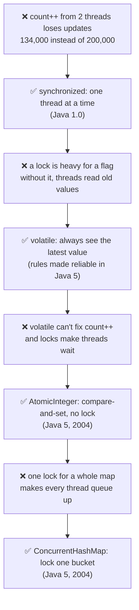
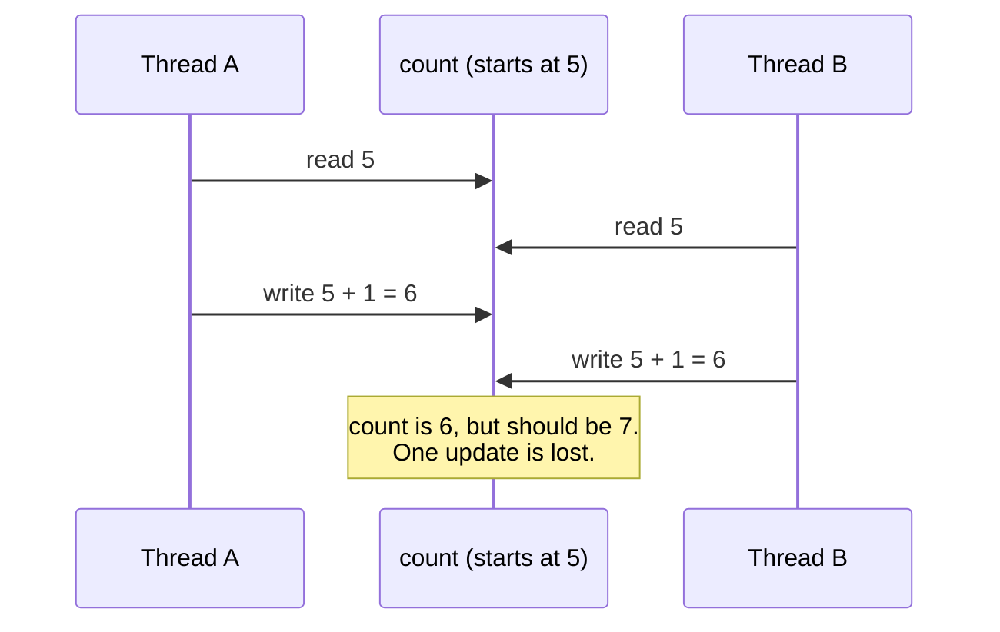
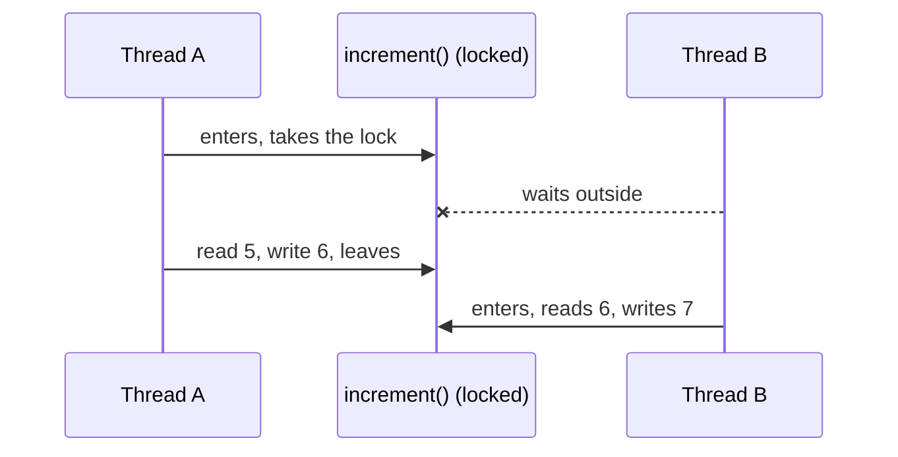
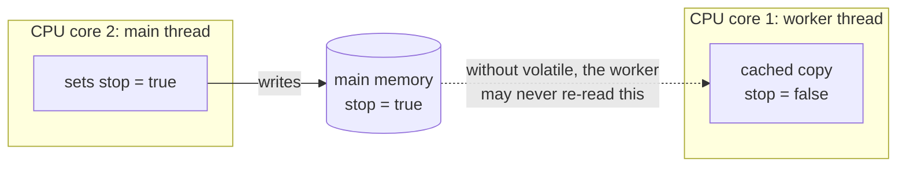
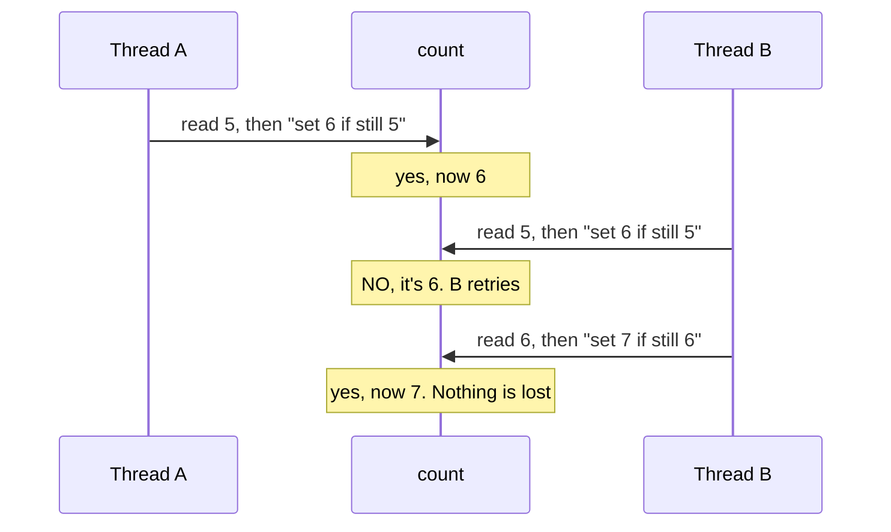
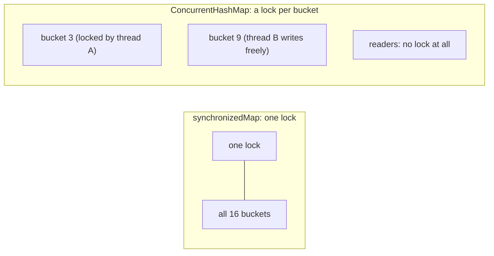
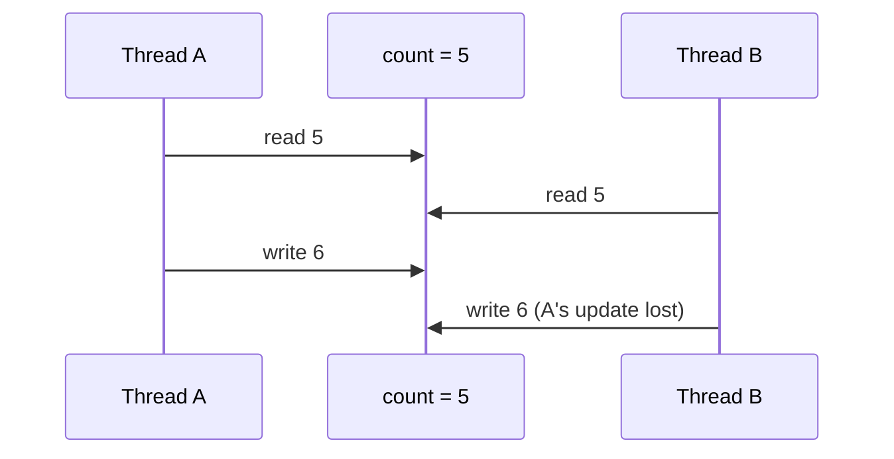

# J05 · synchronized, volatile, and ConcurrentHashMap vs synchronizedMap

> **In one line:** When two threads change the same data, updates get **silently lost**. `synchronized` lets one thread in at a time. `volatile` only makes the **latest value visible**. `AtomicInteger` does safe counting without locks. `ConcurrentHashMap` is a thread-safe map that locks **one bucket**, not the whole map.

| ⏱️ Read | 🧪 Run | 🎯 Asked |
|---|---|---|
| 14 min | `java 01-java-core/J05_ConcurrencyBasics.java` | Every backend round. Payments interviews love "two requests debit at the same time" |

---

## 🧬 Why does this exist? The story

Why does Java have so many tools for threads? Each one fixed the pain the one before it left behind:

1. **❌ The pain:** two threads run `count++` on one counter. It's really 3 steps (read, add, write), so the steps overlap and updates get lost. 2 × 100,000 gave about **134,000**.
2. **✅ The fix (Java 1.0, 1996): `synchronized`.** A lock: only one thread at a time runs that code. Exactly **200,000**.
3. **❌ New pain:** a lock is heavy for something tiny, like a stop flag. And with no lock at all, a thread may keep reading its own **old cached copy** of the flag and never stop.
4. **✅ The fix: `volatile`.** Every read sees the latest write. The keyword was in Java 1.0, but its rules were only made clear and reliable in **Java 5 (2004)**.
5. **❌ New pain:** volatile doesn't fix `count++` (still 3 steps). And synchronized makes every other thread **wait**.
6. **✅ The fix (Java 5, 2004): `AtomicInteger`.** It uses a CPU instruction, compare-and-set: "write 6 only if it's still 5, otherwise retry". Nothing is lost, and no thread waits.
7. **❌ New pain:** shared maps. HashMap loses entries with 2 threads. Hashtable and `synchronizedMap` are safe, but one lock covers the **whole map**, so every thread waits in one line.
8. **✅ The fix (Java 5, 2004): `ConcurrentHashMap`.** It locks only a small part (since Java 8, one bucket), and reads don't lock at all. Many threads work at the same time.



👀 **Notice:** Java 5 brought the whole `java.util.concurrent` package (atomics, ConcurrentHashMap, thread pools). Before it, `synchronized` was almost the only tool.

🧠 **So it's not random:** every tool is "safe, but with less waiting" than the one before. Java 8 added one last piece: `merge()` and `compute()`, which do "read then update" as one safe step (Step 6).

---

## 🧩 Words you need

| Word | In one line |
|---|---|
| **race condition** | two threads change shared data at the same time, and the result depends on luck |
| **atomic** | done as **one** step that can't be split or interrupted |
| **visibility** | whether one thread can **see** another thread's latest write |
| **lock** | a key only one thread can hold; the others wait |
| **CAS (compare-and-set)** | a CPU instruction meaning "write the new value only if the old one is still what I read" |

---

## 🖼️ Picture it: one ledger, two cashiers

Two cashiers update the same ledger. Both read "5 payments", both write "6", and one payment is gone. Nobody made an error; they just overlapped.



👀 **Notice:** `count++` looks like one step but is **three**: read, add, write. The damage happens when two threads' steps interleave.

| Bank | Java |
|---|---|
| two cashiers overwriting each other | a race condition |
| a room with one key | `synchronized` |
| the live notice board (no private diary copies) | `volatile` |
| "write only if it still says 5, else re-read" | `AtomicInteger` (CAS) |
| one counter for every customer | `Collections.synchronizedMap` |
| many counters, one per section | `ConcurrentHashMap` |

---

## 🔬 How it works, step by step

The running example: **two threads each record 100,000 payments into one counter**, so the right answer is **200,000**.

### Step 1 · The race: a plain `int`

This laptop printed **118,516**, **134,310** and **139,589** on different runs. The number changes every run, and it's always wrong. No exception is thrown, which is what makes this dangerous in production.

### Step 2 · `synchronized`: one thread at a time

```java
synchronized void increment() { value++; }     // only one thread can be inside
```



`synchronized` gives **two** guarantees:
1. **Mutual exclusion:** one thread at a time.
2. **Visibility:** the next thread sees the changes.

Result: **200,000**, every time.

### Step 3 · `volatile`: visibility, but NOT atomic

Each CPU core can keep a **cached copy** of a variable. Without `volatile`, a thread may keep reading its stale copy forever.



**The demo's stop flag:** a worker loops `while (!stop)`, and the main thread sets `stop = true`.
- Without volatile, the worker was **still running 1 second later**, in every run.
- With `volatile boolean stop`, it **stopped** at once.

**But volatile does NOT fix `count++`.** You read the latest value, but read-add-write can still interleave. The volatile counter printed **132,514** to **171,978** (and 150,072), which is still wrong.

🧠 **volatile = visibility. synchronized = visibility + one-at-a-time.** Use volatile for a flag one thread writes and others read, not for counters.

### Step 4 · `AtomicInteger`: compare-and-set, no lock



Result: **200,000**, every time, with no thread ever blocked. This is the best fit for counters.

### Step 5 · Maps under two threads

Two threads each put **50,000 different keys**, so the right size is **100,000**:

| Map | Size in the demo | Why |
|---|---|---|
| `HashMap` | 79,155 · 83,250 · 88,764 ❌ | not thread-safe: entries get lost during concurrent writes and resizes |
| `Collections.synchronizedMap` | 100,000 ✅ | **one lock** for the whole map |
| `ConcurrentHashMap` | 100,000 ✅ | locks **only the bucket** being written; reads don't lock |



👀 **Notice:** both are **correct**. The difference is **waiting**. With synchronizedMap, a writer on bucket 3 blocks a reader of bucket 9. With ConcurrentHashMap, they run at the same time.

### Step 6 · A thread-safe map does NOT make your logic thread-safe

```java
map.put("SUCCESS", map.get("SUCCESS") + 1);   // two calls: another thread can run in between
```

Even on a ConcurrentHashMap, this gave about **52,000** instead of 100,000, the same lost update as Step 1. The fix is **one atomic call**:

```java
map.merge("SUCCESS", 1, Integer::sum);        // "add 1 to whatever is there", in one step: 100,000
```

Other one-step "check then act" methods are `putIfAbsent`, `computeIfAbsent` and `compute`.

| Tool | One at a time? | Sees the latest value? | Use it for |
|---|---|---|---|
| `synchronized` | ✅ | ✅ | a block of code that must not interleave |
| `volatile` | ❌ | ✅ | a flag written by one thread |
| `AtomicInteger` / `AtomicLong` | ✅ for one variable (CAS) | ✅ | counters, IDs |
| `synchronizedMap` | ✅ one lock for everything | ✅ | rarely, low traffic |
| `ConcurrentHashMap` | a lock per bucket, lock-free reads | ✅ | shared maps: caches, counters with `merge` |

---

## 💻 Code you should be able to write

```java
// A thread-safe counter, three ways
synchronized void increment() { count++; }          // lock
AtomicInteger count = new AtomicInteger();          // CAS, no lock: count.incrementAndGet()
map.merge(status, 1, Integer::sum);                 // per-key counter in a ConcurrentHashMap

// A stop flag
private volatile boolean running = true;            // one thread writes it, others read it

// Duplicate-callback guard: only the FIRST thread gets null back
if (processed.putIfAbsent(txnId, Boolean.TRUE) == null) {
    process(txnId);
}
```

**What the demo prints** (from a real run):

```text
plain int    : 134310 (expected 200000, changes every run)
synchronized : 200000 (expected 200000)
volatile int : 150072 (expected 200000, still wrong)
stop flag without volatile: still running 1 second later (never saw stop = true)
stop flag with volatile   : stopped
AtomicInteger: 200000 (expected 200000)
```

---

## ⚠️ Traps interviewers love

| Trap | Why it's wrong | Say this instead |
|---|---|---|
| "volatile makes count++ safe" | it gives visibility, not atomicity | "AtomicInteger or synchronized for counters" |
| "ConcurrentHashMap makes my code thread-safe" | each call is safe, but get-then-put is two calls | "Use merge / compute / putIfAbsent" |
| "synchronizedMap and ConcurrentHashMap are the same" | one lock vs a lock per bucket, and lock-free reads | "Both are correct; CHM scales far better" |
| Iterating a synchronizedMap without a lock | another thread can change it mid-loop | "Wrap the loop in `synchronized (map) { }`" |
| A null key or value in ConcurrentHashMap | not allowed, NullPointerException | "Absent vs null would be ambiguous across threads" |

---

## 🎯 In the interview

**What they're really testing**
- *Service companies:* synchronized vs volatile, and why HashMap isn't thread-safe.
- *Product companies:* **atomicity vs visibility**, CAS, how ConcurrentHashMap achieves concurrency (Java 7 segments vs Java 8 per-bucket locks), compound actions, deadlocks, and designing a safe payment counter or duplicate guard.

**Say it in this order** (start with the problem):
1. **The problem:** `count++` is read-add-write, so two threads can interleave and lose updates. That's a **race condition**.
2. **synchronized (Java 1.0):** one thread at a time, plus visibility. The cost: other threads wait.
3. **volatile:** only visibility, so it's for flags, not counters. For counters, use **AtomicInteger** (Java 5): CAS, no lock.
4. **HashMap** isn't safe. **synchronizedMap** uses one lock, so threads queue up. **ConcurrentHashMap** (Java 5) locks per bucket and reads without locks, so it scales. No nulls.
5. Even with ConcurrentHashMap, **get-then-put isn't atomic**, so use `merge`, `compute` or `putIfAbsent`.

**Sample answer** (about a minute, in your own words):

> "count++ is actually three steps: read, add and write. So two threads can both read 5 and both write 6, and one update is lost. synchronized fixes that by letting only one thread into the block at a time, and it also makes the changes visible to the next thread. volatile only solves visibility: a thread always sees the latest value, which is right for a stop flag but doesn't make count++ atomic. For counters I'd use AtomicInteger, which Java 5 added for exactly this: it uses compare-and-set without locking. For maps, HashMap isn't thread-safe. Collections.synchronizedMap is safe but uses one lock for everything, so threads queue up. ConcurrentHashMap, also from Java 5, locks only the bucket being updated and doesn't lock for reads, so it scales much better. One catch: get followed by put is still not atomic, so I use merge or computeIfAbsent, for example when counting payment statuses."

**Product-company deep dive:**
- **Q: How did ConcurrentHashMap work in Java 7 vs Java 8?**
  **A:** Java 7 had 16 segments, each with its own lock. Java 8 fills an empty bucket with CAS and locks only a bucket's first node when writing to it, and long buckets become trees, like HashMap (J01).
- **Q: Why no nulls in ConcurrentHashMap?**
  **A:** If `get` returned null, you couldn't tell "missing" from "stored null", and you can't safely double-check with `containsKey` while other threads are changing the map.
- **Q: What's a deadlock? How do you avoid it?**
  **A:** Thread A holds lock 1 and waits for lock 2, while B holds lock 2 and waits for lock 1, so both wait forever. Avoid it by always taking locks in the **same order**, or use `ReentrantLock.tryLock` with a timeout.
- **Q: ReentrantLock vs synchronized?**
  **A:** ReentrantLock adds tryLock, timeouts, fairness and interruptible waits, but you must call `unlock()` in `finally`. synchronized releases the lock automatically.
- **Q: What's "happens-before"?**
  **A:** It's Java's visibility rule. A write to a volatile variable is visible to every later read of it. Releasing a lock makes your changes visible to the next thread that takes the same lock.

---

## ❓ Follow-up questions

**synchronized method vs synchronized block?**
A synchronized method locks `this` (or the class, if static) for the whole method. A block can lock a smaller piece of code, or a different object, so threads wait less.

**Hashtable vs ConcurrentHashMap?**
Hashtable (Java 1.0) locks the whole table for every call, like synchronizedMap. ConcurrentHashMap (Java 5) was built to remove that queue. It's the modern choice.

**Where does this show up in payments?**
If it's true for you: status counters, in-memory caches of biller details, and a quick duplicate-callback guard with `putIfAbsent(txnId, true)`.

---

## 🧪 Test yourself (answer aloud, then click)

<details><summary>1. count is 5, and two threads run count++ at the same time. What can it end at?</summary>

6 or 7. If their read-add-write steps overlap, one update is lost and it ends at 6.

</details>

<details><summary>2. Does volatile fix count++?</summary>

No. volatile gives visibility only; the three steps can still interleave.

</details>

<details><summary>3. One thread sets a stop flag and a worker loops until it sees it. What do you use?</summary>

A volatile boolean. Without it, the worker may never see the change, as the demo shows.

</details>

<details><summary>4. Two threads each call incrementAndGet() 1,000 times on the same AtomicInteger. What's the final value?</summary>

2,000. CAS retries instead of losing updates.

</details>

<details><summary>5. Is map.put(k, map.get(k) + 1) safe from two threads on a ConcurrentHashMap?</summary>

No. Each call is safe, but a thread can sneak in between them. Use map.merge(k, 1, Integer::sum).

</details>

<details><summary>6. synchronizedMap vs ConcurrentHashMap: which lets two threads write different buckets at once?</summary>

ConcurrentHashMap, because it locks per bucket.

</details>

<details><summary>7. Java already had synchronized. Why did Java 5 add AtomicInteger and ConcurrentHashMap?</summary>

synchronized makes every other thread wait. AtomicInteger counts safely without a lock, using compare-and-set. ConcurrentHashMap lets many threads use one map at the same time, because it locks one bucket instead of the whole map.

</details>

If you get stuck on one, add it to [STUMBLE-LIST.md](../STUMBLE-LIST.md). When they all feel easy, tick J05 in the [README](../README.md) and send `next`.

---

## ⚡ Quick Revision (2 hours before the interview)

**🧬 The story:** `count++` from two threads loses updates → **synchronized** (Java 1.0, one at a time) → a lock is heavy, and threads may read old values → **volatile** (visibility) → volatile can't fix `count++`, and locks make threads wait → **AtomicInteger**, CAS (Java 5) → one lock for a whole map makes a queue → **ConcurrentHashMap** (Java 5).



**🧠 Must remember**
1. `count++` is **read + add + write**, so two threads can lose updates (2 × 100,000 gave about **134,000**).
2. **synchronized** gives one thread at a time **and** visibility: exactly **200,000**.
3. **volatile** gives **visibility only**. Right for a stop flag, **wrong** for counters.
4. **AtomicInteger** uses **CAS** ("set if still 5, else retry"): exactly 200,000, with no lock.
5. **HashMap** is not thread-safe and loses entries (about 80,000 of 100,000).
6. **synchronizedMap** has one lock for everything. **ConcurrentHashMap** locks per bucket and reads with no lock. It allows **no nulls**.
7. **get-then-put** isn't atomic even on ConcurrentHashMap. Use `merge`, `compute` or `putIfAbsent`.
8. **Deadlock:** two threads each hold the lock the other needs. Avoid it by taking locks in the same order.

**⚠️ Top traps**
- Claiming volatile makes counters safe.
- Claiming a thread-safe map makes your logic safe.
- Mixing up synchronizedMap and ConcurrentHashMap.

**🎯 30-second answer:** "count++ is three steps, so threads can interleave and lose updates. synchronized lets one thread in at a time and makes changes visible. volatile only makes changes visible, so I use it for flags. For counters I use AtomicInteger, which uses compare-and-set. For shared maps I use ConcurrentHashMap, which locks per bucket instead of the whole map, and I use merge or putIfAbsent, because get-then-put isn't atomic."

**🔑 Memory hook:** *"volatile: see the notice board. synchronized: one key to the room. Atomic: 'only if it still says 5'. ConcurrentHashMap: a counter for every section, not one queue for the whole bank."*

**🗣️ Say it aloud (no peeking):**
1. Draw the "read 5, read 5, write 6, write 6" timeline. Then say why Java 5 added AtomicInteger and ConcurrentHashMap when synchronized already existed.
2. volatile vs synchronized, with one use case each.
3. Why is get-then-put unsafe on a ConcurrentHashMap, and what's the fix?
