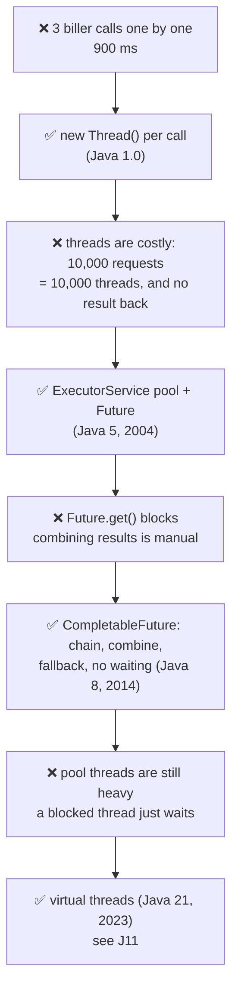
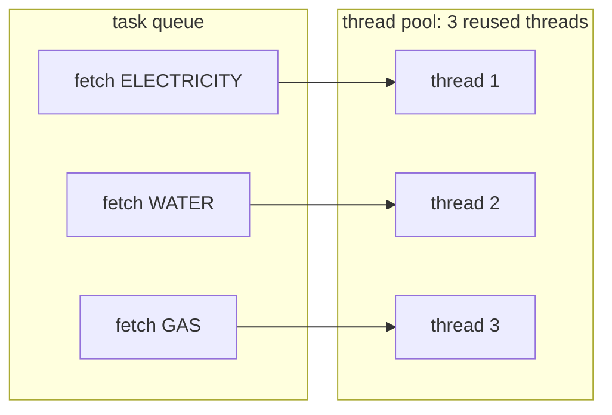
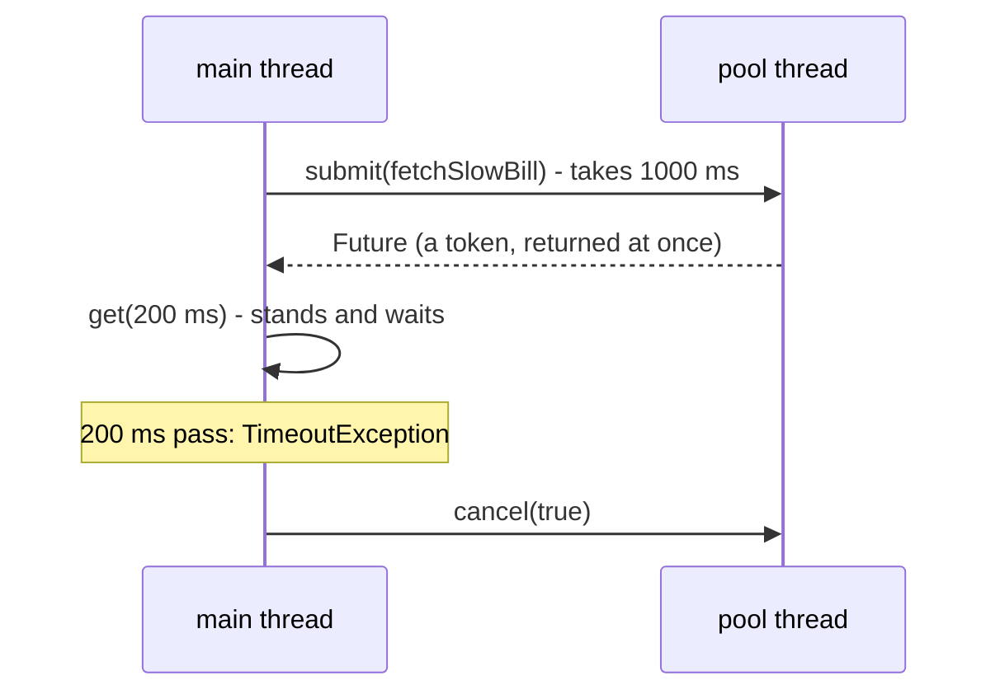
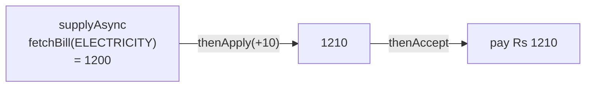
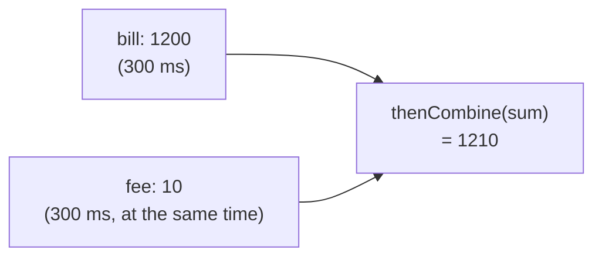
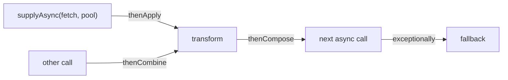

# J06 · ExecutorService, Future and CompletableFuture

> **In one line:** A **thread pool** (ExecutorService) runs independent tasks **at the same time** with a few reused threads. A **Future** is a token you wait on, and a **CompletableFuture** lets you chain "when this finishes, do that" **without waiting**, including combining results, fallbacks and timeouts.

| ⏱️ Read | 🧪 Run | 🎯 Asked |
|---|---|---|
| 14 min | `java 01-java-core/J06_ExecutorsAndCompletableFuture.java` | Every Spring/backend round: "How do you call 3 services in parallel?" |

---

## 🧬 Why does this exist? The story

Java has four ways to run work in parallel, and each came from the pain of the one before:

1. **❌ The pain:** calling 3 billers one after another takes **900 ms** (3 × 300 ms), even though the calls don't depend on each other.
2. **✅ The fix (Java 1.0, 1996): `new Thread()`** for each call, so the calls run at the same time.
3. **❌ New pain:** every thread costs memory (its own stack, often about 1 MB) and time to create. 10,000 requests would mean 10,000 threads, and the server falls over. Also, a thread returns nothing, so getting the result back meant shared variables and messy waiting code.
4. **✅ The fix (Java 5, 2004): `ExecutorService`, `Callable` and `Future`.** A small pool of **reused** threads with a task queue. `submit()` gives you a Future, a token for the result.
5. **❌ New pain:** `Future.get()` **blocks**: your thread stands at the counter and waits. "When A finishes, do B" or "combine A and B" meant writing your own waiting code.
6. **✅ The fix (Java 8, 2014): `CompletableFuture`.** Chain the next step (`thenApply`), combine calls (`thenCombine`, `allOf`) and add fallbacks (`exceptionally`), with **no waiting**. Java 9 added timeouts (`orTimeout`, `completeOnTimeout`).
7. **❌ New pain:** pool threads are still heavy OS threads. A thread blocked on an HTTP call just sits there, so 200 pool threads can serve only about 200 waiting calls at once. And async chains are harder to read and debug than plain code.
8. **✅ The fix (Java 21, 2023): virtual threads.** Threads so cheap you can have lakhs of them, so simple blocking code scales again. That's in J11.



👀 **Notice:** each fix keeps the good part of the last one. Pools keep threads' parallelism, CompletableFuture keeps the pool, and virtual threads keep the simple code.

🧠 **So it's not random:** the whole story is about two costs, **threads are expensive** and **waiting wastes them**. Every new tool cuts one of them.

---

## 🧩 Words you need

| Word | In one line |
|---|---|
| **thread pool** | a fixed team of threads that pick tasks from a queue and are reused |
| **task** | a job for the pool: a `Runnable` (returns nothing) or a `Callable` (returns a value) |
| **Future** | a token for a result that isn't ready yet |
| **blocking** | the current thread sits and waits, doing nothing |
| **CompletableFuture** | a Future you can chain: `thenApply`, `thenCombine`, `exceptionally` … |

---

## 🖼️ Picture it: a food court

- **Thread pool:** the kitchen has **3 cooks** (threads). Orders (tasks) wait in a queue, and a free cook takes the next one. Hiring a new cook for every order would be slow and chaotic at rush hour.
- **Future:** the **token** you get when you order. `get()` means standing at the counter until your food is ready.
- **CompletableFuture:** a **buzzer plus instructions**: "When the pizza is ready, add toppings, then bring it to table 5." Nobody stands and waits.



👀 **Notice:** three independent calls, three free threads, so all three run **at the same time**.

---

## 🔬 How it works, step by step

The running example is fetching bills from **3 billers**: electricity ₹1,200, water ₹450 and gas ₹300, a total of **₹1,950**. Each call takes **300 ms**.

### Steps 1–2 · One by one vs a thread pool

```mermaid
gantt
    title 3 biller calls of 300 ms each
    dateFormat x
    axisFormat %L ms
    section 1 thread = 900 ms
    ELECTRICITY :0, 300
    WATER       :300, 600
    GAS         :600, 900
    section 2 threads = 600 ms
    ELECTRICITY and WATER together :0, 300
    GAS         :300, 600
    section 3 threads = 300 ms
    all three together :0, 300
```



| Threads | Rounds | Math | Demo measured |
|---|---|---|---|
| 1 (one by one) | 3 | 3 × 300 | **902 ms** |
| 2 | 2 (2 calls, then 1) | 2 × 300 | **603 ms** |
| 3 | 1 | 1 × 300 | **305 ms** |

👀 **Notice:** time = **rounds × 300 ms**, and rounds = calls ÷ threads, rounded **up**.

```java
ExecutorService pool = Executors.newFixedThreadPool(3);     // 3 reused threads
Future<Integer> f = pool.submit(() -> fetchBill("WATER"));  // returns at once with a token
int amount = f.get();                                       // wait for this one result
```

💡 **Why a pool, not `new Thread()` per task?** Every thread costs memory (its own stack, often about 1 MB) and time to create. 10,000 requests would mean 10,000 threads, and the server falls over. A pool **reuses** a few threads, and extra tasks queue up.

### Step 3 · Future: the token and its limits



- A **Callable** returns a value (and can throw checked exceptions). A **Runnable** returns nothing.
- `get()` **blocks**. `get(200, MILLISECONDS)` gives up after 200 ms with a `TimeoutException`.
- The limits: waiting blocks your thread, and "when A is done, do B" or "combine A and B" means writing your own waiting code.

### Step 4 · CompletableFuture: chain, combine, all

**Chain.** Nobody waits in the middle:



**Combine two parallel calls:**



The demo measured **303 ms**, not 600.

**Wait for all three:** `CompletableFuture.allOf(call1, call2, call3).join()`, then add up the results. That's **₹1,950 in 303 ms**.

🧠 `join()` is like `get()`, but it throws an unchecked exception, so no try/catch is needed.

### Step 5 · Errors and timeouts: real systems fail

| Problem | Tool | Demo result |
|---|---|---|
| The GAS biller throws "down" | `.exceptionally(error -> 0)` | uses 0, and the chain carries on |
| A biller takes 1 second | `.completeOnTimeout(0, 400, MILLISECONDS)` | gives up after 400 ms and uses 0 |
| You want to fail on slowness | `.orTimeout(400, MILLISECONDS)` | completes with a TimeoutException |

⚠️ Inside `exceptionally`, the error arrives **wrapped** in a `CompletionException`, so `error.getCause()` is the real exception.

### Step 6 · thenApply vs thenCompose

- **`thenApply`** is for a normal next step, value to value: `amount -> amount + 10`.
- **`thenCompose`** is for a next step that is **itself async**, value to CompletableFuture: `amount -> payAsync(amount)`.

```text
thenApply(amount -> payAsync(amount))    ->  CompletableFuture<CompletableFuture<String>>   (a box in a box)
thenCompose(amount -> payAsync(amount))  ->  CompletableFuture<String>                      (flattened)
```

Demo: fetch water (₹450), then pay asynchronously, which gives **PAY-WATER-450**. It's the same idea as `map` vs `flatMap` (J08).

### Step 7 · Always shut down

- `shutdown()`: no new tasks, and the running ones finish.
- `shutdownNow()`: also interrupts the running tasks.
- `awaitTermination(5, SECONDS)`: waits for it to end.

👀 **Notice:** forget `shutdown()` and the pool's threads keep the program running even after `main` ends.

---

## 💻 Code you should be able to write

```java
// Fetch 3 bills in parallel, add them up, with a fallback for a down biller
ExecutorService pool = Executors.newFixedThreadPool(3);
List<CompletableFuture<Integer>> calls = billers.stream()
        .map(b -> CompletableFuture.supplyAsync(() -> fetchBill(b), pool)
                                   .exceptionally(e -> 0))            // one biller down? use 0
        .toList();
CompletableFuture.allOf(calls.toArray(new CompletableFuture<?>[0])).join();
int total = calls.stream().mapToInt(CompletableFuture::join).sum();    // 1950, in about 300 ms
pool.shutdown();
```

**What the demo prints** (from a real run):

```text
total Rs 1950 in 902 ms (3 x 300 = 900)
3 threads: total Rs 1950 in 305 ms
2 threads: total Rs 1950 in 603 ms
thenApply + thenAccept: pay Rs 1210
thenCombine: Rs 1210 in 303 ms (both ran together)
allOf: total Rs 1950 in 303 ms
thenCompose: PAY-WATER-450
```

---

## ⚠️ Traps interviewers love

| Trap | Why it's wrong | Do this instead |
|---|---|---|
| `new Thread()` per request | expensive, and thousands of threads crash the server | a thread pool |
| Calling `get()` right after `submit()` in a loop | it waits for each call in turn, which is sequential again | submit them all first, then get, or use `allOf` |
| Blocking HTTP calls on the default pool | `supplyAsync` without an executor uses the shared `ForkJoinPool.commonPool()` | pass your own executor |
| `newFixedThreadPool` in production | its queue has **no limit**, so it can run out of memory under load | a `ThreadPoolExecutor` with a bounded queue |
| Forgetting `shutdown()` | the app never exits, and threads leak | `shutdown()` in `finally`, or try-with-resources (Java 19+) |

---

## 🎯 In the interview

**What they're really testing**
- *Service companies:* why pools, Runnable vs Callable, and what Future.get does.
- *Product companies:* CompletableFuture composition (thenCompose vs thenApply, allOf, exceptionally, timeouts), which pool runs what, pool sizing, bounded queues and rejection policies, and virtual threads (J11).

**Say it in this order** (start with the problem):
1. **The problem:** calls one by one add up (900 ms), and a new thread per task is expensive. So use a **pool** (Java 5). With 3 threads, 3 × 300 ms calls take 300 ms instead of 900.
2. `submit` returns a **Future**. `get()` blocks, and `get(timeout)` gives up. Callable returns a value; Runnable doesn't.
3. **CompletableFuture** (Java 8) removes that waiting: it chains without blocking (`thenApply`, `thenAccept`), combines (`thenCombine`, `allOf`), handles errors (`exceptionally`, `handle`) and adds timeouts (`orTimeout`, `completeOnTimeout`).
4. `thenCompose` is for a next step that is itself async, so you don't get a future inside a future.
5. Pass your **own executor** for blocking I/O, and always **shut down** the pool.

**Sample answer** (about a minute, in your own words):

> "Creating a thread per task is expensive, so I use an ExecutorService, a pool of reusable threads. If I need bills from three billers and each call takes 300 ms, doing them one by one takes 900 ms, but with a pool of three they run in parallel in about 300 ms. submit gives me a Future, but get blocks, and combining several futures is manual. Java 8's CompletableFuture fixes that: supplyAsync to fetch, thenApply to add the fee, thenAccept to use the result, without blocking. thenCombine joins two parallel calls, allOf waits for many, exceptionally gives a fallback if a biller is down, and completeOnTimeout handles a slow biller. For blocking I/O I pass my own executor, and I always shut the pool down."

**Product-company deep dive:**
- **Q: How many threads should a pool have?**
  **A:** For CPU-heavy work, about the number of cores. For I/O-heavy work like HTTP and DB calls, more, because threads mostly wait. A rough rule is cores × (1 + wait time ÷ compute time). Then measure under load.
- **Q: What happens when the queue is full?**
  **A:** A `ThreadPoolExecutor` with a bounded queue applies a **rejection policy**. `AbortPolicy` throws. `CallerRunsPolicy` makes the caller run the task, which naturally slows down producers.
- **Q: Which thread runs `thenApply`?**
  **A:** Either the thread that completed the previous stage, or the caller if it's already done. `thenApplyAsync` forces it onto a pool.
- **Q: How does this look in Spring?**
  **A:** If it's true for you: an `@Async` method returning `CompletableFuture<T>`, running on a `ThreadPoolTaskExecutor` bean. For many HTTP calls, WebClient is another option. On Java 21, virtual threads (J11).

---

## ❓ Follow-up questions

**execute() vs submit()?**
`execute(Runnable)` returns nothing. `submit()` returns a Future, which you can use for the result, the exception, or to cancel.

**Which pools does `Executors` give?**
- `newFixedThreadPool(n)`: n threads.
- `newCachedThreadPool()`: grows as needed.
- `newSingleThreadExecutor()`: one thread, so tasks run in order.
- `newScheduledThreadPool(n)`: delayed or repeating tasks.
- `newVirtualThreadPerTaskExecutor()` (Java 21): one cheap virtual thread per task.

**What happens to an exception inside a pool task?**
It's stored in the Future, and `get()` throws an `ExecutionException` with your exception as its cause (J07).

*Only if they push further:* `CompletableFuture.anyOf(...)` completes with whichever call finishes **first**. That's useful when you ask two gateways and take the first answer.

---

## 🧪 Test yourself (answer aloud, then click)

<details><summary>1. 4 calls of 300 ms on a pool of 2 threads: about how long?</summary>

600 ms: two rounds of 300.

</details>

<details><summary>2. 5 calls of 300 ms on a pool of 2 threads?</summary>

900 ms: 3 rounds (2, then 2, then 1).

</details>

<details><summary>3. What's the problem with Future.get()?</summary>

It blocks the calling thread, and chaining or combining several futures is manual.

</details>

<details><summary>4. The bill (₹1,200) and the fee (₹10) are fetched in parallel and joined with thenCombine. What's the result, and how long does it take?</summary>

₹1,210, in about 300 ms.

</details>

<details><summary>5. thenApply or thenCompose for "after fetching the bill, call payAsync(bill)"?</summary>

thenCompose, because payAsync returns a CompletableFuture. thenApply would give a future inside a future.

</details>

<details><summary>6. Why pass your own executor to supplyAsync for HTTP calls?</summary>

The default is the shared ForkJoinPool.commonPool(), sized to the CPU cores. Blocking calls there starve the rest of the app.

</details>

<details><summary>7. Java 5 already had Future. Why was CompletableFuture added in Java 8?</summary>

Future.get() blocks the thread, and there was no way to say "when this finishes, do that" or to combine two results without writing your own waiting code. CompletableFuture chains and combines steps without blocking.

</details>

If you get stuck on one, add it to [STUMBLE-LIST.md](../STUMBLE-LIST.md). When they all feel easy, tick J06 in the [README](../README.md) and send `next`.

---

## ⚡ Quick Revision (2 hours before the interview)

**🧬 The story:** calls one by one are slow → **new Thread()** per task (Java 1.0) → threads are costly and return nothing → **ExecutorService + Future** (Java 5) → `get()` blocks, and combining is manual → **CompletableFuture** (Java 8) → pool threads are still heavy while they wait → **virtual threads** (Java 21).



**🧠 Must remember**
1. **Pool** = reused threads plus a task queue. Time = **rounds × task time**: 3 calls × 300 ms takes 900 ms on 1 thread, 600 ms on 2 and 300 ms on 3.
2. **Callable** returns a value; **Runnable** doesn't. `submit()` returns a **Future**.
3. `Future.get()` **blocks**. `get(timeout)` throws a `TimeoutException`.
4. **CompletableFuture:** `supplyAsync`, then `thenApply` (transform), `thenAccept` (use), `thenCombine` (two in parallel), `allOf` (all).
5. **thenCompose** is for a step that is itself async, flattening the future inside a future. It's like flatMap.
6. **exceptionally / handle** for errors. **orTimeout / completeOnTimeout** for slow calls.
7. The default pool is the **commonPool**, so pass your **own executor** for blocking I/O.
8. Always call **shutdown()**. In production, use a **bounded queue** and a rejection policy.

**⚠️ Top traps**
- Calling get() inside the submit loop makes it sequential again.
- Blocking calls on the commonPool.
- An unbounded queue in newFixedThreadPool.

**🎯 30-second answer:** "I use an ExecutorService so tasks run in parallel on reused threads: three 300 ms calls take about 300 ms instead of 900. Future.get blocks, so I prefer CompletableFuture: supplyAsync to start, thenApply to transform, thenCombine or allOf to join parallel calls, exceptionally for fallbacks, and orTimeout for slow services. I pass my own executor for blocking I/O, and I shut the pool down."

**🔑 Memory hook:** *"A food court: cooks are threads, the token is a Future, and the buzzer with instructions is a CompletableFuture. 3 cooks, 3 orders, done in one round."*

**🗣️ Say it aloud (no peeking):**
1. Why did Java go from new Thread() to pools, then to CompletableFuture, then to virtual threads? And how long do 5 calls of 300 ms take on 2 threads?
2. thenApply vs thenCompose, with an example.
3. How do you handle one of three billers being down?
