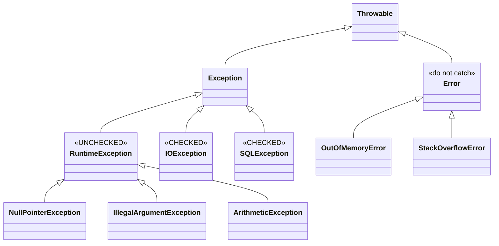
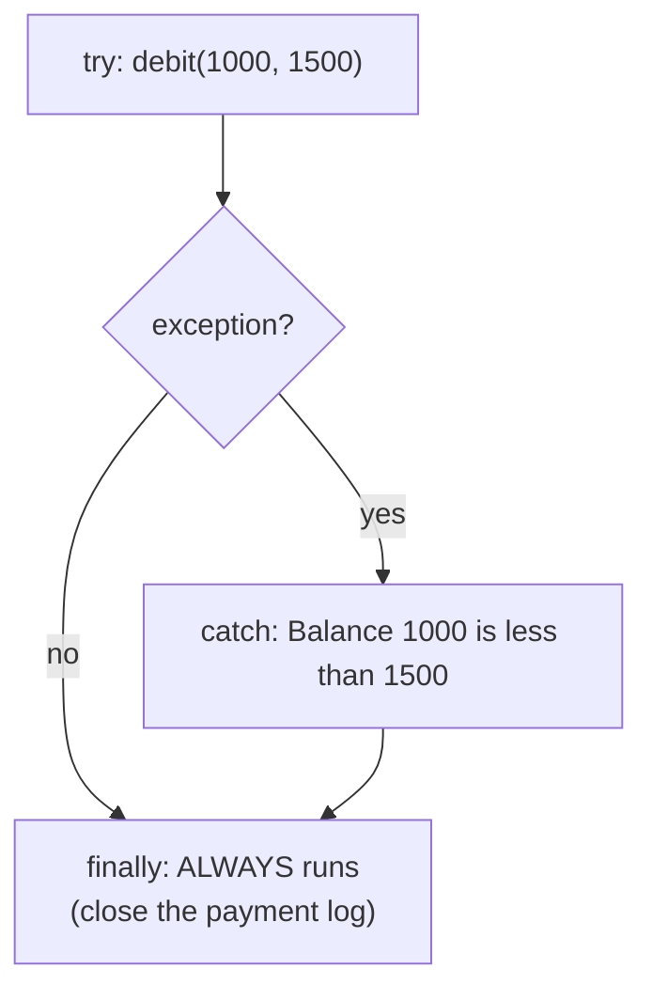
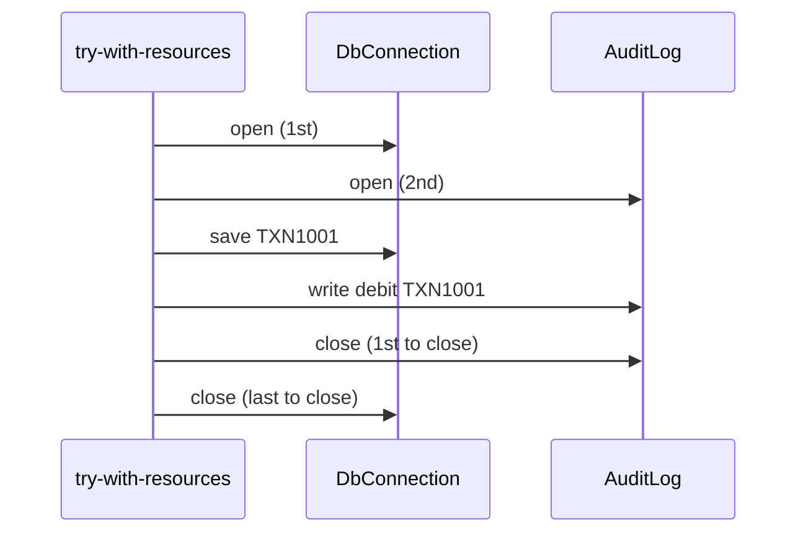
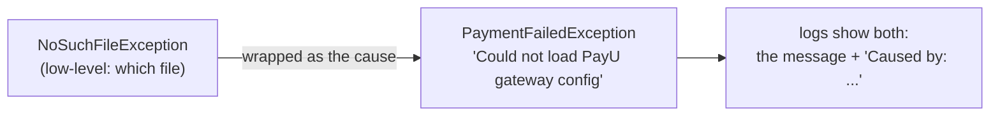
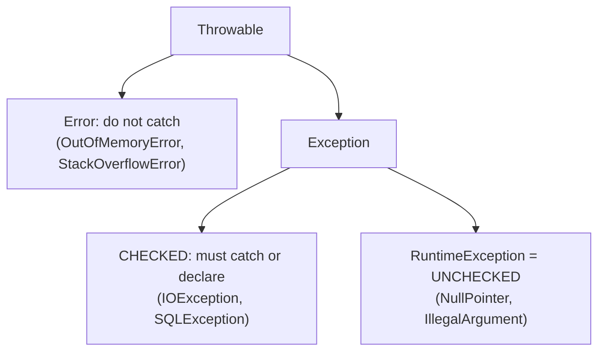

# J07 · Checked vs unchecked exceptions, try-with-resources, custom exceptions

> **In one line:** **Checked** exceptions are problems outside your control, like files, network or DB, and the compiler **forces** you to handle them. **Unchecked** exceptions are bugs in your own code, so you fix the code. `finally` and **try-with-resources** make sure cleanup **always** happens, and **custom** exceptions give business errors a clear name.

| ⏱️ Read | 🧪 Run | 🎯 Asked |
|---|---|---|
| 10 min | `java 01-java-core/J07_Exceptions.java` | Every Java round. Spring rounds add "@Transactional rollback" |

---

## 🧩 Words you need

| Word | In one line |
|---|---|
| **checked exception** | the compiler makes you `catch` it or declare it with `throws` |
| **unchecked exception** | a `RuntimeException`; the compiler doesn't force anything |
| **Error** | a serious JVM problem, like `OutOfMemoryError`; don't catch it |
| **finally** | a block that runs **every time**: after success, after a catch, even after a return |
| **AutoCloseable** | anything with a `close()` method that try-with-resources can close for you |

---

## 🖼️ Picture it: the family tree



👀 **Notice:** everything under **RuntimeException** is **unchecked**. Every **other** Exception is **checked**. Errors are for the JVM.

**Real-life picture: the bank.**
- **Checked:** the loan form has a **mandatory** field, "What if the cheque bounces?" The clerk (the compiler) won't accept the form until you fill it in, either by handling it (`catch`) or passing it on (`throws`).
- **Unchecked:** a mistake in **your own** work, like dividing by zero or paying from an empty wallet (null). There's no form field for it, so fix your work.
- **Error:** the building is on fire. You don't handle it; you get out, and the app restarts.
- **finally:** switching off the lights when you leave, whether the day went well or not.

---

## 🔬 How it works, step by step

The running example is **debiting ₹1,500 from a balance of ₹1,000**.

### Step 1 · Checked exceptions: the compiler forces you

```java
static String readGatewayConfig() throws IOException {         // must declare it...
    return Files.readString(Path.of("config/missing-gateway.properties"));
}
```

Without `throws IOException`, javac refuses to compile, with *"unreported exception java.io.IOException; must be caught or declared to be thrown"*. The demo catches **`NoSuchFileException: config\missing-gateway.properties`**.

🧠 Checked exceptions are for things **outside your control** that a caller could recover from: files, network, database.

### Step 2 · Unchecked exceptions: bugs in your own code

| Code | Exception | The demo's message |
|---|---|---|
| `1000 / 0` | ArithmeticException | `/ by zero` |
| `gatewayName.length()` (null) | NullPointerException | `Cannot invoke "String.length()" because "J07_Exceptions.gatewayName" is null` |
| `Integer.parseInt("12a")` | NumberFormatException | `For input string: "12a"` |

👀 **Notice:** since Java 14, the NullPointerException says **exactly which variable** was null. The fix for these is better code (validate inputs, check for null), not more catch blocks.

### Step 3 · try → catch → finally



- The line after `debit(...)` inside `try` **never runs**, because the exception jumps straight to `catch`.
- `finally` runs **every time**. Only `System.exit()` or a JVM crash skips it.

⚠️ **The trap:** `try { return 1; } finally { return 2; }` returns **2**. A return in finally replaces the try's return, and can even hide an exception. Never return from finally.

### Step 4 · try-with-resources: closes things for you, in reverse order

```java
try (DbConnection db = new DbConnection();     // opened 1st
     AuditLog log = new AuditLog()) {           // opened 2nd
    db.save("TXN1001");
    log.write("debit TXN1001");
}                                               // closed automatically
```



👀 **Notice:** **the last one opened is closed first**, like a stack of plates.

**If both the body and `close()` throw**, you don't lose either. The body's exception is thrown, and the close error is attached to it as **suppressed**:

```text
caught    : debit failed
suppressed: audit log close failed
```

### Step 5 · A custom exception: a clear name for a business error

```java
class InsufficientBalanceException extends RuntimeException {
    final long balance, amount;
    InsufficientBalanceException(long balance, long amount) {
        super("Balance " + balance + " is less than " + amount);   // a clear message
        this.balance = balance;
        this.amount = amount;
    }
}
```

`debit(1000, 1500)` gives "Balance 1000 is less than 1500", **short by ₹500**.

💡 **Why unchecked (RuntimeException) in Spring apps?**
- The code stays clean, with no `throws` on every method up the chain.
- `@Transactional` rolls back automatically **only for unchecked exceptions** (B05). That's exactly what you want when a debit fails.
- A global `@RestControllerAdvice` turns it into a clean HTTP error (B07).

### Step 6 · Wrap it, but keep the cause



```java
catch (IOException e) {
    throw new PaymentFailedException("Could not load PayU gateway config", e);   // e = the cause
}
```

👀 **Notice:** the caller gets **your** clear message, and the real reason survives inside. Forget to pass `e`, and the real reason is gone forever.

---

## 💻 Code you should be able to write

```java
public void debit(long balance, long amount) {
    if (amount <= 0) throw new IllegalArgumentException("amount must be positive");   // throw early
    if (amount > balance) throw new InsufficientBalanceException(balance, amount);    // business rule
    // ... debit ...
}

try (Connection con = dataSource.getConnection();
     PreparedStatement ps = con.prepareStatement(sql)) {    // both closed automatically, in reverse order
    ps.executeUpdate();
} catch (SQLException e) {
    throw new PaymentFailedException("debit failed for " + txnId, e);                // wrap, keep the cause
}
```

**What the demo prints** (from a real run):

```text
=== Step 4: try, catch, finally ===
try     : debit Rs 1500 from a balance of Rs 1000
catch   : Balance 1000 is less than 1500
finally : always runs (close the payment log here)
return in try (1) and in finally (2) -> method returns 2
```

---

## ⚠️ Traps interviewers love

| Trap | Why it's wrong | Do this instead |
|---|---|---|
| An empty `catch {}` | the error disappears silently | log it, or rethrow with a cause |
| `catch (Exception e)` everywhere | it hides bugs and catches too much | catch specific types; use a global handler at the edge |
| `return` inside `finally` | it replaces the try's return and hides exceptions | never return from finally |
| Wrapping without the cause | the real reason is lost | `new MyException("msg", e)` |
| A checked exception in a `@Transactional` method | by default it **does not roll back** | throw unchecked, or `rollbackFor = Exception.class` |

---

## 🎯 In the interview

**What they're really testing**
- *Service companies:* checked vs unchecked, throw vs throws, final/finally/finalize, and try-with-resources.
- *Product companies:* designing an exception strategy (custom exceptions, wrapping with a cause, where to catch), suppressed exceptions, @Transactional rollback rules, and exceptions across threads (ExecutionException).

**Say it in this order:**
1. Everything comes from **Throwable**, which has two branches. **Error** is for JVM problems you don't catch. **Exception** is for problems you handle.
2. **Checked** (IOException, SQLException): you must catch or declare them. **Unchecked** (RuntimeException and below): usually bugs, not forced.
3. **finally** always runs, so do cleanup there, and never return from it.
4. **try-with-resources** closes AutoCloseable resources automatically, in reverse order, and keeps close errors as suppressed.
5. **Custom exceptions:** in Spring, extend RuntimeException with a clear message, which also gets @Transactional rollback. When wrapping, keep the **cause**.

**Sample answer** (about a minute, in your own words):

> "In Java all exceptions come from Throwable. Errors like OutOfMemoryError are JVM problems we don't catch. Exceptions split into checked and unchecked. Checked ones, like IOException, must be caught or declared, because they're about things outside our control, like a missing file. Unchecked ones extend RuntimeException, like NullPointerException, and usually mean a bug. finally always runs, so it's for cleanup, and I never return from it because that overrides the try's return. For resources like connections I use try-with-resources, which closes them automatically in reverse order. For business rules I create custom unchecked exceptions, like InsufficientBalanceException when the balance is 1,000 and the debit is 1,500. In Spring, that means @Transactional rolls back by default, and a @RestControllerAdvice turns it into a proper HTTP response."

**Product-company deep dive:**
- **Q: Where should exceptions be caught?**
  **A:** **Throw early** (validate at the start) and **catch late**, at a boundary like a controller advice that logs once and returns a clean error. Don't log and rethrow at every level.
- **Q: What happens to an exception inside a thread-pool task?**
  **A:** It's stored in the Future, and `get()` throws an `ExecutionException` with it as the cause (J06).
- **Q: Can an overriding method throw more exceptions?**
  **A:** It can't throw **broader checked** exceptions than the parent method. It can throw fewer, narrower or unchecked ones.
- **Q: Why does @Transactional not roll back on checked exceptions?**
  **A:** Spring's default treats checked exceptions as "expected business outcomes". Use `@Transactional(rollbackFor = Exception.class)` if a checked exception should undo the debit.

---

## ❓ Follow-up questions

**throw vs throws?**
`throw` actually throws one exception object. `throws` in a method signature declares which checked exceptions it may throw.

**final vs finally vs finalize?**
- `final` stops a variable being reassigned, a method being overridden, or a class being extended.
- `finally` is the block that always runs.
- `finalize()` was an old GC hook; it's deprecated, so don't use it.

**Can you have try without catch?**
Yes: `try { } finally { }`, or try-with-resources on its own.

**Multi-catch?**
`catch (IOException | SQLException e)` handles several types in one block. Put specific catches **before** general ones, or the code won't compile.

---

## 🧪 Test yourself (answer aloud, then click)

<details><summary>1. Is IOException checked or unchecked? And NullPointerException?</summary>

IOException is checked. NullPointerException is unchecked, because it extends RuntimeException.

</details>

<details><summary>2. A method calls Files.readString(...). What must it do?</summary>

Catch IOException, or declare throws IOException.

</details>

<details><summary>3. try returns 1 and finally returns 2. What does the method return?</summary>

2, the value from finally.

</details>

<details><summary>4. try-with-resources opens a DB connection, then a LOG. In what order do they close?</summary>

LOG first, then the DB connection: reverse order.

</details>

<details><summary>5. What does debit(balance 500, amount 800) throw?</summary>

InsufficientBalanceException: "Balance 500 is less than 800". The account is short by ₹300.

</details>

<details><summary>6. Why are custom business exceptions usually unchecked in Spring?</summary>

There's no throws clutter, and @Transactional rolls back automatically only for unchecked exceptions.

</details>

If you get stuck on one, add it to [STUMBLE-LIST.md](../STUMBLE-LIST.md). When they all feel easy, tick J07 in the [README](../README.md) and send `next`.

---

## ⚡ Quick Revision (2 hours before the interview)



**🧠 Must remember**
1. **Checked** = outside your control (file, network, DB): **catch or declare** (`throws`).
2. **Unchecked** = RuntimeException = a bug in your code: **fix the code**.
3. **Error** = a JVM problem (OutOfMemoryError, StackOverflowError): don't catch it.
4. **finally always runs.** A `return` in finally replaces the try's return (1 becomes 2). Never do it.
5. **try-with-resources:** auto-close, **in reverse order**, and close errors become **suppressed**.
6. **Custom business exceptions** extend **RuntimeException** with a clear message ("Balance 1000 is less than 1500").
7. **Wrap with the cause:** `new PaymentFailedException("msg", e)`.
8. **@Transactional** rolls back only on **unchecked** exceptions by default. For checked ones, use `rollbackFor = Exception.class`.

**⚠️ Top traps**
- An empty catch block.
- Returning from finally.
- Wrapping without the cause.

**🎯 30-second answer:** "Checked exceptions like IOException are for things outside our control, and the compiler forces us to catch or declare them. Unchecked ones extend RuntimeException and usually mean bugs. finally always runs, so it's for cleanup, and try-with-resources closes resources automatically in reverse order. For business rules I throw custom unchecked exceptions with clear messages, which @Transactional rolls back on, and when wrapping I always pass the original exception as the cause."

**🔑 Memory hook:** *"Checked = the mandatory field on the bank form. Unchecked = your own mistake. Error = the building's on fire. finally = switch off the lights on the way out."*

**🗣️ Say it aloud (no peeking):**
1. Checked vs unchecked, with one example each.
2. What does try-with-resources do if both the body and close() throw?
3. Why should a failed debit throw an unchecked exception in a Spring service?
