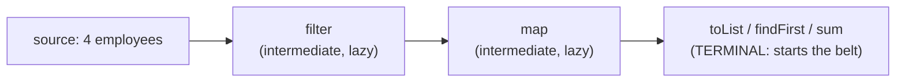
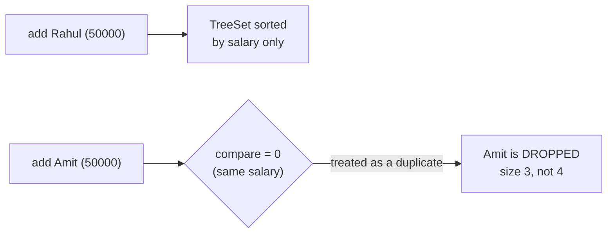
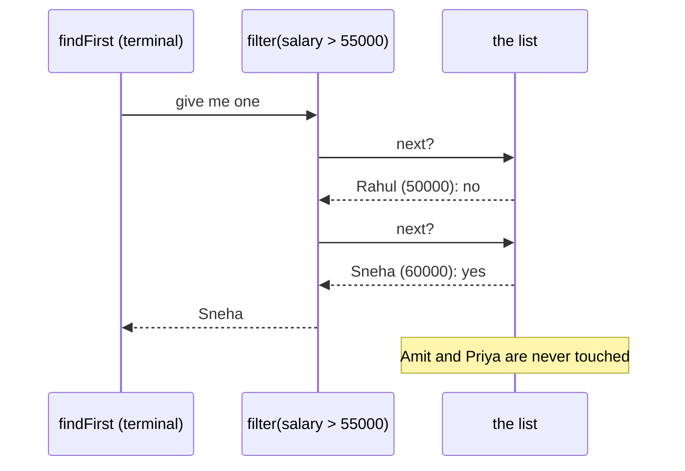
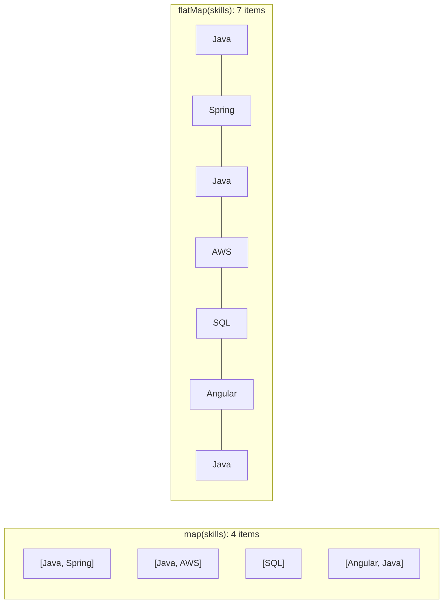
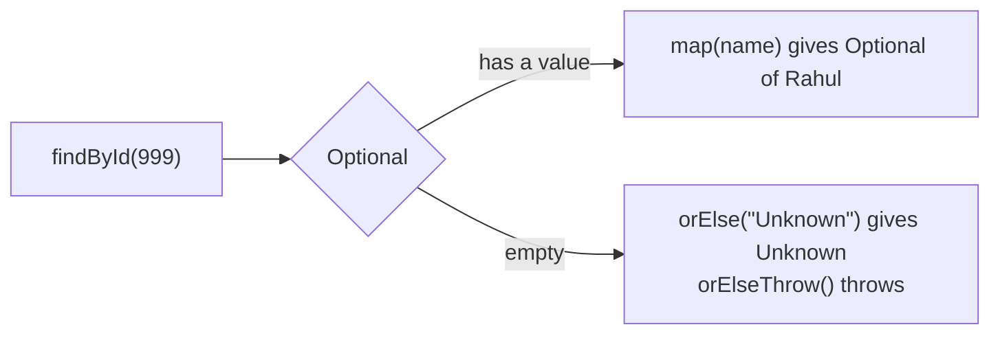
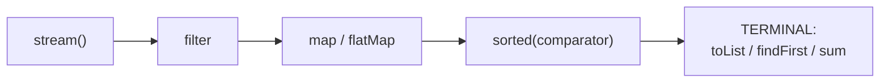

# J08 · Comparable vs Comparator, map vs flatMap, intermediate vs terminal, Optional

> **In one line:** **Comparable** is the one order built **into** a class; a **Comparator** is any order written **outside** it. A **stream** is a lazy pipeline: nothing happens until a **terminal** operation pulls the data. `map` is one-to-one, while `flatMap` is one-to-many and flattened. **Optional** is a box that may be empty, so you use it instead of returning null.

| ⏱️ Read | 🧪 Run | 🎯 Asked |
|---|---|---|
| 12 min | `java 01-java-core/J08_ComparatorStreamsOptional.java` | Every Java 8 round; it's also the base for the 8 stream programs (Part 2) |

The running example is four employees. They're **not** in id order on purpose:

| id | name | salary | skills |
|---|---|---|---|
| 101 | Rahul | 50,000 | Java, Spring |
| 104 | Sneha | 60,000 | Java, AWS |
| 103 | Amit | 50,000 | SQL |
| 102 | Priya | 70,000 | Angular, Java |

---

## 🧩 Words you need

| Word | In one line |
|---|---|
| **compareTo** | returns negative ("I come first"), 0 ("same place") or positive ("I come after") |
| **intermediate operation** | `filter`, `map`, `sorted`: they only **describe** the work and return a stream |
| **terminal operation** | `collect`, `toList`, `findFirst`, `sum`: they **run** the pipeline and give a result |
| **lazy** | nothing is done until someone asks for the result |
| **Optional** | a box that holds a value, or is empty |

---

## 🖼️ Picture it

- **Comparable** is the **token number** printed on each patient's card at a clinic: the one default order, part of the card.
- **Comparator** is the doctor's **special rule for today**, like "emergencies first, then by age". It sits outside the card, and you can have many.
- **A stream** is a **factory conveyor belt**. Items pass stations (filter, map), but the belt only moves when someone at the end **asks for the product**.
- **flatMap** means **opening each box** and putting what's inside directly on the belt.



👀 **Notice:** only the **last** box makes anything happen. Without a terminal operation, the belt never moves.

---

## 🔬 How it works, step by step

### Step 1 · Comparable: the natural order, built in

```java
record Employee(int id, String name, int salary, List<String> skills) implements Comparable<Employee> {
    public int compareTo(Employee other) {
        return Integer.compare(this.id, other.id);   // by id
    }
}
Collections.sort(list);     // uses compareTo
```

This gives **[Rahul, Priya, Amit, Sneha]**, which is ids **[101, 102, 103, 104]**. `compareTo(101 vs 102)` returns **-1**, so 101 comes first. A class gets only **one** natural order.

### Step 2 · Comparator: any order, from outside

```java
list.sort(Comparator.comparing(Employee::name));                  // by name
list.sort(Comparator.comparingInt(Employee::salary).reversed()   // salary, high to low
        .thenComparing(Employee::name));                         // tie? then by name
```

| Order | Result |
|---|---|
| by name | Amit, Priya, Rahul, Sneha |
| salary high → low, then name | **Priya 70k, Sneha 60k, Amit 50k, Rahul 50k** |

👀 **Notice:** Amit and Rahul **tie** at 50,000, so the name decides: A comes before R.

⚠️ **The TreeSet trap:** TreeSet and TreeMap treat "compare = 0" as **the same element**.



The fix is to add a tie-breaker: `.thenComparing(Employee::id)`.

### Step 3 · Streams are lazy; the terminal operation pulls

`filter(salary > 55,000).findFirst()` over [Rahul, Sneha, Amit, Priya]:



The demo prints "pipeline built, nothing checked yet" **before** any check. Then it checks only Rahul and Sneha.

👀 **Notice:** two lessons in one. **Nothing runs** until the terminal operation, and short-circuit operations (`findFirst`, `anyMatch`, `limit`) **stop early**.

Another terminal operation is `mapToInt(Employee::salary).sum()`: 50,000 + 60,000 + 50,000 + 70,000 = **230,000**.

### Step 4 · map vs flatMap



| | Result | Count |
|---|---|---|
| `map(Employee::skills)` | four **lists** | 4 |
| `flatMap(e -> e.skills().stream())` | the skills, opened out | **7** |
| `+ distinct()` | Java, Spring, AWS, SQL, Angular | **5** |

🧠 **map is one in, one out. flatMap is one in, many out, flattened.** It's the same idea as `thenCompose` in J06.

### Step 5 · A stream can be used only once

Calling `names.count()` twice on the same stream gives **IllegalStateException: stream has already been operated upon or closed**. A stream is a **one-time trip**, not a collection; call `employees.stream()` again for a new one.

### Step 6 · Optional: a box that may be empty



- `findById(101)` gives **Optional[Rahul]**, and `findById(999)` gives **Optional.empty**.
- `.map(Employee::name).orElse("Unknown")` gives "Unknown" for 999.

⚠️ **orElse vs orElseGet:** Rahul exists, so no default is needed. But:
- `orElse(createDefault())` **still runs** createDefault(), because the argument is evaluated first.
- `orElseGet(() -> createDefault())` doesn't run it. The lambda runs only when the box is empty.

🧠 Use `orElseGet` when the default is expensive, like a DB call.

---

## 💻 Code you should be able to write

```java
// Top 3 earners' names, highest first, ties by name
List<String> top3 = employees.stream()
        .sorted(Comparator.comparingInt(Employee::salary).reversed()
                .thenComparing(Employee::name))
        .limit(3)
        .map(Employee::name)
        .toList();                                     // [Priya, Sneha, Amit]

// All distinct skills
Set<String> skills = employees.stream()
        .flatMap(e -> e.skills().stream())
        .collect(Collectors.toSet());

// Find, or fail with a clear message
Employee e = repository.findById(id)
        .orElseThrow(() -> new EmployeeNotFoundException(id));
```

**What the demo prints** (from a real run):

```text
pipeline built, nothing checked yet (no terminal operation)
  checking Rahul
  checking Sneha
findFirst -> Sneha (stopped early: Amit and Priya were never checked)
...
 orElse:
  createDefault() ran
 orElseGet:
 (nothing printed for orElseGet)
```

---

## ⚠️ Traps interviewers love

| Trap | Why it's wrong | Do this instead |
|---|---|---|
| `a - b` inside compareTo | int overflow: -2,000,000,000 - 1,000,000,000 wraps to **+1,294,967,296** | `Integer.compare(a, b)` |
| A TreeSet with a tie-prone comparator | "compare = 0" means a duplicate, so items vanish | add `.thenComparing(id)` |
| A stream with no terminal operation | nothing runs | end with collect, toList, sum … |
| Reusing a stream | IllegalStateException | create a new stream |
| `Optional.get()` without checking | NoSuchElementException | `orElse`, `orElseThrow`, `ifPresent` |
| An Optional field or parameter | Optional is meant for return values | return Optional, and use plain fields |

---

## 🎯 In the interview

**What they're really testing**
- *Service companies:* Comparable vs Comparator, map vs flatMap, and intermediate vs terminal.
- *Product companies:* **laziness** and short-circuiting, comparator chains with ties, the TreeSet trap, overflow in compareTo, orElse vs orElseGet, and when **not** to use parallel streams.

**Say it in this order:**
1. **Comparable** is the natural order inside the class (`compareTo`), one per class. **Comparator** is an external rule, you can have many, and you chain them with `comparing().reversed().thenComparing()`.
2. A stream is **source + intermediate operations + one terminal operation**. The intermediate ones are **lazy**, the terminal one runs everything, and some **stop early**. You can use a stream only once.
3. **map** is one-to-one. **flatMap** is one-to-many, flattened.
4. **Optional** is a return type for "may be missing". Use map, orElse, orElseGet or orElseThrow. **orElseGet is lazy**; orElse isn't.

**Sample answer** (about a minute, in your own words):

> "Comparable gives a class its natural order through compareTo, like employees by id, and there's only one. Comparator is an external rule, so I can have many, like salary descending then name, built with Comparator.comparing, reversed and thenComparing. A stream is a pipeline: intermediate operations like filter and map are lazy and only describe the work, and the terminal operation, like collect or findFirst, actually runs it. findFirst even stops early. map converts each element to one result, while flatMap converts each element to many and flattens them, like getting all skills from all employees. Optional is for return values that may be missing, like findById. I use map, orElse or orElseThrow instead of null checks, and orElseGet when the default is expensive, because orElse always evaluates it."

**Product-company deep dive:**
- **Q: Should compareTo agree with equals?**
  **A:** Strongly recommended. Sorted collections use compareTo to decide duplicates, which is the TreeSet trap.
- **Q: When should you use `parallelStream()`?**
  **A:** Only for large, CPU-heavy work. It uses the shared ForkJoinPool, so it's bad for small lists or blocking calls (J06).
- **Q: `list.sort()` vs `stream().sorted()`?**
  **A:** `list.sort` sorts **in place**. `sorted()` gives a new sorted stream and leaves the list unchanged.
- **Q: `Collection` vs `Stream`?**
  **A:** A collection **stores** data and can be looped over many times. A stream **processes** data once, lazily, and stores nothing.

---

## ❓ Follow-up questions

**findFirst vs findAny?**
They're the same for normal streams. On parallel streams, findAny returns whichever match is found first, so it's faster.

**What's peek() for?**
Debugging only. It lets you see elements as they pass through.

**Optional.of vs Optional.ofNullable?**
`Optional.of(null)` throws NullPointerException. `ofNullable(null)` gives an empty Optional.

---

## 🧪 Test yourself (answer aloud, then click)

<details><summary>1. Sort the four employees by salary high to low, then by name.</summary>

Priya (70k), Sneha (60k), Amit (50k), Rahul (50k). The tie is broken by name.

</details>

<details><summary>2. A TreeSet with a comparator by salary only gets all four. What's its size?</summary>

3. Rahul and Amit compare as 0, so one is treated as a duplicate.

</details>

<details><summary>3. employees.stream().filter(...).map(...) with no terminal operation: how many elements are processed?</summary>

None. Intermediate operations are lazy.

</details>

<details><summary>4. filter(salary > 55,000).findFirst() over [Rahul, Sneha, Amit, Priya]: how many are checked?</summary>

2: Rahul (no), then Sneha (yes), and it stops.

</details>

<details><summary>5. How many items do map(skills) and flatMap(skills) produce here?</summary>

4 lists and 7 skills. There are 5 after distinct().

</details>

<details><summary>6. findById(101).orElse(createDefault()): does createDefault() run? And with orElseGet?</summary>

Yes with orElse, because its argument is always evaluated. No with orElseGet, whose lambda runs only when the Optional is empty.

</details>

If you get stuck on one, add it to [STUMBLE-LIST.md](../STUMBLE-LIST.md). When they all feel easy, tick J08 in the [README](../README.md) and send `next`.

---

## ⚡ Quick Revision (2 hours before the interview)



**🧠 Must remember**
1. **Comparable** means `compareTo` inside the class, the **one** natural order. **Comparator** means many external orders.
2. Chain them: `comparingInt(salary).reversed().thenComparing(name)` gives Priya, Sneha, Amit, Rahul.
3. In a TreeSet or TreeMap, **compare = 0 means a duplicate**. A salary-only TreeSet of 4 has size **3**.
4. **Intermediate** operations (filter, map, sorted) are **lazy**. The **terminal** one (collect, toList, findFirst, sum) runs everything.
5. **Short-circuit:** findFirst checked **2 of 4** employees and stopped.
6. **map** is 1 → 1 (4 lists). **flatMap** is 1 → many, flattened (7 skills, 5 distinct).
7. A stream can be used **once** only.
8. **Optional** is a **return type**. `orElse` always runs its argument; **`orElseGet` is lazy**. Use `orElseThrow` for "not found".

**⚠️ Top traps**
- `a - b` in compareTo overflows. Use `Integer.compare`.
- The TreeSet silently drops items that tie.
- `orElse(expensiveCall())` runs every time.

**🎯 30-second answer:** "Comparable is the one natural order inside the class, and Comparator is any number of external orders that I chain with comparing, reversed and thenComparing. Streams are lazy: filter and map only describe the work, and a terminal operation like collect or findFirst runs it, even stopping early. map is one to one, and flatMap flattens one to many. Optional is for return values that may be missing, and I prefer orElseGet for expensive defaults."

**🔑 Memory hook:** *"The token on the card (Comparable) vs the doctor's rule for today (Comparator). The belt only moves when the last station asks (terminal). flatMap opens the boxes."*

**🗣️ Say it aloud (no peeking):**
1. Why did findFirst never check Amit and Priya?
2. Show map vs flatMap with the skills example.
3. When is orElse wasteful, and what do you use instead?
