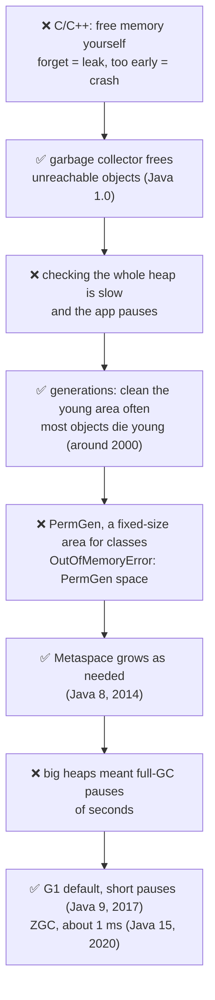
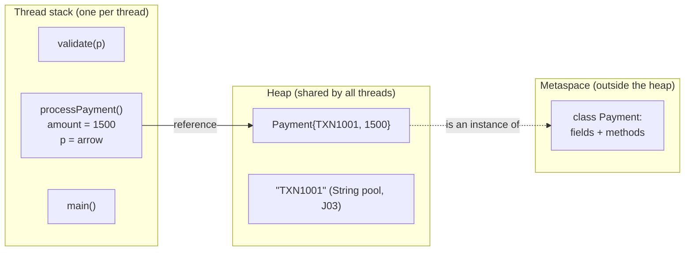
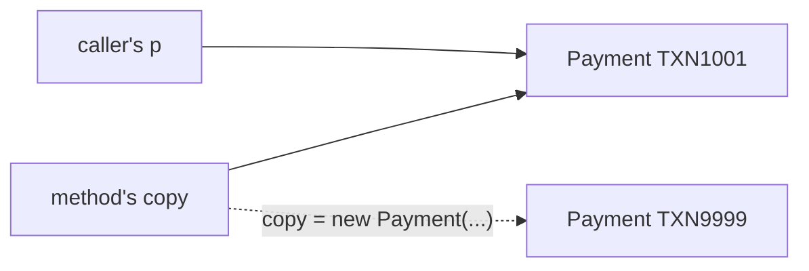
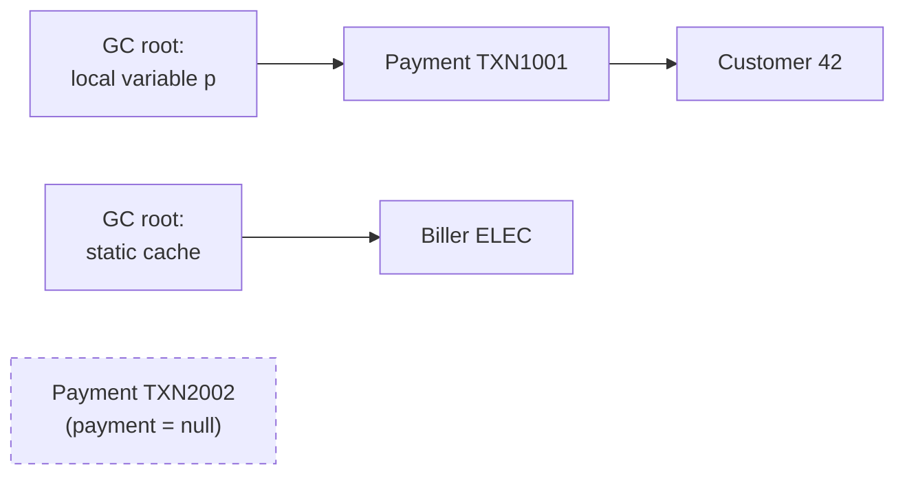
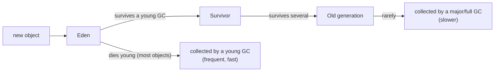
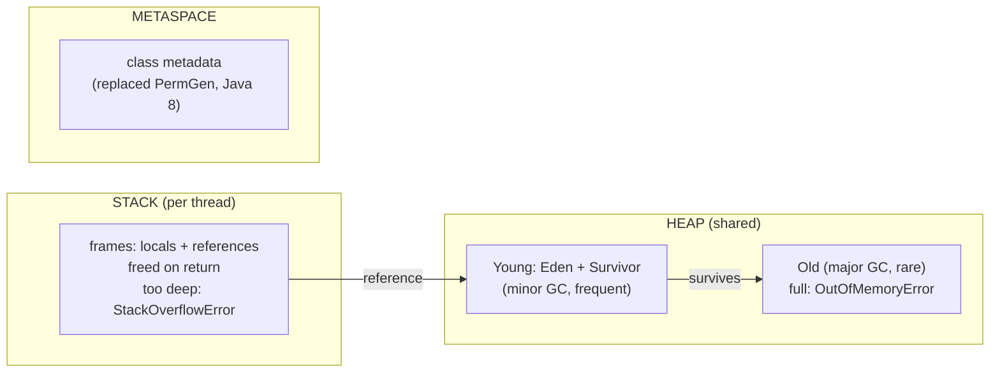

# J09 · JVM memory (stack, heap, metaspace), GC basics, OutOfMemoryError vs StackOverflowError

> **In one line:** Each thread has its own **stack**, which holds method calls and local variables and is freed as soon as a method returns. **Objects** live on the shared **heap**, which the **garbage collector** cleans. **Class definitions** live in **metaspace**. Too many nested calls fill the stack (**StackOverflowError**); too many live objects fill the heap (**OutOfMemoryError**).

| ⏱️ Read | 🧪 Run | 🎯 Asked |
|---|---|---|
| 14 min | `java 01-java-core/J09_JvmMemoryAndGc.java` | Every Java round. Product companies add GC types, leaks and tuning |

---

## 🧬 Why does this exist? The story

Why does Java have a garbage collector, generations, Metaspace and several GC types? Each one fixed a problem programmers hit.

### Chapter 1 · Freeing memory by hand

**🧑‍💻 What people were doing:** in C and C++, you freed memory yourself, with `free` or `delete`.

**😣 The problem they hit:** forget to free it, and memory leaks until the app crashes. Free it too early, and other code reads garbage and crashes.

**☕ What the Java team said:** "Just stop using an object. **We'll find** the objects nobody can reach any more, and free them." → **the garbage collector (Java 1.0, 1996)**

**✅ How it solved the problem:** no more manual freeing. **But…** checking the whole **heap** (the memory where objects live) takes time, and the app **pauses** while the GC works ("stop the world").

### Chapter 2 · The app paused while the GC worked

**🧑‍💻 What people were doing:** running apps that create millions of small objects.

**😣 The problem they hit:** each time the GC checked the whole heap, the app froze.

**☕ What the Java team said:** "Most objects **die young**, like request objects and DTOs. So we'll clean a small **young** area often, which is fast, and the **old** area rarely." → **generations (the HotSpot JVM, around 2000)**

**✅ How it solved the problem:** short, frequent cleanups instead of big ones. **But…** class data lived in a fixed-size area called **PermGen** (the permanent generation).

### Chapter 3 · PermGen ran out of space

**🧑‍💻 What people were doing:** running apps and frameworks that load many classes.

**😣 The problem they hit:** the fixed area filled up, and apps crashed with `OutOfMemoryError: PermGen space`.

**☕ What the Java team said:** "We'll move class data to **native memory** (memory outside the heap), which grows as needed." → **Metaspace (Java 8, 2014)**

**✅ How it solved the problem:** no more PermGen crashes. **But…** heaps grew to many GB.

### Chapter 4 · Pauses of whole seconds

**🧑‍💻 What people were doing:** running payment APIs with heaps of many GB.

**😣 The problem they hit:** one full GC could pause the app for **seconds**. For a payment API, that means timeouts.

**☕ What the Java team said:** "We'll split the heap into small **regions**, and clean the most-garbage regions first, aiming for short pauses." → **G1 became the default (Java 9, 2017)**. For huge heaps, **ZGC** (production-ready in Java 15, 2020) keeps pauses around a millisecond.

**✅ How it solved the problem:** pauses stay short, even on big heaps.



👀 **Notice:** this lesson's demo shows the result of all of it: Eden, Survivor and Old Gen (generations), Metaspace (no PermGen), and G1 as the collector.

🧠 **So it's not random:** every change fights one of two enemies, **forgetting to free memory** (the GC) and **pausing the app** (generations, G1, ZGC).

---

The running example is one line of payment code:

```java
void processPayment(int amount) {                    // amount = 1500
    Payment p = new Payment("TXN1001", amount);     // p and the Payment object
    validate(p);
}
```

---

## 🧩 Words you need

| Word | In one line |
|---|---|
| **stack frame** | the "page" a method call gets on its thread's stack: parameters and local variables |
| **heap** | the shared memory where every object and array lives |
| **reference** | the "arrow" in a variable that points to an object on the heap |
| **GC root** | a starting point the GC always trusts: a local variable, a static field, a live thread |
| **metaspace** | memory outside the heap for class metadata (fields and methods) |

---

## 🖼️ Picture it: where everything in that one line lives



👀 **Notice:** `amount` and the **arrow** `p` sit in the method's stack frame. The **object** is on the heap. The **class** is in metaspace.

**Real-life picture: a restaurant.**
- The **stack** is each waiter's **own notepad**, one page per order in progress. The page is torn off when the order is done.
- The **heap** is the **shared storeroom**.
- The **GC** is the **cleaner**, who throws out items nobody's notepad points to any more.
- **Metaspace** is the **recipe cabinet**.

---

## 🔬 How it works, step by step

### Step 1 · The stack: one frame per method call

Inside `validate`, the demo asks Java which frames are on the stack: **[validate, processPayment, main]**.

```text
top ->  | validate(p)                    |   <- removed as soon as validate() returns
        | processPayment: amount, p      |
        | main                           |
```

- Every thread has **its own** stack, so there's no sharing and no locking.
- A frame is freed **the moment the method returns**, with no GC needed.
- A stack is small, around **512 KB to 1 MB** per thread by default (`-Xss`).

### Step 2 · The heap, and pass-by-value

All **objects and arrays** live on the heap, which all threads share. That's why J05's thread-safety tools exist. The maximum size (`-Xmx`) defaults to about **RAM ÷ 4**. On this laptop that's 15,765 MB of RAM and a **3,942 MB** max heap.

**Pass-by-value is a classic question.** Java always passes a **copy**; for objects, it copies the **arrow**:



| In the method | What the caller sees | Why |
|---|---|---|
| `copy.amount = 2000` | amount **2000** | both arrows point to the **same** object |
| `copy = new Payment(...)` | still **TXN1001** | only the copied arrow moved |

🧠 **Java is always pass-by-value. For objects, the value copied is the reference.**

### Step 3 · Inside the heap: young and old generations

The demo lists the JVM's real memory areas:

| Area | Used on this laptop | What it holds |
|---|---|---|
| G1 **Eden** Space | 40 MB | brand-new objects |
| G1 **Survivor** Space | 0 MB | objects that survived a young GC |
| G1 **Old** Gen | 1 MB | long-lived objects |
| **Metaspace** | 10 MB | class metadata. It replaced **PermGen** in Java 8 |

### Step 4 · Garbage collection: unreachable means collectable



👀 **Notice:** TXN2002 can't be reached from any root, so it's **garbage**. The demo watches it with a `WeakReference`, and after `payment = null` plus `System.gc()`, it prints **collected**.

**Most objects die young**, like request objects, DTOs and temporary Strings. So the heap is split, and a young GC is frequent and cheap:



The demo creates about **700 MB** of short-lived garbage, and **5 young GCs** run by themselves; nobody calls them.

- **G1** has been the default collector since Java 9: region-based, with short pauses.
- **ZGC** is for very low pauses on huge heaps.
- A **stop-the-world pause** is when application threads wait while the GC works.
- `System.gc()` is only a **request**. Don't call it in real code.

### Step 5 · StackOverflowError: the notepad runs out of pages

```java
static void callMyselfForever() { depth++; callMyselfForever(); }   // no stopping condition
```

This laptop hit `StackOverflowError` after **11,000 to 14,000** nested calls; it varies per run. The cause is almost always **recursion without a correct base case**.

### Step 6 · OutOfMemoryError: the storeroom is full

The demo asks for one array **twice the size of the whole heap**:

```text
OutOfMemoryError: Java heap space (asked for 7884 MB, max heap is 3942 MB)
```

⚠️ In real apps, OOM usually comes from a **memory leak**: objects you don't need that are **still referenced**, so the GC can't remove them. The classic case is a static map that only grows:

```java
static Map<String, PaymentStatus> cache = new HashMap<>();   // every txnId added, never removed -> OOM one day
```

Fix it with a size limit and eviction (the LRU cache from J04), or a proper cache library.

| | Stack | Heap | Metaspace |
|---|---|---|---|
| Holds | frames: primitives + references | all objects and arrays | class metadata |
| Shared? | ❌ one per thread | ✅ | ✅ |
| Freed when | the method returns | the GC finds it unreachable | the class unloads |
| Too full | **StackOverflowError** | **OutOfMemoryError: Java heap space** | **OutOfMemoryError: Metaspace** |
| Size flag | `-Xss` | `-Xms` / `-Xmx` | `-XX:MaxMetaspaceSize` |

---

## 💻 Code you should be able to write

```java
// A bounded cache instead of a leaky static map (see J04 for LruCache)
private final Map<String, BillerDetails> cache = new LruCache<>(1_000);

// Start the app so an OOM leaves evidence
// java -Xms512m -Xmx512m -XX:+HeapDumpOnOutOfMemoryError -jar payments.jar
```

**What the demo prints** (from a real run):

```text
frames on the stack (top first): [validate, processPayment, main]
RAM on this machine : 15765 MB
max heap (-Xmx)     : 3942 MB  (default: about RAM / 4)
after changeAmount(p) : amount = 2000  (same object, field changed)
after replacePayment(p): txnId = TXN1001 (our variable still points to the old object)
young GCs that ran meanwhile: 5 (nobody called them)
after payment = null and System.gc(): collected
StackOverflowError after 11316 nested calls (the thread's stack was full)
OutOfMemoryError: Java heap space (asked for 7884 MB, max heap is 3942 MB)
```

---

## ⚠️ Traps interviewers love

| Trap | Why it's wrong | Say this instead |
|---|---|---|
| "Java is pass-by-reference for objects" | the reference itself is **copied**, so reassigning it inside the method changes nothing outside | "Always pass-by-value; for objects the value is the reference" |
| "Objects are deleted when set to null" | they become **eligible**; the GC decides when | "Unreachable means collectable, later" |
| "Java has no memory leaks thanks to GC" | objects that are still referenced but unneeded leak | "Static maps, unbounded caches, unclosed resources" |
| "System.gc() frees memory" | it's only a request, and a smell in production | "Let the JVM decide; fix the leak" |
| "PermGen" in Java 8+ | it was replaced by **Metaspace** | "Metaspace, in native memory" |

---

## 🎯 In the interview

**What they're really testing**
- *Service companies:* stack vs heap, what the GC does, OOM vs SOE, and pass-by-value.
- *Product companies:* the generational hypothesis, GC roots, G1 vs ZGC and stop-the-world pauses, **finding a leak** (heap dump plus MAT), `-Xms/-Xmx` in containers, and where static fields and the String pool live.

**Say it in this order** (start with the problem):
0. **Why a GC exists:** in C and C++ you free memory yourself, and mistakes cause leaks and crashes. Java frees unreachable objects for you.
1. Each **thread** has a **stack** of frames: locals and references, freed on return.
2. **Objects** are on the shared **heap**, managed by the GC, and split into **young** (Eden, Survivor) and **old**. Sized with `-Xms/-Xmx`.
3. **Metaspace** (Java 8+) holds class metadata, outside the heap.
4. The GC removes objects **unreachable from GC roots**. Most die young, so young GCs are cheap. **G1** is the default.
5. **SOE** means the stack is full (deep recursion). **OOM** means the heap is full, often a leak (an ever-growing static map).

**Sample answer** (about a minute, in your own words):

> "Every thread has its own stack. Each method call adds a frame with its parameters and local variables, and the frame is removed when the method returns. So in processPayment(1500), the amount and the reference p are on the stack, while the Payment object is on the heap, which all threads share. The heap is managed by the garbage collector, so unlike in C++, I never free memory myself. It's split into young and old generations. New objects go into Eden, and since most objects die young, minor GCs clean that area often and cheaply. Class metadata lives in Metaspace, which replaced PermGen in Java 8. The GC removes objects that aren't reachable from GC roots like stack variables and static fields. StackOverflowError means a thread's stack is full, usually infinite recursion. OutOfMemoryError means the heap is full, often a leak like a static map that keeps growing."

**Product-company deep dive:**
- **Q: How do you find the cause of an OutOfMemoryError?**
  **A:** Start the app with `-XX:+HeapDumpOnOutOfMemoryError`. Open the dump in Eclipse MAT or VisualVM, then look at the **largest retained objects** and **who references them**.
- **Q: Where do static variables live?**
  **A:** Their values live on the heap (since Java 8), with the class's `Class` object. The class metadata lives in metaspace.
- **Q: G1 vs ZGC?**
  **A:** G1 (the default) splits the heap into regions and collects the ones with the most garbage first, aiming for short pauses. ZGC keeps pauses around a millisecond even on very large heaps, and it's generational since Java 21.
- **Q: -Xms vs -Xmx in Docker or Kubernetes?**
  **A:** Set them to the same value to avoid resizing, and keep them below the container's memory limit, because metaspace, thread stacks and native memory need room too.

---

## ❓ Follow-up questions

**When is an object eligible for GC?**
When no chain of references from a GC root reaches it. For example, after `p = null`, or when the method holding the only reference returns.

**Common leaks in Java?**
- Static collections that only grow.
- Caches without eviction.
- Connections and streams that aren't closed (use try-with-resources, J07).
- Listeners that are never removed.
- ThreadLocal values left behind in pooled threads.

**What about the other OOM messages?**
- `Metaspace`: too many classes loaded.
- `GC overhead limit exceeded`: the GC runs constantly but frees almost nothing.
- `unable to create native thread`: too many threads (J06).

---

## 🧪 Test yourself (answer aloud, then click)

<details><summary>1. In processPayment(1500), where do amount, p and the Payment object live?</summary>

amount and p (the reference) are in the stack frame. The Payment object is on the heap.

</details>

<details><summary>2. Where is the metadata of the class Payment?</summary>

In metaspace, which is native memory (Java 8+).

</details>

<details><summary>3. After p = null, is the object deleted right away?</summary>

No. It becomes eligible, and the GC removes it later.

</details>

<details><summary>4. A method calls itself with no base case. What error do you get, and why?</summary>

StackOverflowError. Every call adds a frame until the thread's stack is full.

</details>

<details><summary>5. A static HashMap caches every transaction forever. What happens eventually?</summary>

OutOfMemoryError: Java heap space. The entries stay reachable, so they leak.

</details>

<details><summary>6. A method does p.amount = 2000, then p = new Payment(...). What does the caller see?</summary>

amount 2000 on the original object. The reassignment only moved the method's copy of the arrow.

</details>

<details><summary>7. Why does the heap have young and old generations? What pain did that fix?</summary>

Checking the whole heap is slow and pauses the app. Most objects die young, so cleaning just the small young area often is fast, and the old area is cleaned rarely.

</details>

<details><summary>8. Why did Java 8 replace PermGen with Metaspace?</summary>

PermGen had a fixed size, so apps that loaded many classes crashed with "OutOfMemoryError: PermGen space". Metaspace lives in native memory and grows as needed.

</details>

If you get stuck on one, add it to [STUMBLE-LIST.md](../STUMBLE-LIST.md). When they all feel easy, tick J09 in the [README](../README.md) and send `next`.

---

## ⚡ Quick Revision (2 hours before the interview)

**🧬 The story:** freeing memory by hand caused leaks and crashes → **GC** (Java 1.0) → checking the whole heap pauses the app → **generations**, because most objects die young → the fixed-size **PermGen** ran out → **Metaspace** (Java 8) → big heaps meant long pauses → **G1** default (Java 9), **ZGC** (Java 15).



**🧠 Must remember**
1. **Stack:** one per thread. Frames hold **primitives and references** and are freed **on return**. About 0.5 to 1 MB (`-Xss`).
2. **Heap:** shared, and holds **all objects**. Default max is about **RAM ÷ 4** (15,765 MB gives 3,942 MB). Set with `-Xms/-Xmx`.
3. **Metaspace:** class metadata in native memory. It replaced **PermGen in Java 8**.
4. **GC:** collects objects **unreachable from GC roots**: stack variables, static fields, live threads.
5. **Generational:** most objects **die young**. Eden → Survivor → Old. Young GCs are frequent and cheap. **G1** is the default (Java 9+).
6. **Pass-by-value, always.** For objects, the **reference is copied**: you can change fields, but you can't reassign the caller's variable.
7. **StackOverflowError** means deep recursion (about 11,000 to 14,000 calls here). **OutOfMemoryError** means the heap is full, usually a **leak**.
8. To debug an OOM: `-XX:+HeapDumpOnOutOfMemoryError`, then look at the biggest retained objects in MAT.

**⚠️ Top traps**
- Saying "pass-by-reference".
- "null means deleted now".
- "GC means no leaks".

**🎯 30-second answer:** "Each thread has a stack of frames with its local variables and references, freed when a method returns. Objects live on the shared heap, which the GC manages in young and old generations, because most objects die young. Class metadata is in Metaspace since Java 8. The GC removes objects unreachable from GC roots. StackOverflowError is deep recursion; OutOfMemoryError is a full heap, usually a leak like a static map that only grows."

**🔑 Memory hook:** *"The waiter's notepad (stack, torn off per order), the shared storeroom (heap, cleaned by the cleaner), and the recipe cabinet (metaspace)."*

**🗣️ Say it aloud (no peeking):**
1. Why does Java have a GC, and why did Metaspace replace PermGen? Then: where do amount, p and the Payment object live?
2. Walk an object from Eden to Old, and explain why generations exist.
3. How would you investigate an OutOfMemoryError in production?
