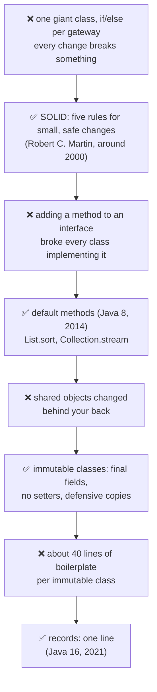
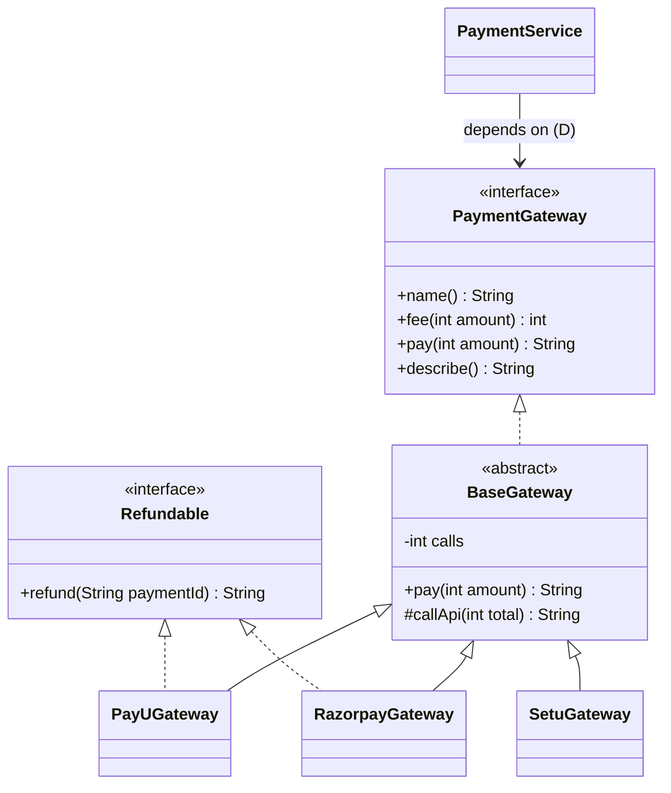
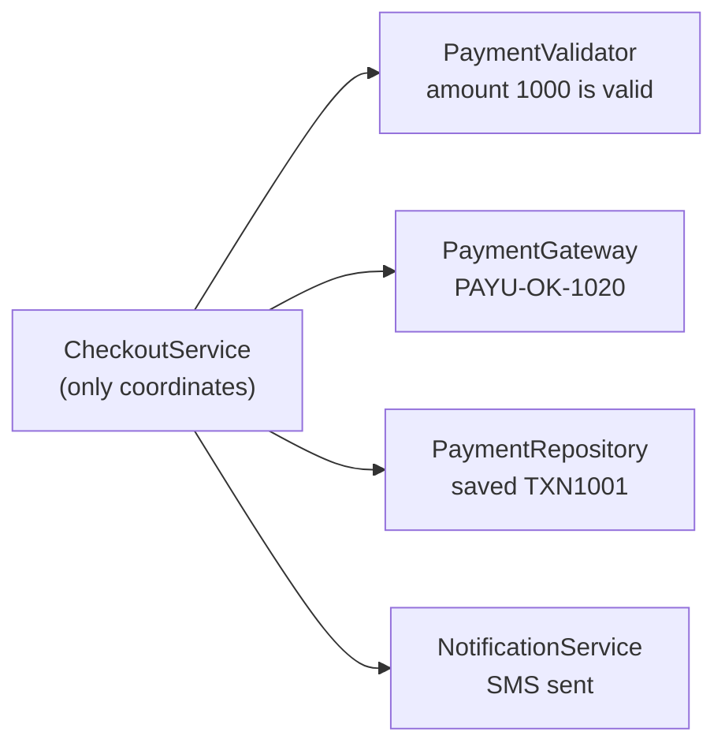
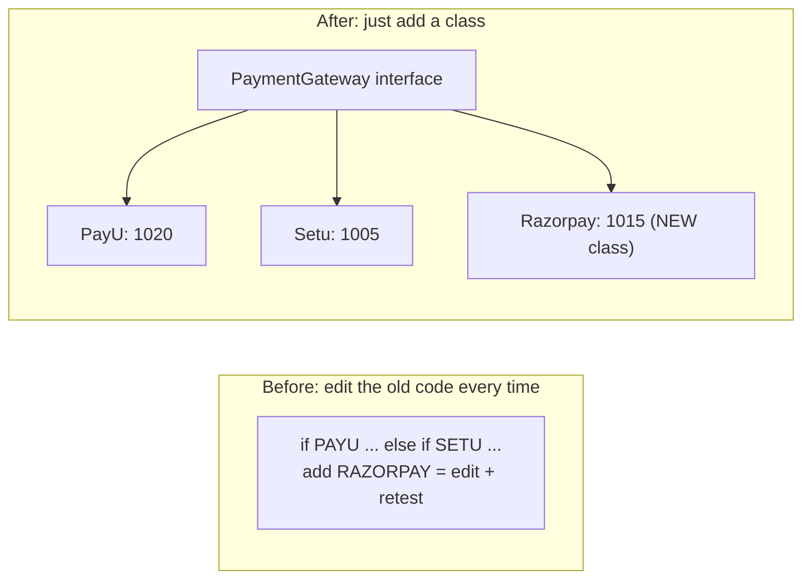
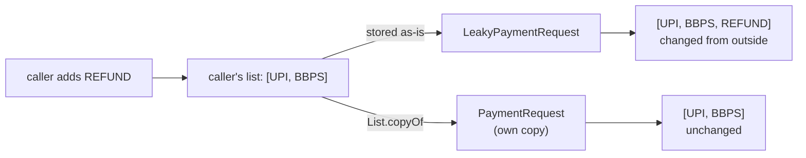
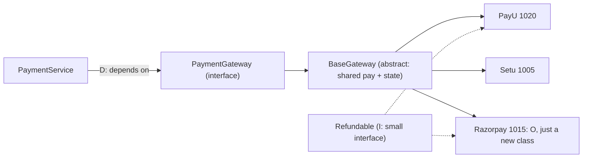

# J10 · SOLID, interface vs abstract class, immutable class

> **In one line:** **SOLID** is five rules that keep changes small and safe, shown here on payment gateways:
> - **S**: one job per class.
> - **O**: add a new gateway without editing old code.
> - **L**: a child class must work wherever its parent does.
> - **I**: small interfaces.
> - **D**: depend on interfaces, and let Spring inject the rest.
>
> An **interface** is a contract; an **abstract class** is shared code plus state. An **immutable** class can never change after it's created.

| ⏱️ Read | 🧪 Run | 🎯 Asked |
|---|---|---|
| 17 min | `java 01-java-core/J10_SolidAndImmutability.java` | "Explain SOLID **with an example from your code**" is very common |

---

## 🧬 Why does this exist? The story

SOLID isn't theory for exams. It came from real teams whose code kept breaking every time they changed it.

1. **❌ The pain:** code that's easy to write but hard to change. One huge PaymentService does everything. A small SMS change breaks payments, and every new gateway means editing a giant if/else and retesting it all.
2. **✅ The fix (Robert C. Martin, around 2000): five design principles**, later named **SOLID** (around 2004). Each letter stops one kind of breakage (the table below).
3. **❌ New pain (interfaces):** before Java 8, adding one method to an interface broke **every** class that implemented it. Java 8 wanted to add `stream()` and `sort()` to `Collection` and `List`, which millions of classes implement.
4. **✅ The fix (Java 8, 2014): default methods.** An interface method with a body, so old classes keep compiling. Since then interfaces and abstract classes look alike, and the real difference is **state** (fields).
5. **❌ New pain (shared objects):** an object anyone can change. You validate a payment request, and some other code changes the amount afterwards. Bugs like this show up only sometimes.
6. **✅ The fix: immutable classes**, the same idea as String (J03): final fields, no setters, defensive copies.
7. **❌ New pain:** a small immutable class by hand is about 40 lines: constructor, getters, equals, hashCode and toString.
8. **✅ The fix (Java 16, 2021): records.** One line does it. You still copy lists yourself.



**Each SOLID letter is one pain and its fix:**

| Letter | ❌ The pain it prevents | ✅ The fix |
|---|---|---|
| **S** | a new SMS provider means editing the class that moves money | one job per class |
| **O** | every new gateway edits and retests the old if/else | add a new class behind an interface |
| **L** | a fixed deposit "account" throws on withdraw, so `payBill()` breaks | a subclass must keep its parent's promise |
| **I** | Setu is forced to write a fake `refund()` | small interfaces, like `Refundable` |
| **D** | `new PayUGateway()` inside the service: you can't test it or swap it | depend on the interface, and let Spring inject it |

🧠 **So it's not random:** SOLID, default methods, immutability and records all serve one goal: **change one thing without breaking another**.

---

The fees are made up for the example: **PayU 2%**, **Setu flat ₹5**, **Razorpay 1.5%**, each paying **₹1,000**. If it's true for you, say your own PayU/Setu code follows this shape.

---

## 🧩 Words you need

| Word | In one line |
|---|---|
| **interface** | a contract: *what* a class can do (methods), with no state |
| **abstract class** | a half-built class: shared code **and** fields; you can't create it directly |
| **dependency injection** | someone else (Spring) creates the objects and passes them in |
| **immutable** | the object's data can never change after it's created |
| **defensive copy** | copying a mutable input (like a List) so outsiders can't change it later |

---

## 🖼️ Picture it: the whole design in one diagram



👀 **Notice:** you can find each letter in this one picture:
- **O**: Razorpay is just one more box.
- **I**: Refundable is separate, and Setu doesn't implement it.
- **D**: PaymentService points at the **interface**, never at PayU.

| Real life | Principle |
|---|---|
| a chef who also takes orders, cleans and does billing | breaks **S** |
| a charging port: plug in new devices without rewiring | **O** |
| a duplicate key that looks right but doesn't open the door | breaks **L** |
| a thali that forces every guest to take every dish | breaks **I** |
| a wall socket: any appliance with the standard plug works | **D** |

---

## 🔬 How it works, step by step

### S · Single Responsibility: one class, one job



❌ One class that validates, calls PayU, saves and sends SMS has **4 reasons to change**. A new SMS provider would mean editing the class that moves money.

✅ Each job gets its own class, and the service only coordinates.

### O · Open for extension, closed for modification



| Gateway | Fee on ₹1,000 | `pay(1000)` |
|---|---|---|
| PayU (2%) | 20 | PAYU-OK-**1020** |
| Setu (flat ₹5) | 5 | SETU-OK-**1005** |
| Razorpay (1.5%), added later | 15 | RAZORPAY-OK-**1015** |

👀 **Notice:** Razorpay was **a new class only**. `PaymentService` wasn't touched.

### L · Liskov: a child must work wherever the parent works

```java
static void payBill(Account from, int amount) { from.withdraw(amount); }   // written for ANY Account
```

- `payBill(new Account(5000), 1200)` leaves **3,800**.
- `payBill(new FixedDepositAccount(5000), 1200)` throws **"FD is locked until maturity"**.

🧠 If a subclass throws "not supported" for a parent's method, the inheritance is **wrong**. It's the duplicate key that doesn't open the door. The fix is to split the types: an FD shouldn't **be** a withdrawable account.

### I · Interface Segregation: small interfaces

```text
PAYU: refunded P1
SETU: no refunds (doesn't implement Refundable)
RAZORPAY: refunded P1
```

If `PaymentGateway` also had `refund()` and `emi()`, Setu would be forced to write methods that just throw. A small `Refundable` interface fixes that.

### D · Dependency Inversion: depend on the interface

❌ `private PayUGateway gateway = new PayUGateway();` welds the service to PayU, so it can't be tested without calling PayU.

✅ `PaymentService(List<PaymentGateway> gateways)`: Spring injects every gateway bean. In a test, you pass a `FakeGateway`, which gives **FAKE-OK-1000** with no real call.

### Interface vs abstract class

The demo uses both:
- The **interface** `PaymentGateway` is the contract, plus a `default describe()` that gives "PAYU charges Rs 20 on Rs 1000".
- The **abstract class** `BaseGateway` holds the fixed `pay()` recipe **and state**: after two payments, `calls = 2`.

| | Interface | Abstract class |
|---|---|---|
| How many can a class use? | **many** (`implements A, B`) | **one** (`extends X`) |
| Instance fields (state) | ❌ only constants | ✅ |
| Constructors | ❌ | ✅ (called with `super()`) |
| Methods | abstract, plus `default`, `static` and `private` (Java 8/9) | abstract and normal, any access level |
| Meaning | "**can do**": a capability | "**is a**": a base with shared code |

🧠 **They combine well:** an interface for the contract, plus an abstract base class for shared code, which is exactly the demo's design.

### Immutable class: six rules

1. `final class`, so no subclass can add changeable behaviour.
2. All fields `private final`.
3. No setters.
4. Set everything in the constructor.
5. **Defensive copies** of mutable inputs and outputs (`List.copyOf`).
6. A "change" returns a **new** object: `withAmount(1500)`.



👀 **Notice:** `final List<String> tags` alone is **not** enough. `final` stops reassigning the field, not changing the list. The copy is also unmodifiable: `safe.tags().add("HACK")` throws UnsupportedOperationException.

💡 **Why bother?**
- Immutable objects are **thread-safe with no locks** (J05).
- They're **safe HashMap keys** (J01).
- They're safe to cache and share, which is exactly why String is immutable (J03).

---

## 💻 Code you should be able to write

```java
// D + O in Spring: inject every gateway, pick by name; no if-else per gateway
@Service
public class PaymentService {
    private final Map<String, PaymentGateway> gateways;          // Spring fills this: bean name -> bean
    public PaymentService(Map<String, PaymentGateway> gateways) { this.gateways = gateways; }
    public String pay(String gateway, int amount) { return gateways.get(gateway).pay(amount); }
}

// An immutable request (a record with a defensive copy)
public record PaymentRequest(String txnId, int amount, List<String> tags) {
    public PaymentRequest { tags = List.copyOf(tags); }           // compact constructor: copy the list
}
```

**What the demo prints** (from a real run):

```text
PAYU-OK-1020
SETU-OK-1005
RAZORPAY-OK-1015
Notice: Razorpay was added as a new class; no existing class changed.
...
leaky tags: [UPI, BBPS, REFUND]  (changed from outside!)
safe tags : [UPI, BBPS]  (defensive copy, unchanged)
```

---

## ⚠️ Traps interviewers love

| Trap | Why it's wrong | Do this instead |
|---|---|---|
| Reciting SOLID definitions with no example | it sounds memorized | use one running example (the gateways) |
| "`final` fields make it immutable" | a final List can still be modified | a defensive copy: `List.copyOf` |
| A subclass that throws "unsupported" | breaks Liskov | split the types; prefer composition |
| One fat interface | forces fake implementations | several small interfaces |
| `new ConcreteClass()` inside a service | welded together, untestable | constructor injection of an interface |

---

## 🎯 In the interview

**What they're really testing**
- *Service companies:* the five letters, interface vs abstract, and how to make a class immutable.
- *Product companies:* **applying** SOLID to a real design (the gateways, a refund capability), composition over inheritance, defensive copies, records and shallow immutability, and how Spring supports D and O.

**Say it in this order** (start with the problem):
0. **Why SOLID exists:** big classes and if/else chains make every change risky. Each letter removes one kind of risk.
1. **S:** one job per class. Validation, gateway, repository and SMS are separate, and the service coordinates.
2. **O:** a PaymentGateway interface with one class per gateway, so adding Razorpay is a new class with no edits.
3. **L:** a subclass must work wherever the parent is used. A fixed deposit that throws on withdraw breaks it.
4. **I:** small interfaces, like a separate Refundable, so Setu doesn't fake refunds.
5. **D:** depend on the interface, and Spring injects the implementation, which also makes testing easy.
6. **Interface vs abstract** is "can do" vs "is a": many vs one, no state vs state.
7. **Immutable:** final class, private final fields, no setters, defensive copies, and new objects for changes.

**Sample answer** (about a minute, in your own words):

> "SOLID exists because code that's easy to write is often hard to change, and each letter removes one kind of risk. I can explain it with payment gateways. Single responsibility: validation, the gateway call, saving and notifications are separate classes, and the service only coordinates. Open/closed: I have a PaymentGateway interface and one class per gateway, so adding Razorpay is just a new class. Liskov: a subclass must work wherever the parent is used, so a fixed deposit account that throws on withdraw shouldn't extend a normal account. Interface segregation: refunds are a separate Refundable interface, because not every gateway supports them. Dependency inversion: the service depends on the PaymentGateway interface and Spring injects the implementations, which also makes testing easy. For shared code I use an abstract base class, and request objects are immutable: final fields, no setters, and defensive copies of lists."

**Product-company deep dive:**
- **Q: Composition over inheritance?**
  **A:** Prefer "has a" (a field) to "is a" (extends). Deep inheritance breaks easily, as the FD shows. Strategy (J12) is composition in action.
- **Q: Are records immutable?**
  **A:** Only shallowly. The fields are final, but a List inside can change, so copy it in the compact constructor.
- **Q: Why did Java 8 add default methods?**
  **A:** To add methods to existing interfaces (like `List.sort`) without breaking every class that implements them. If two interfaces clash, you override and choose with `Refundable.super.method()`.
- **Q: Which SOLID principles does Spring help with?**
  **A:** **D** through dependency injection, and **O** by injecting a `List` or `Map` of beans, so a new bean extends the behaviour.

---

## ❓ Follow-up questions

**Can an interface have fields or a constructor?**
It can't have a constructor. Its only fields are constants (`public static final`).

**Can an abstract class have a constructor? Can it have no abstract methods?**
Yes to both. Subclasses call the constructor with `super(...)`.

**Which immutable classes does the JDK have?**
String, Integer and the other wrappers, BigDecimal, LocalDate, and `List.of()` / `Map.of()`.

---

## 🧪 Test yourself (answer aloud, then click)

<details><summary>1. One class validates, calls PayU, saves and sends SMS. Which principle does it break?</summary>

S. Split it into four classes and let a service coordinate them.

</details>

<details><summary>2. Adding Razorpay means editing an if-else chain. Which principle is broken?</summary>

O. Use an interface with one class per gateway.

</details>

<details><summary>3. payBill(new FixedDepositAccount(5000), 1200) throws. Which principle is broken?</summary>

L. The subclass can't do what its parent promises.

</details>

<details><summary>4. Setu is forced to implement refund(). Which principle is broken, and what's the fix?</summary>

I. Move refunds into a small Refundable interface.

</details>

<details><summary>5. What are the totals on ₹1,000 through PayU (2%), Setu (₹5) and Razorpay (1.5%)?</summary>

₹1,020, ₹1,005 and ₹1,015.

</details>

<details><summary>6. The constructor stores the caller's List in a private final field. Is the class immutable?</summary>

No. The caller can still change that list. Store List.copyOf(list) instead.

</details>

<details><summary>7. Before Java 8, what happened if you added a method to an interface? What fixed it?</summary>

Every class that implemented it stopped compiling until it added the method. Java 8's default methods let an interface add a method with a body, which is how List got sort() and Collection got stream().

</details>

<details><summary>8. Why were records added in Java 16?</summary>

An immutable data class needed about 40 lines: constructor, getters, equals, hashCode and toString. A record does it in one line, though you still copy lists yourself.

</details>

If you get stuck on one, add it to [STUMBLE-LIST.md](../STUMBLE-LIST.md). When they all feel easy, tick J10 in the [README](../README.md) and send `next`.

---

## ⚡ Quick Revision (2 hours before the interview)

**🧬 The story:** one giant class makes every change risky → **SOLID** (around 2000), one pain per letter → adding a method to an interface broke every implementer → **default methods** (Java 8) → shared objects changed behind your back → **immutable classes** → about 40 lines of boilerplate → **records** (Java 16).



**🧠 Must remember**
1. **S:** one reason to change. Validator, gateway, repository and notifier are separate classes.
2. **O:** a new gateway is a **new class**, not an edit (PayU 1020, Setu 1005, Razorpay 1015).
3. **L:** a child must work wherever the parent works. An FD that throws on withdraw breaks it.
4. **I:** small interfaces. `Refundable` is separate, so Setu doesn't fake it.
5. **D:** depend on the **interface**. Spring injects it, and tests use a fake.
6. **Interface** = can-do, many, no state. **Abstract class** = is-a, one, shared code **plus state**.
7. **Immutable:** final class, private final fields, no setters, **defensive copies**, and `withX()` returns a new object.
8. `final List` is **not** immutable. Records are only **shallowly** immutable, so copy lists in the compact constructor.

**⚠️ Top traps**
- Definitions with no example.
- Thinking `final` fields make a class immutable.
- A subclass throwing UnsupportedOperationException.

**🎯 30-second answer:** "I use SOLID on payment gateways. Each class has one job. New gateways are new classes behind a PaymentGateway interface, so old code isn't edited. Subclasses must honour the parent's contract. Capabilities like refunds are small separate interfaces. And services depend on interfaces that Spring injects. An interface is a can-do contract without state; an abstract class shares code and state. Immutable objects have final fields, no setters and defensive copies."

**🔑 Memory hook:** *"One cook one job (S), a charging port (O), a key that must open the door (L), no forced thali (I), a wall socket (D)."*

**🗣️ Say it aloud (no peeking):**
1. SOLID with the gateway example: for each letter, the pain it prevents and the fix.
2. When would you pick an abstract class over an interface? Why did Java 8 add default methods?
3. Make PaymentRequest immutable. What's the easy-to-miss step?
