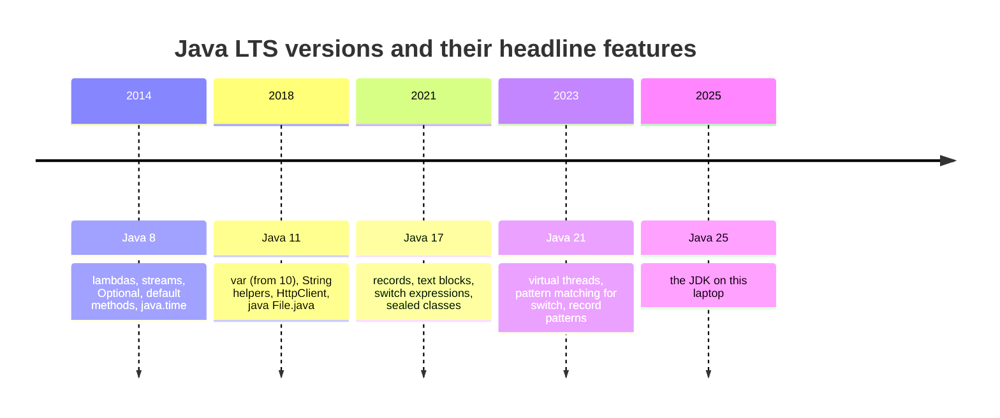
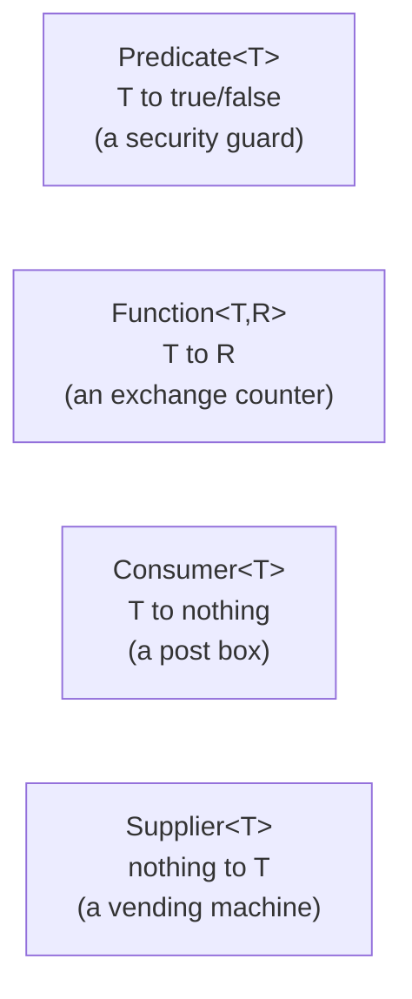
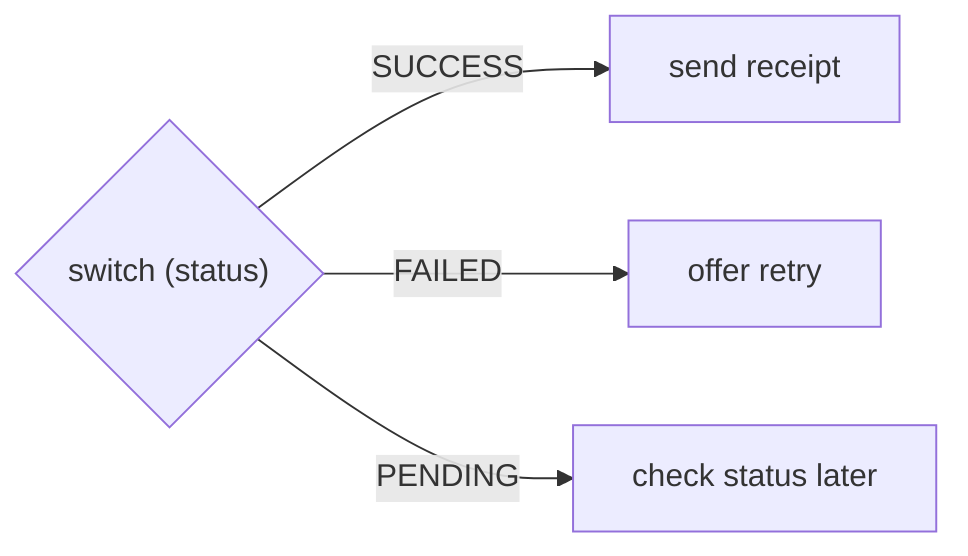
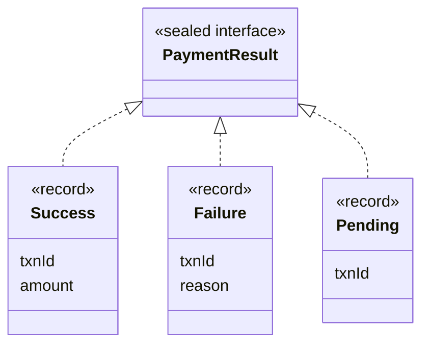
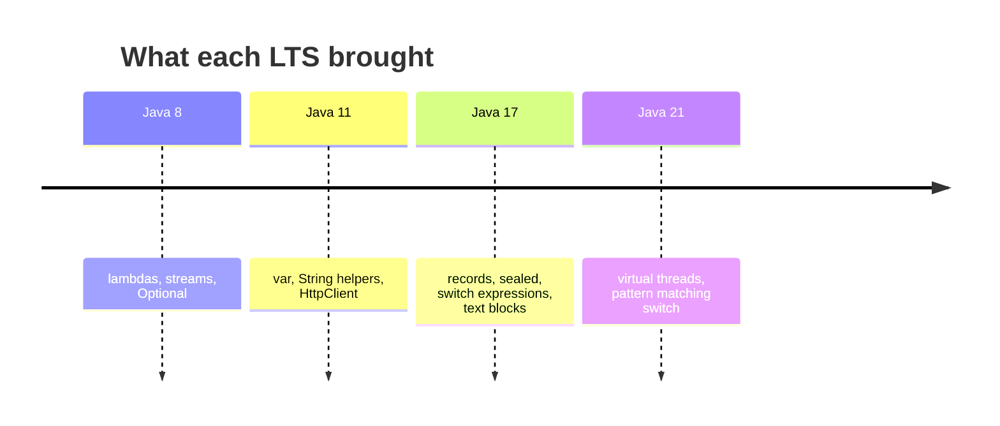

# J11 ⭐ · Modern Java, 8 to 21: the features interviewers ask about

> **In one line:** Java releases every 6 months; companies stay on the **LTS** versions (8, 11, 17, 21, 25). Know the headline features: Java 8's lambdas and streams; records, switch expressions and text blocks (up to 17); virtual threads and pattern matching (21). Answer "which version do you use?" with **a feature you really used and why**.

| ⏱️ Read | 🧪 Run | 🎯 Asked |
|---|---|---|
| 12 min | `java 01-java-core/J11_ModernJavaFeatures.java` | Often the **opening** Java question: "Which version, and what's new?" |

The running example is four payments:

| txnId | amount | status |
|---|---|---|
| TXN1 | 1,200 | SUCCESS |
| TXN2 | 450 | FAILED |
| TXN3 | 300 | PENDING |
| TXN4 | 15,000 | SUCCESS |

---

## 🧩 Words you need

| Word | In one line |
|---|---|
| **LTS** | Long-Term Support: a version that gets fixes for years, and the one companies use |
| **functional interface** | an interface with exactly **one** abstract method, so a lambda can implement it |
| **record** | a one-line data class: fields, constructor, getters, equals, hashCode and toString |
| **sealed** | "only these types may extend me", so the compiler knows every subtype |
| **virtual thread** | a very cheap thread (Java 21) that doesn't hold an OS thread while it waits |

---

## 🖼️ Picture it: phone OS updates

A new Java arrives every **6 months**, like phone updates. Every 2 years one of them is an **LTS**, which companies stay on.



👀 **Notice:** most companies today run **17 or 21**, so be ready to name features from those two.

---

## 🔬 How it works, step by step

### Step 1 · Lambdas and functional interfaces (Java 8)



| Interface | The demo |
|---|---|
| `Predicate<Payment>` | `p -> p.amount() > 10_000`: of 1,200, 450, 300 and 15,000, only **TXN4** passes |
| `Function<Payment, String>` | `Payment::txnId` (a method reference) |
| `Consumer<String>` | `id -> System.out.println(id)` |
| `Supplier<String>` | `() -> "TXN5"` |

You can write your own too: `@FunctionalInterface interface FeeRule { int fee(int amount); }`, then `FeeRule twoPercent = a -> a * 2 / 100;` gives `twoPercent.fee(1000)` = **20**. The `@FunctionalInterface` annotation makes the compiler reject a second abstract method.

### Step 2 · var, text blocks and String helpers (Java 10, 11, 15)

```java
var payments = List.of(...);                 // var (10): the compiler works out List<Payment>
String json = """
        {"txnId": "%s", "amount": %d}
        """.formatted("TXN1", 1_200);        // text block (15): multi-line text, no \n or +
"  TXN1  ".strip();   // "TXN1"      (11)
"   ".isBlank();      // true        (11)
"=".repeat(10);       // "=========="(11)
```

⚠️ `var` is **not** dynamic typing. The type is fixed at compile time; you just don't write it. It only works for local variables with a value.

### Step 3 · Switch expressions (Java 14)



```java
String action = switch (p.status()) {
    case SUCCESS -> "send receipt";
    case FAILED  -> "offer retry";
    case PENDING -> "check status later";
};
```

Why it beats the old switch:
- it **returns a value**,
- there's **no `break`**, so no fall-through,
- the compiler checks that **every enum value** is covered. Add REFUNDED and it won't compile until you handle it.

### Step 4 · Records, sealed types, pattern matching (Java 16, 17, 21)



```java
String message = switch (result) {
    case Success(String id, int amount) -> id + " paid Rs " + amount;   // record pattern: unpacks the fields
    case Failure f -> f.txnId() + " failed: " + f.reason();
    case Pending p -> p.txnId() + " is pending";
};   // no default: the interface is sealed, so the compiler knows all 3 types
```

This gives "TXN1 paid Rs 1200", "TXN2 failed: insufficient balance" and "TXN3 is pending".

👀 **Notice:** **sealed + switch = a compile-time safety net.** Add a 4th result type, and every switch that forgets it stops compiling.

**instanceof pattern (16):** `if (x instanceof Success s) { s.amount() }` tests the type and gives you a typed variable in one step.

### Step 5 · Virtual threads (Java 21)

**The picture:** platform threads are **full-time staff**: expensive, and there are only so many desks. Virtual threads are **gig workers** who use a desk only while working. While waiting for an HTTP reply, the desk is free.

```mermaid
gantt
    title 1000 tasks that each wait 100 ms
    dateFormat x
    axisFormat %L ms
    section 50 platform threads
    20 rounds of 100 ms :0, 2000
    section virtual threads
    all 1000 wait together :0, 110
```



| Executor | Math | Demo (several runs) |
|---|---|---|
| 50 platform threads | 1,000 / 50 = 20 rounds × 100 ms ≈ **2,000 ms** | 2,022 to 2,047 ms |
| Virtual threads | all wait together ≈ **100 ms** | **111 to 162 ms** |

🧠 Virtual threads help code that **waits** (HTTP, DB). They don't speed up CPU-heavy work. In Spring Boot 3.2+, turn them on with `spring.threads.virtual.enabled=true`.

### Step 6 · Which Java is this?

The demo prints `Runtime.version()`: **25.0.3+9-LTS**. In the interview, talk about the version you used **at work**, and add that you've tried the newer ones.

---

## 💻 Code you should be able to write

```java
// A DTO in one line (Java 16+)
public record PaymentResponse(String txnId, int amount, String status) { }

// Map a status to an action, exhaustively (Java 14+)
String action = switch (status) {
    case SUCCESS -> "send receipt";
    case FAILED  -> "offer retry";
    case PENDING -> "check status later";
};

// Many blocking calls on virtual threads (Java 21)
try (var executor = Executors.newVirtualThreadPerTaskExecutor()) {
    billers.forEach(b -> executor.submit(() -> fetchBill(b)));
}
```

---

## ⚠️ Traps interviewers love

| Trap | Why it's wrong | Say this instead |
|---|---|---|
| "var makes Java dynamically typed" | the type is fixed when compiling | "Local type inference only" |
| Claiming features you never used | the follow-up is "where did you use it?" | name 2 features you used, with the reason |
| "Virtual threads make everything faster" | they only help code that waits | "They scale blocking I/O, not CPU work" |
| Records as JPA entities | entities need a no-arg constructor and changeable fields | "Records for DTOs; classes for entities" |
| A switch expression with no `default` on a non-sealed type | the compiler demands exhaustiveness | "Enums and sealed types can skip default" |

---

## 🎯 In the interview

**What they're really testing**
- *Service companies:* Java 8 features (lambdas, streams, Optional, default methods) and what a functional interface is.
- *Product companies:* **why** each feature exists (records for immutable DTOs, sealed + switch for exhaustiveness, virtual threads for I/O-bound scaling), and honest depth about your own version.

**Say it in this order:**
1. Java ships every 6 months; the **LTS** versions are 8, 11, 17, 21 and 25. Say the version you use at work (only if true).
2. **Java 8** was the big shift: lambdas, functional interfaces, streams, Optional, default methods, java.time.
3. Newer features you use, **with the reason**: records (less boilerplate), switch expressions (no fall-through, exhaustive), text blocks, `var`.
4. **17/21:** sealed + pattern-matching switch lets the compiler check every case. **Virtual threads** scale blocking I/O cheaply.

**Sample answer** (about a minute; change the version to yours):

> "At work we were on Java 17, and I've also tried 21. From Java 8 I use lambdas and streams every day, and Optional for repository results. From the newer versions, I use records for DTOs, since one line gives me fields, getters, equals and hashCode, and switch expressions for mapping a payment status to an action, because there's no fall-through and the compiler checks every enum value is covered. Text blocks are handy for JSON in tests. Java 21 adds virtual threads, which are very cheap, so a service that mostly waits on HTTP or DB calls can handle many more requests without a huge thread pool. It also adds pattern matching for switch, which together with sealed interfaces lets the compiler check that every result type is handled."

**Product-company deep dive:**
- **Q: Lambda vs anonymous class?**
  **A:** A lambda is shorter, and inside it `this` means the surrounding class. An anonymous class creates a new class, and its `this` is itself. Both can use only **effectively final** local variables.
- **Q: What kinds of method references are there?**
  **A:** Four:
  - a static method: `Integer::parseInt`
  - a method on a specific object: `System.out::println`
  - a method on whatever object comes in: `String::length`
  - a constructor: `ArrayList::new`
- **Q: When shouldn't you use virtual threads?**
  **A:** For CPU-heavy work, and don't pool them, because they're cheap to create. In Java 21 to 23, a virtual thread blocked inside `synchronized` pinned its carrier thread. Java 24 fixed that.
- **Q: Sealed class rules?**
  **A:** `permits` lists the allowed subtypes, and each one must be `final`, `sealed` or `non-sealed`.

---

## ❓ Follow-up questions

**What's a functional interface?**
An interface with exactly one abstract method; default and static methods are allowed. Examples are Runnable, Callable, Comparator, Predicate and Function.

**Where would you use a record in Spring Boot?**
DTOs, request and response bodies, and events. Not JPA entities.

*Only if they push further (Java 25):* a small program can now be just `void main() { ... }` with no class around it, and constructors can run statements before `super(...)`.

---

## 🧪 Test yourself (answer aloud, then click)

<details><summary>1. Which versions are LTS?</summary>

8, 11, 17, 21, 25.

</details>

<details><summary>2. Which functional interface fits "is this payment above ₹10,000?"</summary>

Predicate&lt;Payment&gt;.

</details>

<details><summary>3. What does a switch expression give that the old switch statement didn't?</summary>

It returns a value, has no break or fall-through, and checks that every case is covered.

</details>

<details><summary>4. Why doesn't the switch over PaymentResult need a default?</summary>

It's sealed, so the compiler knows the only types: Success, Failure and Pending.

</details>

<details><summary>5. 1,000 tasks of 100 ms: about how long on 50 platform threads, and on virtual threads?</summary>

About 2,000 ms (20 rounds) on platform threads, and about 100 to 160 ms on virtual threads.

</details>

<details><summary>6. Is var dynamic typing?</summary>

No. The type is fixed at compile time.

</details>

If you get stuck on one, add it to [STUMBLE-LIST.md](../STUMBLE-LIST.md). When they all feel easy, tick J11 in the [README](../README.md) and send `next`.

---

## ⚡ Quick Revision (2 hours before the interview)



**🧠 Must remember**
1. **LTS:** 8, 11, 17, 21, 25. A new version every **6 months**. Most companies are on **17/21**.
2. **Functional interface** = one abstract method. **Predicate** (T to boolean), **Function** (T to R), **Consumer** (T to nothing), **Supplier** (nothing to T).
3. `var` is compile-time inference for **locals only**, not dynamic typing.
4. **Switch expression:** returns a value, no fall-through, and **exhaustive** (every enum value).
5. **Records** are one-line immutable data classes, great for **DTOs** and **not** for JPA entities.
6. **Sealed** interfaces plus pattern-matching switch mean **no default** is needed, and the compiler catches a missing case.
7. **Virtual threads (21)** are cheap threads for **waiting** code: 1,000 × 100 ms took about 2,000 ms on 50 threads vs about 110 to 160 ms virtual.
8. **Text blocks** (`"""`) for JSON and SQL; `strip`, `isBlank` and `repeat` came in Java 11.

**⚠️ Top traps**
- Claiming features you never used.
- Saying var means dynamic typing.
- Saying virtual threads make CPU work faster.

**🎯 30-second answer:** "I've used Java 17 at work. From Java 8 I use lambdas, streams and Optional daily. From newer versions I use records for DTOs and switch expressions for mapping statuses, because they're exhaustive with no fall-through. Java 21 adds virtual threads, which make blocking I/O scale cheaply, and pattern matching for switch, which with sealed types lets the compiler check every case."

**🔑 Memory hook:** *"8 gave lambdas, 17 gave records, 21 gave virtual threads. Gig workers only take a desk while they're working."*

**🗣️ Say it aloud (no peeking):**
1. Which Java do you use, and name two features from it you actually used.
2. Why is a switch over a sealed interface safer than if-else with instanceof?
3. When do virtual threads help, and when don't they?
