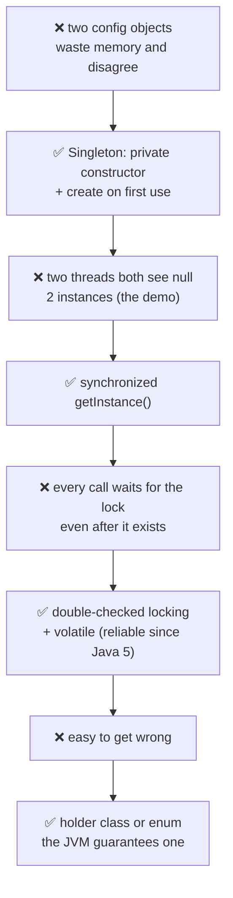
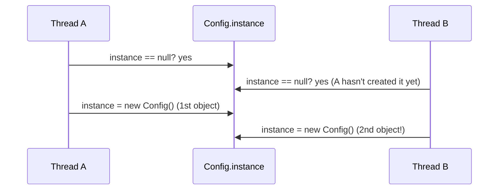
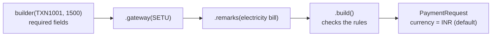
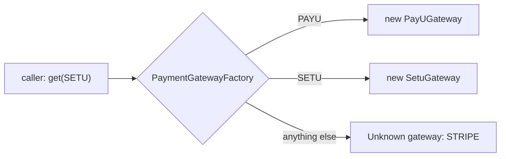
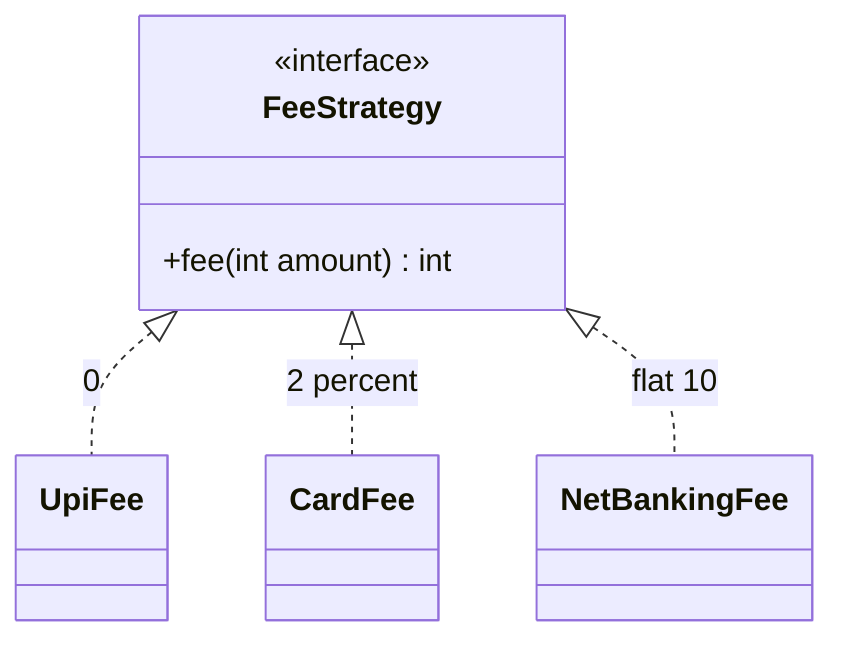
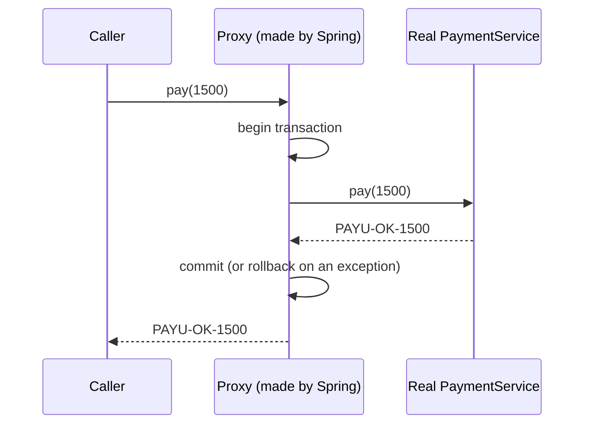
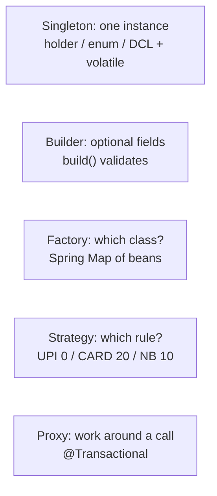

# J12 ⭐ · Design patterns: Singleton, Builder, Factory, Strategy (and Proxy)

> **In one line:** A design pattern is a **named, proven fix for a common problem**:
> - **Singleton:** exactly one shared instance.
> - **Builder:** readable objects with many optional fields.
> - **Factory:** one place decides which class to create.
> - **Strategy:** swap a rule at runtime.
> - **Proxy:** a stand-in that adds work around a call. That's how Spring's `@Transactional` works.

| ⏱️ Read | 🧪 Run | 🎯 Asked |
|---|---|---|
| 14 min | `java 01-java-core/J12_DesignPatterns.java` | "Which patterns have you used?" is standard for 3 years of experience; "how does @Transactional work?" follows |

---

## 🧬 Why does this exist? The story

In 1994, four authors (the "Gang of Four") wrote the book *Design Patterns*. They didn't invent these ideas. They noticed that teams kept hitting the **same problems** and solving them the **same way**, so they gave each fix a name. With a name, you can say "use a strategy" instead of explaining 50 lines.

**Every pattern is one problem and its fix:**

| Pattern | ❌ The problem people hit | ✅ What the pattern says |
|---|---|---|
| **Singleton** | two config objects or connection pools get created. They waste memory and can disagree with each other | make exactly one shared instance |
| **Builder** | `new PaymentRequest("TXN1001", 1500, "INR", "SETU", null, "electricity bill")`: which null is which? | set fields by name, then `build()` checks them |
| **Factory** | `if (type == PAYU) new PayUGateway() else if ...` copied in 10 places | one place decides which class to create |
| **Strategy** | a giant if-else of fee rules inside the payment method | each rule is its own class behind one interface |
| **Proxy** | writing "begin transaction, commit, rollback" by hand in every service method | a stand-in wraps the real object and adds it around each call |

**Even one pattern has its own story.** Singleton is the most asked, so here's how it grew.

### Chapter 1 · Two config objects

**🧑‍💻 What people were doing:** writing `new AppConfig()` wherever they needed the config.

**😣 The problem they hit:** two config objects wasted memory, and could hold different values.

**☕ What experienced programmers said:** "Make the constructor **private**, and create the one instance on first use." → **Singleton**

**✅ How it solved the problem:** only one config object. **But…** two threads can break it.

### Chapter 2 · Two threads made two singletons

**🧑‍💻 What people were doing:** `if (instance == null) instance = new AppConfig();` inside `getInstance()`.

**😣 The problem they hit:** two threads both saw `null` at the same moment, and created **2** instances (the demo shows it).

**☕ What experienced programmers said:** "Make `getInstance()` **synchronized**, so only one thread can be inside at a time."

**✅ How it solved the problem:** exactly one instance. **But…** now every call waits for the lock.

### Chapter 3 · Waiting for a lock, forever

**🧑‍💻 What people were doing:** calling `getInstance()` thousands of times a second.

**😣 The problem they hit:** every call waited for the lock, even long after the instance existed.

**☕ What experienced programmers said:** "Check first **without** the lock. Lock only if it's still null, then check again inside." → **double-checked locking**. It needs `volatile`, and it's only been reliable since Java 5.

**✅ How it solved the problem:** no lock once the instance exists. **But…** it's easy to get wrong.

### Chapter 4 · Too easy to get wrong

**🧑‍💻 What people were doing:** copying double-checked locking code, and sometimes forgetting `volatile`.

**😣 The problem they hit:** a tiny mistake made a bug that appears only under load.

**☕ What experienced programmers said:** "Let the **JVM** do it. It creates a class only once, so use a **holder class** or an **enum**."

**✅ How it solved the problem:** the JVM guarantees one instance, with no locking code at all.



🧠 **So it's not random:** a pattern is just a pain that kept coming back, plus the fix that worked. Learn the pain, and you'll remember the pattern. Spring then applies most of them for you (the table in Step 5).

---

## 🧩 Words you need

| Word | In one line |
|---|---|
| **pattern** | a reusable shape of code for a problem that keeps coming back |
| **lazy creation** | build the object only the first time someone asks for it |
| **fluent API** | calls you can chain: `.gateway("SETU").remarks("...").build()` |
| **interchangeable** | different classes behind one interface, so either one can be plugged in |
| **proxy** | an object that stands in front of the real one and adds work before and after each call |

---

## 🖼️ Picture it

| Pattern | Everyday picture | Problem it solves |
|---|---|---|
| Singleton | the RBI governor: there's only one, and everyone refers to the same person | exactly one shared instance |
| Builder | ordering at Subway: bread first, then extras, then "make it" | objects with many optional fields |
| Factory | a car rental counter: say "SUV" and get the right car | hide which class gets created |
| Strategy | Google Maps: car, bike or walk, the same trip calculated differently | swap a rule at runtime |
| Proxy | a personal assistant who handles things before and after your meeting | add work around a call without touching it |

---

## 🔬 How it works, step by step

### Step 1 · Singleton: exactly one instance

The idea: a `private` constructor (nobody else can call `new`) plus one static way to get the instance.

⚠️ **The trap is the lazy version with no locking.** Two threads can both see `null`:



| Version | Instances created (demo, every run) |
|---|---|
| lazy, no locking | **2** ❌ |
| double-checked locking + `volatile` | 1 ✅ |
| holder class | 1 ✅ |
| `enum` | 1 ✅ |

**Double-checked locking:**

```java
private static volatile Config instance;          // volatile: nobody sees a half-built object (J05)
static Config getInstance() {
    if (instance == null) {                        // 1st check: skip the lock once it exists
        synchronized (Config.class) {
            if (instance == null) {                // 2nd check: the other thread may have made it
                instance = new Config();
            }
        }
    }
    return instance;
}
```

✅ Simpler and safe: the **holder class** (the JVM creates it once, on first use) or an **enum**: `enum Config { INSTANCE; }`. Even reflection and serialization can't make a second enum instance.

🧠 **In Spring you rarely write this.** Every bean is a singleton **by default**, one per container (B03).

### Step 2 · Builder: many optional fields, readable code

❌ `new PaymentRequest("TXN1001", 1500, "INR", "SETU", null, "electricity bill")`: which null is which?

✅ With a builder:



This gives `PaymentRequest[txnId=TXN1001, amount=1500, currency=INR, gateway=SETU, remarks=electricity bill]`. `builder("TXN1002", 0).build()` is refused with **"amount must be positive, got 0"**.

At work, Lombok's `@Builder` writes all of this for you.

### Step 3 · Factory: one place decides which class



The demo prints "factory gave SetuGateway -> SETU-OK-1500". Callers only know the **interface**, and adding a gateway changes one place.

🧠 **In Spring, the container is the factory.** Inject `Map<String, PaymentGateway>`, and Spring fills it with every gateway bean.

### Step 4 · Strategy: the same job, a different rule, chosen at runtime



| Mode | Rule | Fee on ₹1,000 | Total |
|---|---|---|---|
| UPI | free | ₹0 | **₹1,000** |
| CARD | 2% | ₹20 | **₹1,020** |
| NETBANKING | flat ₹10 | ₹10 | **₹1,010** |

👀 **Notice:** the payment code just calls `strategy.fee(amount)`, with no if-else. A new mode is a new strategy, which is open/closed from J10.

🧠 **Factory vs Strategy:** Factory answers "**which object** do I create?" Strategy answers "**which behaviour** do I use?" They're often used together: `feeStrategyFor(mode)` hands you the right strategy.

### Step 5 · Proxy: how Spring's `@Transactional` really works



The demo builds exactly this with `java.lang.reflect.Proxy`:

```text
  [proxy] begin transaction before pay()
  [proxy] commit transaction after pay()
  result: PAYU-OK-1500
```

⚠️ **The classic bug:** calling a `@Transactional` method **from another method in the same class** skips the transaction. `this.method()` calls the real object directly and never passes through the proxy (B05). `@Async` and `@Cacheable` work the same way, and fail the same way.

| Pattern | Where Spring uses it |
|---|---|
| Singleton | beans are singleton-scoped by default |
| Factory | `BeanFactory` / `ApplicationContext` |
| Proxy | `@Transactional`, `@Async`, `@Cacheable`, AOP |
| Template Method | `JdbcTemplate`, `RestTemplate` (and J10's `BaseGateway.pay()`) |
| Observer | `@EventListener`, RabbitMQ publish/subscribe |
| Builder | `ResponseEntity.ok().body(...)`, `WebClient.builder()` |

---

## 💻 Code you should be able to write

```java
// Thread-safe lazy singleton (the holder idiom)
public final class GatewayConfig {
    private GatewayConfig() { }
    private static class Holder { static final GatewayConfig INSTANCE = new GatewayConfig(); }
    public static GatewayConfig getInstance() { return Holder.INSTANCE; }
}

// Strategy picked by payment mode, no if-else chain in the payment code
Map<String, FeeStrategy> fees = Map.of(
        "UPI", a -> 0,
        "CARD", a -> a * 2 / 100,
        "NETBANKING", a -> 10);
int total = amount + fees.get(mode).fee(amount);
```

---

## ⚠️ Traps interviewers love

| Trap | Why it's wrong | Say this instead |
|---|---|---|
| A lazy singleton with no locking | two threads create two instances (the demo: 2) | holder class, enum, or double-checked + volatile |
| Double-checked locking without `volatile` | another thread may see a half-built object | "The field must be volatile" |
| Listing 10 pattern names | it sounds memorized | "3 or 4, each with a real example" |
| Calling a `@Transactional` method from the same class | it bypasses the proxy, so no transaction | call it through another bean |
| "Factory and Strategy are the same" | one creates, the other behaves | "Often used together" |

---

## 🎯 In the interview

**What they're really testing**
- *Service companies:* what each pattern is, and a thread-safe singleton.
- *Product companies:* **when** to use each one and its trade-offs, why `volatile` is needed in double-checked locking, how Spring applies patterns (proxies, factories), and the self-invocation bug.

**Say it in this order** (pick 3 or 4, each as **problem → example**):
0. **Why patterns exist:** the same problems kept coming back, so the proven fixes got names (the Gang of Four book, 1994). A name lets a team say "use a strategy" instead of explaining 50 lines.
1. **Singleton:** one instance. It needs thread safety (holder, enum, or double-checked + volatile). Spring beans are already singletons.
2. **Builder:** many optional fields, readable and validated in `build()`. Lombok's `@Builder`.
3. **Factory:** hides which class gets created. Spring injects `Map<String, PaymentGateway>`.
4. **Strategy:** interchangeable rules behind one interface, like fees per mode, replacing an if-else chain.
5. **Proxy:** Spring wraps beans for `@Transactional`, which is why self-invocation skips it.

**Sample answer** (about a minute; tie it to your work only if true):

> "In payment code the most useful patterns are strategy and factory. Each payment mode has its own fee rule behind a FeeStrategy interface, so adding a mode means adding a class instead of editing an if-else chain, and a factory, or really a Spring-injected map, gives me the right gateway by name. For request objects with many optional fields I use a builder, usually Lombok's @Builder, and build() validates the amount. For singletons, I know why a lazy one needs double-checked locking with volatile, but in Spring beans are singletons by default, so I rarely write one. And @Transactional is a proxy around the bean, which is why calling a transactional method from inside the same class doesn't start a transaction."

**Product-company deep dive:**
- **Q: Why is an enum the best singleton?**
  **A:** The JVM guarantees exactly one instance, it's thread-safe with no extra code, and reflection or serialization can't create a second one.
- **Q: How can a normal singleton be broken?**
  **A:** Reflection (calling the private constructor), serialization (without `readResolve`), cloning, or several class loaders.
- **Q: How does Spring create proxies?**
  **A:** With JDK dynamic proxies (like the demo) when the bean implements an interface. Otherwise, and by default in Spring Boot, it uses **CGLIB**, which creates a subclass at runtime. That's why `final` methods can't be proxied.

---

## ❓ Follow-up questions

**Singleton vs a class with only static methods?**
A singleton is an object. It can implement interfaces, be injected, be created lazily and be mocked in tests. A static class can't do any of that.

**Factory Method vs Abstract Factory?**
A factory method is one method choosing a class. An abstract factory creates a **family** of related objects.

**Which patterns does the JDK use?**
- Builder: `StringBuilder`, `HttpRequest.newBuilder()`.
- Factory: `List.of()`, `Executors`.
- Strategy: `Comparator`.
- Decorator: `BufferedReader`.
- Proxy: `java.lang.reflect.Proxy`.

---

## 🧪 Test yourself (answer aloud, then click)

<details><summary>1. Two threads call a lazy getInstance() with no locking at the same moment. How many instances?</summary>

It can be 2, as the demo showed every run.

</details>

<details><summary>2. Why must the field be volatile in double-checked locking?</summary>

So no thread sees a reference to a half-constructed object.

</details>

<details><summary>3. PaymentRequest has 2 required and 5 optional fields. Which pattern?</summary>

Builder.

</details>

<details><summary>4. What are the fees and totals on ₹1,000 for UPI (free), CARD (2%) and NETBANKING (₹10)?</summary>

Fees 0, 20 and 10, so totals of 1,000, 1,020 and 1,010.

</details>

<details><summary>5. Which pattern makes @Transactional work, and what's the classic bug?</summary>

Proxy. A self-invocation from inside the same class skips the proxy, so no transaction starts.

</details>

<details><summary>6. In one line each, what pain does each pattern fix: Singleton, Builder, Factory, Strategy, Proxy?</summary>

Singleton: duplicate shared objects. Builder: unreadable constructor calls with many nulls. Factory: if-else creation code copied everywhere. Strategy: one giant if-else of rules. Proxy: the same before-and-after code (like transactions) written by hand in every method.

</details>

<details><summary>7. Why not just make getInstance() synchronized and stop there?</summary>

It's correct, but every call waits for the lock, even after the instance exists. Double-checked locking skips the lock once it's created, and volatile stops threads seeing a half-built object. A holder class or an enum gets the same safety with no locking code.

</details>

If you get stuck on one, add it to [STUMBLE-LIST.md](../STUMBLE-LIST.md). When they all feel easy, tick J12 in the [README](../README.md) and send `next`.

---

## ⚡ Quick Revision (2 hours before the interview)

**🧬 The story:** each pattern is a pain that kept coming back (named in the Gang of Four book, 1994). Duplicate shared objects → **Singleton** · constructor calls full of nulls → **Builder** · if-else creation in 10 places → **Factory** · one giant if-else of rules → **Strategy** · transaction code by hand in every method → **Proxy**. Singleton's own story: 2 threads make 2 → synchronized → every call waits → double-checked + volatile → **holder / enum**.



**🧠 Must remember**
1. **Singleton:** a private constructor plus one access point. A lazy version with no locking creates **2** under a race. Use a **holder**, an **enum** (the best) or **double-checked + volatile**.
2. Spring beans are **singletons by default**, so you rarely hand-write one.
3. **Builder:** required fields in `builder(...)`, optional ones by name, and `build()` **validates**. Use Lombok's `@Builder`.
4. **Factory:** one place picks the class. In Spring, inject `Map<String, PaymentGateway>`.
5. **Strategy:** interchangeable rules behind an interface. The fee on ₹1,000 is **0 / 20 / 10**.
6. **Factory** means "which object"; **Strategy** means "which behaviour". They're often used together.
7. **Proxy:** Spring wraps beans for `@Transactional`, `@Async` and `@Cacheable`. **Self-invocation skips the proxy.**
8. Spring uses CGLIB proxies by default, so **final methods can't be proxied**.

**⚠️ Top traps**
- A lazy singleton without locking, or without volatile.
- Listing patterns with no examples.
- Calling a @Transactional method from the same class.

**🎯 30-second answer:** "I use strategy for fee rules per payment mode, and factory, usually a Spring-injected map, to pick the gateway, so new modes and gateways are new classes, not if-else edits. I use builders for requests with many optional fields. A singleton needs thread safety, like the holder idiom or an enum, but Spring beans are singletons already. And @Transactional works through a proxy, which is why self-invocation doesn't start a transaction."

**🔑 Memory hook:** *"The RBI governor (one), a Subway order (build step by step), the rental counter (you ask, it picks), Google Maps modes (swap the rule), a personal assistant (before and after the meeting)."*

**🗣️ Say it aloud (no peeking):**
1. For each of the 5 patterns, say the pain it fixes in one line. Then Factory vs Strategy, with the payment example.
2. Show why a lazy singleton breaks with two threads, and walk the fixes up to the enum.
3. How does @Transactional work, and what is the self-invocation problem?
