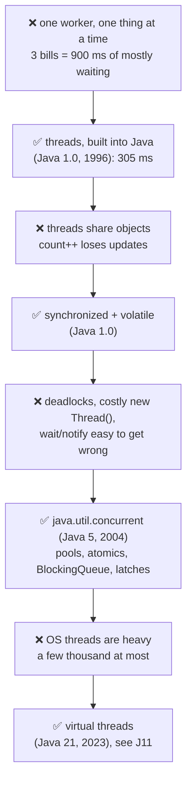
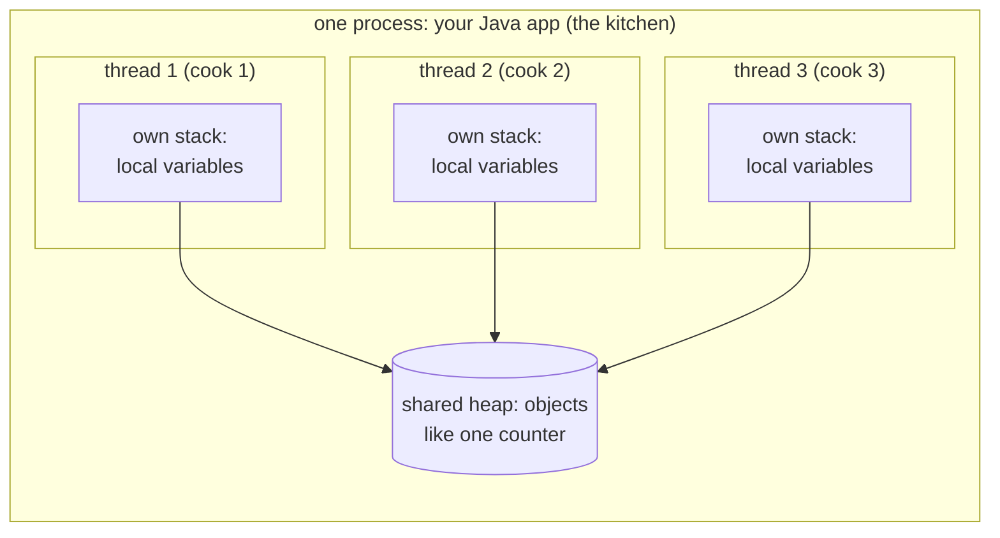
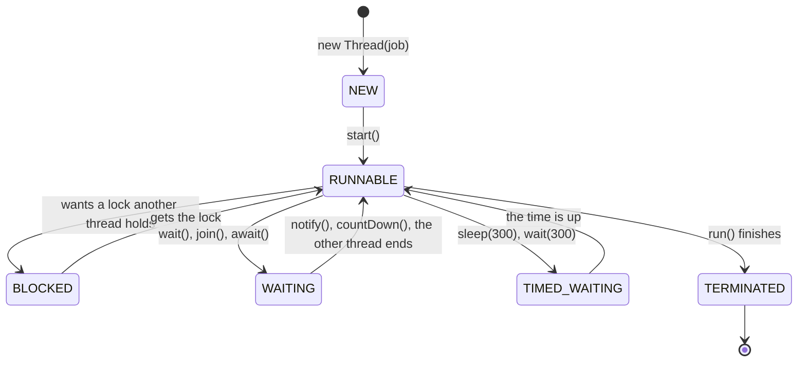
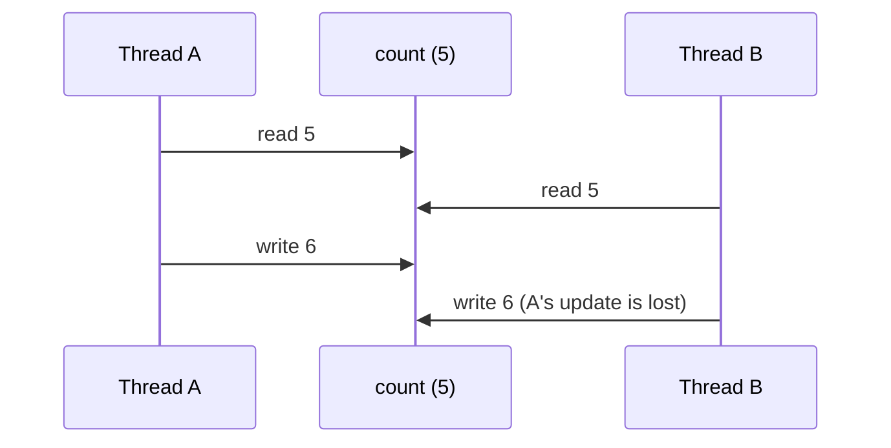
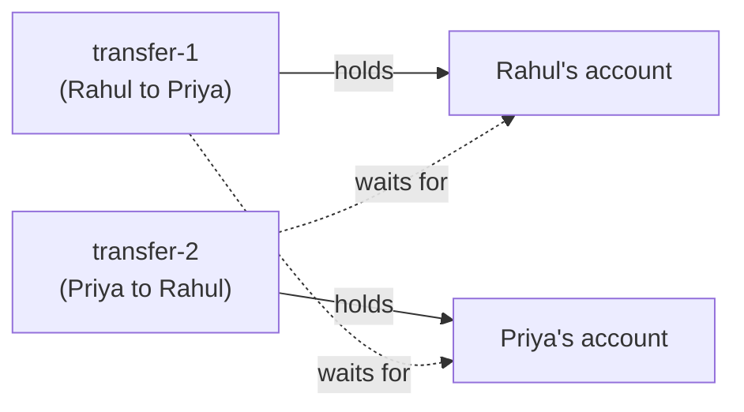
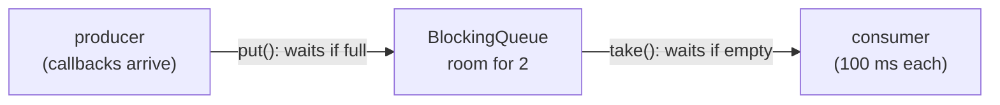
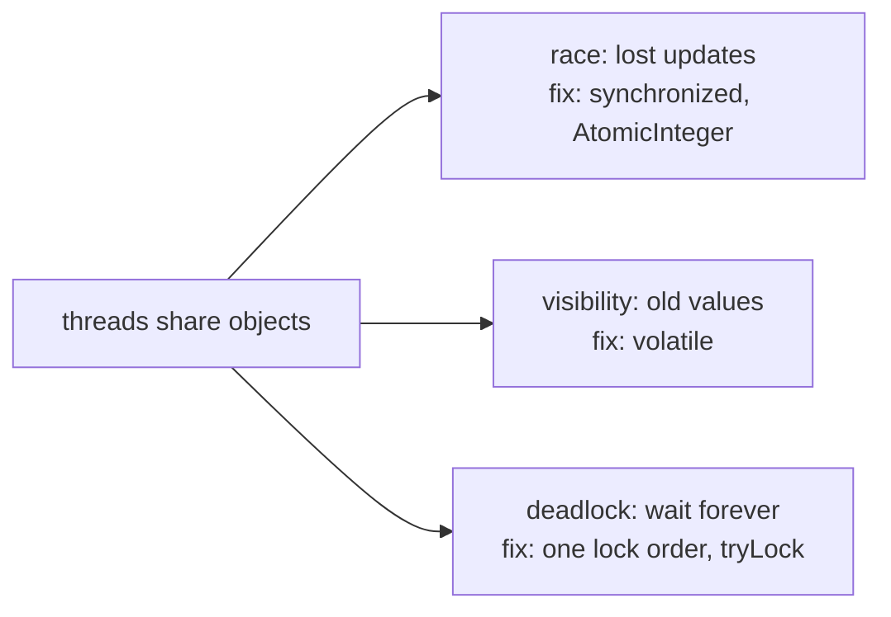

# J13 ⭐ · Multithreading from zero: threads, their life, the 3 dangers, and the tools

> **In one line:** A **thread** is one worker inside your program. Several threads let you do several things at the same time, like calling 3 billers together. But threads that share data can **overwrite each other**, **miss each other's changes**, or **wait for each other forever**. Every tool in Java's multithreading toolbox exists to stop one of these three problems.

| ⏱️ Read | 🧪 Run | 🎯 Asked |
|---|---|---|
| 25 min | `java 01-java-core/J13_MultithreadingFromZero.java` | Every Java round: "thread vs process", "start() vs run()", "how do you avoid a deadlock?", "print odd and even numbers with two threads" |

**Where this fits:** start here if threads are new to you. Then go deeper with J05 (locks and ConcurrentHashMap), J06 (thread pools and CompletableFuture), J11 (virtual threads) and **B13 (threads inside a Spring Boot app)**.

---

## 🧬 Why does this exist? The story

Java's thread tools look like a long random list. They aren't. Each one fixed a problem programmers hit.

### Chapter 1 · One worker, mostly waiting

**🧑‍💻 What people were doing:** running a program with one worker (one **thread**) that fetched 3 bills of 300 ms each.

**😣 The problem they hit:** it took **900 ms**, and most of that time it just **waited** for the billers to answer. Meanwhile, the laptop's other CPU cores sat idle.

**☕ What the Java team said:** "Threads are built into the language from day one. Start more workers, and let them wait together." → **`Thread`, `Runnable` and `synchronized` (Java 1.0, 1996)**

**✅ How it solved the problem:** 3 workers wait together: **305 ms**. **But…** threads share the same objects.

### Chapter 2 · A shared counter lost updates

**🧑‍💻 What people were doing:** two threads ran `count++` on one counter, 100,000 times each.

**😣 The problem they hit:** they got between **124,336 and 166,131**, never 200,000. The threads' steps overlapped.

**☕ What the Java team said:** "`synchronized` lets **one thread in at a time**, and `volatile` makes every thread see the **latest value**." → **both in Java 1.0**

**✅ How it solved the problem:** exactly 200,000. **But…** locks brought new problems.

### Chapter 3 · Deadlocks and hand-made tools

**🧑‍💻 What people were doing:** using locks everywhere, a `new Thread()` for every task, and `wait()` and `notify()` to signal between threads.

**😣 The problem they hit:** a **deadlock**, where two threads each hold what the other needs, and both wait forever. Creating threads was costly, and `wait()`/`notify()` was easy to get wrong.

**☕ What the Java team said:** "We'll give you **ready-made, tested tools**." → **the `java.util.concurrent` package (Java 5, 2004)**, led by Doug Lea: thread pools, atomic variables, `ConcurrentHashMap`, `BlockingQueue`, `CountDownLatch`, `Semaphore` and locks with a timeout. Java 8 (2014) added `CompletableFuture`.

**✅ How it solved the problem:** no more building these tools by hand. **But…** every Java thread was still a heavy operating-system thread.

### Chapter 4 · Threads are heavy

**🧑‍💻 What people were doing:** running one thread per request on a server.

**😣 The problem they hit:** each thread has its own stack of often about 1 MB, so a server can have only a few thousand. A thread that waits for the database just sits there.

**☕ What the Java team said:** "We'll give you threads so cheap you can have **lakhs** of them." → **virtual threads (Java 21, 2023)**, covered in J11

**✅ How it solved the problem:** waiting is cheap, so simple code scales.



👀 **Notice:** every ✅ box fixes the ❌ box just above it, and then leads to the next ❌.

🧠 **So it's not random:** every tool below answers one of three questions. How do I run work at the same time? How do threads share data safely? How do threads wait for each other?

---

## 🧩 Words you need

| Word | In one line |
|---|---|
| **process** | a running program with its own memory. Your Spring Boot app is one process |
| **thread** | one worker inside a process. Threads share the heap (the objects), and each has its own stack (J09) |
| **concurrent vs parallel** | concurrent: several tasks in progress, taking turns. Parallel: truly running at the same instant, on different CPU cores |
| **shared data** | an object that more than one thread can reach, like a field in a Spring bean |
| **lock** | a key that only one thread can hold at a time. `synchronized` uses one |
| **thread-safe** | gives the right result even when many threads use it at once |

---

## 🖼️ Picture it: one kitchen, several cooks

- The **restaurant** is the process: your app, with its own building and storeroom.
- Each **cook** is a thread. Every cook has a **notepad** of their own (the stack: local variables). All cooks share the **storeroom** (the heap: objects), like in J09.
- One cook making 3 dishes one after another is slow. Three cooks make them together.
- Trouble only starts with **shared** things:
  - two cooks updating the same "orders done" board (a race)
  - a cook reading an old copy of the board (visibility)
  - two cooks, each holding the tool the other needs (a deadlock)



👀 **Notice:** local variables are private to each thread, so they're always safe. Only the shared objects on the heap cause trouble.

| Kitchen | Java |
|---|---|
| the restaurant | a process (your app) |
| a cook | a thread |
| a cook's own notepad | the thread's stack: its local variables |
| the shared storeroom | the heap: objects every thread can reach |
| two cooks overwriting the "orders done" board | a race condition |
| a small room with one key | `synchronized` |
| each cook holds what the other needs | a deadlock |
| a fixed team of cooks and an order rail | a thread pool (J06) |

---

## 🔬 How it works, step by step

### Step 1 · Why threads: one worker vs three

**The problem:** one thread calls the 3 billers one by one, and waits for each answer in turn.

```java
Thread worker = new Thread(() -> amounts[slot] = fetchBill(biller), "worker-" + biller);
worker.start();   // the job now runs on its own, NEW thread
...
worker.join();    // main waits here until that worker is done
```



```mermaid
gantt
    title 3 biller calls of 300 ms each
    dateFormat x
    axisFormat %L ms
    section 1 thread
    ELECTRICITY :0, 300
    WATER       :300, 600
    GAS         :600, 900
    section 3 threads
    ELECTRICITY :0, 300
    WATER       :0, 300
    GAS         :0, 300
```

| | Result | Demo (several runs) |
|---|---|---|
| 1 thread | Rs 1,950 | **902 to 905 ms** |
| 3 threads | Rs 1,950 | **305 to 320 ms** |

👀 **Notice:** each call still took 300 ms. Only the **waiting** overlapped. That's why threads help most with work that waits, like HTTP and database calls.

💡 This laptop has **8 CPU cores**, so up to 8 threads can run at the same instant (parallel). With more threads than cores, they take turns (concurrent).

### Step 2 · Three ways to create a thread, and one way to get a result

**The problem:** a thread needs a job, meaning the code it should run.

| Way | Code | When to use it |
|---|---|---|
| 1. extend `Thread` | `class ReminderThread extends Thread { public void run() { ... } }` | rarely: it uses up your class's one `extends` |
| 2. implement `Runnable` | `new Thread(new ReminderJob(), "way-2-runnable")` | the job is separate from the worker, so any thread or pool can run it |
| 3. a lambda | `new Thread(() -> ..., "way-3-lambda")` | the usual way since Java 8, because Runnable has only one method |
| + `Callable` | `Callable<Integer> job = () -> fetchBill("WATER")`, then `pool.submit(job)` | when you need a **result** back: here `future.get()` gives **Rs 450** |

🧠 **Runnable vs Callable:** Runnable's `run()` returns nothing and can't throw checked exceptions. Callable's `call()` returns a value and can throw them.

💡 **Real code rarely says `new Thread()`.** Creating a thread is costly, so you give jobs to a **thread pool**, which reuses a few threads (J06). In Spring, you use **@Async** (B13).

### Step 3 · start() vs run(): the number one beginner trap

**The problem:** calling `run()` looks right, but no new thread is created.

```text
worker.run()   -> the job runs on: main       (a normal method call)
worker.start() -> the job runs on: worker-1   (Java made a new thread, and it called run())
worker.start() again -> IllegalThreadStateException
```

👀 **Notice:** `run()` printed **main**, so nothing ran in parallel. A thread object can be started **only once**. To run a job again, make a new thread, or better, reuse a pool.

### Step 4 · The life of a thread: 6 states

**The problem:** in a thread dump, or in an interview, you need to say what a thread is doing right now.



The demo catches a real thread in every state:

| State | What it means | How the demo got there |
|---|---|---|
| NEW | created, `start()` not called yet | `new Thread(...)` |
| RUNNABLE | running, or ready to run | a thread busy on the CPU |
| TIMED_WAITING | paused **with** a time limit | `sleep(300)` |
| BLOCKED | waiting to get a **lock** another thread holds | main held the lock |
| WAITING | waiting for **another thread** to act, with no time limit | `latch.await()` |
| TERMINATED | `run()` has finished | after `join()` |

👀 **Notice:** BLOCKED means "waiting for a lock". WAITING means "waiting for another thread to do something". Mixing them up is a common interview slip.

### Step 5 · sleep() vs wait(): who keeps the lock?

**The problem:** both pause a thread, but only one lets go of the lock while it pauses.

Thread A takes a lock and pauses. Thread B wants the same lock:

| A does this while holding the lock | B waited for the lock | Why |
|---|---|---|
| `sleep(300)` | **246 to 247 ms** | sleep() **keeps** the lock |
| `lock.wait(300)` | **0 ms** | wait() **gives it back** while it waits |

| | `sleep(ms)` | `wait()` |
|---|---|---|
| belongs to | the `Thread` class | every object (the object you lock on) |
| the lock | keeps it | gives it back while waiting |
| where you can call it | anywhere | only inside `synchronized` on that object, or you get IllegalMonitorStateException |
| wakes up when | the time is up | another thread calls `notify()`/`notifyAll()`, or the timeout ends |
| used for | "pause for a while" | "wait until another thread changes something" |

🧠 **Why wait() gives the lock back:** the other thread needs that lock to make the change you're waiting for. If you kept it, you'd wait forever.

### Step 6 · Danger 1: the race (lost updates)

**The problem:** `count++` looks like one step, but it's three: read, add, write. Two threads mix those steps up.



| Counter (2 threads × 100,000) | Result |
|---|---|
| plain `int` | **124,336 · 141,464 · 166,131** (different every run, always wrong) |
| `synchronized` method | **200,000** |
| `AtomicInteger` | **200,000** |

```java
synchronized void increment() { value++; }   // one thread at a time
atomic.incrementAndGet();                      // one safe step, with no lock (compare-and-set)
```

👀 **Notice:** no exception was thrown. The number was just silently wrong. In payments, that's a wrong balance. J05 goes deeper.

### Step 7 · Danger 2: visibility, and how to stop a thread properly

**The problem:** each CPU core can keep its own cached copy of a variable. One thread's change may never reach another thread.

| A worker loops until `stop` becomes true | Result |
|---|---|
| `static boolean stop` | **still running 1 second later**: it never saw the change |
| `static volatile boolean stop` | **stopped** at once |

**How do you stop a thread?** You can't safely force it. `Thread.stop()` was deprecated back in Java 1.2 (1998), because it could stop a thread halfway through updating an object. On new Java versions it doesn't even work: on this laptop's Java 25 it just throws `UnsupportedOperationException`. Instead, you **ask** the thread to stop with `interrupt()`:

```java
while (!Thread.currentThread().isInterrupted()) {
    checkPendingPayments();
    try {
        Thread.sleep(100);
    } catch (InterruptedException e) {
        Thread.currentThread().interrupt();   // sleep() cleared the flag: set it again, then the loop ends
    }
}
```

The demo's poller checked **4 times**, then stopped cleanly when main called `poller.interrupt()`.

⚠️ **Never leave `catch (InterruptedException e) {}` empty.** The "please stop" signal is lost, and the thread keeps running.

### Step 8 · Danger 3: deadlock (waiting for each other forever)

**The problem:** two threads each hold one lock and wait for the other's lock.

The example: `transfer-1` sends Rs 300 from Rahul to Priya, and `transfer-2` sends Rs 100 from Priya to Rahul, at the same time. Each one locks the **"from"** account first:



What the demo printed:

```text
1 second later: transfer-1 alive = true, transfer-2 alive = true
DEADLOCK: transfer-1 waits for Priya's account, which transfer-2 holds
DEADLOCK: transfer-2 waits for Rahul's account, which transfer-1 holds
same lock order: both finished. Rahul 800, Priya 700 (total 1500, nothing lost)
```

**The fix:** always take locks in **one fixed order**. Here that means the account with the smaller id first, whichever way the money moves. Both transfers now lock Rahul (id 1) first, so they can never hold one account each.

```java
Account first  = from.id < to.id ? from : to;
Account second = from.id < to.id ? to : from;
synchronized (first) {
    synchronized (second) {
        from.balance -= amount;
        to.balance += amount;
    }
}
```

Other fixes:
- `ReentrantLock.tryLock(1, SECONDS)` gives up after a timeout instead of waiting forever (J05).
- Hold locks for as short a time as possible, and never call slow code (HTTP, DB) while holding one.

💡 **Finding a deadlock in production:** take a **thread dump** with `jstack <pid>`. It prints *"Found one Java-level deadlock"* with each thread's held and wanted lock. The demo does the same check from code, with `ThreadMXBean.findDeadlockedThreads()`.

💡 **Daemon threads:** the stuck demo threads were made **daemon** threads, only so the program could still end. A daemon thread doesn't keep the JVM alive (the GC's threads are daemons). In a real app, a deadlock freezes those requests until you restart.

### Step 9 · Handing work over: producer-consumer with a BlockingQueue

**The problem:** one thread produces work (payment callbacks arrive), and another consumes it. The consumer must wait when there's no work, and the producer must wait when the buffer is full. By hand, that's `wait()`/`notify()` code that's easy to get wrong (see Step 12). Java 5's `BlockingQueue` does the waiting for you.



```java
BlockingQueue<String> callbacks = new ArrayBlockingQueue<>(2);   // room for only 2
callbacks.put("CB1");            // producer: waits while the queue is full
String cb = callbacks.take();    // consumer: waits while the queue is empty
```

The demo (the consumer starts 250 ms late on purpose):

```text
[  8 ms] producer put  CB1
[ 57 ms] producer put  CB2
[268 ms] consumer took CB1
[268 ms] producer put  CB3   (waited 211 ms: the queue was full)
[376 ms] consumer took CB2
[376 ms] producer put  CB4   (waited 106 ms: the queue was full)
...
[701 ms] consumer took CB5
```

👀 **Notice:** nobody called `wait()` or `notify()`. This is RabbitMQ in miniature: a queue between producers and consumers (M03). Thread pools also keep their waiting tasks in a BlockingQueue (B13).

### Step 10 · Two ready-made helpers: CountDownLatch and Semaphore

| Helper | Meaning | Demo |
|---|---|---|
| `CountDownLatch(3)` | "wait until 3 things have happened". Each biller calls `countDown()`, and main waits in `await()` | all 3 billers answered after **307 to 309 ms** |
| `Semaphore(2)` | "at most 2 at a time". Take a permit with `acquire()`, give it back with `release()` | 5 calls on 5 threads, **at most 2 inside at once**, so **935 to 937 ms** (3 rounds: 2 + 2 + 1) |

```java
permits.acquire();          // waits here if 2 calls are already inside
try {
    fetchBill("WATER");
} finally {
    permits.release();      // in finally, so the permit comes back even on an error
}
```

💡 **A real use of Semaphore:** a biller's API allows only 2 calls at once, or you want to protect a slow downstream service.

### Step 11 · ThreadLocal: each thread's own copy

**The problem:** you want per-request data, like the logged-in user, available everywhere, without passing it through every method, and without two requests mixing it up.

```java
static final ThreadLocal<String> CURRENT_USER = new ThreadLocal<>();
CURRENT_USER.set("Rahul");     // only THIS thread sees "Rahul"
CURRENT_USER.get();
CURRENT_USER.remove();         // clean up when the request ends
```

| What the demo did | What it saw |
|---|---|
| `request-1` set "Rahul", `request-2` set "Priya", both at the same time | Rahul and Priya: each saw only its own |
| main never set it | `null` |
| a **pool** thread ran job 1, which set "Rahul" and forgot `remove()`, then job 2 on the same thread | **'Rahul'**: another user's data! |

⚠️ **Pools reuse threads**, so always `remove()` in `finally`.

💡 **Spring uses ThreadLocal everywhere:** for the current `@Transactional` transaction, the logged-in user (`SecurityContextHolder`) and the trace ID in your logs (`MDC`). That's why they don't follow your code to another thread (B13 Step 7).

### Step 12 · The classic coding question: two threads print 1 to 10 in turn

"Print 1 to 10 with two threads: one prints odd numbers, the other even, in order." It's asked in many rounds, because it tests `synchronized`, `wait()` and `notifyAll()` together.

```java
class TakeTurns {
    private int next = 1;

    synchronized void printMyNumbers(boolean iPrintOdd) {
        while (next <= 10) {
            boolean myTurn = (next % 2 == 1) == iPrintOdd;
            if (!myTurn) {
                try {
                    wait();                // not my turn: give up the lock and sleep until notified
                } catch (InterruptedException e) {
                    Thread.currentThread().interrupt();
                    return;
                }
                continue;                  // woke up: check again
            }
            System.out.println(Thread.currentThread().getName() + " " + next);
            next++;
            notifyAll();                   // wake the other thread: it's their turn now
        }
    }
}
// new Thread(() -> turns.printMyNumbers(true), "odd").start();
// new Thread(() -> turns.printMyNumbers(false), "even").start();
```

The demo starts the **even** thread first on purpose, and the output is still in order:

```text
odd 1  even 2  odd 3  even 4  odd 5  even 6  odd 7  even 8  odd 9  even 10
```

**The 3 rules this code follows:**
1. `wait()` and `notifyAll()` only inside `synchronized`, on the same object.
2. `wait()` inside a **loop** that re-checks the condition, because a thread can wake up when it isn't its turn.
3. `notifyAll()` after every change, so the other thread wakes up.

💡 **A shorter way, if they allow it:** two Semaphores. `odd` starts with 1 permit and `even` with 0. Each thread takes its own permit, prints, and gives the other thread a permit.

---

## 💻 Code you should be able to write

```java
// 1. Run jobs at the same time, and wait for all of them
Thread t = new Thread(() -> fetchBill("WATER"), "worker-WATER");
t.start();          // NOT run()
t.join();

// 2. A thread-safe counter
AtomicInteger processed = new AtomicInteger();
processed.incrementAndGet();

// 3. Producer-consumer
BlockingQueue<String> queue = new ArrayBlockingQueue<>(100);
queue.put(callback);                 // producer
String next = queue.take();          // consumer

// 4. Deadlock-free transfer: always lock the smaller id first
Account first = from.id < to.id ? from : to;
Account second = from.id < to.id ? to : from;
synchronized (first) { synchronized (second) { /* move the money */ } }
```

**What the demo prints** (from a real run, trimmed):

```text
1 thread : Rs 1950 in 904 ms (300 + 300 + 300)
3 threads: Rs 1950 in 305 ms (the three waits happened together)
worker.run()   = a normal method call, no new thread:
  the job runs on: main
BLOCKED       waiting for a lock main holds    -> BLOCKED
A sleep()s holding the lock -> B waited 247 ms for the lock
A wait()s holding the lock  -> B waited 0 ms for the lock
plain int     : 166131 (should be 200000; changes every run)
flag without volatile: still running 1 second later (it never saw stop = true)
DEADLOCK: transfer-1 waits for Priya's account, which transfer-2 holds
Semaphore(2)  : 5 calls on 5 threads, but at most 2 inside at once, so 935 ms (3 rounds: 2 + 2 + 1)
pool, no remove: the next job on the same thread sees 'Rahul' (another user's data!)
odd 1  even 2  odd 3  even 4  odd 5  even 6  odd 7  even 8  odd 9  even 10
```

---

## ⚠️ Traps interviewers love

| Trap | Why it's wrong | Do this instead |
|---|---|---|
| Calling `run()` to "start" a thread | it runs on the current thread; nothing is parallel | `start()` |
| Calling `start()` twice | IllegalThreadStateException | a new thread, or a pool |
| `wait()` outside `synchronized` | IllegalMonitorStateException | call it inside `synchronized (lock)` |
| `wait()` inside `if` instead of `while` | the thread can wake up when it isn't its turn | re-check in a `while` loop |
| An empty `catch (InterruptedException e)` | the "please stop" signal is lost | `Thread.currentThread().interrupt()` |
| `volatile` for a counter | visibility only; `count++` still loses updates | `AtomicInteger` or `synchronized` |
| Taking locks in different orders | deadlock | one fixed lock order, or `tryLock` with a timeout |
| ThreadLocal in a pool without `remove()` | the next task sees the old user | `remove()` in `finally` |

---

## 🎯 In the interview

**What they're really testing**
- *Service companies:* process vs thread, the ways to create a thread, start vs run, the states, sleep vs wait, synchronized vs volatile, deadlock, and the odd-even program.
- *Product companies:* why each tool exists, visibility, deadlock prevention and detection (thread dumps), producer-consumer design, interruption, ThreadLocal leaks, when to use a pool, and virtual threads.

**Say it in this order** (start with the problem):
1. **Why:** a thread is a worker inside a process. Threads let waiting work overlap: 3 calls of 300 ms take about 300 ms instead of 900.
2. **Create:** a Runnable or a lambda for a job, a Callable for a result. In real code, a thread pool or Spring's @Async. Always `start()`, never `run()`.
3. **States:** NEW, RUNNABLE, BLOCKED (wants a lock), WAITING, TIMED_WAITING, TERMINATED.
4. **Sharing data has 3 dangers:** races (fix: synchronized, atomics), visibility (fix: volatile), and deadlock (fix: one lock order, or tryLock).
5. **Coordination tools:** BlockingQueue for producer-consumer, CountDownLatch to wait for N, Semaphore to allow at most N, and ThreadLocal for per-thread data.

**Sample answer** (about a minute, in your own words):

> "A process is a running application with its own memory, and a thread is a worker inside it. Threads share the heap, but each has its own stack. I use threads when work spends time waiting, for example calling three billers: one by one it takes 900 milliseconds, in parallel about 300. I create threads with a Runnable or a lambda, or a Callable if I need a result, but in real code I submit tasks to an ExecutorService or use Spring's @Async, and I always call start, not run. Sharing data brings three problems. Race conditions, like count++ losing updates, which I fix with synchronized or AtomicInteger. Visibility, where one thread doesn't see another's change, which I fix with volatile. And deadlocks, which I avoid by always taking locks in the same order. To coordinate threads I use java.util.concurrent tools, like a BlockingQueue for producer-consumer, and CountDownLatch or Semaphore."

**Product-company deep dive:**
- **Q: How do you find a deadlock in production?**
  **A:** Take a thread dump with `jstack <pid>` (or `kill -3 <pid>` on Linux, or VisualVM). The JVM prints "Found one Java-level deadlock", with the lock each thread holds and wants. From code, `ThreadMXBean.findDeadlockedThreads()` does the same check, as the demo shows.
- **Q: What are the 4 conditions for a deadlock?**
  **A:** Mutual exclusion, hold and wait, no preemption, and a circular wait (Coffman, 1971). Break any one of them. A fixed lock order breaks the circle, and `tryLock` with a timeout breaks "hold and wait".
- **Q: Why must `wait()` be inside a loop?**
  **A:** The Java docs say a thread can wake up without being notified (a "spurious wakeup"). And with `notifyAll()`, another thread may have taken the turn first. So the thread must check its condition again.
- **Q: Livelock and starvation?**
  **A:** Livelock: threads keep reacting to each other and never make progress, like two people stepping aside in a corridor again and again. Starvation: a thread never gets its turn, for example because others always get the lock first.
- **Q: How many threads should a pool have?**
  **A:** About the number of cores for CPU-heavy work, and more for work that waits on I/O. Then measure (J06).

---

## ❓ Follow-up questions

**Process vs thread?**
Processes don't share memory; they talk over the network or through files. Threads of one process share the heap, so they can share objects directly, which is fast but needs care. A thread is also much cheaper to create than a process.

**What happens when a thread throws an uncaught exception?**
Only that thread dies, and its stack trace is printed. The other threads carry on. In a pool with `submit()`, the exception is kept inside the Future, and `get()` throws it (J06). You can log such deaths with `Thread.setDefaultUncaughtExceptionHandler(...)`.

**Daemon vs user threads?**
The JVM exits when only daemon threads are left. Mark a thread with `setDaemon(true)` before `start()`. Never use a daemon thread for work that must finish, like saving a payment.

**Does thread priority matter?**
`setPriority(1 to 10)` is only a hint to the operating system. Don't rely on it for correctness.

**Which classes are thread-safe for free?**
Immutable ones: String, Integer, LocalDate, and records with immutable fields (J10). Nobody can change them, so there's nothing to protect.

---

## 🧪 Test yourself (answer aloud, then click)

<details><summary>1. 4 biller calls of 300 ms each: about how long on 1 thread, and on 4 threads?</summary>

About 1,200 ms on 1 thread, and about 300 ms on 4 threads, because the waits overlap.

</details>

<details><summary>2. You call worker.run(). Which thread runs the job?</summary>

The thread that called it (main, in the demo). No new thread is created. Use start().

</details>

<details><summary>3. What's the state of a thread that's waiting to enter a synchronized block? Inside sleep(300)? Inside latch.await()?</summary>

BLOCKED, TIMED_WAITING and WAITING.

</details>

<details><summary>4. Thread A holds a lock and calls sleep(300). Can thread B get the lock meanwhile? And if A calls lock.wait(300) instead?</summary>

No: sleep() keeps the lock, and B waited about 247 ms. Yes: wait() gives the lock back, and B waited 0 ms.

</details>

<details><summary>5. Two threads each run count++ 100,000 times on a plain int. What's the result, and the fix?</summary>

Less than 200,000, different every run (124,336 to 166,131 in the demo). Use synchronized or AtomicInteger.

</details>

<details><summary>6. transfer(Rahul to Priya) and transfer(Priya to Rahul) run at the same time, and each locks "from" first. What happens, and how do you fix it?</summary>

A deadlock: each holds one account and waits for the other forever. Always lock the smaller id first. Then both finish: Rahul 800, Priya 700.

</details>

<details><summary>7. A BlockingQueue of size 2 is full. What does put() do? What does take() do on an empty queue?</summary>

put() waits until a slot is free. take() waits until an item arrives.

</details>

<details><summary>8. A pool thread runs a task that sets a ThreadLocal and never removes it. What does the next task on that thread see?</summary>

The old value ('Rahul' in the demo), which is another user's data. Always remove() in finally.

</details>

<details><summary>9. Why does wait() go inside a while loop, and why inside synchronized?</summary>

The loop: a thread can wake up when its condition isn't true yet, so it must check again. Synchronized: wait() gives back the lock, so the thread must hold it first, or Java throws IllegalMonitorStateException.

</details>

<details><summary>10. Java 1.0 already had threads and synchronized. Why did Java 5 add java.util.concurrent?</summary>

A new thread per task was costly, locks could deadlock, and wait/notify was easy to get wrong. Java 5 added thread pools, atomics, ConcurrentHashMap, BlockingQueue, latches, semaphores and locks with a timeout.

</details>

If you get stuck on one, add it to [STUMBLE-LIST.md](../STUMBLE-LIST.md). When they all feel easy, tick J13 in the [README](../README.md), then read B13 to see all of this inside Spring Boot.

---

## ⚡ Quick Revision (2 hours before the interview)

**🧬 The story:** one worker does one thing at a time (900 ms) → **threads** (Java 1.0): 305 ms → shared data gets spoiled → **synchronized + volatile** (Java 1.0) → deadlocks, costly threads, tricky wait/notify → **java.util.concurrent** (Java 5): pools, atomics, BlockingQueue, latches → OS threads are heavy → **virtual threads** (Java 21).



**🧠 Must remember**
1. A **process** is the running app, with its own memory. A **thread** is a worker inside it. Threads share the **heap**, and each has its own **stack**.
2. Threads help most with **waiting**: 3 calls of 300 ms take **904 ms** on 1 thread and **305 ms** on 3.
3. Create one by extending Thread, implementing Runnable, or with a lambda. **Callable** returns a value (`pool.submit` gives a Future). Real code uses a **pool** (J06) or **@Async** (B13).
4. **start()** makes a new thread. **run()** is a normal call on the current thread. start() twice throws **IllegalThreadStateException**.
5. **States:** NEW, RUNNABLE, BLOCKED (wants a lock), WAITING (no time limit), TIMED_WAITING (sleep), TERMINATED.
6. **sleep() keeps the lock** (B waited about 247 ms). **wait() gives it back** (0 ms), and must be called inside synchronized, in a while loop.
7. **Race:** `count++` lost updates (124k to 166k of 200k), so use synchronized or AtomicInteger. **Visibility:** use volatile. **Stopping:** use interrupt(), and never leave the catch empty.
8. **Deadlock:** locks taken in opposite orders. Fix it with one fixed order (Rahul 800, Priya 700) or tryLock with a timeout. Find it with a thread dump (jstack).
9. **BlockingQueue** = producer-consumer with no wait/notify. **CountDownLatch** = wait for N. **Semaphore** = at most N at once (2 permits: 5 calls took 3 rounds).
10. **ThreadLocal** = one copy per thread. Spring keeps the transaction, the user and the trace ID there. In pools, always **remove()** in finally.

**⚠️ Top traps**
- `run()` instead of `start()`.
- `wait()` with `if`, or outside `synchronized`.
- A ThreadLocal in a pool without `remove()`.

**🎯 30-second answer:** "A thread is a worker inside a process. Threads share the heap and each has its own stack, so they let waiting work overlap: three 300 ms calls take 300 ms instead of 900. Real code gives tasks to a pool or @Async and always calls start. Sharing data brings three dangers: races, fixed with synchronized or atomics, visibility, fixed with volatile, and deadlocks, avoided with a fixed lock order. For coordination I use BlockingQueue, CountDownLatch and Semaphore."

**🔑 Memory hook:** *"Cooks in one kitchen: their own notepads (stacks), one shared storeroom (heap). Trouble only at shared things: two cooks on one board (race), an old copy of the board (visibility), each holding what the other needs (deadlock)."*

**🗣️ Say it aloud (no peeking):**
1. Why do threads exist, and why did Java 5 add java.util.concurrent?
2. start() vs run(), and the 6 states with one example each.
3. Explain the deadlock with the two transfers, and two ways to prevent it.
