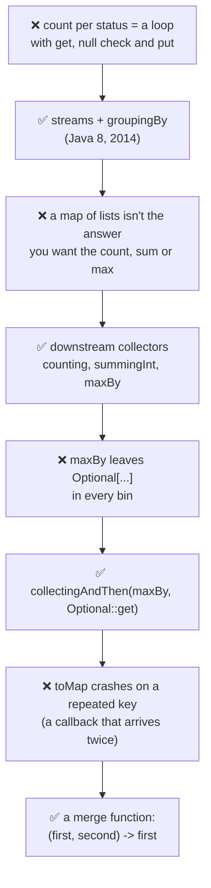
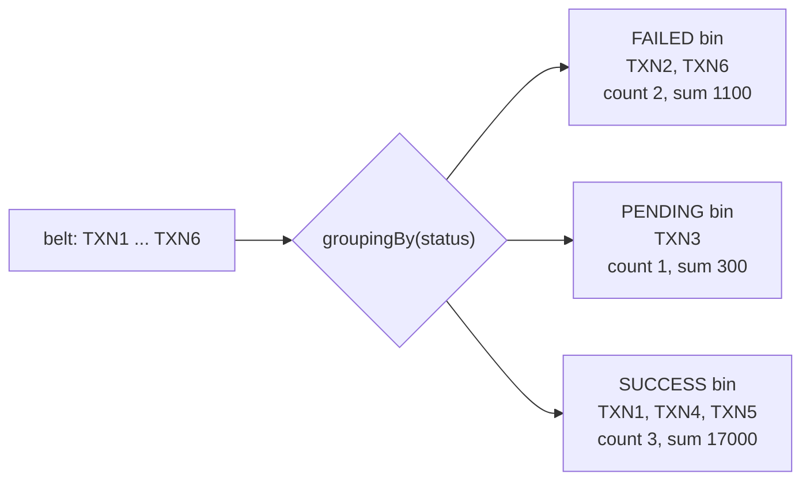
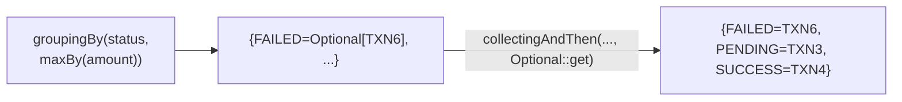
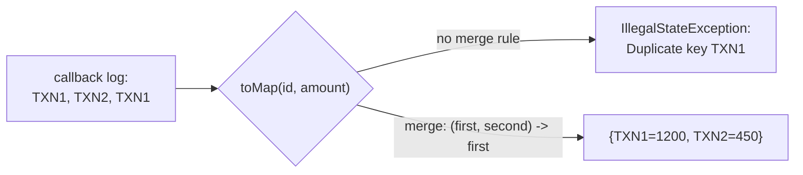
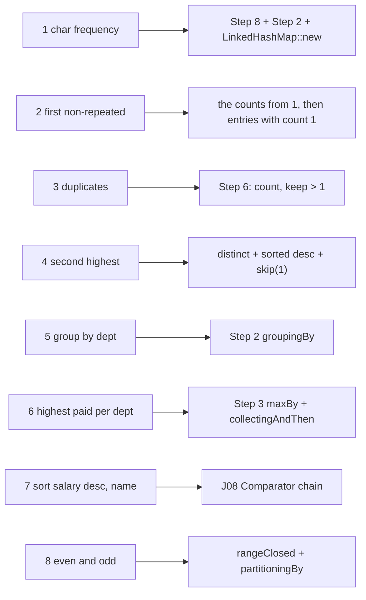
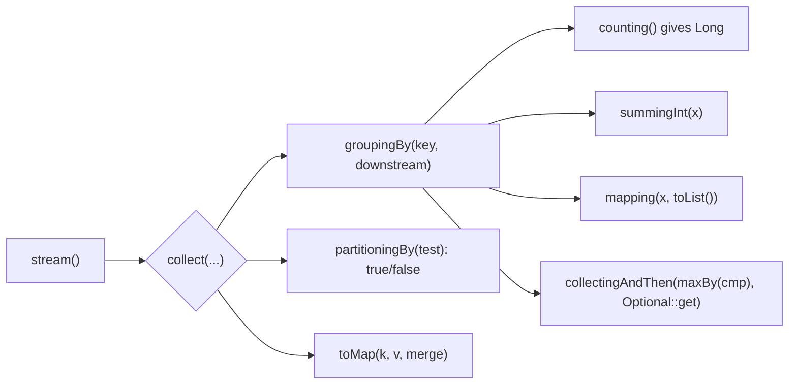

# S00 · Streams toolkit: the collectors you need for the 8 programs

> **In one line:** Most stream interview questions sound like "**group** these, then **count / sum / find the biggest** in each group". The answer is one `collect(...)` call with the right **collector**: `groupingBy`, `counting`, `summingInt`, `maxBy`, `partitioningBy` or `toMap`.

| ⏱️ Read | 🧪 Run | 🎯 Asked |
|---|---|---|
| 14 min | `java 02-java8-streams/S00_StreamsToolkit.java` | The live-coding part of most Java rounds. Practice in [S01](S01_StreamPractice.java) |

---

## 🧬 Why does this exist? The story

Every collector below exists because the loop version was long and easy to get wrong.

1. **❌ The pain (before Java 8):** "count payments per status" took a loop with a map, a `get`, a null check and a `put`.
2. **✅ The fix (Java 8, 2014): streams and `groupingBy`.** One line puts every payment into its bin.
3. **❌ New pain:** a map of **lists** is rarely the answer. You want the count, the total or the biggest per bin.
4. **✅ The fix (Java 8): downstream collectors.** The 2nd argument of groupingBy: `counting()`, `summingInt()`, `maxBy()`, `mapping()`.
5. **❌ New pain:** `maxBy` leaves an `Optional[...]` in every bin, which is ugly in the result.
6. **✅ The fix: `collectingAndThen(maxBy(...), Optional::get)`** unwraps it in the same step.
7. **❌ New pain:** `toMap` crashes when a key repeats, like a gateway callback that arrives twice.
8. **✅ The fix: a merge function,** toMap's 3rd argument, which says which value to keep.

**The same count, before and after Java 8:**

```java
// Before Java 8: a loop, a map and a null check
Map<String, Integer> countByStatus = new HashMap<>();
for (Payment p : payments) {
    Integer old = countByStatus.get(p.status());
    countByStatus.put(p.status(), old == null ? 1 : old + 1);
}

// Java 8: one collect
Map<String, Long> countByStatus = payments.stream()
        .collect(Collectors.groupingBy(Payment::status, Collectors.counting()));
```



👀 **Notice:** later versions kept adding small helpers: `filtering` and `flatMapping` (Java 9), `teeing` (Java 12) and `Stream.toList()` (Java 16).

🧠 **So it's not random:** every collector answers one question the loop made you code by hand: how many, how much, which is biggest, which two groups, and what if a key repeats.

---

This is your **look-up sheet** for the practice file. Learn the tools on these six payments, then write the 8 programs yourself in S01. Come back only after 10 minutes stuck.

| txnId | amount | status | mode |
|---|---|---|---|
| TXN1 | 1,200 | SUCCESS | UPI |
| TXN2 | 450 | FAILED | CARD |
| TXN3 | 300 | PENDING | UPI |
| TXN4 | 15,000 | SUCCESS | NETBANKING |
| TXN5 | 800 | SUCCESS | CARD |
| TXN6 | 650 | FAILED | UPI |

---

## 🧩 Words you need

| Word | In one line |
|---|---|
| **collector** | the "how to gather the results" part of `collect(...)` |
| **groupingBy** | puts items into bins by a key, giving `Map<key, List>` |
| **downstream collector** | the 2nd argument of groupingBy: what to do with each bin (count, sum, max …) |
| **partitioningBy** | exactly two bins: `true` and `false` |
| **merge function** | toMap's rule for "the same key twice" |

---

## 🖼️ Picture it: the post office sorting room



👀 **Notice:** `groupingBy` makes the bins. The **downstream collector** decides what you write on each bin's label: the list, the count, the sum or the biggest.

| Sorting room | Collector |
|---|---|
| bins by PIN code | `groupingBy(Payment::status)` |
| count per bin | `groupingBy(..., counting())` |
| total postage per bin | `groupingBy(..., summingInt(Payment::amount))` |
| keep only the label | `groupingBy(..., mapping(Payment::txnId, toList()))` |
| heaviest parcel per bin | `groupingBy(..., maxBy(comparator))` |
| two bins, "Speed Post: yes / no" | `partitioningBy(p -> p.amount() > 1000)` |
| one register line per tracking number | `toMap(Payment::txnId, Payment::amount)` |

---

## 🔬 How it works, step by step

### Step 1 · `toList()` and `joining()`

```java
PAYMENTS.stream().filter(p -> p.status().equals("SUCCESS")).map(Payment::txnId).toList();
// [TXN1, TXN4, TXN5]
PAYMENTS.stream().map(Payment::txnId).collect(Collectors.joining(", "));
// "TXN1, TXN2, TXN3, TXN4, TXN5, TXN6"
```

`.toList()` is Java 16+. On older Java, write `.collect(Collectors.toList())`.

### Step 2 · `groupingBy` plus a downstream collector

| Call | Result |
|---|---|
| `groupingBy(status)` | {FAILED=[TXN2, TXN6], PENDING=[TXN3], SUCCESS=[TXN1, TXN4, TXN5]} |
| `groupingBy(status, counting())` | {FAILED=**2**, PENDING=**1**, SUCCESS=**3**} |
| `groupingBy(status, summingInt(amount))` | FAILED 450 + 650 = **1,100** · PENDING **300** · SUCCESS 1,200 + 15,000 + 800 = **17,000** |
| `groupingBy(mode, mapping(txnId, toList()))` | {CARD=[TXN2, TXN5], NETBANKING=[TXN4], UPI=[TXN1, TXN3, TXN6]} |

⚠️ `counting()` gives a **Long**, so the map is `Map<String, Long>`. Writing Integer is a classic compile error in live coding.

### Step 3 · The biggest in each bin: `maxBy` and `collectingAndThen`



`maxBy` returns an **Optional**, because in general a stream can be empty. Inside a groupingBy bin there's always at least one item, so unwrapping with `Optional::get` is safe. FAILED gives TXN6 because 650 > 450.

### Step 4 · `partitioningBy`: exactly two bins

```java
partitioningBy(p -> p.amount() > 1_000)               // {false=[TXN2, TXN3, TXN5, TXN6], true=[TXN1, TXN4]}
partitioningBy(p -> p.amount() > 1_000, counting())   // {false=4, true=2}
```

🧠 partitioningBy **always** has both keys, even when one list is empty. groupingBy only has the keys that actually appear.

### Step 5 · `toMap`, and the duplicate-key trap

A gateway callback log where **TXN1 arrives twice**, which is common in payments:



```java
toMap(Payment::txnId, Payment::amount, (first, second) -> first)   // keep the first
```

### Step 6 · Count, then filter the counts; choose the map type

```java
Map<String, Long> countByMode = ...groupingBy(Payment::mode, counting());   // {CARD=2, NETBANKING=1, UPI=3}
countByMode.entrySet().stream()                   // a stream over the map's entries
        .filter(entry -> entry.getValue() > 1)    // used more than once
        .map(Map.Entry::getKey)
        .toList();                                // [CARD, UPI]
```

**Choose the map** with the 3-argument groupingBy:
- `groupingBy(Payment::mode, LinkedHashMap::new, counting())` gives `{UPI=3, CARD=2, NETBANKING=1}`, which is **first-seen order**.
- `TreeMap::new` gives sorted keys.

`Function.identity()` means "the element itself": `toMap(Payment::txnId, Function.identity())` maps each id to the whole Payment.

### Step 7 · Numbers

```java
mapToInt(Payment::amount).sum()                    // 18,400
mapToInt(Payment::amount).summaryStatistics()      // count=6, min=300, max=15000, average=3066.67
map(Payment::amount).sorted(Comparator.reverseOrder()).limit(3)   // [15000, 1200, 800]
IntStream.rangeClosed(1, 5).boxed().toList()       // [1, 2, 3, 4, 5]
```

- `mapToInt` avoids boxing and gives `sum()` and `average()`.
- `boxed()` turns an `int` back into an `Integer`.
- `skip(n)` jumps over n items, and `limit(n)` keeps n.

### Step 8 · A String as a stream of characters

```java
"BBPS".chars()                          // [66, 66, 80, 83]  <- int CODES, not letters!
"BBPS".chars().mapToObj(c -> (char) c)  // [B, B, P, S]
"BBPS".chars().distinct().count()       // 3
```

---

## 🗺️ Hint sheet: which tools for which S01 problem (use it only after 10 minutes)



---

## ⚠️ Traps interviewers love

| Trap | Why it's wrong | Do this instead |
|---|---|---|
| `Map<String, Integer>` with `counting()` | counting returns Long | `Map<String, Long>` |
| toMap with possible duplicate keys | IllegalStateException | add a merge function |
| Expecting order from groupingBy | it builds a HashMap | pass `LinkedHashMap::new` or `TreeMap::new` |
| Leaving maxBy's Optional in the result | an ugly `Optional[...]` value | `collectingAndThen(maxBy(...), Optional::get)` |
| Printing `"BBPS".chars()` expecting letters | you get int codes | `mapToObj(c -> (char) c)` |

---

## 🎯 In the interview (live coding)

**What they're really testing**
- *Service companies:* can you write groupingBy and counting without looking it up.
- *Product companies:* the right collector for the job, the types (`Long`), duplicates in toMap, ordering, and the cost: one pass is O(n), a sort is O(n log n).

**Talk before you type, in this order:**
1. **The shape of the answer:** "I need a map from department to the highest-paid employee."
2. **The collector:** "So groupingBy on department, with maxBy on salary downstream."
3. **The detail:** "maxBy gives an Optional, so I unwrap it with collectingAndThen." Or: "toMap needs a merge function for duplicates." Or: "LinkedHashMap for first-seen order."
4. **The cost:** "One pass, O(n)."

**Sample answer** (simple words):

> "Before Java 8 this was a loop with a map and null checks. Now I stream the payments and collect with groupingBy on status, which gives a map from status to its payments. For counts I pass counting() as the downstream collector, and for totals, summingInt on amount. For the biggest payment per status I use maxBy with a comparator, which returns an Optional, so I wrap it in collectingAndThen with Optional::get. For just two groups, like above or below 1,000, partitioningBy is cleaner. And when I build a map with toMap I remember it throws on duplicate keys, so I give it a merge function."

---

## ❓ Follow-up questions

**groupingBy vs partitioningBy?**
partitioningBy takes a true/false test and always has both keys. groupingBy takes any key and has only the keys that appear.

**`toList()` vs `collect(Collectors.toList())`?**
`toList()` (Java 16) is **unmodifiable**. `Collectors.toList()` gives a normal, changeable list.

**toMap with null values?**
It throws NullPointerException.

*Only if they push further:* `teeing(c1, c2, merger)` (Java 12) runs two collectors in one pass and combines them, for example the min and the max together.

---

## 🧪 Test yourself (answer aloud, then click)

<details><summary>1. What does groupingBy(status, counting()) give on the six payments?</summary>

{FAILED=2, PENDING=1, SUCCESS=3}

</details>

<details><summary>2. What's the total of the FAILED payments, and which collector gives it?</summary>

450 + 650 = 1,100, from groupingBy(status, summingInt(Payment::amount)).

</details>

<details><summary>3. Why does maxBy give Optional values, and how do you remove them?</summary>

A stream could be empty in general. Wrap it: collectingAndThen(maxBy(...), Optional::get).

</details>

<details><summary>4. What does toMap(txnId, amount) do with TXN1 twice?</summary>

It throws IllegalStateException: Duplicate key TXN1. Add (first, second) -> first.

</details>

<details><summary>5. What do "BBPS".chars() and then mapToObj(c -> (char) c) give?</summary>

[66, 66, 80, 83], then [B, B, P, S].

</details>

<details><summary>6. Why do downstream collectors exist? What would you do without them?</summary>

groupingBy alone gives a map of lists. To get counts, totals or the biggest per group, you'd loop over every list again. A downstream collector works it out in the same pass: counting(), summingInt(), maxBy().

</details>

When they all feel easy, tick S00 in the [README](../README.md) and open [S01_StreamPractice.java](S01_StreamPractice.java).

---

## ⚡ Quick Revision (2 hours before the interview)

**🧬 The story:** counting per group took a loop with null checks → **groupingBy** (Java 8) → a map of lists isn't the answer → **downstream collectors** (counting, summingInt, maxBy) → maxBy leaves Optionals → **collectingAndThen** → toMap crashes on a repeated key → **merge function**.



**🧠 Must remember**
1. `groupingBy(key)` gives `Map<key, List>`. The 2nd argument, the **downstream**, says what to do per bin.
2. `counting()` gives a **Long**. `summingInt(f)` gives the sum. `mapping(f, toList())` keeps only f.
3. **Max per group:** `collectingAndThen(maxBy(comparingInt(f)), Optional::get)`.
4. `partitioningBy(test)` always gives **both** false and true.
5. `toMap(k, v)` **throws on duplicate keys**. Add `(a, b) -> a`.
6. **Order:** `groupingBy(key, LinkedHashMap::new, downstream)` for first-seen order, `TreeMap::new` for sorted.
7. **Count, then filter:** `.entrySet().stream().filter(e -> e.getValue() > 1).map(Map.Entry::getKey)`.
8. `str.chars()` gives **int codes**, so use `mapToObj(c -> (char) c)`. `mapToInt(...).sum()`. `IntStream.rangeClosed(1, n).boxed()`.

**⚠️ Top traps**
- Writing `Map<String, Integer>` with counting().
- A toMap with duplicates and no merge rule.
- Expecting order from a plain groupingBy.

**🎯 30-second answer:** "For 'group and aggregate' questions I use collect with groupingBy and a downstream collector: counting for counts, summingInt for totals, maxBy wrapped in collectingAndThen for the biggest per group. partitioningBy for exactly two groups, and toMap with a merge function when keys can repeat. LinkedHashMap::new if the order matters."

**🔑 Memory hook:** *"The post office: groupingBy makes the bins, and the downstream writes the label: count, sum or heaviest. Partitioning is just Yes and No. toMap is the register: decide what to do if a number repeats."*

**🗣️ Say it aloud (no peeking):**
1. Why does groupingBy need a downstream collector? Then write the "highest paid per department" collector from memory.
2. What goes wrong with toMap on a callback log, and how do you fix it?
3. How do you get a character-frequency map in first-seen order?
