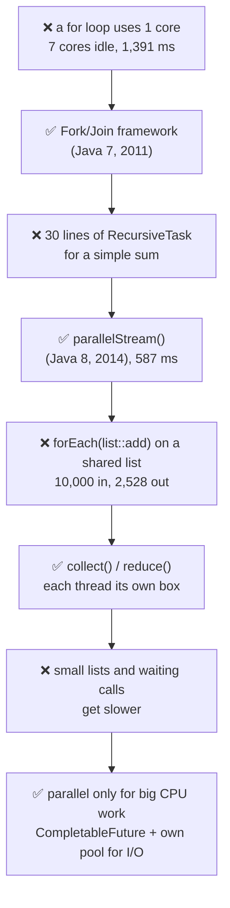
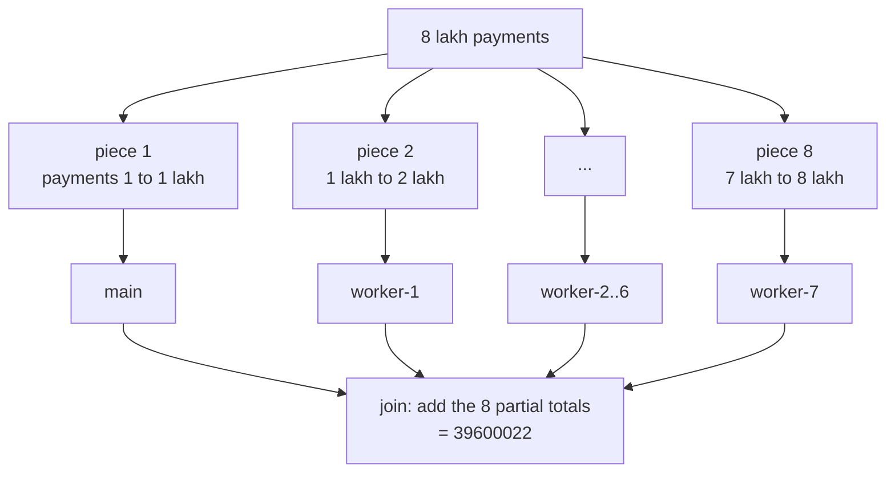
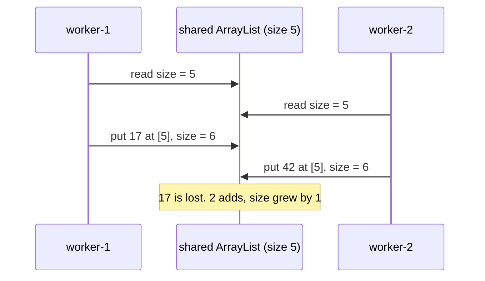
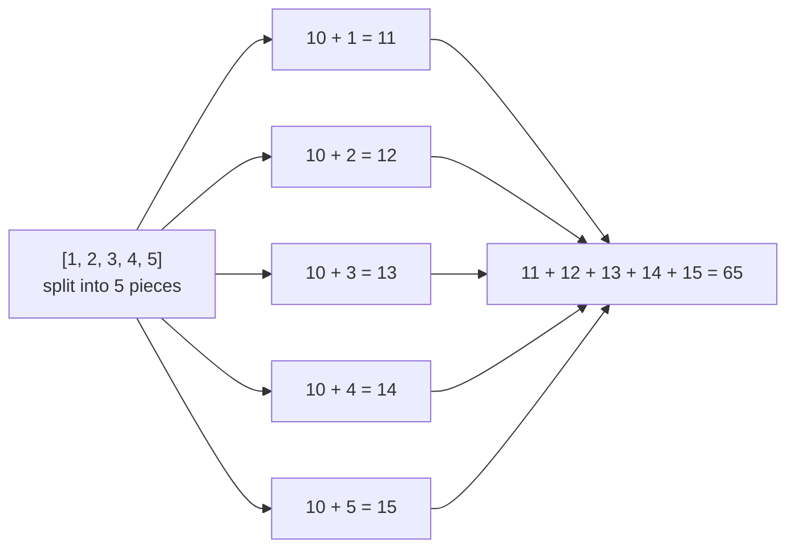
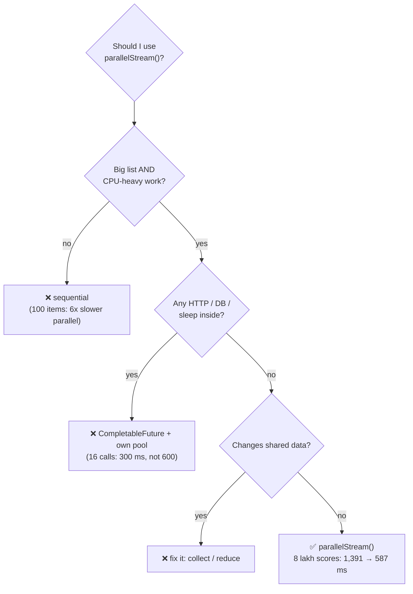

# S03 · Parallel streams: when one word makes it faster, and when it breaks things

> **In one line:** `parallelStream()` splits a list into pieces, works on the pieces on **many CPU cores at once**, then joins the results. It helps only for **big, CPU-heavy, independent** work. It is slower for small lists, wrong with **shared mutable data**, and harmful for **waiting work** like HTTP calls.

| ⏱️ Read | 🧪 Run | 🎯 Asked |
|---|---|---|
| 15 min | `java 02-java8-streams/S03_ParallelStreams.java` | "When would you use parallelStream?" in Java 8 rounds. Product companies push on the common pool, thread safety and "why did it get slower?" |

---

## 🧬 Why does this exist? The story

Why did Java add `parallelStream()`, and why do seniors say "don't use it blindly"? Here's what happened, in order.

### Chapter 1 · One core worked, seven sat idle

**🧑‍💻 What people were doing:** looping over 8 lakh payments to compute a risk score for each, with a normal `for` loop.

**😣 The problem they hit:** laptops and servers now had 8 cores (8 CPU brains). A loop runs on **one** thread, so one core worked and 7 sat idle. The job took 1.4 seconds.

**☕ What the Java team said:** "We'll give you a framework that **splits a big job into small pieces**, runs them on all cores, and **joins** the answers." → **Fork/Join framework (Java 7, 2011)**

**✅ How it solved the problem:** all 8 cores could work together. **But…** you had to write a `RecursiveTask` class (about 30 lines) with split, fork, compute and join. Nobody wanted that for a simple sum.

### Chapter 2 · Fork/Join was too much code

**🧑‍💻 What people were doing:** either writing that 30-line class, or just keeping the slow single-core loop.

**😣 The problem they hit:** the speed was there, but the code was long and easy to get wrong.

**☕ What the Java team said:** "Add **one word** to your stream, and we'll do the splitting and joining for you, on Fork/Join underneath." → **`parallelStream()` and `.parallel()` (Java 8, 2014)**

**✅ How it solved the problem:** 8 lakh risk scores went from **1,391 ms to 587 ms** on this laptop, with the same total. It runs on one shared pool, the **common pool** (Java's built-in Fork/Join pool). **But…** people started using it everywhere, even with code that changes shared data.

### Chapter 3 · Items went missing from a shared list

**🧑‍💻 What people were doing:** `numbers.parallelStream().forEach(list::add)`, adding into one outside `ArrayList`.

**😣 The problem they hit:** many threads called `add()` on the **same** list at once. ArrayList isn't thread-safe (it doesn't stop two threads writing together). Out of 10,000 items they got 2,528, or 4,577, or a crash.

**☕ What the Java team said:** "Don't change outside data. Use **`collect()`** or **`reduce()`**: we'll give each thread **its own** small container and join them at the end." → **collectors and reduce (Java 8)**

**✅ How it solved the problem:** `collect` gives exactly **10,000** every time, with no locks. **But…** parallel still got **slower** for some jobs.

### Chapter 4 · Parallel made things slower

**🧑‍💻 What people were doing:** adding `.parallel()` to small lists, and to code that calls other services.

**😣 The problem they hit:** two kinds of slow.
- A sum of **100 amounts** took about 26,000 ns parallel vs 4,300 ns sequential. Splitting and joining cost more than the work.
- **16 biller calls** of 300 ms took about **600 ms**. The common pool has only 8 threads (7 workers + main), and they just **slept**, waiting. Every other parallel stream in the whole app had to wait too.

**☕ What the Java team said:** "Parallel isn't free. Use it only for **big, CPU-heavy, independent** work. For waiting work, use **`CompletableFuture` with your own pool**." → **the rule of thumb, plus CompletableFuture (Java 8, see J06)**

**✅ How it solved the problem:** the same 16 calls on our own pool of 16 threads took about **300 ms**, and the common pool stayed free.



👀 **Notice:** every fix kept the speed of the one before, and removed one way to hurt yourself.

🧠 **So it's not random:** parallel streams are Fork/Join made easy. That's why they need **independent pieces** that can be split and joined, and why they share **one pool**.

---

## 🧩 Words you need

| Word | In one line |
|---|---|
| **core** | one CPU brain. 8 cores can run 8 threads at the same instant |
| **sequential stream** | the normal stream: one thread, one element after another |
| **parallel stream** | the list is split into pieces, and pieces run on many threads at once |
| **common pool** | `ForkJoinPool.commonPool()`, one pool **shared by the whole JVM**, with cores − 1 threads (7 here) plus the calling thread |
| **split and join** | split: cut the list in halves again and again (a **Spliterator** does it). Join: combine the pieces' answers |
| **stateless / independent** | each element's work doesn't read or change anything shared |

---

## 🖼️ Picture it: checking board exam copies

800 answer sheets arrive. **One teacher** checking alone takes all day (sequential). The head examiner **splits** the pile into stacks for 8 teachers (fork), each one totals their own stack, and the head **adds the 8 totals** (join).



👀 **Notice:** each thread works on **its own piece**. Nobody touches anyone else's piece, so no locks are needed.

| Exam copies | Parallel stream |
|---|---|
| 800 answer sheets | the list |
| the head examiner cutting the pile | Spliterator (split) |
| 8 teachers | the common pool threads + main |
| each teacher's own total | each thread's partial result |
| head adds the 8 totals | join / combiner |
| all 8 teachers writing in **one** register at once | `forEach(list::add)` on a shared ArrayList, entries overwrite |
| a teacher phoning a parent and waiting on hold | a blocking HTTP call: the teacher (thread) is busy doing nothing |
| a pile of 5 copies split among 8 teachers | a small list: splitting takes longer than checking |

---

## 🔬 How it works, step by step

### Step 1 · One word spreads the work

A normal stream uses only the thread that called it. Add `.parallel()` (or call `parallelStream()` on a list), and Java uses the common pool too.

```java
list.stream()            // sequential: main only
list.parallelStream()    // parallel: main + common pool workers
IntStream.range(0, n).parallel()
```

```text
CPU cores on this machine      : 8
common pool parallelism        : 7   (cores - 1, because main also helps)
sequential uses : [main]
parallel uses   : [main, worker-1, worker-2, worker-3, worker-4, worker-5, worker-6]
```

👀 **Notice:** the pool has **cores − 1** workers, because the calling thread (main) also does a piece. Together that's 8 threads for 8 cores.

### Step 2 · Big CPU-heavy work: here it wins

Computing a risk score for 8 lakh payments is pure calculation, with no waiting. That's the perfect job for all 8 cores.

```text
sequential : total 39600022 in 1391 ms
parallel   : total 39600022 in 587 ms   (yours may differ)
same total : true
```

👀 **Notice:** about **2.4× faster**, not 8×. Splitting, joining and thread start-up eat some of the gain. The **answer is the same**.

### Step 3 · Small, cheap work: here it loses

Summing 100 numbers takes a few microseconds. Splitting into pieces and waking up threads costs more than that.

```text
sum = 5050
sequential : about 4277 ns per sum
parallel   : about 25731 ns per sum   (yours may differ)
```

👀 **Notice:** parallel was about **6× slower**. The rule of thumb from the Java team: it pays off only when **N (number of items) × Q (work per item)** is big, roughly over 10,000 "simple operations".

### Step 4 · The trap: changing a shared list

`forEach(list::add)` makes all threads write into **one** ArrayList. ArrayList's `add` does "put at position size, then size++". Two threads can read the same size and overwrite each other, or one grows the array while another writes past its end.



```text
wrong, run 1 : size 2528   (expected 10000)
wrong, run 2 : size 4577   (expected 10000)
wrong, run 3 : crashed with ArrayIndexOutOfBoundsException   (expected 10000)
right, collect      : size 10000
```

```java
// ❌ wrong: shared mutable list
List<Integer> out = new ArrayList<>();
ids.parallelStream().forEach(out::add);

// ✅ right: let the stream build the list
List<Integer> out = ids.parallelStream().toList();   // Java 8: .collect(Collectors.toList())
```

👀 **Notice:** the wrong result **changes every run**, and sometimes it doesn't crash. That's why this bug reaches production. `collect` gives each thread its own list and joins them at the end.

### Step 5 · Order: forEach jumbles it

Threads finish in any order. `forEach` runs each element as soon as its thread gets to it.

```text
forEach        : 6 3 4 5 2 1 8 7   (yours may differ)
forEachOrdered : 1 2 3 4 5 6 7 8
findFirst(>1000) : 1500   (always 1500)
findAny(>1000)   : 4000   (any of 1500, 2500, 4000, 5000)
```

👀 **Notice:** `toList()`, `collect` and `findFirst` still respect the list's order, because Java joins the pieces in order. Only `forEach` and `findAny` don't. `findAny` is faster on parallel, because it takes whichever match comes first.

### Step 6 · The reduce trap: the identity is used once per piece

`reduce(identity, op)` runs on **each piece** starting from the identity, then joins the pieces. So the identity must be **neutral**: 0 for a sum, 1 for a product.

```text
reduce(0, +)  sequential : 15
reduce(0, +)  parallel   : 15
reduce(10, +) sequential : 25   (10 + 15)
reduce(10, +) parallel   : 65   (10 added once per piece: 5 pieces -> 50 + 15)
```



👀 **Notice:** to add a ₹10 base fee, start from **0** and add the 10 **after** the stream. The operation must also be **associative** (grouping doesn't matter): `+` and `max` are fine, `-` is not.

### Step 7 · Waiting work: use your own pool, not a parallel stream

A biller call spends 300 ms **waiting** for the network, not computing. The common pool has only 8 threads, so 16 calls run in 2 rounds.

```mermaid
gantt
    title 16 biller calls of 300 ms each
    dateFormat x
    axisFormat %L ms
    section parallel stream (8 threads)
    calls 1 to 8   :0, 300
    calls 9 to 16  :300, 600
    section own pool of 16
    calls 1 to 16  :0, 300
```



```text
parallel stream (8 threads)       : 16 bills in about 600 ms
CompletableFuture, own pool of 16 : 16 bills in about 300 ms
```

```java
ExecutorService pool = Executors.newFixedThreadPool(16);
List<CompletableFuture<Integer>> calls = billers.stream()
        .map(b -> CompletableFuture.supplyAsync(() -> callBiller(b), pool))
        .toList();
int bills = calls.stream().mapToInt(CompletableFuture::join).sum();
```

👀 **Notice:** the common pool is **shared by the whole JVM**. In a Spring Boot app, if one request's parallel stream sleeps on HTTP calls, every other parallel stream (and `CompletableFuture.supplyAsync` without an executor) waits behind it.

---

## 💻 Code you should be able to write

```java
// ✅ good use: big list, pure CPU work, no shared state
long total = payments.parallelStream()
        .mapToLong(p -> riskScore(p))      // independent, no I/O
        .sum();

// ✅ safe collecting
Map<String, Long> countByStatus = payments.parallelStream()
        .collect(Collectors.groupingByConcurrent(Payment::status, Collectors.counting()));

// ❌ shared list, wrong identity, blocking call
payments.parallelStream().forEach(results::add);
fees.parallelStream().reduce(10, Integer::sum);
billers.parallelStream().map(b -> httpCall(b));
```

**What the demo prints** (from a real run on an 8-core laptop; times will differ):

```text
=== Step 2: 8 lakh payments, a heavy risk score for each ===
sequential : total 39600022 in 1391 ms
parallel   : total 39600022 in 587 ms   (yours may differ)
=== Step 4: the trap, adding to a shared ArrayList ===
wrong, run 1 : size 2528   (expected 10000)
wrong, run 3 : crashed with ArrayIndexOutOfBoundsException   (expected 10000)
right, collect      : size 10000
=== Step 6: the reduce trap, a wrong identity ===
reduce(10, +) parallel   : 65   (10 added once per piece: 5 pieces -> 50 + 15)
=== Step 7: 16 biller calls of 300 ms each ===
parallel stream (8 threads)       : 16 bills in about 600 ms
CompletableFuture, own pool of 16 : 16 bills in about 300 ms
```

---

## ⚠️ Traps interviewers love

| Trap | Why it's wrong | Do this instead |
|---|---|---|
| "parallel is always faster" | 100 amounts: 26,000 ns parallel vs 4,300 ns sequential | use it only for big N × heavy work, and **measure** |
| `forEach(list::add)` into an ArrayList | threads overwrite each other: 2,528 of 10,000, or a crash | `collect(...)` / `toList()` |
| `reduce(10, Integer::sum)` | identity added once per piece: 65, not 25 | identity 0, add the 10 afterwards |
| HTTP or DB calls inside a parallel stream | 8 shared threads just wait; the whole JVM's common pool is blocked | `CompletableFuture.supplyAsync(..., ownPool)` |
| expecting `forEach` to keep order | threads finish in any order: 6 3 4 5 2 1 8 7 | `forEachOrdered`, or collect first |
| `parallelStream()` on a `LinkedList` or `Stream.iterate` | hard to split evenly (must walk node by node) | ArrayList, arrays, `IntStream.range` split well |
| using `synchronized` inside the lambda to "fix" it | threads queue for the lock, so it's sequential again, but slower | remove the shared state |

---

## 🎯 In the interview

**What they're really testing**
- *Service companies:* do you know `parallelStream()` exists, that it uses multiple threads, and that it isn't always faster?
- *Product companies:* the **common ForkJoinPool** and its size, why shared mutable state breaks, the reduce identity/associativity rules, ordering, and why blocking I/O in a parallel stream hurts the whole app.

**Say it in this order** (start with the problem):
1. **Problem:** a normal stream uses one core, so big CPU work leaves the other cores idle.
2. **What it does:** `parallelStream()` splits the data, runs the pieces on the **common ForkJoinPool** (cores − 1 threads plus the caller), then joins the results.
3. **When it helps:** big data, CPU-heavy, independent work. 8 lakh risk scores: 1.4 s → 0.6 s.
4. **When it hurts:** small lists (splitting costs more), and blocking I/O (it ties up the shared pool).
5. **Rules:** no shared mutable state (use `collect`/`reduce`), a neutral identity, an associative operation, and `forEach` loses order.
6. **In practice:** for parallel service calls I use `CompletableFuture` with my own executor. I use parallel streams rarely, and only after measuring.

**Sample answer** (about a minute, in your own words):

> "A normal stream runs on one thread, so on an 8-core machine 7 cores sit idle for heavy work. parallelStream splits the data into pieces, runs them on the common ForkJoinPool, which has cores minus one threads plus the calling thread, and joins the results. For 8 lakh CPU-heavy risk scores it took about 0.6 seconds instead of 1.4. But it's not free. For a small list it's slower, because splitting and joining cost more than the work. The lambdas must not change shared state: forEach adding into an ArrayList loses items or crashes, so I use collect. The reduce identity must be neutral, and the operation associative. And I never put HTTP or DB calls in a parallel stream, because the common pool is shared by the whole JVM. For calling several billers in parallel I use CompletableFuture with my own thread pool. So I use parallel streams only for big CPU-bound work, and I measure first."

**Product-company deep dive:**
- **Q: How many threads does a parallel stream use?**
  **A:** The common pool has `availableProcessors() − 1` workers (7 on 8 cores), and the calling thread joins in. You can change it with `-Djava.util.concurrent.ForkJoinPool.common.parallelism=N`, but that affects the whole JVM.
- **Q: Can I run a parallel stream on my own pool?**
  **A:** A known trick: `myForkJoinPool.submit(() -> list.parallelStream()...).get()` runs it inside that pool. It works, but it relies on an implementation detail. For I/O, CompletableFuture with an executor is the clear choice.
- **Q: How does it split the data?**
  **A:** With a `Spliterator` (Java 8). ArrayList and arrays split in half instantly by index. LinkedList and `iterate` split badly, so parallel gains little.
- **Q: Is `groupingBy` safe on a parallel stream?**
  **A:** Yes, it's correct: each thread builds its own map and the maps are merged. `groupingByConcurrent` writes into one ConcurrentHashMap instead, and skips the merge, but doesn't keep order.

---

## ❓ Follow-up questions

**parallelStream() vs stream().parallel()?**
Same thing. The first is on a collection, the second turns any stream parallel. The **last** `.parallel()` or `.sequential()` call decides for the whole pipeline.

**Does parallel change the result?**
Not if your code follows the rules: no shared state, a neutral identity, an associative operation. Then only the time changes. `forEach` and `findAny` may give a different **order** or element.

**What about virtual threads (Java 21)?**
They are for **waiting** work, like many HTTP calls. Parallel streams are for **CPU** work. Different tools (see J11).

**Parallel stream inside a Spring Boot request?**
Usually avoid it. Many requests share one common pool, so under load they fight for 7 workers.

---

## 🧪 Test yourself (answer aloud, then click)

<details><summary>1. Why did the Java team add parallelStream() when Fork/Join already existed?</summary>

Fork/Join (Java 7) needed a ~30-line RecursiveTask class to split, fork and join. parallelStream (Java 8) does the same splitting and joining on Fork/Join with one word.

</details>

<details><summary>2. On an 8-core machine, how many threads does a parallel stream use?</summary>

The common pool has 7 workers (cores − 1), plus the calling thread (e.g. main) = 8.

</details>

<details><summary>3. 10,000 numbers, parallel().forEach(list::add) into an ArrayList. What size do you get, and why?</summary>

Anything: 2,528, 4,577, or an ArrayIndexOutOfBoundsException. Threads read the same size and overwrite each other's slot. Fix: `toList()` or `collect(Collectors.toList())`.

</details>

<details><summary>4. [1, 2, 3, 4, 5].parallelStream().reduce(10, Integer::sum) printed 65. Why not 25?</summary>

The identity 10 is used once per piece. With 5 pieces: 5 × 10 + 15 = 65. Use 0 as the identity, then add 10 afterwards.

</details>

<details><summary>5. You must call 16 billers (300 ms each). Parallel stream or CompletableFuture?</summary>

CompletableFuture with your own pool of 16: about 300 ms. The parallel stream has 8 threads, so 2 rounds = about 600 ms, and it blocks the JVM-wide common pool while waiting.

</details>

<details><summary>6. Summing 100 numbers: why is parallel slower?</summary>

Splitting the list, waking threads and joining results cost more than adding 100 numbers. Parallel pays off only when N × work-per-item is big.

</details>

---

## ⚡ Quick Revision (2 hours before the interview)

**🧬 The story:** a loop uses 1 core, 7 idle → Fork/Join (Java 7) → too much code → `parallelStream()` (Java 8) → shared ArrayList loses items → `collect`/`reduce` → small lists and HTTP calls get slower → parallel only for big CPU work, `CompletableFuture` + own pool for I/O



**🧠 Must remember**
1. `parallelStream()` = split → work on many threads → join. Built on **Fork/Join (Java 7)**, added in **Java 8**.
2. It uses the **common ForkJoinPool**: **cores − 1** workers (7 on 8 cores) + the calling thread. **Shared by the whole JVM.**
3. Wins only for **big + CPU-heavy + independent** work: 8 lakh risk scores 1,391 ms → 587 ms (about 2.4×, not 8×).
4. Small/cheap work gets **slower**: 100 numbers, 4,300 ns → 26,000 ns.
5. **No shared mutable state:** `forEach(list::add)` gave 2,528 of 10,000, or a crash. Use `collect`/`toList()`.
6. **reduce:** identity must be neutral (0 for +), op associative. `reduce(10, +)` gave 65 instead of 25.
7. **Order:** `forEach` jumbles, `forEachOrdered` / `toList()` / `findFirst` keep order. `findAny` is faster.
8. **Never block** inside it: 16 × 300 ms calls = 600 ms on 8 threads. Own pool of 16 = 300 ms.
9. ArrayList and arrays split well. LinkedList and `Stream.iterate` split badly.

**⚠️ Top traps**
- Adding to an outside ArrayList / HashMap inside the lambda.
- HTTP / DB calls inside a parallel stream (blocks the shared common pool).
- "Parallel is always faster": measure; small lists lose.

**🎯 30-second answer:** "A normal stream uses one core. parallelStream splits the data, runs the pieces on the common ForkJoinPool, which has cores minus one threads plus the caller, and joins the results. It helps for big CPU-heavy work, like 8 lakh risk scores in 0.6 s instead of 1.4. It's slower for small lists, it breaks with shared mutable state, so I use collect, and I never put blocking calls in it because the pool is shared by the whole JVM. For parallel service calls I use CompletableFuture with my own executor."

**🔑 Memory hook:** *Exam copies: 8 teachers, each with their own stack, one adds the totals. Don't make them write in one register, don't give them 5 copies, and don't let them sit on the phone.*

**🗣️ Say it aloud (no peeking):**
1. Why do parallel streams exist? What was the pain before (Java 7 and before)?
2. Which pool do they run on, how many threads, and why is that dangerous in a Spring Boot app?
3. Name 3 cases where parallel gives a wrong answer or is slower, with the numbers.
