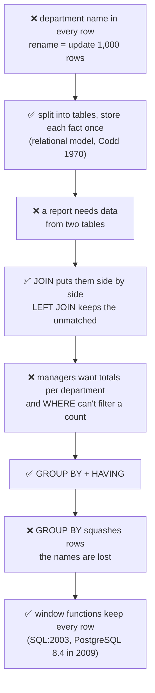
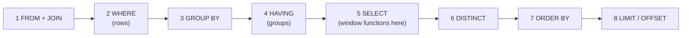
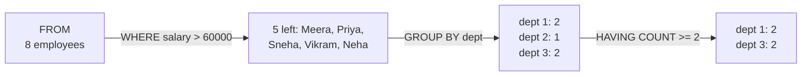
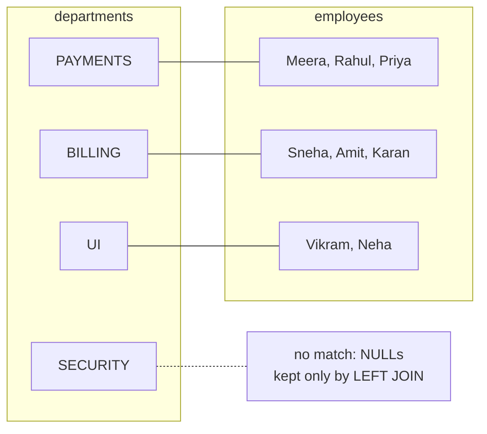
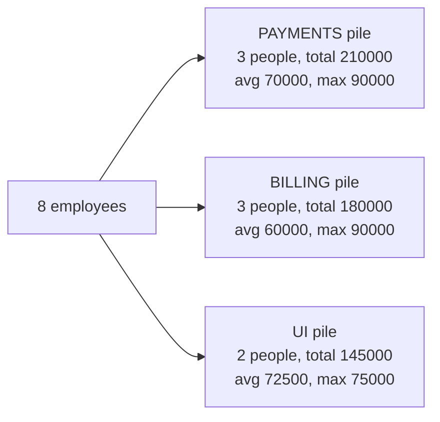
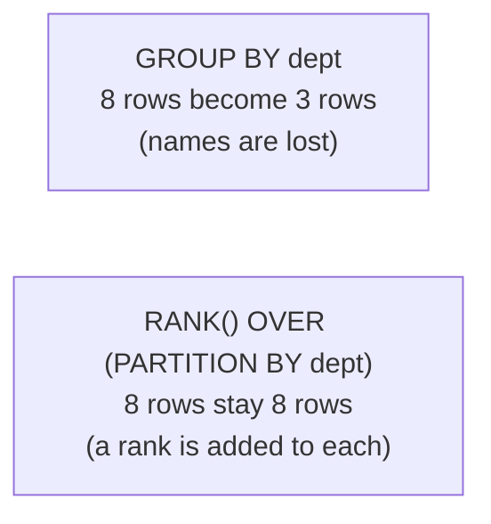

# Q00 · SQL toolkit: how a query really runs, JOINs, GROUP BY/HAVING, window functions

> **In one line:** A query **runs** in a different order from how you **write** it: FROM → WHERE → GROUP BY → HAVING → SELECT → ORDER BY → LIMIT. Once you see that, and how **JOINs**, **GROUP BY**, **window functions** and **NULL** behave, the six classic problems (Q01–Q06) are just these tools combined.

| ⏱️ Read | 🧪 Run | 🎯 Asked |
|---|---|---|
| 15 min | paste [Q00_setup.sql](Q00_setup.sql) into db-fiddle.com (PostgreSQL, left box), then any query below (right box) | Every backend round: "WHERE vs HAVING?", "RANK vs DENSE_RANK?", "types of JOIN?" |

The running example is 8 employees and 4 departments:

| id | name | salary | department | manager |
|---|---|---|---|---|
| 1 | Meera | 90,000 | PAYMENTS | none |
| 2 | Rahul | 40,000 | PAYMENTS | Meera |
| 3 | Priya | 80,000 | PAYMENTS | Meera |
| 4 | Sneha | 90,000 | BILLING | Meera |
| 5 | Amit | 30,000 | BILLING | Sneha |
| 6 | Karan | 60,000 | BILLING | Sneha |
| 7 | Vikram | 70,000 | UI | Meera |
| 8 | Neha | 75,000 | UI | Vikram |

A fourth department, **SECURITY**, has nobody in it yet.

---

## 🧬 Why does this exist? The story

Every SQL tool in this lesson fixes a side effect of the one before it. Here's the story.

### Chapter 1 · The department name in every row

**🧑‍💻 What people were doing:** storing the department name inside every employee row.

**😣 The problem they hit:** renaming "PAYMENTS" meant updating **1,000 rows**. One typo, like "PAYMNETS", created a fake department.

**☕ What E. F. Codd said (1970):** "**Split the data into tables**, store each fact once, and link the tables with ids." → **the relational model**: `employees.department_id` points to `departments.id`

**✅ How it solved the problem:** a rename now changes **1 row**. **But…** a report needs the employee **and** the department name, and they're in two tables now.

### Chapter 2 · The data is in two tables

**🧑‍💻 What people were doing:** writing a report that needs each employee next to their department name.

**😣 The problem they hit:** one query can read only one table at a time.

**☕ What SQL said:** "Use **JOIN** to put matching rows side by side." → **JOIN**, and **LEFT JOIN**, which also keeps rows with no match, like the empty SECURITY department

**✅ How it solved the problem:** one result with both names. **But…** managers want totals, not 8 lines.

### Chapter 3 · Managers want totals

**🧑‍💻 What people were doing:** trying to get the head count and salary total per department.

**😣 The problem they hit:** `WHERE` can't filter on a count, because it runs **before** the groups exist.

**☕ What SQL said:** "**GROUP BY** makes one row per pile, and **HAVING** filters the piles after they're counted." → **GROUP BY + HAVING**

**✅ How it solved the problem:** one summary row per department. **But…** GROUP BY squashes the rows, so the names are lost.

### Chapter 4 · GROUP BY lost the names

**🧑‍💻 What people were doing:** trying to "rank people inside their department".

**😣 The problem they hit:** they needed messy self-joins and subqueries, because GROUP BY throws away the individual rows.

**☕ What SQL said:** "We'll calculate across rows (a rank, an average) and **keep every row**." → **window functions (the SQL:2003 standard; PostgreSQL 8.4 in 2009, MySQL 8.0 in 2018)**. The same versions added **CTEs** (`WITH`), which give each step of a long query a name.

**✅ How it solved the problem:** every row stays, with its rank or average written next to it.



👀 **Notice:** NULL has a small story too. Some values are unknown, like the manager of the CEO, so SQL has **NULL**. But "unknown = unknown" isn't true, so `= NULL` finds nothing, and SQL added **IS NULL** (Step 7).

🧠 **So it's not random:** splitting tables needs JOIN, JOIN gives too many rows so GROUP BY summarizes them, and GROUP BY loses detail so window functions keep it.

---

## 🧩 Words you need

| Word | In one line |
|---|---|
| **JOIN** | puts rows from two tables side by side where a condition matches |
| **aggregate** | a function over many rows that gives one value: COUNT, SUM, AVG, MAX, MIN |
| **GROUP BY** | makes one group ("pile") per value, then one result row per pile |
| **window function** | calculates across rows (rank, average) but **keeps every row** |
| **NULL** | "unknown", not zero and not empty. `NULL = NULL` is not true |

---

## 🖼️ Picture it: an office with two registers

The **staff register** (employees) and the **department register** (departments):
- **JOIN** means laying them side by side and matching lines on the department number.
- **GROUP BY** means making piles by department and writing one summary line per pile.
- **WHERE** crosses out single lines **before** the piles are made. **HAVING** throws away whole piles **after**.
- A **window function** writes a rank next to each person **inside their pile**, and nothing gets merged.

---

## 🔬 How it works, step by step

### Step 1 · The order a query really runs in



Follow one query: **departments with at least 2 people earning more than 60,000**.

```sql
SELECT department_id, COUNT(*) AS people
FROM employees
WHERE salary > 60000
GROUP BY department_id
HAVING COUNT(*) >= 2
ORDER BY department_id;
```



👀 **Notice:** Karan (60,000) is removed by WHERE, because "more than" isn't "equal". BILLING's pile has only 1, so HAVING drops the **whole pile**. The result is **1 → 2** and **3 → 2**.

This order explains three classic errors:
- `COUNT(*)` in **WHERE** is an error, because the piles don't exist yet. Use HAVING.
- A SELECT **alias** in WHERE is an error, because the alias doesn't exist yet at step 2.
- A **window function** in WHERE is an error, because it runs at step 5. Wrap it in a subquery or CTE (Q01, Q02).

### Step 2 · JOINs: which rows survive



| JOIN | Keeps | Head count per department |
|---|---|---|
| `INNER JOIN` | only rows that match on both sides | BILLING 3, PAYMENTS 3, UI 2 (**no SECURITY**) |
| `LEFT JOIN` | every left row, with NULLs where there's no match | BILLING 3, PAYMENTS 3, **SECURITY 0**, UI 2 |
| `RIGHT JOIN` | every right row | the same as LEFT with the tables swapped |
| `FULL JOIN` | every row from both sides | |
| `CROSS JOIN` | every pair | 4 × 8 = **32** rows |
| self join | a table joined to itself | employee → manager (Q05) |

### Step 3 · GROUP BY and the aggregates



```sql
SELECT d.name AS department, COUNT(*) AS people, SUM(e.salary) AS total,
       ROUND(AVG(e.salary), 2) AS average, MAX(e.salary) AS highest, MIN(e.salary) AS lowest
FROM employees e JOIN departments d ON d.id = e.department_id
GROUP BY d.name ORDER BY d.name;
```

⚠️ **The rule:** every selected column must be **in the GROUP BY** or **inside an aggregate**. `SELECT department_id, name, MAX(salary) … GROUP BY department_id` is an error, because each pile has several names (Q02).

### Step 4 · WHERE vs HAVING

| | WHERE | HAVING |
|---|---|---|
| Filters | **rows** | **groups** |
| Runs | **before** GROUP BY | **after** GROUP BY |
| Can use aggregates? | ❌ | ✅ usually does |

Step 1's query used both: `WHERE salary > 60000` removed people, then `HAVING COUNT(*) >= 2` removed BILLING's pile.

### Step 5 · Window functions: rank inside the pile, keep every row



```sql
SELECT name, salary,
       ROW_NUMBER() OVER (ORDER BY salary DESC, name) AS row_num,
       RANK()       OVER (ORDER BY salary DESC)       AS rank_num,
       DENSE_RANK() OVER (ORDER BY salary DESC)       AS dense_rank_num
FROM employees ORDER BY salary DESC, name;
```

| name | salary | ROW_NUMBER | RANK | DENSE_RANK |
|---|---|---|---|---|
| Meera | 90,000 | 1 | 1 | 1 |
| Sneha | 90,000 | 2 | **1** | **1** |
| Priya | 80,000 | 3 | **3** | **2** |
| Neha | 75,000 | 4 | 4 | 3 |
| Vikram | 70,000 | 5 | 5 | 4 |
| Karan | 60,000 | 6 | 6 | 5 |
| Rahul | 40,000 | 7 | 7 | 6 |
| Amit | 30,000 | 8 | 8 | 7 |

👀 **Notice the tie at 90,000:**
- **ROW_NUMBER** never ties (1, 2, 3).
- **RANK** shares the number, then **skips**, like two gold medals with no silver (1, 1, 3).
- **DENSE_RANK** shares the number with **no gaps** (1, 1, 2). That's the one for "Nth highest" (Q01).

**PARTITION BY** restarts the ranking for each department: BILLING gives Sneha 1, Karan 2, Amit 3; PAYMENTS gives Meera 1, Priya 2, Rahul 3; UI gives Neha 1, Vikram 2.

### Step 6 · Subquery vs CTE (`WITH`)

```sql
WITH dept_totals AS (                         -- a named subquery, written first
    SELECT department_id, SUM(salary) AS total
    FROM employees GROUP BY department_id
)
SELECT d.name, t.total
FROM dept_totals t JOIN departments d ON d.id = t.department_id
WHERE t.total > 150000 ORDER BY d.name;
-- BILLING 180000, PAYMENTS 210000   (UI 145000 is filtered out)
```

It gives the same result as a subquery, but it reads top to bottom. `WITH RECURSIVE` can walk a tree (Q05's reporting line).

### Step 7 · NULL: "unknown", not zero

| Query | Result | Why |
|---|---|---|
| `WHERE manager_id = NULL` | **no rows** | NULL = NULL is unknown, not true |
| `WHERE manager_id IS NULL` | Meera | the right way |
| `COUNT(*)` vs `COUNT(manager_id)` | 8 vs **7** | `COUNT(column)` skips NULLs |
| `id NOT IN (1, 2, 3, NULL)` | **no rows** | one NULL makes NOT IN unknown (Q06) |
| `COALESCE(m.name, 'No manager')` | "No manager" for Meera | replaces a NULL (Q05) |

---

## ⚠️ Traps interviewers love

| Trap | Why it's wrong | Do this instead |
|---|---|---|
| `WHERE COUNT(*) > 1` | WHERE runs before grouping | `HAVING COUNT(*) > 1` |
| Selecting a non-grouped column | ambiguous: a pile has many values | group by it, or aggregate it |
| `= NULL` | never true | `IS NULL` |
| `COUNT(*)` after a LEFT JOIN | counts the NULL row as 1 | `COUNT(right_table.id)` |
| RANK for "Nth highest" | it skips numbers after ties | DENSE_RANK |

---

## 🎯 In the interview

**What they're really testing**
- *Service companies:* JOIN types, WHERE vs HAVING, GROUP BY, and writing the 6 classic queries.
- *Product companies:* run order, window functions with ties, NULL traps (NOT IN, COUNT), CTEs, and **why** a query is slow (indexes, EXPLAIN in Q07).

**Say it in this order** (for any SQL theory question):
0. **Why each tool exists:** data is split into tables so each fact is stored once. JOIN puts it back together, GROUP BY summarizes, and window functions summarize without losing rows.
1. **Run order:** FROM/JOIN, WHERE, GROUP BY, HAVING, SELECT, ORDER BY, LIMIT.
2. **JOINs:** INNER keeps only matches. LEFT keeps every left row, with NULLs.
3. **GROUP BY:** one row per group, and every selected column must be grouped or aggregated.
4. **Window functions** keep every row. ROW_NUMBER is unique, RANK has gaps, DENSE_RANK has none.
5. **NULL:** use IS NULL. COUNT(column) skips NULLs. NOT IN with a NULL returns nothing.

**Sample answer** ("WHERE vs HAVING", about 30 seconds):

> "WHERE filters individual rows before grouping, and HAVING filters groups after GROUP BY. For example, to find departments with at least two people earning over 60,000, I put salary > 60000 in WHERE to remove low earners first, then GROUP BY department, then HAVING COUNT(*) >= 2. You can't use COUNT in WHERE, because WHERE runs before the groups exist."

**Product-company deep dive:**
- **Q: DELETE vs TRUNCATE vs DROP?**
  **A:** DELETE removes chosen rows (with WHERE), fires triggers and can roll back. TRUNCATE quickly empties the table. DROP removes the table itself.
- **Q: UNION vs UNION ALL?**
  **A:** UNION removes duplicates, which costs a sort or hash. UNION ALL keeps everything and is faster. Use UNION ALL unless you need de-duplication.
- **Q: Normalization, in one line each?**
  **A:** 1NF: one value per cell. 2NF: every column depends on the whole key. 3NF: no column depends on another non-key column (store `department_id`, not `department_name`).

---

## ❓ Follow-up questions

**PRIMARY KEY vs UNIQUE?**
Both reject duplicates. There's one primary key per table, and it can't be NULL. A table can have many UNIQUE constraints.

**What does a FOREIGN KEY do?**
It makes sure the value exists in the other table: `employees.department_id` must be a real `departments.id`.

**What's a view?**
A saved query you can use like a table. It stores no data itself, unless it's a materialized view.

---

## 🧪 Test yourself (answer aloud, then click)

<details><summary>1. Order these by when they run: SELECT, WHERE, GROUP BY, HAVING, FROM, ORDER BY.</summary>

FROM, WHERE, GROUP BY, HAVING, SELECT, ORDER BY.

</details>

<details><summary>2. After a LEFT JOIN from departments, what does COUNT(e.id) give SECURITY? And COUNT(*)?</summary>

0 and 1.

</details>

<details><summary>3. What are RANK and DENSE_RANK for Priya (80,000), after two people at 90,000?</summary>

RANK 3, DENSE_RANK 2.

</details>

<details><summary>4. What's BILLING's average, and who is above it?</summary>

(90,000 + 30,000 + 60,000) / 3 = 60,000. Only Sneha; Karan equals it.

</details>

<details><summary>5. How many rows does departments CROSS JOIN employees give?</summary>

4 × 8 = 32.

</details>

<details><summary>6. GROUP BY already gives results per department. Why do window functions exist?</summary>

GROUP BY squashes each department into one row, so you lose the names. A window function calculates across the rows (a rank, an average) but keeps every row, so you can show each person next to their rank or their department's average.

</details>

When they all feel easy, tick Q00 in the [README](../README.md) and start [Q01](Q01_nth_highest_salary.sql).

---

## ⚡ Quick Revision (2 hours before the interview)

**🧬 The story:** the same fact repeated in every row → **separate tables** (Codd, 1970) → the data is now in two tables → **JOIN** → too many rows for a report → **GROUP BY + HAVING** → grouping loses the names → **window functions** (SQL:2003, PostgreSQL 8.4).


**🧠 Must remember: the concepts**
1. **Run order:** FROM, WHERE, GROUP BY, HAVING, SELECT, DISTINCT, ORDER BY, LIMIT. So aggregates go in **HAVING**, and window functions need a subquery to filter.
2. **INNER JOIN** keeps matches only. **LEFT JOIN** keeps all left rows (NULLs), so SECURITY shows **0** with `COUNT(e.id)`.
3. **GROUP BY:** every selected column must be grouped or aggregated.
4. **ROW_NUMBER** 1,2,3 · **RANK** 1,1,3 · **DENSE_RANK** 1,1,2. **PARTITION BY** restarts per group.
5. **NULL:** use `IS NULL`. `COUNT(col)` skips NULLs. `NOT IN (…, NULL)` returns nothing. Use `COALESCE` for defaults.

**🧠 Must remember: the six problems in one line each**
| # | Problem | Pattern |
|---|---|---|
| Q01 | Nth highest salary | `DENSE_RANK() OVER (ORDER BY salary DESC)` = N, or `DISTINCT … LIMIT 1 OFFSET N-1`. 2nd = **80,000** |
| Q02 | Highest per department | `MAX` + GROUP BY for the amount. `DENSE_RANK() OVER (PARTITION BY dept …)` = 1 for the person |
| Q03 | Above department average | CTE of `AVG` per dept, joined back, `salary > avg`. Meera, Priya, Sneha, Neha |
| Q04 | Duplicate emails | `GROUP BY email HAVING COUNT(*) > 1`. anu 2, ravi 3 |
| Q05 | Employee + manager | `employees e LEFT JOIN employees m ON m.id = e.manager_id` |
| Q06 | Departments with no employees | `LEFT JOIN … WHERE e.id IS NULL`, or `NOT EXISTS`. SECURITY |

**⚠️ Top traps**
- COUNT in WHERE.
- RANK for "Nth highest".
- A condition on the right table in WHERE turns a LEFT JOIN into an INNER JOIN.

**🎯 30-second answer ("WHERE vs HAVING"):** "WHERE filters rows before grouping; HAVING filters groups after. So salary > 60000 goes in WHERE, and COUNT(*) >= 2 goes in HAVING, because the counts don't exist until GROUP BY has run."

**🔑 Memory hook:** *"Registers side by side (JOIN), piles with one label each (GROUP BY), cross out lines before the piles (WHERE), throw away piles after (HAVING), and write a rank on each line without merging (window)."*

**🗣️ Say it aloud (no peeking):**
1. Walk the "at least 2 people over 60,000" query through the run order, with the numbers.
2. Why do window functions exist? Then RANK vs DENSE_RANK vs ROW_NUMBER, on the 90,000 tie.
3. Why does NOT IN with a NULL return no rows?
