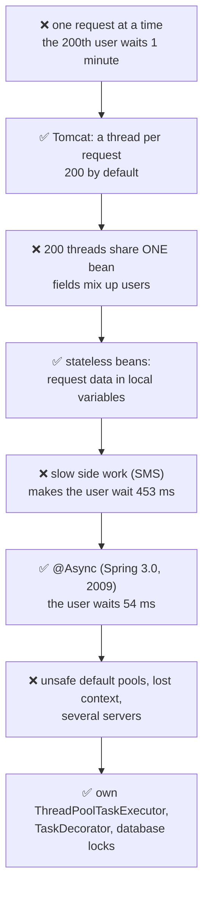
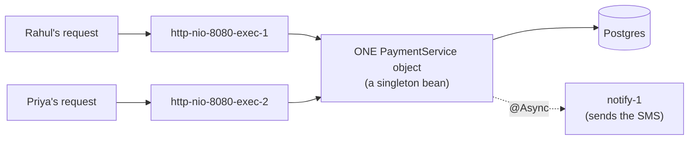
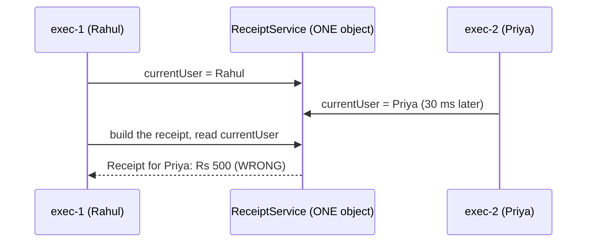
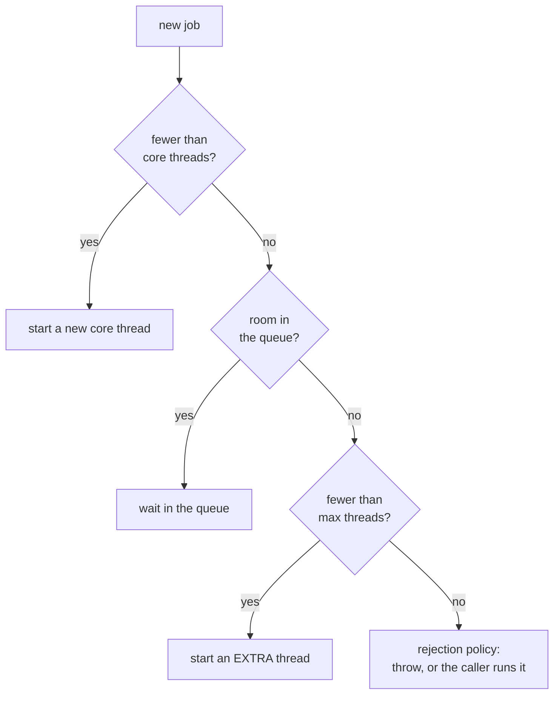
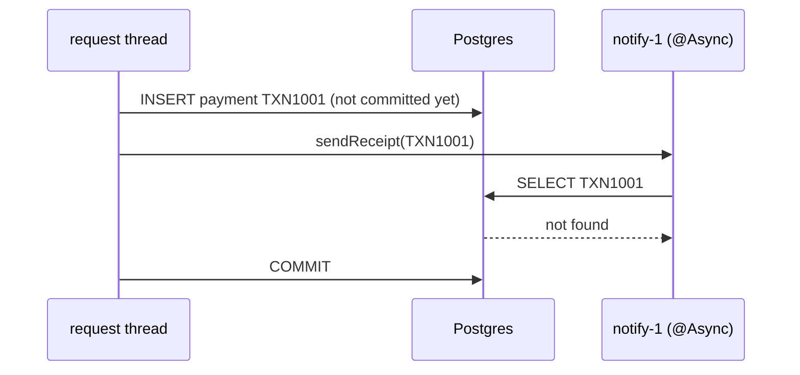
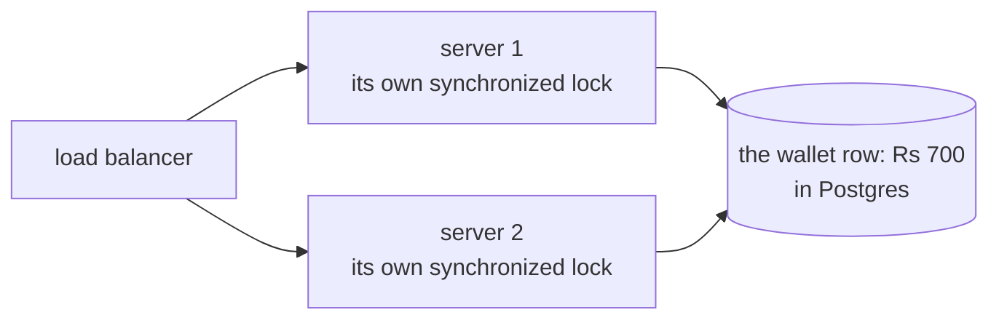
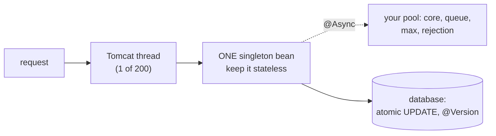

# B13 ⭐ · Multithreading in Spring Boot: request threads, stateless beans, @Async, thread pools, @Scheduled, and locks across servers

> **In one line:** Your Spring Boot app is multithreaded from the very first request. Tomcat runs every request on its own thread (up to 200), and all of them share your singleton beans, so beans must never keep request data in fields. For background work, use **@Async on your own thread pool**. For timed jobs, use **@Scheduled**. For money, lock in the **database**, because `synchronized` protects only one server.

| ⏱️ Read | 🧪 Run | 🎯 Asked |
|---|---|---|
| 25 min | `java 05-spring-boot/B13_MultithreadingInSpringBoot.java` (plain Java: no Spring needed) | "Is your Spring service thread-safe?", "How does @Async work?", "How do you call 3 services in parallel?", "How do you stop a double debit?" |

**Read J13 first** if threads are new to you. This lesson uses its words: thread, race, ThreadLocal, pool.

**About the demo:** Spring isn't installed on this laptop, so the `.java` file copies, in plain Java, what Tomcat and Spring do with your code. The thread names match the real ones. The real Spring code is in this `.md`.

---

## 🧬 Why does this exist? The story

Every Spring threading rule exists because a real server hit a real problem. Here's the story.

### Chapter 1 · One request at a time

**🧑‍💻 What people were doing:** running a server that handles one request at a time.

**😣 The problem they hit:** if each request takes 300 ms, the 200th user waits about **1 minute**.

**☕ What the server builders said:** "Keep a **pool of request threads**, and give each request its own thread." → **Tomcat, 200 threads by default**. Spring Boot has shipped with Tomcat built in since its first version (1.0, 2014).

**✅ How it solved the problem:** 3 requests take about 300 ms, not 900. **But…** all those threads share the same objects.

### Chapter 2 · 200 threads, one shared bean

**🧑‍💻 What people were doing:** saving request data in a field of a Spring bean (an object Spring creates for you).

**😣 The problem they hit:** Spring creates **one** object per bean (a **singleton**), and all 200 threads share it. Another user's request overwrote the field. In the demo, **Rahul's receipt shows Priya's name**.

**☕ What the Spring team said:** "Keep beans **stateless**. Put request data in parameters and local variables, which live on each thread's own stack." → **stateless beans**. Shared state goes into thread-safe types or the database.

**✅ How it solved the problem:** each request's data stays private to its thread. **But…** some work is slow, and the user waits for it.

### Chapter 3 · The user waited for the SMS

**🧑‍💻 What people were doing:** sending the SMS after a payment, on the request thread.

**😣 The problem they hit:** the user waited **453 ms instead of 54**, just for a message they don't need to wait for.

**☕ What the Spring team said:** "Put `@Async` on the method, and we'll hand the call to a thread pool and return at once." → **`@Async` (Spring 3.0, 2009)**

**✅ How it solved the problem:** the user waits 54 ms. **But…** the default setup isn't safe for production.

### Chapter 4 · Production problems

**🧑‍💻 What people were doing:** using the default pools, and `synchronized` for shared data.

**😣 The problem they hit:** the default pools aren't safe for production. Context like the log's trace ID doesn't follow the job to the new thread. And production runs 2 or more copies of the app, where `synchronized` protects only one.

**☕ What the Spring team said:** "Configure **your own** `ThreadPoolTaskExecutor` (a limited queue, named threads), copy the context with a `TaskDecorator`, and lock in the **database**: a version check or `SELECT ... FOR UPDATE`." On Java 21, **Spring Boot 3.2 (2023)** can also run requests on cheap virtual threads.

**✅ How it solved the problem:** safe pools, traceable logs, and correct data even across many servers.



👀 **Notice:** every ✅ box fixes the ❌ box just above it, and then leads to the next ❌.

🧠 **So it's not random:** every Spring threading rule comes from one fact: **many threads, one shared bean, and often more than one server**.

---

## 🧩 Words you need

| Word | In one line |
|---|---|
| **request thread** | the thread Tomcat gives one HTTP request, like `http-nio-8080-exec-7` |
| **singleton bean** | Spring's default: **one** object of your class, shared by every thread |
| **stateless** | keeps no request data in fields, so sharing it is safe |
| **`@Async`** | "run this method on another thread, and let the caller carry on" |
| **`ThreadPoolTaskExecutor`** | Spring's thread pool: a wrapper around Java's `ThreadPoolExecutor` (J06) |
| **`TaskDecorator`** | a hook that wraps every task, for example to copy the trace ID into it |

---

## 🖼️ Picture it: a restaurant with 200 waiters and one kitchen board

- **Tomcat's request threads are waiters.** Each serves one table (one request).
- **A singleton bean is the shared kitchen board.** If a waiter writes "current table: 5" on it, the next waiter overwrites it with "table 9".
- **Keep the table number in your own notepad**, meaning a local variable.
- **`@Async` is handing the dessert order to a helper**, so the waiter can go back to the table at once.
- **Two restaurants share one bank account** (two servers, one database). A lock on one restaurant's door doesn't stop the other restaurant's cashier. Only the bank (the database) can lock the account.



👀 **Notice:** two threads, **one** object. Anything stored in that object's fields is shared by both users.

| Restaurant | Spring Boot |
|---|---|
| a waiter serving one table | a Tomcat request thread |
| the shared kitchen board | a singleton bean's fields |
| the waiter's own notepad | parameters and local variables |
| a helper who takes the dessert order | an `@Async` method on a thread pool |
| the helpers' team and the ticket rail | `ThreadPoolTaskExecutor`: threads plus a queue |
| two restaurants, one bank account | two servers, one database row |

---

## 🔬 How it works, step by step

### Step 1 · Your app is already multithreaded

**The problem:** it's easy to think "I never wrote a thread, so my app is single-threaded". But Tomcat gives every request its own thread.

The demo sends 3 requests of 300 ms each:

```text
GET /bills/ELECTRICITY -> handled by http-nio-8080-exec-1
GET /bills/WATER -> handled by http-nio-8080-exec-2
GET /bills/GAS -> handled by http-nio-8080-exec-3
3 requests answered in 340 ms, not 900: each one had its own thread
```

(The demo measured 329 to 373 ms; the first requests also pay a little JVM warm-up.)

```properties
server.tomcat.threads.max=200       # request threads (the default)
server.tomcat.threads.min-spare=10  # threads kept ready even when idle (the default)
```

👀 **Notice:** Spring Boot's log line shows the thread's name in brackets, cut to 15 characters: `[nio-8080-exec-1]`. Search for it to follow one request through the logs.

### Step 2 · One bean, many threads: keep beans stateless

**The problem:** Spring makes **one** `ReceiptService` object. Rahul's and Priya's request threads use it at the same time.

```java
@Service
public class ReceiptService {
    private String currentUser;                          // ❌ ONE field, shared by every request thread

    public String payAndBuildReceipt(String user, int amount) {
        currentUser = user;                              // Rahul's thread writes "Rahul"
        paymentRepository.save(...);                     // 100 ms: meanwhile Priya's thread writes "Priya"
        return "Receipt for " + currentUser + ": Rs " + amount;
    }
}
```



What the demo printed:

```text
A bean WITH a field:
  Rahul gets: Receipt for Priya: Rs 500   <- WRONG: another user's name!
  Priya gets: Receipt for Priya: Rs 800
A STATELESS bean:
  Rahul gets: Receipt for Rahul: Rs 500
  Priya gets: Receipt for Priya: Rs 800
```

✅ **The fix:** delete the field and use the parameter `user` directly. Parameters and local variables live on each thread's own stack (J09).

🧠 **The rule:** a singleton bean's fields should be `final`, set once at startup, and hold only other beans or settings. Things like `private final PaymentRepository repository` are fine.

### Step 3 · What's safe to share in a Spring app

| Thing | Safe to share? | Why, or what to use instead |
|---|---|---|
| your stateless `@Service`, `@Repository`, `@RestController` | ✅ | no request data in fields |
| injected beans (`private final PaymentRepository repository`) | ✅ | final, and set once at startup |
| `RestTemplate`, `WebClient` | ✅ | safe to share once they're built |
| `ObjectMapper` | ✅ | as long as you don't change its settings after startup |
| `JdbcTemplate`, the injected JPA `EntityManager` | ✅ | the injected EntityManager is a proxy that finds the current thread's transaction |
| a `HashMap` or `ArrayList` field | ❌ | `ConcurrentHashMap` (J05), or better, the database or a cache |
| an `int` or `long` counter field | ❌ | `AtomicLong`, or a Micrometer counter (B11) |
| a `SimpleDateFormat` field | ❌ | it isn't thread-safe; use `DateTimeFormatter`, which is immutable |
| a JPA entity object | ❌ | load it per request; don't share it between threads |

### Step 4 · @Async: do slow side work in the background

**The problem:** after saving a payment (50 ms), sending the SMS takes 400 ms. On the request thread, the user waits for both.

```mermaid
gantt
    title Pay, then send the SMS
    dateFormat x
    axisFormat %L ms
    section without @Async
    save payment (exec-1) :0, 50
    send SMS (exec-1)     :50, 450
    section with @Async
    save payment (exec-1) :0, 50
    send SMS (notify-1)   :50, 450
```



| | The user waited | Where the SMS was sent |
|---|---|---|
| without `@Async` | **452 to 453 ms** | on `http-nio-8080-exec-1`, the user's own request thread |
| with `@Async` | **54 to 59 ms** | on `notify-1`, a pool thread |

```java
@Configuration
@EnableAsync                                         // switches @Async on
public class AsyncConfig { }

@Service
public class NotificationService {
    @Async("notificationExecutor")                   // run on this pool (Step 5), not on the request thread
    public void sendSms(String mobile, String txnId) {
        smsGateway.send(mobile, "Payment " + txnId + " successful");
    }

    @Async("notificationExecutor")
    public CompletableFuture<String> sendEmail(String email, String txnId) {   // when you need a result
        String messageId = emailGateway.send(email, txnId);
        return CompletableFuture.completedFuture(messageId);
    }
}

@Service
public class PaymentService {
    private final NotificationService notifications;  // ANOTHER bean, so the call goes through Spring's proxy

    public PaymentResponse pay(PaymentRequest request) {
        Payment saved = paymentRepository.save(Payment.from(request));
        notifications.sendSms(request.mobile(), saved.getTxnId());   // returns at once
        return PaymentResponse.success(saved.getTxnId());
    }
}
```

**How it works:** Spring wraps `NotificationService` in a **proxy** (J12). Calling `sendSms()` on the proxy hands the real call to the thread pool, and returns straight away.

**The rules, each with its reason:**
1. **Call it from another bean.** `this.sendSms()` skips the proxy, so it runs on the same thread. It's the same trap as `@Transactional` (B05).
2. **Make the method public.** The proxy works on public methods; that's the safe rule.
3. **Return `void` or `CompletableFuture<T>`.** Only a future can carry a result back.
4. **Exceptions:** an exception in a `void` @Async method never reaches the caller. Log it with an `AsyncUncaughtExceptionHandler`. With a `CompletableFuture`, the caller sees it (J06).
5. **It isn't guaranteed.** Jobs waiting in the pool's queue are lost if the app restarts. For work that must happen, like a refund, use RabbitMQ (M03) or an "outbox" table in the database.

### Step 5 · Your own thread pool: the 4 settings

**The problem:** the default pools aren't safe for production:
- In plain Spring (without Boot), `@Async` falls back to `SimpleAsyncTaskExecutor`, which makes a **new thread for every call**. 10,000 SMS means 10,000 threads.
- Spring Boot's default pool (`applicationTaskExecutor`) has **8 threads and a queue with no limit**. With a slow SMS gateway, the queue grows until memory runs out.

So define your own pool:

```java
@Bean(name = "notificationExecutor")
public ThreadPoolTaskExecutor notificationExecutor() {
    ThreadPoolTaskExecutor executor = new ThreadPoolTaskExecutor();
    executor.setCorePoolSize(2);                          // threads that are always there
    executor.setQueueCapacity(2);                         // jobs that can wait: keep it LIMITED
    executor.setMaxPoolSize(4);                           // extra threads, used ONLY when the queue is full
    executor.setThreadNamePrefix("notify-");              // shows in the logs as [notify-1]
    executor.setRejectedExecutionHandler(new ThreadPoolExecutor.CallerRunsPolicy());   // full? the caller runs it
    executor.setWaitForTasksToCompleteOnShutdown(true);   // on shutdown, finish the running jobs
    executor.setAwaitTerminationSeconds(30);
    return executor;
}
```

The small numbers (2, 2, 4) match the demo. Real values depend on your load, for example core 10, max 20 and a queue of 500. Measure them.

**How a pool decides what to do with a new job:**



The demo sends 8 jobs of 300 ms each to a pool with core 2, queue 2 and max 4:

```text
job 1: runs at once on thread 1 (a core thread)
job 2: runs at once on thread 2 (a core thread)
job 3: waits in the queue (1 of 2)
job 4: waits in the queue (2 of 2)
job 5: runs at once on thread 3 (an EXTRA thread, only because the queue was full)
job 6: runs at once on thread 4 (an EXTRA thread, only because the queue was full)
job 7: REJECTED (all 4 threads busy and the queue is full)
job 8: REJECTED (all 4 threads busy and the queue is full)
job 7 with CallerRunsPolicy: ran on 'main', and the caller was busy for 304 ms
```

👀 **Notice the classic surprise:** extra threads start only when the **queue is full**, not when the core threads are busy. With Spring Boot's unlimited default queue, the max size is **never** used.

| When the pool is full (a rejection policy) | What happens |
|---|---|
| `AbortPolicy` (the default) | it throws. Spring throws `TaskRejectedException` |
| `CallerRunsPolicy` | the caller (the request thread) runs the job itself. That request gets slower, but nothing is lost. This is called back-pressure |
| `DiscardPolicy`, `DiscardOldestPolicy` | a job is silently dropped. That's dangerous for payments |

You can also set Spring Boot's default pool with properties:

```properties
spring.task.execution.pool.core-size=10
spring.task.execution.pool.max-size=20
spring.task.execution.pool.queue-capacity=500
spring.task.execution.thread-name-prefix=task-
```

### Step 6 · Calling 3 billers at once, the Spring way

**The problem:** fetching bills from ELECTRICITY, WATER and GAS one by one takes about 900 ms. In parallel it takes about 300 (J06 measured 902 ms vs 303 ms).

```java
@Service
public class BillService {
    private final BillerClient billerClient;
    private final Executor billerExecutor;       // a ThreadPoolTaskExecutor bean, like in Step 5

    public BillService(BillerClient billerClient, @Qualifier("billerExecutor") Executor billerExecutor) {
        this.billerClient = billerClient;
        this.billerExecutor = billerExecutor;
    }

    public int totalDue(List<String> billers) {
        List<CompletableFuture<Integer>> calls = billers.stream()
                .map(biller -> CompletableFuture
                        .supplyAsync(() -> billerClient.fetchAmount(biller), billerExecutor)  // OUR pool, not the common pool
                        .orTimeout(2, TimeUnit.SECONDS)                                        // a slow biller can't hang us
                        .exceptionally(error -> 0))                                            // a failed biller: 0 for now
                .toList();
        return calls.stream().mapToInt(CompletableFuture::join).sum();   // 1200 + 450 + 300 = 1950, in about 300 ms
    }
}
```

**Why your own executor?** Without one, `supplyAsync` uses the shared `ForkJoinPool.commonPool()`, which is sized to the CPU cores. Blocking HTTP calls there slow down everything else that uses it (J06).

### Step 7 · The context doesn't follow the job to another thread

**The problem:** Spring keeps per-request things in **ThreadLocals** (J13 Step 11):

| What | Where Spring keeps it |
|---|---|
| the trace ID in your logs | SLF4J's `MDC` |
| the logged-in user | `SecurityContextHolder` |
| the current `@Transactional` transaction and its DB connection | `TransactionSynchronizationManager` |
| the current HTTP request | `RequestContextHolder` |

A job on another thread starts with **none** of them. The demo:

```text
  [traceId=req-7f3a] http-nio-8080-exec-1: payment TXN1001 saved
  [traceId=null] notify-1: sending SMS (plain @Async)
  [traceId=req-7f3a] notify-1: sending SMS (@Async with a TaskDecorator)
```

✅ **The fix for logs:** a `TaskDecorator`. It copies the MDC when the job is handed over, and clears it afterwards:

```java
public class MdcTaskDecorator implements TaskDecorator {
    @Override
    public Runnable decorate(Runnable task) {
        Map<String, String> context = MDC.getCopyOfContextMap();   // read on the REQUEST thread
        return () -> {
            if (context != null) {
                MDC.setContextMap(context);                         // set on the POOL thread
            }
            try {
                task.run();
            } finally {
                MDC.clear();                                        // pool threads are reused
            }
        };
    }
}
// in the executor bean: executor.setTaskDecorator(new MdcTaskDecorator());
```

- **For the logged-in user:** wrap the executor in Spring Security's `DelegatingSecurityContextAsyncTaskExecutor`.
- **For the transaction:** it can't be copied. An `@Async` method runs **outside** the caller's transaction, so give it its own `@Transactional` if it writes to the database.

⚠️ **The timing trap:** an `@Async` job started inside a `@Transactional` method can run **before** the caller commits, so it can't find the new payment:



✅ Start it **after** the commit: publish an event, and handle it with `@TransactionalEventListener` (its default phase is AFTER_COMMIT), plus `@Async` on that listener.

### Step 8 · @Scheduled: jobs that run on a timer

**The problem:** some work runs on a clock. For example, check PENDING payments every 5 minutes, or reconcile with the bank every night (P03).

```java
@Configuration
@EnableScheduling                                       // switches @Scheduled on
public class SchedulingConfig { }

@Component
public class PaymentJobs {
    @Scheduled(fixedDelay = 300_000)                    // 5 minutes after the last run ENDED
    public void checkPendingPayments() { ... }

    @Scheduled(cron = "0 0 2 * * *", zone = "Asia/Kolkata")   // every night at 2:00 AM
    public void reconcile() { ... }
}
```

- `fixedRate`: start every N ms, counted from start to start.
- `fixedDelay`: wait N ms after the previous run **ends**. It's safer for slow jobs.

⚠️ **Spring Boot's scheduler has just 1 thread by default,** so one slow job makes all the others late:

| Scheduler threads | The status-check job, due at 100 ms, started at |
|---|---|
| 1 (the default) | **616 to 634 ms**: LATE, because the only thread was busy with the 600 ms reconciliation |
| 2 (`spring.task.scheduling.pool.size=2`) | **110 to 114 ms**: on time, on `scheduling-2` |

⚠️ **With 3 servers, every @Scheduled job runs 3 times**, once on each server. The fixes:
- **ShedLock:** a lock row in the database, so only one server runs the job. `@SchedulerLock(name = "checkPendingPayments", lockAtMostFor = "10m")`.
- **`SELECT ... FOR UPDATE SKIP LOCKED`** (PostgreSQL): each server picks different PENDING rows, and none gets the same row twice.

### Step 9 · RabbitMQ listeners are threads too

**The problem:** one consumer thread handles payment callbacks one by one, and they pile up.

```properties
spring.rabbitmq.listener.simple.concurrency=3       # start with 3 consumer threads
spring.rabbitmq.listener.simple.max-concurrency=10  # grow up to 10 when busy
spring.rabbitmq.listener.simple.prefetch=10         # messages each consumer holds at a time (the default is 250)
```

Or on one listener: `@RabbitListener(queues = "payment-callbacks", concurrency = "3-10")`.

**What that means for your code:**
- The listener bean is **one** object used by 3 to 10 threads, so keep it stateless (Step 2).
- Messages are processed in parallel, so their order isn't guaranteed. If order matters, check the payment's status or version in the database before updating it.
- The same message can arrive twice (a redelivery), so make the handler idempotent (M03, M07, P02).

### Step 10 · The biggest trap: `synchronized` protects one server, not three

**The problem:** production runs 2 or more copies of your app (pods) behind a load balancer. Two debits for the same wallet can land on **different** servers. Each server has its own `synchronized` lock, so they never block each other.



The demo: a wallet of Rs 700, and 2 servers debit Rs 100 and Rs 200 at the same time:

```text
synchronized on each server : balance Rs 500 (should be Rs 400: the Rs 100 debit was LOST)
version check in the DB     : balance Rs 400 (right), retries: server-1 0, server-2 1
```

✅ **The fixes all live in the database** (Q07):

```java
// 1. One atomic UPDATE: the database checks and subtracts in one step
@Modifying
@Query("UPDATE Wallet w SET w.balance = w.balance - :amount WHERE w.id = :id AND w.balance >= :amount")
int debit(@Param("id") long id, @Param("amount") int amount);     // returns 0 if the balance was too low

// 2. Optimistic locking: JPA adds "AND version = ?" to every UPDATE
@Entity
public class Wallet {
    @Id private Long id;
    private int balance;
    @Version private int version;   // a stale update fails with ObjectOptimisticLockingFailureException: retry
}

// 3. Pessimistic locking: a row lock (SELECT ... FOR UPDATE); the other server waits for it
@Lock(LockModeType.PESSIMISTIC_WRITE)
@Query("SELECT w FROM Wallet w WHERE w.id = :id")
Optional<Wallet> findByIdForUpdate(@Param("id") long id);
```

👀 **Notice:** `synchronized` is still fine for data that lives inside **one** JVM, like an in-memory cache. For anything in the database, let the database do the locking. For a shared resource that isn't in a database, use a distributed lock (Redis, or ShedLock's lock table).

### Step 11 · Virtual threads in Spring Boot 3.2+

**The problem:** 200 request threads. Each one blocked on a database or HTTP call just waits, and request number 201 has to wait for a free thread.

```properties
spring.threads.virtual.enabled=true   # needs Java 21+ and Spring Boot 3.2+
```

**What changes:** Tomcat runs each request on a new virtual thread, and the default `@Async` executor and the scheduler use virtual threads too. J11 measured 1,000 waiting tasks: about **2,000 ms** on 50 normal threads vs **111 to 162 ms** on virtual threads.

**What doesn't change:**
- The limits move somewhere else. The database connection pool (HikariCP, **10 connections** by default) becomes the real limit: 1,000 virtual threads still share 10 connections.
- On Java 21 to 23, a virtual thread blocked inside `synchronized` holds on to its carrier thread ("pinning"). Java 24 fixed that (J11).
- Don't pool virtual threads, because they're cheap to create. Use a `Semaphore` (J13) to limit calls to a slow biller instead.

### Step 12 · How to talk about it from your project (only what's true)

Pick **only the rows you really did**, and say them with your real numbers:

| If you did this | You could say |
|---|---|
| sent the SMS or email after a payment | "We sent the payment SMS with @Async on a separate pool, so the API answered without waiting for the SMS gateway." |
| called several billers or gateways at once | "We fetched bills from several billers in parallel with CompletableFuture on our own executor, with a timeout per biller." |
| ran a job for PENDING payments | "A @Scheduled job checked PENDING payments every few minutes. With several instances, we used ShedLock so only one ran it." |
| consumed RabbitMQ callbacks | "Our RabbitMQ listener ran with a concurrency of 3 to 10, and the handler was idempotent, because messages can be redelivered." |
| stopped double debits | "We prevented double debits in the database, with an atomic UPDATE or @Version, not with synchronized, because we ran several pods." |

If you haven't done one of these, say so: *"I haven't needed it in production, but here's how I'd do it,"* and then explain. Interviewers respect that far more than a made-up story.

---

## 💻 Code you should be able to write

```java
// 1. Turn @Async on, give it a limited, named pool, and call it from ANOTHER bean
@Configuration
@EnableAsync
public class AsyncConfig {
    @Bean(name = "notificationExecutor")
    public ThreadPoolTaskExecutor notificationExecutor() {
        ThreadPoolTaskExecutor executor = new ThreadPoolTaskExecutor();
        executor.setCorePoolSize(10);
        executor.setMaxPoolSize(20);
        executor.setQueueCapacity(500);                 // limited, so memory can't run out
        executor.setThreadNamePrefix("notify-");
        executor.setRejectedExecutionHandler(new ThreadPoolExecutor.CallerRunsPolicy());
        executor.setTaskDecorator(new MdcTaskDecorator());   // keeps the trace ID in the logs
        return executor;
    }
}

@Service
public class NotificationService {
    @Async("notificationExecutor")
    public void sendSms(String mobile, String txnId) { ... }
}

// 2. A stateless service: request data only in parameters and local variables
@Service
public class ReceiptService {
    private final PaymentRepository repository;         // fine: another bean, final
    public String buildReceipt(String user, int amount) { return "Receipt for " + user + ": Rs " + amount; }
}
```

**What the demo prints** (from a real run, trimmed):

```text
3 requests answered in 340 ms, not 900: each one had its own thread
  Rahul gets: Receipt for Priya: Rs 500   <- WRONG: another user's name!
without @Async: the user waited 453 ms
with @Async   : the user waited 54 ms (the SMS is still on its way)
job 5: runs at once on thread 3 (an EXTRA thread, only because the queue was full)
job 7: REJECTED (all 4 threads busy and the queue is full)
  [traceId=null] notify-1: sending SMS (plain @Async)
  status-check job, due at 100 ms, started at 616 ms on scheduling-1   <- LATE: the only thread was busy
synchronized on each server : balance Rs 500 (should be Rs 400: the Rs 100 debit was LOST)
version check in the DB     : balance Rs 400 (right), retries: server-1 0, server-2 1
```

---

## ⚠️ Traps interviewers love

| Trap | Why it's wrong | Do this instead |
|---|---|---|
| A field with request data in a singleton bean | every request thread shares it, so users see each other's data | parameters and local variables |
| Calling an `@Async` method from the same class | it skips the proxy and runs on the same thread | call it from another bean |
| `@Async` with the default pool | without Boot: a new thread per call. With Boot: an unlimited queue | your own `ThreadPoolTaskExecutor` with a limited queue |
| An exception in a `void` `@Async` method | it never reaches the caller | an `AsyncUncaughtExceptionHandler`, or return a `CompletableFuture` |
| Expecting `@Async` to join the caller's transaction | it runs on another thread, outside that transaction | its own `@Transactional`, started after the commit |
| One scheduler thread | a slow job delays every other job | `spring.task.scheduling.pool.size` |
| `synchronized` to stop double debits | it protects one JVM, and production runs several | an atomic UPDATE, `@Version` or `SELECT ... FOR UPDATE` |
| `@Async` for work that must never be lost | the queue lives in memory, so a restart loses it | RabbitMQ, or an outbox table |

---

## 🎯 In the interview

**What they're really testing**
- *Service companies:* whether singleton beans are thread-safe, @Async and @EnableAsync basics, and @Scheduled.
- *Product companies:* pool sizing and rejection, passing context (MDC, security) to other threads, @Async with transactions, locking across several instances, idempotent consumers, and virtual threads.

**Say it in this order** (start with the problem):
1. **Already multithreaded:** Tomcat runs every request on its own thread, 200 by default.
2. **Singleton beans are shared,** so they must be stateless: request data in parameters and local variables, and shared state in thread-safe types or the database.
3. **@Async** for side work like the SMS, on my own ThreadPoolTaskExecutor with a limited queue, called from another bean, and returning a CompletableFuture if I need the result.
4. **Parallel calls:** `CompletableFuture.supplyAsync` on my own executor, with timeouts.
5. **Context:** MDC, security and transactions live in ThreadLocals. I copy MDC with a TaskDecorator, and async work gets its own transaction, after the commit.
6. **@Scheduled** needs more than 1 thread, and a lock (ShedLock) when several instances run.
7. **Money:** synchronized protects only one JVM, so I lock in the database: an atomic UPDATE, @Version, or FOR UPDATE.

**Sample answer** (about a minute, in your own words):

> "A Spring Boot app is multithreaded by default, because Tomcat handles each request on its own thread, from a pool of 200. Beans are singletons, so all those threads share the same service object. That's why I keep services stateless: request data stays in method parameters and local variables. For slow side work, like sending the SMS after a payment, I use @Async with my own ThreadPoolTaskExecutor, with a limited queue and a CallerRuns policy, so the API responds in about 50 milliseconds instead of waiting for the SMS gateway. To call several billers at once, I use CompletableFuture.supplyAsync with my executor and a timeout. The MDC trace ID, the security context and the transaction are thread-local, so I copy the MDC with a TaskDecorator, and async work runs in its own transaction after the commit. And for money, synchronized isn't enough, because we run several instances. So I use an atomic update, or optimistic locking with @Version, in the database."

**Product-company deep dive:**
- **Q: How do you size the pools?**
  **A:** Tomcat's 200 is fine for most apps; watch the active threads in the metrics (B11). For I/O-heavy @Async work, use more threads. But the database pool is often the real limit: HikariCP has 10 connections by default, so 50 threads just queue for those 10.
- **Q: What happens when all 200 Tomcat threads are busy?**
  **A:** New requests wait until a thread is free, so the API slows down for everyone. A slow downstream call, like a slow biller, can tie up all 200 threads. That's why timeouts and circuit breakers matter (M05).
- **Q: @Async vs CompletableFuture vs RabbitMQ?**
  **A:** @Async is simple fire-and-forget inside one app, lost on a restart. CompletableFuture is for results you need to combine right now. RabbitMQ is for work that must survive a restart, or run in another service.
- **Q: How does @Async work inside?**
  **A:** `@EnableAsync` makes Spring wrap the bean in a proxy. The proxy hands each call to the executor, and returns at once, with nothing or with a future (J12).

---

## ❓ Follow-up questions

**Are Spring beans thread-safe?**
Spring doesn't make them thread-safe. A singleton bean is shared by every thread, so it's safe only if it's stateless.

**Request scope and prototype scope?**
A request-scoped bean gets a new object for every HTTP request. A prototype bean gets a new object every time it's injected (B03). You rarely need either if your services are stateless.

**How do you test async code?**
In tests, wait for the result with `CompletableFuture.get(timeout)` or a `CountDownLatch`. The Awaitility library makes "wait until this becomes true" checks easy.

*Only if they push further:* **WebFlux** uses a few event-loop threads, one per CPU core, instead of 200. The rule there is to never block those threads. It's a different model from everything above.

---

## 🧪 Test yourself (answer aloud, then click)

<details><summary>1. Your controllers never create threads. Is your app multithreaded?</summary>

Yes. Tomcat runs every request on its own thread, 200 by default.

</details>

<details><summary>2. A @Service has private String currentUser, and each request sets it. What goes wrong?</summary>

All request threads share the one bean, so another request overwrites the field. In the demo, Rahul's receipt said Priya.

</details>

<details><summary>3. PaymentService calls this.sendSms(), and sendSms is @Async in the same class. Which thread sends the SMS?</summary>

The request thread. Calling a method on "this" skips Spring's proxy, so @Async does nothing.

</details>

<details><summary>4. A pool has core 2, queue 2 and max 4. 8 jobs of 300 ms arrive at once. What happens to jobs 3, 5 and 7?</summary>

Job 3 waits in the queue. Job 5 gets an extra thread, because the queue is full. Job 7 is rejected, or runs on the caller with CallerRunsPolicy.

</details>

<details><summary>5. Spring Boot's default @Async pool has an unlimited queue. When does it start an extra thread?</summary>

Never. Extra threads start only when the queue is full.

</details>

<details><summary>6. Your @Async SMS logs show traceId=null. Why, and what's the fix?</summary>

MDC is a ThreadLocal, and the pool thread never had the value. Copy it into the job with a TaskDecorator.

</details>

<details><summary>7. An @Async job started inside a @Transactional method can't find the new payment. Why?</summary>

It ran before the caller committed. Start it after the commit, with @TransactionalEventListener (AFTER_COMMIT).

</details>

<details><summary>8. Two @Scheduled jobs: one takes 10 minutes, and the other keeps running late. Why?</summary>

Spring Boot's scheduler has 1 thread by default. Set spring.task.scheduling.pool.size.

</details>

<details><summary>9. Your app runs on 3 pods. Does synchronized on debit() stop a double debit?</summary>

No. Each pod has its own lock (the demo ended at Rs 500 instead of Rs 400). Use an atomic UPDATE, @Version, or SELECT ... FOR UPDATE.

</details>

<details><summary>10. Tomcat already gives every request a thread. Why does @Async exist?</summary>

The request thread belongs to the user. While it sends the SMS, the user waits (453 ms). @Async moves the side work to another pool, so the answer goes back at once (54 ms).

</details>

If you get stuck on one, add it to [STUMBLE-LIST.md](../STUMBLE-LIST.md). When they all feel easy, tick B13 in the [README](../README.md).

---

## ⚡ Quick Revision (2 hours before the interview)

**🧬 The story:** one request at a time is too slow → **Tomcat: a thread per request** (200) → 200 threads share ONE bean, so fields mix up users → **stateless beans** → slow side work makes users wait (453 ms) → **@Async** (Spring 3.0): 54 ms → unsafe default pools, lost context, several servers → **your own ThreadPoolTaskExecutor + TaskDecorator + database locks**.



**🧠 Must remember**
1. **Tomcat** runs every request on its own thread: `server.tomcat.threads.max=200`. Logs show it as `[nio-8080-exec-1]`.
2. **Singleton bean = one object for every thread.** No request data in fields (Rahul got Priya's receipt). Only final fields holding beans or settings.
3. **Safe to share:** stateless beans, RestTemplate, WebClient, ObjectMapper, JdbcTemplate. **Not safe:** HashMap fields, counters, SimpleDateFormat.
4. **@Async** + `@EnableAsync`: the user waited **54 ms instead of 453**. Call it from another bean, make it public, and return void or CompletableFuture.
5. **Pools:** plain Spring makes a thread per call. Boot has 8 threads and an **unlimited queue**. Define a `ThreadPoolTaskExecutor` with a **limited queue**.
6. **The order a pool uses:** core threads → queue → extra threads (only when the queue is full) → rejection. `CallerRunsPolicy` = back-pressure.
7. **ThreadLocal context** (MDC, security, the transaction) doesn't follow the job: use a **TaskDecorator**. An @Async job runs outside the caller's transaction: use **@TransactionalEventListener(AFTER_COMMIT)**.
8. **@Scheduled:** 1 thread by default (a job due at 100 ms started at 616 ms), so raise the pool size. With several servers, use **ShedLock**.
9. **RabbitMQ:** `concurrency=3`, `max-concurrency=10`. Consumer threads share the listener bean, the order isn't guaranteed, and handlers must be idempotent.
10. **synchronized protects ONE JVM:** with 2 servers, Rs 500 instead of Rs 400. Lock in the database: an atomic UPDATE, `@Version`, or `SELECT ... FOR UPDATE`.

**⚠️ Top traps**
- A request-data field in a singleton bean.
- Self-invocation of an @Async method.
- `synchronized` for money when several instances run.

**🎯 30-second answer:** "Spring Boot is multithreaded by default: Tomcat runs each request on its own thread, and they all share singleton beans, so my services are stateless. Slow side work like SMS goes to @Async on my own ThreadPoolTaskExecutor with a limited queue, and parallel calls use CompletableFuture on that executor with timeouts. I copy the MDC with a TaskDecorator, run async work after the commit, and for money I lock in the database, because synchronized doesn't work across instances."

**🔑 Memory hook:** *"200 waiters, one shared kitchen board: write the table number in your own notepad (stateless). Hand desserts to helpers (@Async) with a limited ticket rail (a bounded queue). Two restaurants, one bank account: only the bank can lock it (the database)."*

**🗣️ Say it aloud (no peeking):**
1. Why must a Spring service be stateless? Tell the Rahul and Priya receipt story.
2. How do you set up @Async properly? Name the 4 pool settings, and say the order the pool uses them in.
3. Why doesn't synchronized stop a double debit in production, and what do you use instead?
