# ⚡ Quick Revision: every lesson on one page

> Read this in the last 2 hours before the interview. For each topic, look at the diagram, read the facts, then **cover the screen and answer the "say it aloud" questions**. Recalling beats rereading.
>
> This file is generated from the lessons. Run `node .claude/skills/teach-interview-topic/scripts/build-quick-revision.mjs` after changing one.

## Contents

- [J01 · How HashMap works inside](#j01-hashmapinternals)
- [J02 · equals() and hashCode()](#j02-equalsandhashcode)
- [J03 · Strings: immutability, the String pool, StringBuilder vs StringBuffer](#j03-stringsandstringpool)
- [J04 · ArrayList vs LinkedList, and HashMap vs LinkedHashMap vs TreeMap](#j04-listsandmaps)
- [J05 · synchronized, volatile, and ConcurrentHashMap vs synchronizedMap](#j05-concurrencybasics)
- [J06 · ExecutorService, Future and CompletableFuture](#j06-executorsandcompletablefuture)
- [J07 · Checked vs unchecked exceptions, try-with-resources, custom exceptions](#j07-exceptions)
- [J08 · Comparable vs Comparator, map vs flatMap, intermediate vs terminal, Optional](#j08-comparatorstreamsoptional)
- [J09 · JVM memory (stack, heap, metaspace), GC basics, OutOfMemoryError vs StackOverflowError](#j09-jvmmemoryandgc)
- [J10 · SOLID, interface vs abstract class, immutable class](#j10-solidandimmutability)
- [J11 ⭐ · Modern Java, 8 to 21: the features interviewers ask about](#j11-modernjavafeatures)
- [J12 ⭐ · Design patterns: Singleton, Builder, Factory, Strategy (and Proxy)](#j12-designpatterns)
- [S00 · Streams toolkit: the collectors you need for the 8 programs](#s00-streamstoolkit)
- [S02 The 8 stream programs](#s02-streamsolutions)
- [Q00 · SQL toolkit: how a query really runs, JOINs, GROUP BY/HAVING, window functions](#q00-sql-toolkit)
- [Q01 Nth highest salary](#q01-nth-highest-salary)
- [Q02 Highest salary per department](#q02-highest-salary-per-department)
- [Q03 Employees earning above their department's average](#q03-above-department-average)
- [Q04 Duplicate emails](#q04-duplicate-emails)
- [Q05 Employee with manager's name (self-join)](#q05-employee-manager-self-join)
- [Q06 Departments with zero employees](#q06-departments-without-employees)
- [Q07 Indexes, ACID, isolation](#q07-indexes-acid-isolation)
- [D01 Two Sum](#d01-twosum)
- [D02 Valid Anagram](#d02-validanagram)
- [D03 Longest Substring Without Repeating Characters](#d03-longestsubstringwithoutrepeating)

---

<a id="j01-hashmapinternals"></a>

## J01 · How HashMap works inside

[Full lesson](01-java-core/J01_HashMapInternals.md) · [Back to contents](#contents)

**🧬 The story:** searching a list is slow → hashing, **Hashtable** (Java 1.0, locked) → locks wasted on one thread → **HashMap** (1.2, no locks) → unsafe when threads share it → **ConcurrentHashMap** (5) → too many keys in one bucket is slow again → **trees** in crowded buckets (Java 8).

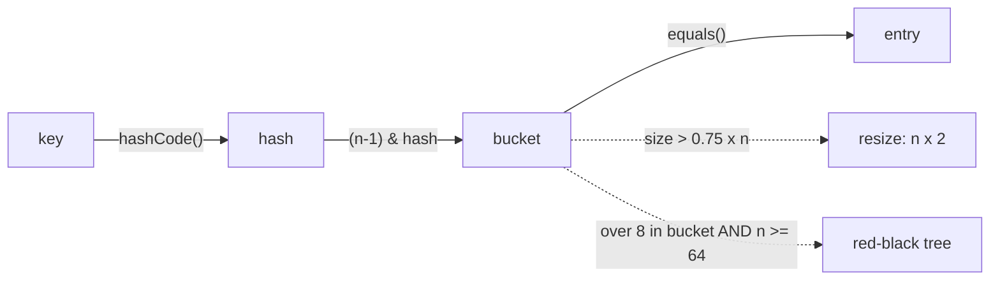

**🧠 Must remember**
1. An array of **16** buckets. bucket = hash % 16, computed as `(n-1) & hash`.
2. **hashCode picks the bucket, equals picks the entry.**
3. **Collision:** the entries are chained in the bucket. Java 8 adds new ones at the tail.
4. Load factor **0.75**, so the resize comes at the **13th** entry: 16 → 32. Each entry stays at `i` or moves to `i + 16`.
5. **Treeify:** more than **8** in one bucket **and** at least **64** buckets. Otherwise it resizes. Back to a list at **6**.
6. On average **O(1)**. The worst case is O(n), or O(log n) with trees (Java 8).
7. **One null key** is allowed, in bucket 0. **Not thread-safe:** use ConcurrentHashMap.
8. **Keys must be immutable,** or get() looks in the wrong bucket.

**⚠️ Top traps**
- A tree needs **more than 8 entries AND 64 buckets**, not just 8.
- The resize happens past **75%**, not at 100%.
- The same hashCode doesn't mean the same key.

**🎯 30-second answer:** "Searching a list checks items one by one, so HashMap calculates where each key lives instead. It's an array of buckets. put calls hashCode, turns it into a bucket index and stores the entry. Keys that collide are chained in the bucket, and equals finds the right one. In Java 8 a bucket with more than 8 entries becomes a red-black tree once there are 64+ buckets. At 75% full it doubles and moves the entries, so get and put stay O(1) on average."

**🔑 Memory hook:** *"Hash picks the drawer, equals picks the file. At 3/4 full, double the cupboard. More than 8 in a drawer with 64 drawers, and it becomes a tree."*

**🗣️ Say it aloud (no peeking):**
1. Why does HashMap exist, why did it replace Hashtable, and what pain made Java 8 add trees?
2. Keys 101 and 117 go into 16 buckets. Where do they go, where does 117 go after the resize to 32, and when exactly does that resize happen?
3. Why does a crowded bucket in a 16-bucket map cause a resize and not a tree?

---

<a id="j02-equalsandhashcode"></a>

## J02 · equals() and hashCode()

[Full lesson](01-java-core/J02_EqualsAndHashCode.md) · [Back to contents](#contents)

**🧬 The story:** `==` can't see that two copies are the same employee → **equals()** defines "same" → calling equals() on every entry is slow → **hashCode()** picks the bucket first → the two must agree → **the contract** → writing both by hand goes wrong → **Objects.hash** (Java 7), Lombok, **records** (Java 16).

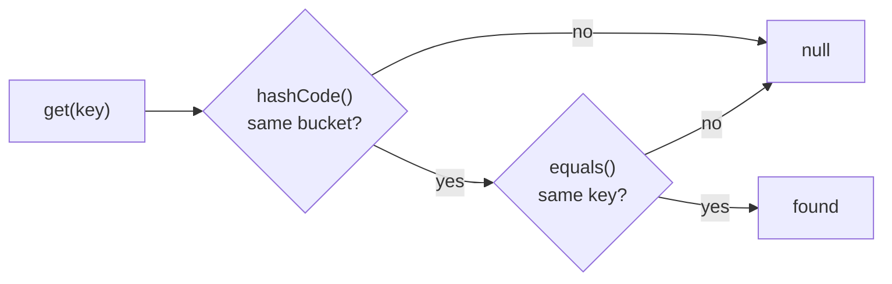

**🧠 Must remember**
1. Default `equals()` is `==`. The default `hashCode()` is a number made up per object.
2. HashMap: **hashCode picks the bucket, equals confirms the key.** Both gates must pass.
3. **Contract:** equal objects mean equal hashCodes. The same hashCode does **not** mean equal ("Aa" and "BB" are both 2112).
4. **Only equals:** different buckets, so set size 2 and get() is null.
5. **Only hashCode:** the right bucket, but equals is `==`, so set size 2 and get() is null.
6. **Both, on the same fields:** set size 1, and get() works.
7. Key fields must be `final`. Records generate both methods from **all** fields.
8. `Objects.hash(101)` = 31 × 1 + 101 = **132**, which goes to bucket 132 % 16 = 4.

**⚠️ Top traps**
- equals() alone does nothing for HashMap, because the hash is checked first.
- hashCode must never use a field that equals ignores.
- On JPA entities, don't build hashCode on a generated ID, and don't put Lombok `@Data` on them.

**🎯 30-second answer:** "HashMap checks hashCode to find the bucket, then equals to confirm the key, so the contract is that equal objects must have equal hashCodes. If I override only equals, equal objects land in different buckets and a HashSet keeps duplicates. If I override only hashCode, they share a bucket but equals is still reference equality. So I always override both, using the same fields."

**🔑 Memory hook:** *"Two gates: the drawer (hashCode) and the name check (equals). Open only one gate and the file is never found."*

**🗣️ Say it aloud (no peeking):**
1. Why do both equals() and hashCode() exist? What pain does each one fix?
2. Walk through what happens with only equals() overridden.
3. How do you write equals and hashCode for Employee by ID?

---

<a id="j03-stringsandstringpool"></a>

## J03 · Strings: immutability, the String pool, StringBuilder vs StringBuffer

[Full lesson](01-java-core/J03_StringsAndStringPool.md) · [Back to contents](#contents)

**🧬 The story:** shared text must never change → **String** is immutable (Java 1.0) → `+=` in a loop copies everything → **StringBuffer**, a growing buffer with locks (Java 1.0) → the locks are wasted on one thread → **StringBuilder**, no locks (Java 5), the default.

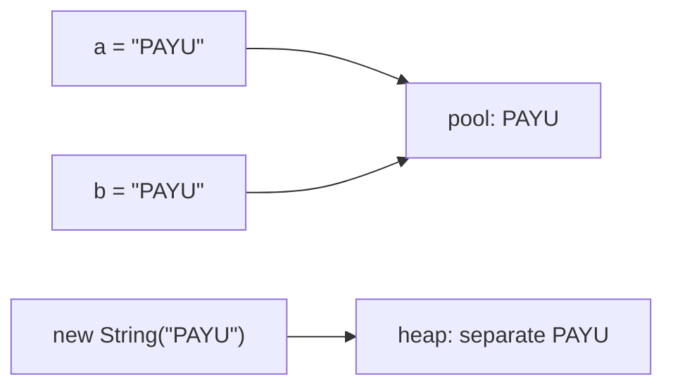

**🧠 Must remember**
1. A String is **immutable**. `toLowerCase` and `replace` return a **new** String.
2. Literals are shared from the **String pool**: `a == b` is true. `new String` is a separate object: `a == c` is false.
3. **Always compare with `equals()`.** `==` compares objects.
4. `"PA" + "YU"` is joined by the compiler and is the pool object. `pa + "YU"` (a normal variable) is a new object.
5. Why immutable: the **pool**, **HashMap keys** (a cached hash), **thread safety** and **security**.
6. `+=` in a loop copies everything every round. 5 × "TXN0001" copies **105** characters, versus **35** with StringBuilder.
7. **StringBuffer** (Java 1.0) is synchronized. **StringBuilder** (Java 5) is the same without locks, so it's faster, and it's the default.
8. `new String("x")` creates **up to 2** objects. Passwords go in a `char[]`, because it can be wiped.

**⚠️ Top traps**
- `==` on Strings.
- Forgetting to assign the result: `s.trim();` does nothing to `s`.
- `+=` inside loops.

**🎯 30-second answer:** "Strings are immutable, so every change creates a new object. Literals are shared in the String pool, which is safe only because nobody can change them, so we compare with equals, not ==. Immutability also makes Strings safe HashMap keys and thread-safe. The cost is that joining in a loop copies everything, so Java added a changeable buffer: StringBuffer in Java 1.0, with locks, then StringBuilder in Java 5, without them. I use StringBuilder, and StringBuffer only if threads share it."

**🔑 Memory hook:** *"A printed notice on the society board: one copy for everyone, and nobody can scribble on it. For drafts, use a whiteboard (StringBuilder); lock the room (StringBuffer) only if many people write."* And: **safe first, fast later**, StringBuffer (1.0) then StringBuilder (5).

**🗣️ Say it aloud (no peeking):**
1. Why does `a == b` print true but `a == c` print false?
2. Give four reasons why String is immutable.
3. Tell the story: why does StringBuffer exist, and why was StringBuilder added later?

---

<a id="j04-listsandmaps"></a>

## J04 · ArrayList vs LinkedList, and HashMap vs LinkedHashMap vs TreeMap

[Full lesson](01-java-core/J04_ListsAndMaps.md) · [Back to contents](#contents)

**🧬 The story:** arrays can't grow → **Vector, Hashtable** (Java 1.0, locked) → locks wasted, no common interface → **Collections Framework** (1.2): ArrayList, LinkedList, HashMap, TreeMap → HashMap forgets the order → **LinkedHashMap** (1.4) → LinkedList is a slow queue → **ArrayDeque** (6).

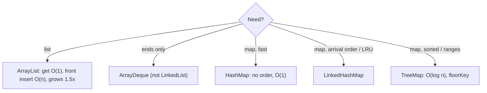

**🧠 Must remember**
1. **ArrayList:** an array inside. `get(i)` is **O(1)**; `add(0)` is **O(n)** (5 items shift). It grows **1.5×**: 10 → 15 → 22 → 33 → 49.
2. **LinkedList:** nodes with prev/next links. **O(1)** at the ends, **O(n)** `get(i)`, more memory.
3. **ArrayList is the default.** Use **ArrayDeque** for queues and stacks.
4. **HashMap:** no order. Keys 250, 42, 305, 101 print as [305, 101, 250, 42].
5. **LinkedHashMap:** insertion order, [250, 42, 305, 101]. In access order it's an **LRU cache**.
6. **TreeMap:** sorted, [42, 101, 250, 305]. **O(log n)**. `floorKey(200)` = 101, `ceilingKey(200)` = 250. **No null keys.**
7. **Fee slabs:** `floorEntry(amount)` replaces an if-else chain.
8. `Arrays.asList` is fixed-size. `List.of` is unmodifiable and allows no nulls.

**⚠️ Top traps**
- "LinkedList inserts are faster" is only true at the ends.
- HashMap has no order you can rely on.
- A null key in a TreeMap throws a NullPointerException.

**🎯 30-second answer:** "ArrayList is a resizable array: O(1) get by index, O(n) inserts at the front, and it grows 1.5×. LinkedList is a doubly linked list: O(1) at the ends but O(n) to reach an index, with extra memory per node. So ArrayList is my default. For maps, HashMap is fastest with no order, LinkedHashMap keeps insertion order and can be an LRU cache, and TreeMap keeps keys sorted, O(log n), with floor and ceiling lookups."

**🔑 Memory hook:** *"Cinema seats (jump to any seat, shifting is painful) vs train coaches (easy to hook on at the ends, you walk to reach the middle). The cupboard, the register or the directory: no order, arrival order, sorted."*

**🗣️ Say it aloud (no peeking):**
1. Java already had Vector and Hashtable. Why were ArrayList, HashMap and later LinkedHashMap added?
2. Why does ArrayList usually beat LinkedList, even for some inserts?
3. The same 4 keys: what order does each map give? And how do you turn LinkedHashMap into an LRU cache?

---

<a id="j05-concurrencybasics"></a>

## J05 · synchronized, volatile, and ConcurrentHashMap vs synchronizedMap

[Full lesson](01-java-core/J05_ConcurrencyBasics.md) · [Back to contents](#contents)

**🧬 The story:** `count++` from two threads loses updates → **synchronized** (Java 1.0, one at a time) → a lock is heavy, and threads may read old values → **volatile** (visibility) → volatile can't fix `count++`, and locks make threads wait → **AtomicInteger**, CAS (Java 5) → one lock for a whole map makes a queue → **ConcurrentHashMap** (Java 5).

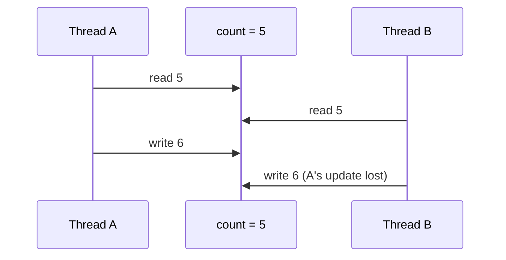

**🧠 Must remember**
1. `count++` is **read + add + write**, so two threads can lose updates (2 × 100,000 gave about **134,000**).
2. **synchronized** gives one thread at a time **and** visibility: exactly **200,000**.
3. **volatile** gives **visibility only**. Right for a stop flag, **wrong** for counters.
4. **AtomicInteger** uses **CAS** ("set if still 5, else retry"): exactly 200,000, with no lock.
5. **HashMap** is not thread-safe and loses entries (about 80,000 of 100,000).
6. **synchronizedMap** has one lock for everything. **ConcurrentHashMap** locks per bucket and reads with no lock. It allows **no nulls**.
7. **get-then-put** isn't atomic even on ConcurrentHashMap. Use `merge`, `compute` or `putIfAbsent`.
8. **Deadlock:** two threads each hold the lock the other needs. Avoid it by taking locks in the same order.

**⚠️ Top traps**
- Claiming volatile makes counters safe.
- Claiming a thread-safe map makes your logic safe.
- Mixing up synchronizedMap and ConcurrentHashMap.

**🎯 30-second answer:** "count++ is three steps, so threads can interleave and lose updates. synchronized lets one thread in at a time and makes changes visible. volatile only makes changes visible, so I use it for flags. For counters I use AtomicInteger, which uses compare-and-set. For shared maps I use ConcurrentHashMap, which locks per bucket instead of the whole map, and I use merge or putIfAbsent, because get-then-put isn't atomic."

**🔑 Memory hook:** *"volatile: see the notice board. synchronized: one key to the room. Atomic: 'only if it still says 5'. ConcurrentHashMap: a counter for every section, not one queue for the whole bank."*

**🗣️ Say it aloud (no peeking):**
1. Draw the "read 5, read 5, write 6, write 6" timeline. Then say why Java 5 added AtomicInteger and ConcurrentHashMap when synchronized already existed.
2. volatile vs synchronized, with one use case each.
3. Why is get-then-put unsafe on a ConcurrentHashMap, and what's the fix?

---

<a id="j06-executorsandcompletablefuture"></a>

## J06 · ExecutorService, Future and CompletableFuture

[Full lesson](01-java-core/J06_ExecutorsAndCompletableFuture.md) · [Back to contents](#contents)

**🧬 The story:** calls one by one are slow → **new Thread()** per task (Java 1.0) → threads are costly and return nothing → **ExecutorService + Future** (Java 5) → `get()` blocks, and combining is manual → **CompletableFuture** (Java 8) → pool threads are still heavy while they wait → **virtual threads** (Java 21).

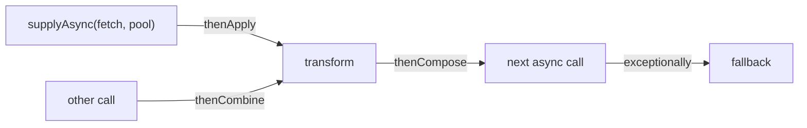

**🧠 Must remember**
1. **Pool** = reused threads plus a task queue. Time = **rounds × task time**: 3 calls × 300 ms takes 900 ms on 1 thread, 600 ms on 2 and 300 ms on 3.
2. **Callable** returns a value; **Runnable** doesn't. `submit()` returns a **Future**.
3. `Future.get()` **blocks**. `get(timeout)` throws a `TimeoutException`.
4. **CompletableFuture:** `supplyAsync`, then `thenApply` (transform), `thenAccept` (use), `thenCombine` (two in parallel), `allOf` (all).
5. **thenCompose** is for a step that is itself async, flattening the future inside a future. It's like flatMap.
6. **exceptionally / handle** for errors. **orTimeout / completeOnTimeout** for slow calls.
7. The default pool is the **commonPool**, so pass your **own executor** for blocking I/O.
8. Always call **shutdown()**. In production, use a **bounded queue** and a rejection policy.

**⚠️ Top traps**
- Calling get() inside the submit loop makes it sequential again.
- Blocking calls on the commonPool.
- An unbounded queue in newFixedThreadPool.

**🎯 30-second answer:** "I use an ExecutorService so tasks run in parallel on reused threads: three 300 ms calls take about 300 ms instead of 900. Future.get blocks, so I prefer CompletableFuture: supplyAsync to start, thenApply to transform, thenCombine or allOf to join parallel calls, exceptionally for fallbacks, and orTimeout for slow services. I pass my own executor for blocking I/O, and I shut the pool down."

**🔑 Memory hook:** *"A food court: cooks are threads, the token is a Future, and the buzzer with instructions is a CompletableFuture. 3 cooks, 3 orders, done in one round."*

**🗣️ Say it aloud (no peeking):**
1. Why did Java go from new Thread() to pools, then to CompletableFuture, then to virtual threads? And how long do 5 calls of 300 ms take on 2 threads?
2. thenApply vs thenCompose, with an example.
3. How do you handle one of three billers being down?

---

<a id="j07-exceptions"></a>

## J07 · Checked vs unchecked exceptions, try-with-resources, custom exceptions

[Full lesson](01-java-core/J07_Exceptions.md) · [Back to contents](#contents)

**🧬 The story:** error codes were silently ignored → **exceptions** (Java 1.0) → expected failures went unplanned → **checked exceptions** → an exception skips cleanup → **finally** → finally blocks got messy and hid errors → **try-with-resources** (Java 7). Later, checked exceptions felt noisy, so Spring prefers **unchecked**.

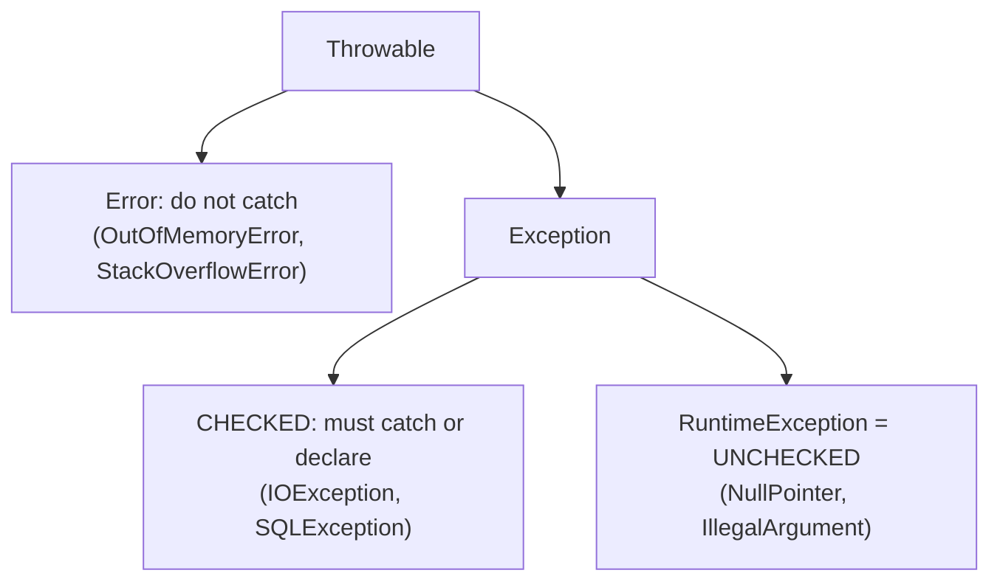

**🧠 Must remember**
1. **Checked** = outside your control (file, network, DB): **catch or declare** (`throws`).
2. **Unchecked** = RuntimeException = a bug in your code: **fix the code**.
3. **Error** = a JVM problem (OutOfMemoryError, StackOverflowError): don't catch it.
4. **finally always runs.** A `return` in finally replaces the try's return (1 becomes 2). Never do it.
5. **try-with-resources:** auto-close, **in reverse order**, and close errors become **suppressed**.
6. **Custom business exceptions** extend **RuntimeException** with a clear message ("Balance 1000 is less than 1500").
7. **Wrap with the cause:** `new PaymentFailedException("msg", e)`.
8. **@Transactional** rolls back only on **unchecked** exceptions by default. For checked ones, use `rollbackFor = Exception.class`.

**⚠️ Top traps**
- An empty catch block.
- Returning from finally.
- Wrapping without the cause.

**🎯 30-second answer:** "Checked exceptions like IOException are for things outside our control, and the compiler forces us to catch or declare them. Unchecked ones extend RuntimeException and usually mean bugs. finally always runs, so it's for cleanup, and try-with-resources closes resources automatically in reverse order. For business rules I throw custom unchecked exceptions with clear messages, which @Transactional rolls back on, and when wrapping I always pass the original exception as the cause."

**🔑 Memory hook:** *"Checked = the mandatory field on the bank form. Unchecked = your own mistake. Error = the building's on fire. finally = switch off the lights on the way out."*

**🗣️ Say it aloud (no peeking):**
1. Why do exceptions exist? Then checked vs unchecked, with one example each.
2. Why was try-with-resources added when finally already existed? What does it do if both the body and close() throw?
3. Why should a failed debit throw an unchecked exception in a Spring service?

---

<a id="j08-comparatorstreamsoptional"></a>

## J08 · Comparable vs Comparator, map vs flatMap, intermediate vs terminal, Optional

[Full lesson](01-java-core/J08_ComparatorStreamsOptional.md) · [Back to contents](#contents)

**🧬 The story:** Java can't order objects → **Comparable** (Java 1.2, one order) → you need many orders → **Comparator** (1.2, but 6-line anonymous classes) → boilerplate hides the logic → **lambdas + streams** (Java 8) → `null` means forgotten checks and NPEs → **Optional** (Java 8).

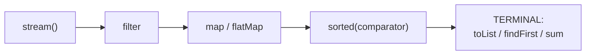

**🧠 Must remember**
1. **Comparable** means `compareTo` inside the class, the **one** natural order. **Comparator** means many external orders.
2. Chain them: `comparingInt(salary).reversed().thenComparing(name)` gives Priya, Sneha, Amit, Rahul.
3. In a TreeSet or TreeMap, **compare = 0 means a duplicate**. A salary-only TreeSet of 4 has size **3**.
4. **Intermediate** operations (filter, map, sorted) are **lazy**. The **terminal** one (collect, toList, findFirst, sum) runs everything.
5. **Short-circuit:** findFirst checked **2 of 4** employees and stopped.
6. **map** is 1 → 1 (4 lists). **flatMap** is 1 → many, flattened (7 skills, 5 distinct).
7. A stream can be used **once** only.
8. **Optional** is a **return type**. `orElse` always runs its argument; **`orElseGet` is lazy**. Use `orElseThrow` for "not found".

**⚠️ Top traps**
- `a - b` in compareTo overflows. Use `Integer.compare`.
- The TreeSet silently drops items that tie.
- `orElse(expensiveCall())` runs every time.

**🎯 30-second answer:** "Comparable is the one natural order inside the class, and Comparator is any number of external orders that I chain with comparing, reversed and thenComparing. Streams are lazy: filter and map only describe the work, and a terminal operation like collect or findFirst runs it, even stopping early. map is one to one, and flatMap flattens one to many. Optional is for return values that may be missing, and I prefer orElseGet for expensive defaults."

**🔑 Memory hook:** *"The token on the card (Comparable) vs the doctor's rule for today (Comparator). The belt only moves when the last station asks (terminal). flatMap opens the boxes."*

**🗣️ Say it aloud (no peeking):**
1. Why do both Comparable and Comparator exist, and what pain did Optional fix?
2. Why did findFirst never check Amit and Priya?
3. Show map vs flatMap with the skills example. When is orElse wasteful, and what do you use instead?

---

<a id="j09-jvmmemoryandgc"></a>

## J09 · JVM memory (stack, heap, metaspace), GC basics, OutOfMemoryError vs StackOverflowError

[Full lesson](01-java-core/J09_JvmMemoryAndGc.md) · [Back to contents](#contents)

**🧬 The story:** freeing memory by hand caused leaks and crashes → **GC** (Java 1.0) → checking the whole heap pauses the app → **generations**, because most objects die young → the fixed-size **PermGen** ran out → **Metaspace** (Java 8) → big heaps meant long pauses → **G1** default (Java 9), **ZGC** (Java 15).

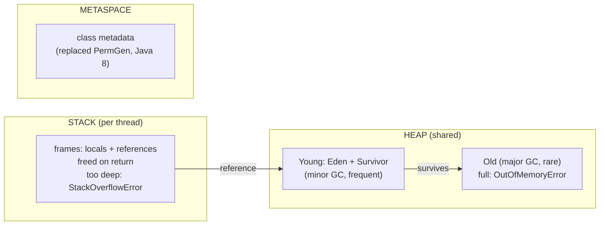

**🧠 Must remember**
1. **Stack:** one per thread. Frames hold **primitives and references** and are freed **on return**. About 0.5 to 1 MB (`-Xss`).
2. **Heap:** shared, and holds **all objects**. Default max is about **RAM ÷ 4** (15,765 MB gives 3,942 MB). Set with `-Xms/-Xmx`.
3. **Metaspace:** class metadata in native memory. It replaced **PermGen in Java 8**.
4. **GC:** collects objects **unreachable from GC roots**: stack variables, static fields, live threads.
5. **Generational:** most objects **die young**. Eden → Survivor → Old. Young GCs are frequent and cheap. **G1** is the default (Java 9+).
6. **Pass-by-value, always.** For objects, the **reference is copied**: you can change fields, but you can't reassign the caller's variable.
7. **StackOverflowError** means deep recursion (about 11,000 to 14,000 calls here). **OutOfMemoryError** means the heap is full, usually a **leak**.
8. To debug an OOM: `-XX:+HeapDumpOnOutOfMemoryError`, then look at the biggest retained objects in MAT.

**⚠️ Top traps**
- Saying "pass-by-reference".
- "null means deleted now".
- "GC means no leaks".

**🎯 30-second answer:** "Each thread has a stack of frames with its local variables and references, freed when a method returns. Objects live on the shared heap, which the GC manages in young and old generations, because most objects die young. Class metadata is in Metaspace since Java 8. The GC removes objects unreachable from GC roots. StackOverflowError is deep recursion; OutOfMemoryError is a full heap, usually a leak like a static map that only grows."

**🔑 Memory hook:** *"The waiter's notepad (stack, torn off per order), the shared storeroom (heap, cleaned by the cleaner), and the recipe cabinet (metaspace)."*

**🗣️ Say it aloud (no peeking):**
1. Why does Java have a GC, and why did Metaspace replace PermGen? Then: where do amount, p and the Payment object live?
2. Walk an object from Eden to Old, and explain why generations exist.
3. How would you investigate an OutOfMemoryError in production?

---

<a id="j10-solidandimmutability"></a>

## J10 · SOLID, interface vs abstract class, immutable class

[Full lesson](01-java-core/J10_SolidAndImmutability.md) · [Back to contents](#contents)

**🧬 The story:** one giant class makes every change risky → **SOLID** (around 2000), one pain per letter → adding a method to an interface broke every implementer → **default methods** (Java 8) → shared objects changed behind your back → **immutable classes** → about 40 lines of boilerplate → **records** (Java 16).

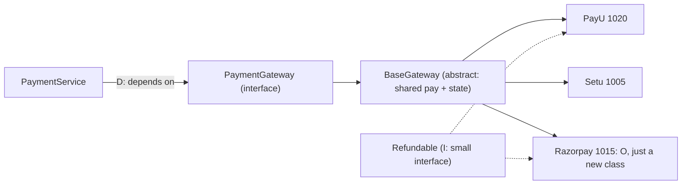

**🧠 Must remember**
1. **S:** one reason to change. Validator, gateway, repository and notifier are separate classes.
2. **O:** a new gateway is a **new class**, not an edit (PayU 1020, Setu 1005, Razorpay 1015).
3. **L:** a child must work wherever the parent works. An FD that throws on withdraw breaks it.
4. **I:** small interfaces. `Refundable` is separate, so Setu doesn't fake it.
5. **D:** depend on the **interface**. Spring injects it, and tests use a fake.
6. **Interface** = can-do, many, no state. **Abstract class** = is-a, one, shared code **plus state**.
7. **Immutable:** final class, private final fields, no setters, **defensive copies**, and `withX()` returns a new object.
8. `final List` is **not** immutable. Records are only **shallowly** immutable, so copy lists in the compact constructor.

**⚠️ Top traps**
- Definitions with no example.
- Thinking `final` fields make a class immutable.
- A subclass throwing UnsupportedOperationException.

**🎯 30-second answer:** "I use SOLID on payment gateways. Each class has one job. New gateways are new classes behind a PaymentGateway interface, so old code isn't edited. Subclasses must honour the parent's contract. Capabilities like refunds are small separate interfaces. And services depend on interfaces that Spring injects. An interface is a can-do contract without state; an abstract class shares code and state. Immutable objects have final fields, no setters and defensive copies."

**🔑 Memory hook:** *"One cook one job (S), a charging port (O), a key that must open the door (L), no forced thali (I), a wall socket (D)."*

**🗣️ Say it aloud (no peeking):**
1. SOLID with the gateway example: for each letter, the pain it prevents and the fix.
2. When would you pick an abstract class over an interface? Why did Java 8 add default methods?
3. Make PaymentRequest immutable. What's the easy-to-miss step?

---

<a id="j11-modernjavafeatures"></a>

## J11 ⭐ · Modern Java, 8 to 21: the features interviewers ask about

[Full lesson](01-java-core/J11_ModernJavaFeatures.md) · [Back to contents](#contents)

**🧬 The story:** 6-line anonymous classes → **lambdas** (8) · a forgotten `break` → **switch expressions** (14) · escaped JSON → **text blocks** (15) · 40-line DTOs → **records** (16) · unknown subtypes → **sealed** (17) · one heavy thread per waiting request → **virtual threads** (21).

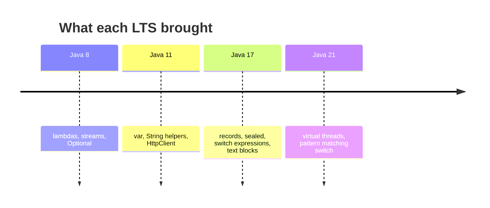

**🧠 Must remember**
1. **LTS:** 8, 11, 17, 21, 25. A new version every **6 months**. Most companies are on **17/21**.
2. **Functional interface** = one abstract method. **Predicate** (T to boolean), **Function** (T to R), **Consumer** (T to nothing), **Supplier** (nothing to T).
3. `var` is compile-time inference for **locals only**, not dynamic typing.
4. **Switch expression:** returns a value, no fall-through, and **exhaustive** (every enum value).
5. **Records** are one-line immutable data classes, great for **DTOs** and **not** for JPA entities.
6. **Sealed** interfaces plus pattern-matching switch mean **no default** is needed, and the compiler catches a missing case.
7. **Virtual threads (21)** are cheap threads for **waiting** code: 1,000 × 100 ms took about 2,000 ms on 50 threads vs about 110 to 160 ms virtual.
8. **Text blocks** (`"""`) for JSON and SQL; `strip`, `isBlank` and `repeat` came in Java 11.

**⚠️ Top traps**
- Claiming features you never used.
- Saying var means dynamic typing.
- Saying virtual threads make CPU work faster.

**🎯 30-second answer:** "I've used Java 17 at work. From Java 8 I use lambdas, streams and Optional daily. From newer versions I use records for DTOs and switch expressions for mapping statuses, because they're exhaustive with no fall-through. Java 21 adds virtual threads, which make blocking I/O scale cheaply, and pattern matching for switch, which with sealed types lets the compiler check every case."

**🔑 Memory hook:** *"8 gave lambdas, 17 gave records, 21 gave virtual threads. Gig workers only take a desk while they're working."*

**🗣️ Say it aloud (no peeking):**
1. Which Java do you use? Name two features you actually used, and the pain each one removed.
2. Why is a switch over a sealed interface safer than if-else with instanceof?
3. When do virtual threads help, and when don't they?

---

<a id="j12-designpatterns"></a>

## J12 ⭐ · Design patterns: Singleton, Builder, Factory, Strategy (and Proxy)

[Full lesson](01-java-core/J12_DesignPatterns.md) · [Back to contents](#contents)

**🧬 The story:** each pattern is a pain that kept coming back (named in the Gang of Four book, 1994). Duplicate shared objects → **Singleton** · constructor calls full of nulls → **Builder** · if-else creation in 10 places → **Factory** · one giant if-else of rules → **Strategy** · transaction code by hand in every method → **Proxy**. Singleton's own story: 2 threads make 2 → synchronized → every call waits → double-checked + volatile → **holder / enum**.

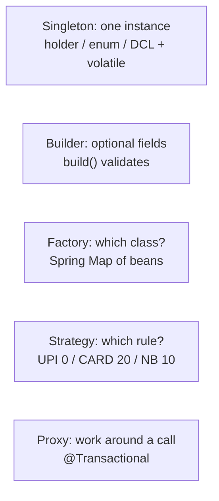

**🧠 Must remember**
1. **Singleton:** a private constructor plus one access point. A lazy version with no locking creates **2** under a race. Use a **holder**, an **enum** (the best) or **double-checked + volatile**.
2. Spring beans are **singletons by default**, so you rarely hand-write one.
3. **Builder:** required fields in `builder(...)`, optional ones by name, and `build()` **validates**. Use Lombok's `@Builder`.
4. **Factory:** one place picks the class. In Spring, inject `Map<String, PaymentGateway>`.
5. **Strategy:** interchangeable rules behind an interface. The fee on ₹1,000 is **0 / 20 / 10**.
6. **Factory** means "which object"; **Strategy** means "which behaviour". They're often used together.
7. **Proxy:** Spring wraps beans for `@Transactional`, `@Async` and `@Cacheable`. **Self-invocation skips the proxy.**
8. Spring uses CGLIB proxies by default, so **final methods can't be proxied**.

**⚠️ Top traps**
- A lazy singleton without locking, or without volatile.
- Listing patterns with no examples.
- Calling a @Transactional method from the same class.

**🎯 30-second answer:** "I use strategy for fee rules per payment mode, and factory, usually a Spring-injected map, to pick the gateway, so new modes and gateways are new classes, not if-else edits. I use builders for requests with many optional fields. A singleton needs thread safety, like the holder idiom or an enum, but Spring beans are singletons already. And @Transactional works through a proxy, which is why self-invocation doesn't start a transaction."

**🔑 Memory hook:** *"The RBI governor (one), a Subway order (build step by step), the rental counter (you ask, it picks), Google Maps modes (swap the rule), a personal assistant (before and after the meeting)."*

**🗣️ Say it aloud (no peeking):**
1. For each of the 5 patterns, say the pain it fixes in one line. Then Factory vs Strategy, with the payment example.
2. Show why a lazy singleton breaks with two threads, and walk the fixes up to the enum.
3. How does @Transactional work, and what is the self-invocation problem?

---

<a id="s00-streamstoolkit"></a>

## S00 · Streams toolkit: the collectors you need for the 8 programs

[Full lesson](02-java8-streams/S00_StreamsToolkit.md) · [Back to contents](#contents)

**🧬 The story:** counting per group took a loop with null checks → **groupingBy** (Java 8) → a map of lists isn't the answer → **downstream collectors** (counting, summingInt, maxBy) → maxBy leaves Optionals → **collectingAndThen** → toMap crashes on a repeated key → **merge function**.

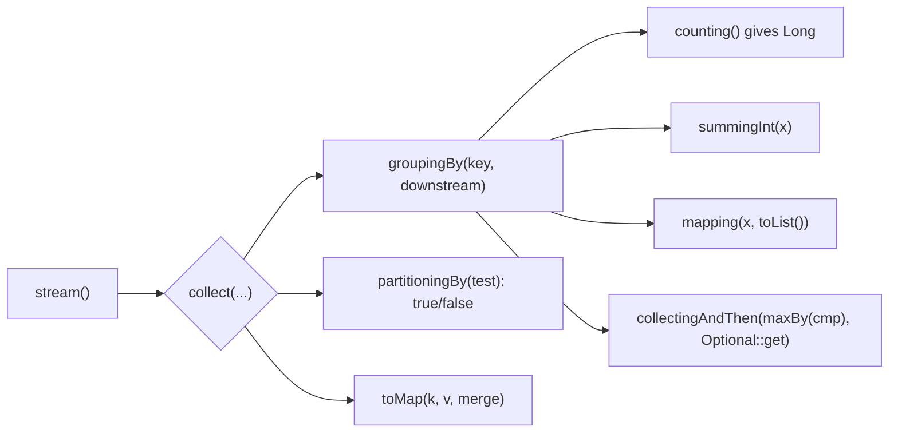

**🧠 Must remember**
1. `groupingBy(key)` gives `Map<key, List>`. The 2nd argument, the **downstream**, says what to do per bin.
2. `counting()` gives a **Long**. `summingInt(f)` gives the sum. `mapping(f, toList())` keeps only f.
3. **Max per group:** `collectingAndThen(maxBy(comparingInt(f)), Optional::get)`.
4. `partitioningBy(test)` always gives **both** false and true.
5. `toMap(k, v)` **throws on duplicate keys**. Add `(a, b) -> a`.
6. **Order:** `groupingBy(key, LinkedHashMap::new, downstream)` for first-seen order, `TreeMap::new` for sorted.
7. **Count, then filter:** `.entrySet().stream().filter(e -> e.getValue() > 1).map(Map.Entry::getKey)`.
8. `str.chars()` gives **int codes**, so use `mapToObj(c -> (char) c)`. `mapToInt(...).sum()`. `IntStream.rangeClosed(1, n).boxed()`.

**⚠️ Top traps**
- Writing `Map<String, Integer>` with counting().
- A toMap with duplicates and no merge rule.
- Expecting order from a plain groupingBy.

**🎯 30-second answer:** "For 'group and aggregate' questions I use collect with groupingBy and a downstream collector: counting for counts, summingInt for totals, maxBy wrapped in collectingAndThen for the biggest per group. partitioningBy for exactly two groups, and toMap with a merge function when keys can repeat. LinkedHashMap::new if the order matters."

**🔑 Memory hook:** *"The post office: groupingBy makes the bins, and the downstream writes the label: count, sum or heaviest. Partitioning is just Yes and No. toMap is the register: decide what to do if a number repeats."*

**🗣️ Say it aloud (no peeking):**
1. Why does groupingBy need a downstream collector? Then write the "highest paid per department" collector from memory.
2. What goes wrong with toMap on a callback log, and how do you fix it?
3. How do you get a character-frequency map in first-seen order?

---

<a id="s02-streamsolutions"></a>

## S02 The 8 stream programs

[Full lesson](02-java8-streams/S02_StreamSolutions.java) · [Back to contents](#contents)

```text
S02 The 8 stream programs: one line each. Say the idea first, then write it.
  Story: each program was a 10-line loop with null checks before Java 8. Streams made it one
         pipeline, and each collector answers one question: count, sum, max, split in two.
  1 char frequency     : s.chars().mapToObj(c -> (char) c)
                           .collect(groupingBy(identity(), LinkedHashMap::new, counting()))   -> {S=3, U=1, C=2, E=1}
  2 first non-repeated : frequencyMap.entrySet().stream().filter(e -> e.getValue() == 1)
                           .map(Map.Entry::getKey).findFirst()                                -> U
  3 duplicates         : groupingBy(identity(), counting()) -> entries with count > 1 -> keys  -> [T1, T2]
                         (or: filter(id -> !seen.add(id)) with a HashSet)
  4 second highest     : distinct().sorted(reverseOrder()).skip(1).findFirst()                -> 1200
  5 group by dept      : groupingBy(Employee::department)
  6 highest per dept   : groupingBy(dept, collectingAndThen(maxBy(comparingInt(salary)), Optional::get))
  7 salary desc, name  : sorted(comparingInt(salary).reversed().thenComparing(name))          -> Priya, Sneha, Vikram, Amit, Rahul
  8 even and odd       : partitioningBy(n -> n % 2 == 0)                                      -> {false=[1,3,5,7,9], true=[2,4,6,8,10]}
Traps: counting() gives Long | problem 4 needs distinct() (without it: 15000) |
       LinkedHashMap::new for first-seen order | toMap needs a merge function for duplicate keys
30-second approach: say the result's shape ("a map from department to employee"), name the collector,
       mention the detail (Optional / duplicates / order), then the cost: one pass O(n), a sort O(n log n).
Memory hook: groupingBy makes the bins, the downstream writes the label; partitioningBy = yes/no bins;
       sorting = a comparator chain.
```

---

<a id="q00-sql-toolkit"></a>

## Q00 · SQL toolkit: how a query really runs, JOINs, GROUP BY/HAVING, window functions

[Full lesson](03-sql/Q00_sql_toolkit.md) · [Back to contents](#contents)

**🧬 The story:** the same fact repeated in every row → **separate tables** (Codd, 1970) → the data is now in two tables → **JOIN** → too many rows for a report → **GROUP BY + HAVING** → grouping loses the names → **window functions** (SQL:2003, PostgreSQL 8.4).

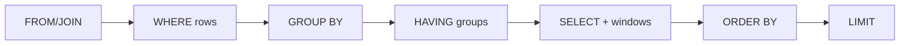

**🧠 Must remember: the concepts**
1. **Run order:** FROM, WHERE, GROUP BY, HAVING, SELECT, DISTINCT, ORDER BY, LIMIT. So aggregates go in **HAVING**, and window functions need a subquery to filter.
2. **INNER JOIN** keeps matches only. **LEFT JOIN** keeps all left rows (NULLs), so SECURITY shows **0** with `COUNT(e.id)`.
3. **GROUP BY:** every selected column must be grouped or aggregated.
4. **ROW_NUMBER** 1,2,3 · **RANK** 1,1,3 · **DENSE_RANK** 1,1,2. **PARTITION BY** restarts per group.
5. **NULL:** use `IS NULL`. `COUNT(col)` skips NULLs. `NOT IN (…, NULL)` returns nothing. Use `COALESCE` for defaults.

**🧠 Must remember: the six problems in one line each**
| # | Problem | Pattern |
|---|---|---|
| Q01 | Nth highest salary | `DENSE_RANK() OVER (ORDER BY salary DESC)` = N, or `DISTINCT … LIMIT 1 OFFSET N-1`. 2nd = **80,000** |
| Q02 | Highest per department | `MAX` + GROUP BY for the amount. `DENSE_RANK() OVER (PARTITION BY dept …)` = 1 for the person |
| Q03 | Above department average | CTE of `AVG` per dept, joined back, `salary > avg`. Meera, Priya, Sneha, Neha |
| Q04 | Duplicate emails | `GROUP BY email HAVING COUNT(*) > 1`. anu 2, ravi 3 |
| Q05 | Employee + manager | `employees e LEFT JOIN employees m ON m.id = e.manager_id` |
| Q06 | Departments with no employees | `LEFT JOIN … WHERE e.id IS NULL`, or `NOT EXISTS`. SECURITY |

**⚠️ Top traps**
- COUNT in WHERE.
- RANK for "Nth highest".
- A condition on the right table in WHERE turns a LEFT JOIN into an INNER JOIN.

**🎯 30-second answer ("WHERE vs HAVING"):** "WHERE filters rows before grouping; HAVING filters groups after. So salary > 60000 goes in WHERE, and COUNT(*) >= 2 goes in HAVING, because the counts don't exist until GROUP BY has run."

**🔑 Memory hook:** *"Registers side by side (JOIN), piles with one label each (GROUP BY), cross out lines before the piles (WHERE), throw away piles after (HAVING), and write a rank on each line without merging (window)."*

**🗣️ Say it aloud (no peeking):**
1. Walk the "at least 2 people over 60,000" query through the run order, with the numbers.
2. Why do window functions exist? Then RANK vs DENSE_RANK vs ROW_NUMBER, on the 90,000 tie.
3. Why does NOT IN with a NULL return no rows?

---

<a id="q01-nth-highest-salary"></a>

## Q01 Nth highest salary

[Full lesson](03-sql/Q01_nth_highest_salary.sql) · [Back to contents](#contents)

```text
Q01 Nth highest salary
  Story  : MAX gives only the top -> sort and skip one -> a tie at the top breaks "skip one" ->
           DISTINCT, or DENSE_RANK (window functions, SQL:2003) where ties share a number
  Best   : SELECT DISTINCT salary FROM (SELECT salary, DENSE_RANK() OVER (ORDER BY salary DESC) AS r
           FROM employees) x WHERE r = N
  Also   : SELECT DISTINCT salary FROM employees ORDER BY salary DESC LIMIT 1 OFFSET N-1
  Numbers: 90000, 90000 (a tie!), 80000, 75000 ... -> 2nd highest = 80000 (Priya), 3rd = 75000 (Neha)
  Picture: salary  90000 90000 80000 75000
           RANK      1     1     3     4     (skips 2)
           DENSE     1     1     2     3     (no gaps)  <- use this
           ROW_NUM   1     2     3     4     (row 2 is 90000 again)
  Traps  : RANK = 2 finds nothing | ROW_NUMBER = 2 gives 90000 | LIMIT/OFFSET without DISTINCT gives 90000 |
           no Nth value -> wrap the query in (SELECT ...) to get NULL
  30-second answer: "DENSE_RANK over salary descending in a subquery, then keep rank N, ties share a
           rank with no gaps. Without window functions: DISTINCT + ORDER BY DESC + LIMIT 1 OFFSET N-1."
```

---

<a id="q02-highest-salary-per-department"></a>

## Q02 Highest salary per department

[Full lesson](03-sql/Q02_highest_salary_per_department.sql) · [Back to contents](#contents)

```text
Q02 Highest salary per department
  Story       : one answer per department -> GROUP BY + MAX -> GROUP BY loses the name ->
                match it back with a subquery, or rank inside each department (window function)
  Amount only : SELECT d.name, MAX(e.salary) FROM employees e JOIN departments d ON d.id = e.department_id
                GROUP BY d.name                         -> BILLING 90000, PAYMENTS 90000, UI 75000
  Who earns it: DENSE_RANK() OVER (PARTITION BY department_id ORDER BY salary DESC) in a subquery,
                keep rank 1                              -> Sneha, Meera, Neha (ties would show both)
  Also        : WHERE salary = (SELECT MAX(salary) ... same department) | PostgreSQL: DISTINCT ON (dept)
  Trap        : SELECT name with GROUP BY department_id -> error (a group has many names)
  30-second answer: "GROUP BY department with MAX for the amount. For the person, rank inside each
                department with DENSE_RANK and PARTITION BY, then keep rank 1, that keeps ties too."
```

---

<a id="q03-above-department-average"></a>

## Q03 Employees earning above their department's average

[Full lesson](03-sql/Q03_above_department_average.sql) · [Back to contents](#contents)

```text
Q03 Employees earning above their department's average
  Story    : WHERE can't use AVG (it checks one row at a time) -> correlated subquery (runs per row) ->
             CTE: each average once, joined back -> or AVG() OVER (PARTITION BY dept) on every row
  Averages : PAYMENTS 210000/3 = 70000 | BILLING 180000/3 = 60000 | UI 145000/2 = 72500
  Result   : Meera 90000, Priya 80000 (PAYMENTS), Sneha 90000 (BILLING), Neha 75000 (UI)
  Way 1    : WHERE e.salary > (SELECT AVG(salary) FROM employees e2 WHERE e2.department_id = e.department_id)
  Way 2    : WITH dept_avg AS (SELECT department_id, AVG(salary) avg_salary ... GROUP BY department_id)
             then JOIN on department_id WHERE salary > avg_salary
  Way 3    : AVG(salary) OVER (PARTITION BY department_id) in a subquery, filter outside
  Trap     : Karan = 60000 equals BILLING's average -> ">" leaves him out
  30-second answer: "Compute each department's average in a CTE, join it back on department_id and
             keep salary > average. A correlated subquery also works but can run once per row."
```

---

<a id="q04-duplicate-emails"></a>

## Q04 Duplicate emails

[Full lesson](03-sql/Q04_duplicate_emails.sql) · [Back to contents](#contents)

```text
Q04 Duplicate emails
  Story   : WHERE can't filter on COUNT -> HAVING filters piles -> GROUP BY hides the extra rows' ids ->
            ROW_NUMBER or MIN(id) to delete them -> a UNIQUE constraint stops new ones
  Find    : SELECT email, COUNT(*) FROM customers GROUP BY email HAVING COUNT(*) > 1
            -> anu@mail.com 2, ravi@mail.com 3
  Extras  : ROW_NUMBER() OVER (PARTITION BY email ORDER BY id) > 1 -> ids 3, 5, 6 are the extra copies
  Delete  : DELETE FROM customers WHERE id NOT IN (SELECT MIN(id) FROM customers GROUP BY email)
            leaves 1 ravi, 2 anu, 4 kiran
  Prevent : a UNIQUE constraint on email (for payments: UNIQUE on txn_id = idempotency guard)
  Trap    : WHERE COUNT(*) > 1 -> error, WHERE runs before GROUP BY, so use HAVING
  30-second answer: "GROUP BY email, HAVING COUNT(*) > 1. HAVING, not WHERE, because WHERE runs
            before grouping. To clean up, keep MIN(id) per email, delete the rest, add a unique constraint."
```

---

<a id="q05-employee-manager-self-join"></a>

## Q05 Employee with manager's name (self-join)

[Full lesson](03-sql/Q05_employee_manager_self_join.sql) · [Back to contents](#contents)

```text
Q05 Employee with manager's name (self-join)
  Story   : a managers table would store people twice -> manager_id in the same table ->
            the name is in another row -> self-join with aliases e and m ->
            INNER JOIN drops the top boss -> LEFT JOIN + COALESCE
  Picture : employees e (the employee)  --  e.manager_id = m.id  -->  employees m (the manager)
            Neha (manager_id 7)  ---->  id 7 = Vikram
  Query   : SELECT e.name, COALESCE(m.name, 'No manager') FROM employees e
            LEFT JOIN employees m ON m.id = e.manager_id       -> 8 rows, Meera = No manager
  INNER   : JOIN instead of LEFT JOIN -> 7 rows (the top boss disappears)
  Extras  : reports per manager: GROUP BY m.name -> Meera 4, Sneha 2, Vikram 1
            earns more than the manager: WHERE e.salary > m.salary -> Neha (75000 > 70000)
            the whole chain up: WITH RECURSIVE -> Neha, Vikram, Meera
  30-second answer: "The manager is a row in the same table, so I join employees to itself with
            aliases e and m on m.id = e.manager_id, as a LEFT JOIN so the top boss still appears."
```

---

<a id="q06-departments-without-employees"></a>

## Q06 Departments with zero employees

[Full lesson](03-sql/Q06_departments_without_employees.sql) · [Back to contents](#contents)

```text
Q06 Departments with zero employees
  Story   : INNER JOIN hides unmatched rows -> LEFT JOIN keeps them, with NULLs -> keep e.id IS NULL ->
            NOT IN breaks on a NULL -> NOT EXISTS
  Query   : SELECT d.name FROM departments d LEFT JOIN employees e ON e.department_id = d.id
            WHERE e.id IS NULL                                    -> SECURITY
  Same    : WHERE NOT EXISTS (SELECT 1 FROM employees e WHERE e.department_id = d.id)
  Counts  : COUNT(e.id) with the LEFT JOIN -> SECURITY 0 (COUNT(*) wrongly gives 1)
  Trap 2  : a condition on employees in WHERE turns the LEFT JOIN into an INNER JOIN, put it in ON
  Trap 3  : NOT IN (..., NULL) returns nothing -> prefer NOT EXISTS
  30-second answer: "LEFT JOIN departments to employees so every department stays, then keep the rows
            where the employee side is NULL. NOT EXISTS works too, NOT IN is risky with NULLs."
```

---

<a id="q07-indexes-acid-isolation"></a>

## Q07 Indexes, ACID, isolation

[Full lesson](03-sql/Q07_indexes_acid_isolation.sql) · [Back to contents](#contents)

```text
Q07 Indexes, ACID, isolation
  Story     : reading every row is slow -> index | a crash mid-transfer loses money -> ACID transaction |
              one at a time is too slow, all together is unsafe -> isolation levels |
              two debits read the same 700 -> atomic UPDATE, FOR UPDATE or @Version
  Index     : a sorted B-tree, like a book's index -> EXPLAIN shows "Index Scan" instead of "Seq Scan".
              Composite (status, amount) helps "status = ?" and "status = ? AND amount > ?",
              not "amount > ?" alone (the leftmost-column rule). Costs: slower writes, more disk.
  ACID      : Atomicity (all or nothing) | Consistency (rules like balance >= 0 hold) |
              Isolation (no half-done work seen) | Durability (committed = survives a crash)
  Levels    : READ UNCOMMITTED < READ COMMITTED (PostgreSQL default) < REPEATABLE READ < SERIALIZABLE
              they stop dirty reads, then non-repeatable reads, then phantoms
  Lost update (double debit): both read 700, write 700-100 and 700-200 -> 500 instead of 400
  Fixes     : UPDATE ... SET balance = balance - 100 (atomic) | SELECT ... FOR UPDATE (lock) |
              a version column (optimistic, JPA @Version) -> the second update matches 0 rows, so retry
  30-second answer: "An index is a sorted B-tree so lookups skip the full scan, I index the columns I
              filter and join on and check EXPLAIN. ACID keeps transactions all-or-nothing, valid,
              isolated and durable. For wallet debits I prevent lost updates with an atomic UPDATE,
              SELECT FOR UPDATE, or optimistic locking with @Version."
```

---

<a id="d01-twosum"></a>

## D01 Two Sum

[Full lesson](04-dsa/D01_TwoSum.java) · [Back to contents](#contents)

```text
D01 Two Sum: return the indices of the two numbers that add up to the target.
  Story   : checking every pair is about 5 crore checks for 10,000 numbers -> but each number already
            knows its partner (target - x) -> a HashMap finds that partner in one lookup: O(n)
  Idea    : for each number x, look for its partner (target - x) in a HashMap of the numbers seen so far.
  Picture : [200, 450, 700, 250], target 900
              200 -> need 700 -> not seen -> remember 200 at 0
              450 -> need 450 -> not seen -> remember 450 at 1
              700 -> need 200 -> SEEN at 0 -> answer [0, 2]
  Cost    : brute force (every pair) O(n^2) time, O(1) space | HashMap O(n) time, O(n) space
  Trap    : check the map BEFORE adding x, or [3, 2, 4] with target 6 answers [0, 0]
  Sorted input? two pointers from both ends: O(n) time, O(1) space
  30-second answer: "Brute force checks every pair, O(n squared). In one pass with a HashMap, for each
    number I look up target minus it among the numbers already seen. If it's there I return both
    indices, otherwise I store the number with its index. O(n) time, O(n) space."
  Memory hook: a register at the door; each bill asks "is my partner already inside?"
```

---

<a id="d02-validanagram"></a>

## D02 Valid Anagram

[Full lesson](04-dsa/D02_ValidAnagram.java) · [Back to contents](#contents)

```text
D02 Valid Anagram: do two strings use the same letters, the same number of times?
  Story   : sorting puts every letter in order, O(n log n), but we only need counts -> only 26 letters
            exist -> an int[26] tally: O(n) time, O(1) space -> any characters? use a HashMap
  Idea    : a tally in int[26]: +1 for each letter of s, -1 for each letter of t; all zero = anagram
  Picture : "listen" / "silent"   e i l n s t : +1 each, then -1 each -> all 0 -> true
            "rat" / "car"          c ends at -1, t ends at +1         -> false
  Cost    : sort both and compare O(n log n) | counting O(n) time, O(1) space (always 26 slots)
  Traps   : check the lengths first | "aab" vs "abb" breaks set-based answers | Unicode or mixed case -> HashMap
  30-second answer: "If the lengths differ it's false. Otherwise I count letters in an int array of 26:
    plus one for the first string, minus one for the second. If every count is zero they're anagrams.
    O(n) time and constant space. Sorting both also works but is O(n log n)."
  Memory hook: a shopkeeper's tally: add for s, subtract for t, the books must balance to zero.
```

---

<a id="d03-longestsubstringwithoutrepeating"></a>

## D03 Longest Substring Without Repeating Characters

[Full lesson](04-dsa/D03_LongestSubstringWithoutRepeating.java) · [Back to contents](#contents)

```text
D03 Longest Substring Without Repeating Characters: the longest run with no repeated character.
  Story   : brute force restarts at every position and re-reads the same letters, O(n^2) -> a repeat
            breaks only the FRONT of the run -> keep the rest: a sliding window, left jumps past the
            old copy, O(n)
  Idea    : a sliding window [left, right] that always holds unique characters, plus a map of each
            character's LAST position. On a repeat inside the window: left = max(left, last + 1).
  Picture : p w w k e w
            [p w]           the second w repeats -> left jumps to 2
                [w k e]     length 3 -> best 3
                  [k e w]   length 3 (the last w pushed left to 3)
  Cost    : brute force O(n^2) | sliding window O(n) time, O(k) space (k = different characters)
  Trap    : forget Math.max -> "abba" gives 3 ("bba") instead of 2
  Tests   : "abcabcbb" 3 | "bbbbb" 1 | "" 0 | " " 1 | "dvdf" 3 | "abba" 2
  30-second answer: "I slide a window with two pointers and keep each character's last index in a map.
    When the right character was already seen inside the window, I move left to just after that index,
    using max so it never goes back. Best = max(best, right - left + 1). O(n) time."
  Memory hook: a bank queue with a no-same-name rule; people leave from the front until the old namesake is gone.
```

---
